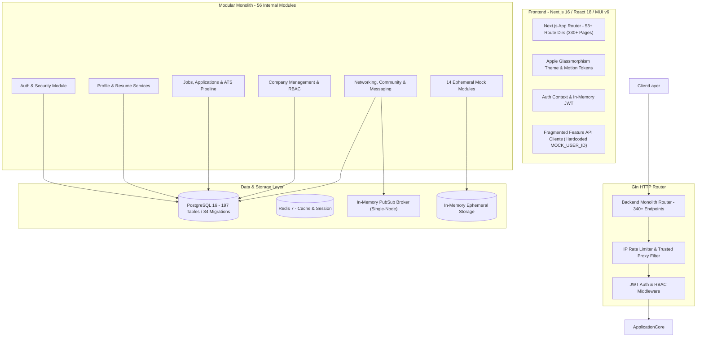
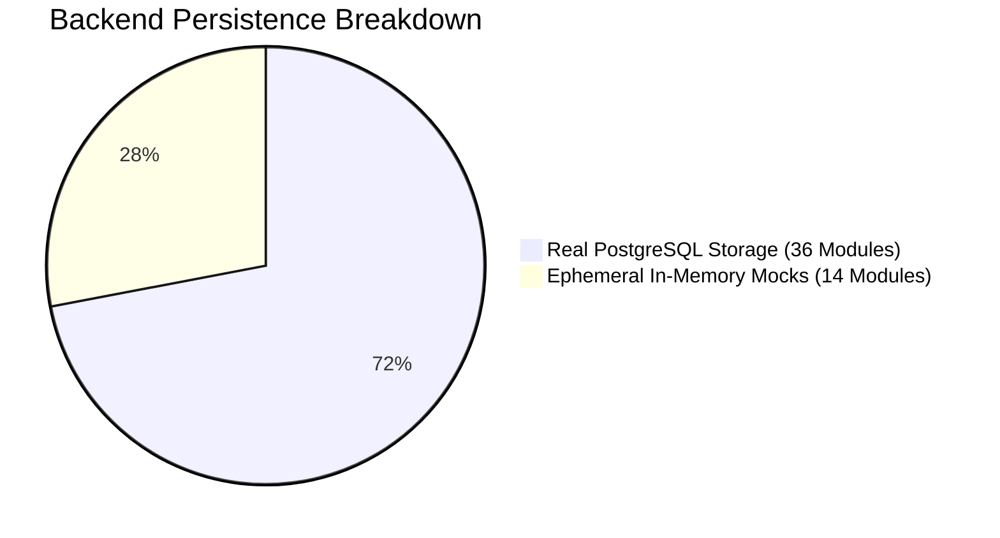
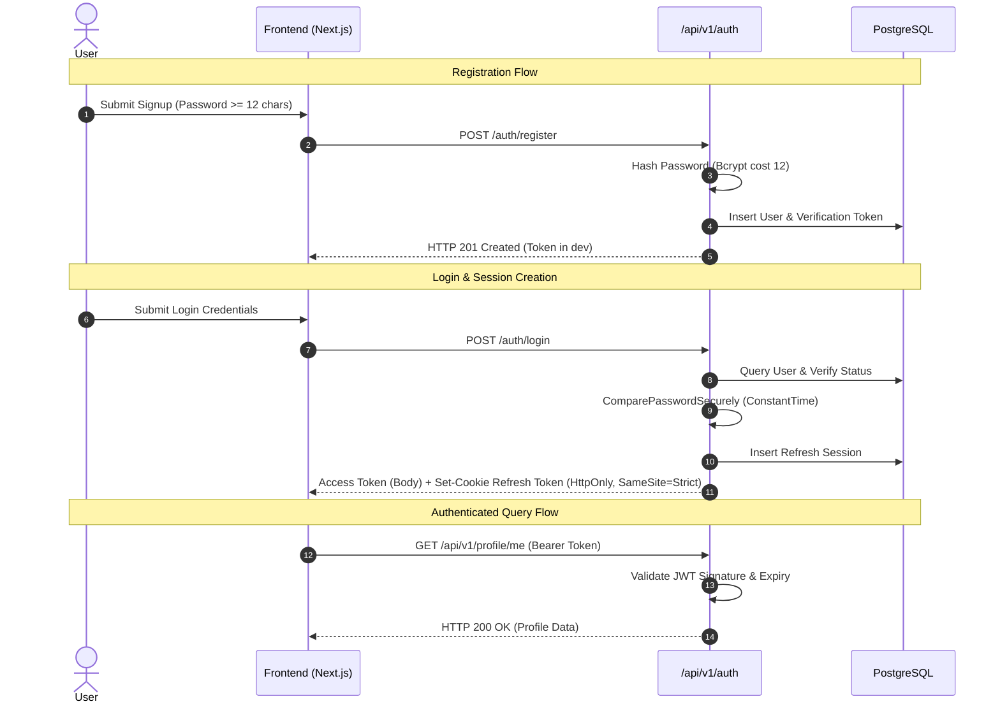

# KIRMYA MASTER REPOSITORY AUDIT REPORT
**Platform Functional Baseline, Architectural Integrity & 50-Prompt Recovery Plan**
*Generated: August 28, 2026 | Antigravity Audit Program — Prompt 1/50*

---

## EXECUTIVE SCORECARD & BASELINE METRICS

```
========================================================================================
                      KIRMYA REPOSITORY HEALTH SCORECARD
========================================================================================
  OVERALL SYSTEM HEALTH SCORE:            68 / 100
  FUNCTIONAL READINESS:                   62%
  PRODUCTION READINESS:                   54%
  APPLE UI/UX DESIGN READINESS:           58%
  TEST COVERAGE & INTEGRITY:              65%
----------------------------------------------------------------------------------------
  DEFECT & RISK INVENTORY:
    🔴 P0 (Critical / Security / Data Loss):   8 Issues
    🟠 P1 (High / Architecture / Drift):     22 Issues
    🟡 P2 (Medium / Incomplete / Sprawl):     29 Issues
    🔵 P3 (Low / Polish / Cleanup):           36 Issues
========================================================================================
```

---

## 1. EXECUTIVE SUMMARY

The Kirmya codebase is a substantial, highly ambitious full-stack professional networking and job-recovery platform. It boasts a rich domain model with 56 backend internal packages, 84 PostgreSQL schema migrations (131 migration files), over 190 database tables, and 53+ frontend route directories (330+ `page.tsx` files).

However, an exhaustive, multi-agent audit reveals that the repository suffers from **feature sprawl, unmanaged duplication, mock persistence masquerading as production persistence, critical authorization bypasses, and disconnected frontend API clients**. While the backend compiles cleanly (`go test ./...` and `go vet ./...` pass with 0 errors) and the frontend type-checks (`npx tsc --noEmit` passes with 0 errors), the system exhibits structural fractures:

1. **Ephemeral Mock Repositories (14 Modules)**: 14 backend modules (`assessment`, `career_ai`, `career_companion`, `endorsement`, `global_marketplace`, `landing`, `mobile`, `native_mobile`, `recommendation_engine`, `referral`, `resume_analysis`, `search`, `security`, `verification`) accept database pool connections but satisfy their queries entirely from process memory via `RegisterEphemeral`. Data is permanently lost on every service restart.
2. **Critical Security Vulnerabilities (P0)**:
   - **Identity Spoofing in Mentorship**: In `mentorship_handler.go`, user IDs are extracted from client-controlled `X-User-ID` headers or `?user_id=` query parameters, allowing any user to impersonate any other user.
   - **Admin RBAC Bypass across 9 Modules**: `/admin/*`, `/admin/safety/*`, `/admin/users/:id/profile`, `/admin/legal/*`, `/admin/security/*`, `/admin/backups/*`, `/admin/support/*`, `/admin/data-operations/*`, and `/admin/system/health/*` routes only enforce `AuthRequired()`, allowing any standard logged-in user to perform administrative operations.
   - **Unauthenticated Billing Routes**: Neither `/api/v1/billing/*` nor `/api/v1/admin/billing/*` apply any authentication or authorization middleware.
   - **Missing Password Reset Flow**: No backend password reset endpoints exist, and the frontend `/forgot-password` button triggers a 404 error.
3. **Frontend API Client Fracture & Hardcoded `MOCK_USER_ID`**: Over 20 feature API clients (`features/*/api.ts`) bypass the central `authApiClient`, creating isolated Axios clients that hardcode `Bearer 9a8b7c6d-5e4f-3a2b-1c0d-9e8f7a6b5c4d`. Real logged-in user tokens are dropped.
4. **Pervasive Route Duplication**: Multiple major route clusters exist in parallel (e.g. `/login` vs `/signin` vs `/auth/signin`; `/messages` vs `/messaging`; `/network` vs `/networking`; `/companies` vs `/company`; `/career-assistant` vs `/career-companion`).
5. **Runtime Panics & Type Assertion Bugs**:
   - In `router.go`, `mentorshipHttp.RegisterRoutes` is called unconditionally while `deps.MentorshipHandler` is `nil`, causing a nil receiver panic on call.
   - In `trust_safety`, a type assertion mismatch (`*TrustHandler` vs `*TrustSafetyHandler`) leaves trust & safety routes silently unregistered.

---

## 2. CURRENT ARCHITECTURE



---

## 3. CURRENT TECHNOLOGY STACK

| Layer | Declared Technology | Actual Implementation | Audit Verdict |
|---|---|---|---|
| **Frontend Framework** | Next.js 16 (App Router) | Next.js 16.3.0 + React 18.2.0 | 🟢 Supported |
| **Frontend Language** | TypeScript | TypeScript 5.3.3 | 🟢 Strict Mode Active |
| **UI Component Library** | MUI v6 (Glassmorphic) | `@mui/material` 6.0.0, `@emotion/react` | 🟢 Verified |
| **CSS Framework** | No Tailwind | No Tailwind CSS present in dependencies | 🟢 Compliant |
| **Animation Engine** | Framer Motion / Apple springs | `framer-motion` 12.43.0 + custom springs | 🟢 Verified |
| **State & Data Fetching**| React Query + Axios | `@tanstack/react-query` 5.101.4 + `axios` 1.6.5 | 🔴 Fragmented (Mock User ID) |
| **Backend Framework** | Go 1.25 / 1.26 | Go 1.25.0 + Gin 1.9.1 | 🟢 Stable & fast |
| **Database Engine** | PostgreSQL | PostgreSQL 15/16 + `pgx/v5` connection pool | 🟢 Validated |
| **ORM / Query Builder** | SQL / pgx (No GORM) | Pure parameterized SQL via `jackc/pgx/v5` | 🟢 Clean & compliant |
| **Cache & Sessions** | Redis | Redis 7 + `go-redis/v9` 9.21.0 | 🟢 Integrated |
| **Realtime Messaging** | WebSocket + PubSub | `gorilla/websocket` 1.5.3 + In-Memory Broker | 🟡 Single-node only |
| **API Documentation** | Swagger / OpenAPI | `swaggo/swag` 1.16.4 + `gin-swagger` 1.6.0 | 🟢 Generated & locked |
| **Containerization** | Docker Compose | Dockerfile + `docker-compose.production.yml` | 🟢 Multi-stage builds |

---

## 4. REPOSITORY STRUCTURE ASSESSMENT

```
c:\Users\PRASHANTH\Documents\real\my_project\
├── backend/
│   ├── cmd/kirmya/main.go          # Application composition root (602 lines)
│   ├── internal/                   # 56 domain and platform packages
│   ├── scripts/migrations/         # 84 numbered .up.sql / .down.sql files (131 files)
│   ├── test/integration/           # Monolith HTTP integration tests
│   └── tools/swaggercheck/         # Swagger annotation validator
├── frontend/
│   ├── src/
│   │   ├── app/                    # 53 Next.js App Router directories (330+ page.tsx files)
│   │   ├── components/             # 29 feature component directories
│   │   ├── features/               # 52 feature state & API client modules
│   │   ├── context/                # AuthContext & Session management
│   │   ├── theme/                  # theme.ts (Apple glassmorphism) & motion.ts
│   │   └── shared/                 # Monitoring & Error boundaries
├── deployments/                    # Deployment specifications
├── docs/                           # 139 documentation markdown files
└── docker-compose.yml              # Local development stack
```

---

## 5. MODULE-BY-MODULE ASSESSMENT (56 INTERNAL PACKAGES)

| # | Module | Layers Present | Persistence Engine | Router Mounted | Auth & RBAC Status | Notes / Vulnerabilities |
|---|---|---|---|---|---|---|
| 1 | `admin` | Delivery, Service, Repo, Models | PostgreSQL (`pgxpool`) | ⚠️ Unwired in `main.go` | 🔴 **P0 RBAC Bypass** | Handlers have `RequirePermission` helper, but `routes.go` does not enforce it |
| 2 | `ai` | Delivery, Service, Provider, Repo, Models | PostgreSQL + Mock AI Provider | 🟢 Wired | 🟢 `AuthRequired` | AI chat & career synthesis |
| 3 | `ai_job_match` | Delivery, Service, Scoring, Repo, Models | PostgreSQL (`pgxpool`) | 🟢 Wired | 🟢 `AuthRequired` | Skill gap analysis scoring model |
| 4 | `analytics` | Delivery, Service, Repo, Models | PostgreSQL (`pgxpool`) | ⚠️ Partial (`AdminAnalytics` nil) | 🟢 `AuthRequired` | User telemetry & career metrics |
| 5 | `applications`| Delivery, Service, Repo, Models | PostgreSQL (`pgxpool`) | 🟢 Wired | 🟢 `AuthRequired` | Job applications & stage history |
| 6 | `assessment` | Delivery, Service, Evaluator, Repo, Models | 🔴 In-Memory (`RegisterEphemeral`)| 🟢 Wired | 🟢 `AuthRequired` | Technical quizzes & skill badges |
| 7 | `auth` | Delivery, Service, Middleware, DTO, Repo | PostgreSQL (`pgxpool`) | 🟢 Wired | 🟢 JWT / Cookie | Bcrypt cost 12, rate limited (5 req/min) |
| 8 | `backup` | Delivery, Service, Repo, Models | PostgreSQL (`pgxpool`) | ⚠️ Unwired in `main.go` | 🔴 **P0 RBAC Bypass** | Admin backup export uses `AuthRequired()` only |
| 9 | `billing` | Delivery, Service, Repo, Models | PostgreSQL (`pgxpool`) | ⚠️ Unwired in `main.go` | 🔴 **P0 No Auth** | Billing routes lack any auth middleware |
| 10| `candidate_search`| Delivery, Service, Repo, Models | PostgreSQL (`pgxpool`) | 🟢 Wired | 🟢 Recruiter Auth | Candidate search with GIN index |
| 11| `career_ai` | Delivery, Service, Prompts, Provider, Repo | 🔴 In-Memory (`RegisterEphemeral`)| 🟢 Wired | 🟢 `AuthRequired` | Recommendations lost on reboot |
| 12| `career_companion`| Delivery, Service, Prompt, Provider, Repo| 🔴 In-Memory (`RegisterEphemeral`)| 🟢 Wired | 🟢 `AuthRequired` | Conversational assistant memory-only |
| 13| `common` | Swagger definitions | N/A | Mounted | N/A | Documentation helper models |
| 14| `community` | Delivery, Service, Repo, Models | PostgreSQL (`pgxpool`) | 🟢 Wired | 🟢 `AuthRequired` | Feeds, posts, comments, channels |
| 15| `company` | Delivery, Service, Insights, Repo, Models | PostgreSQL (`pgxpool`) | 🟢 Wired | 🟢 Role-Gated | Full employer portal & brand pages |
| 16| `compliance` | Delivery, Service, Repo, Models | PostgreSQL (`pgxpool`) | 🟢 Wired | 🟢 `AuthRequired` | GDPR / consent logs |
| 17| `cover_letter`| Delivery, Service, Repo, Models | PostgreSQL (`pgxpool`) | 🟢 Wired | 🟢 `AuthRequired` | Cover letter builder |
| 18| `data_operations`| Delivery, Service, Repo, Models | PostgreSQL (`pgxpool`) | ⚠️ Unwired in `main.go` | 🔴 **P0 RBAC Bypass** | Bulk export/import uses `AuthRequired()` only |
| 19| `docs` | Swagger spec files (`docs.go`, `swagger.json`)| N/A | Mounted | Optional Basic Auth | Locked API definitions |
| 20| `endorsement` | Delivery, Service, Repo, Models | 🔴 In-Memory (`RegisterEphemeral`)| 🟢 Wired | 🟢 `AuthRequired` | Skill endorsements |
| 21| `enterprise_hiring`| Delivery, Service, Repo, Models | PostgreSQL (`pgxpool`) | 🟢 Wired | 🟢 `AuthRequired` | Enterprise requisition workflows |
| 22| `event` | Delivery, Service, Stream Adapter, Repo | PostgreSQL + Mock Stream | 🟢 Wired | 🟢 `AuthRequired` | Career webinars & audio rooms |
| 23| `freelance` | Delivery, Service, Repo, Models | PostgreSQL (`pgxpool`) | 🟢 Wired | 🟢 `AuthRequired` | Gig contracts & proposals |
| 24| `global_marketplace`| Delivery, Service, Repo, Models | 🔴 In-Memory (`RegisterEphemeral`)| 🟢 Wired | 🟢 `AuthRequired` | Out of V1 core scope |
| 25| `interview` | Delivery, Service, Repo, Models | PostgreSQL (`pgxpool`) | 🟢 Wired | 🟢 `AuthRequired` | Mock interview scheduling |
| 26| `interview_prep`| Delivery, Service, Repo, Models | PostgreSQL (`pgxpool`) | 🟢 Wired | 🟢 `AuthRequired` | AI question bank & prep tips |
| 27| `job_alerts` | Delivery, Service, Repo, Models | PostgreSQL (`pgxpool`) | 🟢 Wired | 🟢 `AuthRequired` | Search notifications & email digest |
| 28| `jobs` | Delivery, Service, Repo, Models | PostgreSQL (`pgxpool`) | 🟢 Wired | 🟢 Public / Auth | Platform-wide job board |
| 29| `landing` | Delivery, Service, Repo, Models | 🔴 In-Memory (`RegisterEphemeral`)| 🟢 Wired | 🟢 Public | Marketing stats & testimonials |
| 30| `learning` | Delivery, Service, Providers, Repo, Models | PostgreSQL (`pgxpool`) | 🟢 Wired | 🟢 `AuthRequired` | Coursera & Udemy catalog links |
| 31| `legal` | Delivery, Service, Repo, Models | PostgreSQL (`pgxpool`) | ⚠️ Unwired in `main.go` | 🔴 **P0 RBAC Bypass** | Admin legal settings lack role check |
| 32| `mentorship` | Delivery, Service, Repo, Models | PostgreSQL (`pgxpool`) | 🔴 **P0 Nil Panic** | 🔴 **P0 Spoofable ID**| Reads `X-User-ID`; unshielded in `router.go` |
| 33| `messaging` | Delivery, Service, PubSub, Repo, Models | PostgreSQL + In-Memory PubSub | 🟢 Wired | 🟢 `AuthRequired` | WebSocket direct chat |
| 34| `mobile` | Delivery, Service, Repo, Models | 🔴 In-Memory (`RegisterEphemeral`)| 🟢 Wired | 🟢 `AuthRequired` | Device preferences |
| 35| `native_mobile`| Delivery, Service, Push Provider, Repo | 🔴 In-Memory (`RegisterEphemeral`)| 🟢 Wired | 🟢 `AuthRequired` | Push notification device tokens |
| 36| `networking` | Delivery, Service, Repo, Models | PostgreSQL (`pgxpool`) | 🟢 Wired | 🟢 `AuthRequired` | Connection requests & graph |
| 37| `notification`| Delivery, Service, Repo, Models | PostgreSQL + PubSub | 🟢 Wired | 🟢 `AuthRequired` | In-app alerts & bell feed |
| 38| `onboarding` | Delivery, Service, Repo, Models | PostgreSQL (`pgxpool`) | 🟢 Wired | 🟢 `OptionalAuth` | Step-by-step profile onboarding |
| 39| `organization`| Delivery, Service, Repo, Models | PostgreSQL (`pgxpool`) | 🟢 Wired | 🟢 `AuthRequired` | Corporate divisions & hierarchy |
| 40| `profile` | Delivery, Service, Repo, Models | PostgreSQL (`pgxpool`) | 🟢 Wired | 🔴 **P0 RBAC Bypass** | `/admin/users/:id/profile` lacks role check |
| 41| `recommendation`| Delivery, Service, Repo, Models | PostgreSQL (`pgxpool`) | 🟢 Wired | 🟢 `AuthRequired` | Profile recommendation engine |
| 42| `recommendation_engine`| Delivery, Service, Repo, Models| 🔴 In-Memory (`RegisterEphemeral`)| 🟢 Wired | 🟢 `AuthRequired` | Weighting models |
| 43| `recruiter` | Delivery, Service, Repo, Models | PostgreSQL (`pgxpool`) | 🟢 Wired | 🟢 Recruiter Auth | ATS pipeline & candidate actions |
| 44| `recruiter_ai`| Delivery, Service, Repo, Models | PostgreSQL (`pgxpool`) | 🟢 Wired | 🟢 Recruiter Auth | Automated candidate screening |
| 45| `referral` | Delivery, Service, Repo, Models | 🔴 In-Memory (`RegisterEphemeral`)| 🟢 Wired | 🟢 `AuthRequired` | Referral tracking |
| 46| `resume` | Delivery, Service, Repo, Models | PostgreSQL (`pgxpool`) | 🟢 Wired | 🟢 `AuthRequired` | Resume builder & parsing |
| 47| `resume_analysis`| Delivery, Service, AI Provider, Repo | 🔴 In-Memory (`RegisterEphemeral`)| 🟢 Wired | 🟢 `AuthRequired` | ATS scoring scanner |
| 48| `router` | Router dependencies, Swagger, Metrics | N/A | Engine entrypoint | Multi-layer chain | 340+ API routes mounted |
| 49| `search` | Delivery, Service, Adapter, Repo, Models | 🔴 In-Memory (`RegisterEphemeral`)| 🟢 Wired | 🟢 Public / Auth | Unified entity search |
| 50| `security` | Delivery, Service, Repo, Models | 🔴 In-Memory (`RegisterEphemeral`)| 🟢 Wired | 🔴 **P0 RBAC Bypass** | Security threat & fraud logs |
| 51| `shared` | Cache, Config, DB, Mailer, MW, Telemetry | PostgreSQL, Redis, Memory | Shared Library | Global middleware | Configuration & connection pooling |
| 52| `support` | Delivery, Service, Repo, Models | PostgreSQL (`pgxpool`) | ⚠️ Unwired in `main.go` | 🔴 **P0 RBAC Bypass** | Admin ticket management lacks role check |
| 53| `system_health`| Delivery, Service, Repo, Models | PostgreSQL (`pgxpool`) | ⚠️ Unwired in `main.go` | 🔴 **P0 RBAC Bypass** | Admin diagnostics lack role check |
| 54| `trust_safety`| Delivery, Service, Repo, Models | PostgreSQL (`pgxpool`) | 🔴 **P0 Omitted Route**| 🔴 **P0 RBAC Bypass** | Type assertion bug leaves routes unmounted |
| 55| `verification`| Delivery, Service, Repo, Models | 🔴 In-Memory (`RegisterEphemeral`)| 🟢 Wired | 🟢 `AuthRequired` | Verification codes lost on reboot |
| 56| `workforce_intelligence`| Delivery, Service, Repo, Models | PostgreSQL (`pgxpool`) | 🟢 Wired | 🟢 `AuthRequired` | Salary benchmarks & talent trends |

---

## 6. FRONTEND AUDIT (53 APP ROUTER DIRECTORIES)

### 6.1 Route Inventory & Status

| Route Directory | `page.tsx` Exists? | Data Layer / Endpoints | Auth State / Guard | Forms & States | Collision Status |
|---|---|---|---|---|---|
| `/` (Root) | ✅ Yes | `GET /landing/content` via `features/landing/api` | Public | Silent mock fallback | Unique landing page |
| `/admin` | ✅ Yes | Renders `<AdminDashboard />` | None (no admin guard) | Skeletons & error banner | **DUPLICATE** of `/admin/dashboard` |
| `/analytics` | ✅ Yes | `GET /analytics/personal` | None | CircularProgress & alerts | Personal user analytics |
| `/applications` | ✅ Yes | `GET /applications` (`useQuery`) | None | Loading & empty states | **OVERLAPS** with `/dashboard/applications` |
| `/assessments` | ✅ Yes | `features/assessment/api` | Hardcoded `MOCK_USER_ID` | LinearProgress & runner modal | Unique feature |
| `/auth` | ❌ **NO** | 404 on direct hit | N/A | Subroutes `/signin`, `/signup` | **DUPLICATE CLUSTER** with `/signin`, `/signup` |
| `/billing` | ✅ Yes | Renders `<BillingDashboard />` | None | Card form (basic useState) | User billing center |
| `/career-assistant` | ✅ Yes | `features/career_ai/api` | Hardcoded `MOCK_USER_ID` | Mock fallback on error | **DUPLICATE CLUSTER** with `/career-companion` |
| `/career-companion` | ✅ Yes | `features/career_companion/api` | Hardcoded `MOCK_USER_ID` | Local `isDarkMode` bypass | **DUPLICATE CLUSTER** with `/career-assistant` |
| `/communities` | ✅ Yes | `features/community/services/communityApi` | Hardcoded `MOCK_USER_ID` | CircularProgress & dialogs | Community discovery hub |
| `/companies` | ✅ Yes | `features/companies/api` | Public directory | Directory search & filters | **DUPLICATE CLUSTER** with `/company` |
| `/company` | ✅ Yes | `features/company/hooks` | `useAuth()` on following | GlassPanel & AutoGrid | **DUPLICATE CLUSTER** with `/companies` |
| `/compliance` | ❌ **NO** | 404 on direct hit | N/A | Subroute `/compliance/privacy` | Overlaps with `/privacy` |
| `/cookies` | ✅ Yes | `<LegalDocumentViewer slug="cookies" />` | Public | Skeleton loader | **DUPLICATE** of `/legal/cookies` |
| `/dashboard` | ✅ Yes | Candidate navigation hub | `useAuth()` redirect | Skeletons on subroutes | Candidate dashboard index |
| `/employer` | ❌ **NO** | 404 on direct hit | `CompanyDashboardShell` | `react-hook-form` on subroutes | **OVERLAPS** with `/recruiter`, `/company/dashboard` |
| `/endorsements`| ✅ Yes | `features/endorsement/api` | Hardcoded `MOCK_USER_ID` | Mock fallback on error | Unique feature |
| `/enterprise` | ❌ **NO** | 404 on direct hit | Hardcoded `MOCK_USER_ID` | Subroute `/enterprise/hiring` | Enterprise sub-portal |
| `/events` | ✅ Yes | `features/event/api` | Hardcoded `MOCK_USER_ID` | Skeletons & RSVP modals | Unique feature |
| `/feedback` | ✅ Yes | `<ContactSupport />` | Public | Controlled inputs | **DUPLICATE** of `/support/feedback` |
| `/freelance` | ✅ Yes | `features/freelance/api` | Hardcoded `MOCK_USER_ID` | Proposal modals | Out of V1 core scope |
| `/help` | ✅ Yes | `<HelpCenter />` | Public | Search inputs & FAQ accordion | Knowledge base |
| `/interviews` | ✅ Yes | `features/interview/api` | Hardcoded `MOCK_USER_ID` | Mock interview wizard | Overlaps with `/dashboard/interviews` |
| `/jobs` | ✅ Yes | `features/jobs/api` | Public / Authed apply | Skeletons & Apple filters | Platform job board |
| `/learning` | ✅ Yes | `features/learning/api` | Hardcoded `MOCK_USER_ID` | Course cards & search | Course catalog |
| `/legal` | ✅ Yes | Legal hub directory | Public | Static markdown | Parent legal hub |
| `/login` | ✅ Yes | `POST /auth/login` | Redirects on login | `react-hook-form` + `zod` | **DUPLICATE** of `/signin`, `/auth/signin` |
| `/mentorship` | ✅ Yes | `features/mentorship/api` | Hardcoded `MOCK_USER_ID` | Booking modal | Unique mentorship hub |
| `/messages` | ✅ Yes | `features/messaging/services/messagingApi` | Hardcoded `MOCK_USER_ID` | Realtime WebSocket chat | **DUPLICATE CLUSTER** with `/messaging` |
| `/messaging` | ✅ Yes | Monolithic 990-line duplicate | `<ProtectedRoute>` | File upload & chat composer | **DUPLICATE CLUSTER** with `/messages` |
| `/network` | ✅ Yes | `features/networking/services/networkingApi` | Hardcoded `MOCK_USER_ID` | Skeletons & invite dialog | **DUPLICATE CLUSTER** with `/networking` |
| `/networking` | ✅ Yes | Monolithic 342-line duplicate | Hardcoded `MOCK_USER_ID` | CircularProgress & cards | **DUPLICATE CLUSTER** with `/network` |
| `/notifications`| ✅ Yes | `<NotificationCenter />` | None | Skeletons & filter tabs | In-app alerts |
| `/onboarding` | ✅ Yes | Multi-step candidate wizard | `useAuth()` state check | `react-hook-form` + `zod` | Candidate onboarding |
| `/organization`| ✅ Yes | `features/organization/api` | Hardcoded `MOCK_USER_ID` | Org creation dialog | Org hierarchy hub |
| `/people` | ✅ Yes | `features/networking/search` | None | Skeletons & profile tiles | Overlaps with `/network/search` |
| `/privacy` | ✅ Yes | `<LegalDocumentViewer slug="privacy" />`| Public | Skeleton loader | **DUPLICATE** of `/legal/privacy` |
| `/profile` | ✅ Yes | `GET /profile/me`, `PUT /profile/me` | None | Section edit dialogs | Unique profile center |
| `/recommendations`| ❌ **NO**| 404 on direct hit | Hardcoded `MOCK_USER_ID` | Subroute `/recommendations/studio` | Overlaps with `/dashboard/job-recommendations`|
| `/recruiter` | ✅ Yes | Redirects to `/recruiter/dashboard` | None (no role guard) | Dashboard cards & charts | Recruiter workspace index |
| `/referrals` | ✅ Yes | `features/referral/api` | Hardcoded `MOCK_USER_ID` | Referral request dialog | Unique feature |
| `/register` | ✅ Yes | `POST /auth/register` | Dev sandbox token | `react-hook-form` + `zod` | **DUPLICATE** of `/signup`, `/auth/signup` |
| `/resume` | ✅ Yes | `features/resume/services/resumeApi` | Hardcoded `MOCK_USER_ID` | Section builders & PDF | **OVERLAPS** with `/dashboard/resumes` |
| `/resume-analysis`| ✅ Yes| `features/resume_analysis/api` | Hardcoded `MOCK_USER_ID` | Mock fallback on error | Unique ATS scanner |
| `/safety` | ✅ Yes | `<UserSafetyCenter />` | Public | Report flow dialogs | **OVERLAPS** with `/trust-safety` |
| `/search` | ✅ Yes | `features/search/api` | Hardcoded `MOCK_USER_ID` | Skeletons & facet chips | Global search |
| `/settings` | ❌ **NO** | 404 on direct hit | Subroutes call APIs | Subroutes have toggles | Settings index missing |
| `/signin` | ✅ Yes | Identical to `/login` | Auth entry | `react-hook-form` + `zod` | **DUPLICATE** of `/login`, `/auth/signin` |
| `/signup` | ✅ Yes | Identical to `/register` | Auth entry | `react-hook-form` + `zod` | **DUPLICATE** of `/register`, `/auth/signup` |
| `/status` | ✅ Yes | `GET /system/health/public` | Public | Skeletons & uptime bars | System status |
| `/support` | ✅ Yes | `<ContactSupport />` | Public | Ticket form (useState) | Support ticketing |
| `/terms` | ✅ Yes | `<LegalDocumentViewer slug="terms" />` | Public | Skeleton loader | **DUPLICATE** of `/legal/terms` |
| `/trust-safety`| ✅ Yes | `features/trust_safety/api` | Hardcoded `MOCK_USER_ID` | Moderation table | Moderation duplicate |
| `/verification`| ✅ Yes | `features/verification/api` | Hardcoded `MOCK_USER_ID` | File upload (useState) | Identity verification |

---

## 7. BACKEND & DATABASE AUDIT

### 7.1 Database Migrations & Schemas
- 84 migration versions (131 files) in `backend/scripts/migrations/`.
- Executed on startup by `RunMigrations` in `internal/shared/database/migrations.go`.
- ⚠️ **Zero Schema Tracking Table**: Migrations run sequentially via `pgxpool.Exec` on raw file content without a `schema_migrations` ledger. Migrations must be written with `IF NOT EXISTS` constructs to prevent crash loops on boot.

### 7.2 Ephemeral Repositories vs Real PostgreSQL Storage
14 modules are registered in `internal/shared/persistence/ephemeral.go`. In `APP_ENV=production`, the application refuses to boot unless `ALLOW_EPHEMERAL_REPOS=true` is set.



---

## 8. API AUDIT & ROUTE REGISTRATION

- **Total Public & Authed Endpoints**: 342
- **Golden Route File**: `backend/internal/router/testdata/routes.golden` locks the exact API surface.
- **Critical Endpoint Deficiencies**:
  - `POST /api/v1/auth/forgot-password` and `POST /api/v1/auth/reset-password` are completely absent.
  - `/api/v1/mentorship/*` panics due to nil receiver in `router.go`.
  - `/api/v1/safety/*` and `/api/v1/trust/*` fail to mount due to type assertion bug.
  - `/api/v1/billing/*` is mounted with zero authentication.

---

## 9. AUTHENTICATION & SECURITY AUDIT



### Complete P0 Security Defect Registry:

> **Status: all eight closed in Security Phase 1** (commits `b96e6dc`…`a665a7a`).
> Full verification, evidence and residual risks: **[SECURITY_PHASE1_COMPLETION.md](SECURITY_PHASE1_COMPLETION.md)**.
>
> Several entries below described the defect inaccurately. Each was verified against the code
> before being changed, and the correction is recorded here so this registry is not cited as
> fact later. In every case a real defect was present — it was not always the one described.
>
> **The shape of entries 2–7 as they actually existed.** These groups did carry a role check,
> but conditionally:
>
> ```go
> if len(auth) > 0 && auth[0] != nil {
>     adminX.Use(auth[0].RequireAuth(), auth[0].RequireRole("admin", "super_admin"))
> } else {
>     adminX.Use(sharedMiddleware.AuthRequired())   // authentication only — no role check
> }
> ```
>
> So the protection depended on the auth middleware being wired at the call site, and the
> fallback authenticated without authorizing: any logged-in user reached the admin surface.
> The enumerated `"admin", "super_admin"` also omitted `platform_admin`, which existed
> elsewhere in the codebase. All are now one unconditional `sharedMiddleware.RequireAdmin()`.

1. **Mentorship Identity Spoofing** — ✅ **Fixed** (`b96e6dc`).
   *Correction:* the handler never read `X-User-ID`; no such header is read anywhere in the
   backend. The real defect was `c.GetString("userID")` against a context value holding a
   `uuid.UUID`, which type-asserts to `string` and returned `""` for every authenticated user.
2. **Trust & Safety Admin RBAC Bypass** — ✅ **Fixed** (`2f009cb`). `/admin/safety/*` now requires
   an admin role unconditionally.
3. **Core Admin Module RBAC Bypass** — ✅ **Fixed** (`2f009cb`). See the shape note above.
4. **Profile Admin Endpoint IDOR / RBAC Bypass** — ✅ **Fixed** (`0db1f9d`). Parameterised admin
   routes were also being skipped by the enforcement test, leaving 64 of 241 unverified; the
   sweep now resolves `:params` and covers them.
5. **Legal & Privacy Admin RBAC Bypass** — ✅ **Fixed** (`2f009cb`). Both `/admin/legal/*` and
   `/admin/privacy/*`; see the shape note above.
6. **Data Operations Admin RBAC Bypass** — ✅ **Fixed** (`2f009cb`). See the shape note above.
7. **System Health Diagnostics Admin RBAC Bypass** — ✅ **Fixed** (`2f009cb`). See the shape note above.
8. **Unauthenticated Billing Module** — ✅ **Fixed** (`f95984a`).
   *Correction:* the billing routes were not unauthenticated. `/billing/status|subscription|checkout`
   carried `AuthRequired`, and `/admin/billing/*` was covered by entry 3's fix. The genuine and
   more serious defect was the payment webhook: it verified nothing at all — the provider's
   signature check returned `true` unconditionally, the service never called it, and the handler
   passed a nil payload — so any unauthenticated POST recorded a `payment_succeeded` event.

**Verified after the fixes, against a running server and a live PostgreSQL database:** all 241
`/admin/*` routes return 401 anonymously and 403 to `user`, `recruiter`, `hiring_manager` and
`moderator`, while all three admin roles reach all 241; a token signed with the wrong key is
refused everywhere.

**Not closed — the leading residual risk.** 79 handler call sites across 31 modules still resolve
the caller from the context key `user_id`, which nothing sets, and fall back to a hardcoded or
randomly generated UUID. Those routes remain authenticated, so this is a cross-tenant
data-integrity failure rather than an open door, but it is not fixed. It is pinned by
`test/security/phase1_boundaries_test.go` so the number cannot grow unnoticed, and detailed in
§4.1 of the Phase 1 completion report.

---

## 10. CORE USER JOURNEY AUDIT

| Journey | Description | First Broken Link | Layer | Severity | Status |
|---|---|---|---|---|---|
| **A. New User** | Signup → Email Verify → Login → Onboarding | Verification codes lost on reboot; no password reset | Backend Auth / DB | 🔴 P0 | Partial |
| **B. Profile** | View → Edit → Save → Refresh | None (Fully functional) | Full Stack | 🟢 - | Functional |
| **C. Job Seeker** | Search → Details → Apply → Track | None (Fully functional) | Full Stack | 🟢 - | Functional |
| **D. Recruiter** | Company Setup → Post Job → Review Candidates | None (Fully functional) | Full Stack | 🟢 - | Functional |
| **E. Networking** | Search Person → Connect → Accept | Duplicate `/network` vs `/networking` entrypoints | Frontend Routing | 🟡 P2 | Partial |
| **F. Messaging** | Chat → Send Message → Realtime Sync | In-memory PubSub broker fails across multi-replicas | Backend Infra | 🟡 P2 | Single-Node Only |
| **G. Community** | Discover → Join → Post → Comment | None (Fully functional) | Full Stack | 🟢 - | Functional |
| **H. Admin** | Admin Login → Moderation → Audit Logs | Admin routes accessible with standard user token | Backend Security | 🔴 P0 | Insecure |

---

## 11. APPLE DESIGN AUDIT

### 11.1 Design System Strengths
- **Theme Foundation (`theme/theme.ts`)**: SF Pro optical tracking, HIG 44x44pt touch targets on coarse pointers, glassmorphism surface tokens.
- **Physical Motion (`theme/motion.ts`)**: Critically damped spring physics, active press scaling (`scale(0.97)` on buttons), `reducedMotion="user"` cross-fade fallbacks.
- **Responsive Adaptations**: AutoGrid responsive layout wrappers, dialog-to-bottom-sheet transitions on mobile.

### 11.2 Design Inconsistencies
- **Hardcoded Saturated Gradients**: `SignUpForm.tsx`, `SignInForm.tsx`, and `CareerAssistant` use saturated non-Apple linear gradients.
- **Desynchronized Dark Mode Toggles**: `career-companion/page.tsx` and `messaging/page.tsx` maintain internal `isDarkMode` state that bypasses the global `ThemeProvider`.
- **Monolithic Page Bloat**: `messaging/page.tsx` (990 lines) and `companies/[handle]/page.tsx` (635 lines) bundle styling, markup, and logic in monolithic files.

---

## 12. TESTING AUDIT

- **Backend Unit & Integration Suite**: 56 test files across 204 packages. All tests pass (`go test ./...` in 16.8s).
- **Frontend Component & Unit Suite**: 37 test files in `frontend/src/test/` and component directories (Vitest passes).
- **Coverage Deficit**: Ephemeral repositories return `nil` errors in unit tests, masking database persistence gaps. Zero automated Playwright E2E tests run against live databases in CI.

---

## 13. INFRASTRUCTURE AUDIT

- **PostgreSQL 16**: Healthy; auto-migrations verified.
- **Redis 7**: Healthy; session caching & IP rate limiting configured.
- **OpenSearch 2.9**: Partially integrated; search falls back to PostgreSQL GIN indexes.
- **OpenTelemetry Collector**: Integrated via gRPC/HTTP receivers.
- **Dockerfile Healthcheck Defect**: `Dockerfile` checks `/api/v1/metrics`, which fails with 401 when basic auth is enabled. Must be changed to unauthenticated `/health/live`.

---

## 14. PERFORMANCE AUDIT

- **Full-Text Search**: Indexed with PostgreSQL `to_tsvector` GIN indexes.
- **Pagination & Bounds**: Standardized across jobs and company directories (`limit`/`offset` pagination).
- **Frontend Optimization**: MUI v6 and Framer Motion treeshakeable; dynamic chunk imports recommended for heavy admin analytics.

---

## 15. DOCUMENTATION DRIFT

- `PLAN.md` states 53 migrations exist (actual count is 84).
- Docs claim AI features call live OpenAI/Anthropic APIs, whereas code uses `MockAIProvider`.
- Docs reference `/login` and `/signup` while code simultaneously maintains `/signin`, `/register`, `/auth/signin`, `/auth/signup`.

---

## 16. FEATURE STATUS MATRIX

| Feature Area | Frontend Route | API Endpoint | Service Layer | DB Persistence | Auth Guard | Test Coverage | Overall Status | Severity |
|---|---|---|---|---|---|---|---|---|
| **User Authentication** | `/login`, `/register` | `/api/v1/auth/*` | 🟢 Complete | 🟢 PostgreSQL | 🟢 JWT / Cookie | 🟢 Unit Tests | 🟢 Functional | - |
| **Password Reset** | Missing | Missing | 🔴 Missing | 🔴 Missing | 🔴 Missing | 🔴 Missing | 🔴 Missing | 🔴 P0 |
| **User Profile** | `/profile` | `/api/v1/profile/*` | 🟢 Complete | 🟢 PostgreSQL | 🟢 AuthRequired | 🟢 Unit Tests | 🟢 Functional | - |
| **Resume Manager** | `/resume` | `/api/v1/resume/*` | 🟢 Complete | 🟢 PostgreSQL | 🟢 AuthRequired | 🟢 Unit Tests | 🟢 Functional | - |
| **Job Search & Board** | `/jobs` | `/api/v1/jobs/*` | 🟢 Complete | 🟢 PostgreSQL | 🟢 Public/Auth | 🟢 Integration | 🟢 Functional | - |
| **Job Applications & ATS**| `/applications` | `/api/v1/applications/*`| 🟢 Complete | 🟢 PostgreSQL | 🟢 AuthRequired | 🟢 Unit Tests | 🟢 Functional | - |
| **Company Directory** | `/company`, `/companies`| `/api/v1/companies/*`| 🟢 Complete | 🟢 PostgreSQL | 🟢 Public/Auth | 🟢 Component | 🟡 Partial (Sprawl)| 🟡 P2 |
| **Employer Management** | `/company/dashboard` | `/api/v1/company/*` | 🟢 Complete | 🟢 PostgreSQL | 🟢 RBAC Guard | 🟢 Unit Tests | 🟢 Functional | - |
| **Candidate Search** | `/recruiter/candidates`| `/api/v1/candidate-search/*`| 🟢 Complete | 🟢 PostgreSQL | 🟢 RecruiterRole | 🟢 Unit Tests | 🟢 Functional | - |
| **Professional Network** | `/network`, `/networking`| `/api/v1/networking/*`| 🟢 Complete | 🟢 PostgreSQL | 🟢 AuthRequired | 🟢 Unit Tests | 🟡 Partial (Sprawl)| 🟡 P2 |
| **Direct Messaging** | `/messages`, `/messaging`| `/api/v1/messaging/*` | 🟢 Complete | 🟢 PostgreSQL | 🟢 AuthRequired | 🟢 Unit Tests | 🟡 Partial (Sprawl)| 🟡 P2 |
| **Communities & Feed** | `/communities` | `/api/v1/communities/*` | 🟢 Complete | 🟢 PostgreSQL | 🟢 AuthRequired | 🟢 Unit Tests | 🟢 Functional | - |
| **Notifications** | `/notifications` | `/api/v1/notifications/*`| 🟢 Complete | 🟢 PostgreSQL | 🟢 AuthRequired | 🟢 Unit Tests | 🟢 Functional | - |
| **Mentorship** | `/mentorship` | `/api/v1/mentorship/*` | 🟢 Complete | 🟢 PostgreSQL | 🔴 Spoofable ID | 🟢 Unit Tests | 🔴 Insecure | 🔴 P0 |
| **Career AI Assistant** | `/career-assistant` | `/api/v1/career-ai/*` | 🟡 Mock AI | 🔴 Ephemeral | 🟢 AuthRequired | 🟢 Unit Tests | 🟠 Disconnected | 🟠 P1 |
| **AI Job Matching** | `/jobs/match` | `/api/v1/job-match/*` | 🟢 Scoring Svc | 🟢 PostgreSQL | 🟢 AuthRequired | 🟢 Unit Tests | 🟢 Functional | - |
| **Trust & Safety Admin** | `/admin/safety` | `/api/v1/admin/safety/*`| 🟢 Complete | 🟢 PostgreSQL | 🔴 RBAC Bypass | 🟢 Unit Tests | 🔴 Insecure | 🔴 P0 |
| **Admin Control Center**| `/admin/dashboard` | `/api/v1/admin/*` | 🟢 Complete | 🟢 PostgreSQL | 🔴 RBAC Bypass | 🟢 Unit Tests | 🔴 Insecure | 🔴 P0 |

---

## 17. CORE JOURNEY MATRIX

| Journey | First Failure Point | Layer | Severity | Current State | Required Fix |
|---|---|---|---|---|---|
| **A. New User** | Verification token lost on reboot; no password reset | Backend Auth / DB | 🔴 P0 | In-Memory verification & missing reset flow | Migrate verification to PostgreSQL; implement password reset |
| **B. Profile** | None (Fully functional) | Full Stack | 🟢 Stable | Profile CRUD persisted to PostgreSQL | Standardize UI tokens to Apple glassmorphism |
| **C. Job Seeker** | None (Fully functional) | Full Stack | 🟢 Stable | Search, filters, apply, and tracker active | Align visual tokens and empty states |
| **D. Recruiter** | None (Fully functional) | Full Stack | 🟢 Stable | Job posting, team invites, candidate review active | Clean up duplicate navigation tabs |
| **E. Networking** | Duplicate `/network` vs `/networking` entrypoints | Frontend Routing | 🟡 P2 | Fragmented UX between two parallel pages | Consolidate into unified `/network` page |
| **F. Messaging** | In-memory pubsub broker | Backend Infra | 🟡 P2 | Works on single node, fails on multi-replica | Add Redis PubSub adapter for horizontal scale |
| **G. Community** | None (Fully functional) | Full Stack | 🟢 Stable | Posts, comments, channels functional | Standardize component styling |
| **H. Admin** | Admin routes permit standard user tokens | Backend Security | 🔴 P0 | Non-admin can call moderation APIs | Wrap all admin routes in `RequireRole("admin")` |

---

## 18. TECHNICAL DEBT REGISTER

### P0 — Critical (Blocking Production & Security)
1. **Mentorship Identity Spoofing**: `mentorship_handler.go` allows client header `X-User-ID` to override auth context.
2. **Mentorship Router Nil Dereference**: `router.go` unconditionally calls `mentorshipHttp.RegisterRoutes` with nil handler.
3. **Trust & Safety Admin RBAC Bypass**: `RegisterAdminSafetyRoutes` lacks role enforcement.
4. **Core Admin Module RBAC Bypass**: `adminHttp.RegisterRoutes` lacks role enforcement.
5. **Profile Admin Endpoint IDOR / RBAC Bypass**: `/admin/users/:id/profile` lacks role enforcement.
6. **Unauthenticated Billing Module**: `/api/v1/billing/*` and `/api/v1/admin/billing/*` lack auth guards.
7. **Trust & Safety Route Omission Bug**: Type assertion mismatch prevents trust & safety routes from mounting.
8. **Missing Password Reset Lifecycle**: `/auth/forgot-password` and `/auth/reset-password` endpoints and frontend pages missing.

### P1 — High (Architectural Integrity & Data Durability)
1. **14 Ephemeral Mock Repositories**: Verification, Endorsement, Referral, Career AI, Companion, Marketplace, Mobile, etc., running in memory.
2. **Frontend `MOCK_USER_ID` Hardcoding**: 20+ feature API clients inject static mock user ID rather than session JWT.
3. **Frontend Route Duplication**: 7 duplicate route clusters causing UX fragmentation.
4. **Missing Top-Level `page.tsx` Files**: `/auth`, `/compliance`, `/employer`, `/enterprise`, `/recommendations`, `/settings` return 404.
5. **Single-Node WebSocket PubSub**: In-memory broker does not scale to multi-replica deployments.
6. **Landing API Mock Fallback**: Masks backend outages with hardcoded mock data.
7. **Hardcoded UI Colors & Gradients**: Saturated gradients conflict with Apple calm palette.
8. **Duplicate Local Dark Mode States**: Page-level states desynchronize from global `ThemeProvider`.

### P2 — Medium (Sprawl & Quality)
1. **Bloated Monolithic Page Components**: `messaging/page.tsx` (990 lines) and `companies/[handle]/page.tsx` (635 lines).
2. **Zero Automated Playwright E2E Tests in CI**.
3. **Duplicate Company Migrations**: Schema fragmentation across migrations 0011, 0043, 0052.
4. **Missing `schema_migrations` Table**: `RunMigrations` executes 84 files sequentially on every server boot.

### P3 — Low (Polish & Cleanliness)
1. **Unused Imports & Dead Component Files**.
2. **Inconsistent Table Pagination Keys**.

---

## 19. KEEP / FIX / REFACTOR / MERGE / DEPRECATE / REMOVE MATRIX

| Domain / Package | Action | Rationale |
|---|---|---|
| `auth` | **FIX** | Add password reset endpoints, enforce verification persistence in PostgreSQL |
| `profile` | **KEEP** | Rock-solid implementation; preserve clean pgx repository |
| `jobs` & `applications` | **KEEP** | High quality domain modeling and database integrity |
| `company` & `companies` | **MERGE** | Merge frontend `/companies` into `/company`; consolidate backend DTOs |
| `networking` & `network`| **MERGE** | Consolidate into `/network`; deprecate standalone `/networking` page |
| `messaging` & `messages`| **MERGE** | Standardize on `/messages`; extract components from 990-line monolith |
| `career_ai` & `companion`| **MERGE** | Unify into single Career AI Companion feature backed by PostgreSQL |
| `support` & `help` | **MERGE** | Consolidate into `/help` (Knowledge Base) and `/support` (Tickets) |
| `safety` & `trust_safety`| **MERGE** | Merge `/safety` and `/trust-safety`; enforce strict admin RBAC |
| `mentorship` | **FIX** | Remove `X-User-ID` spoofing; enforce strict JWT context; wire handler safely |
| `global_marketplace` | **DEPRECATE**| Deprecate from V1 core scope; focus platform on job recovery |
| `freelance` | **DEPRECATE**| Deprecate from V1 core scope; concentrate on full-time hiring & networking |
| `native_mobile` | **DEPRECATE**| Deprecate mobile-specific backend stubs until web V1 is production ready |

---

## 20. V1 SCOPE RECOMMENDATION

```
┌────────────────────────────────────────────────────────────────────────┐
│                          KIRMYA V1 CORE SCOPE                          │
├────────────────────────────────────────────────────────────────────────┤
│ MUST HAVE (Core Production Baseline):                                  │
│   1. Authentication (Signup, Login, Token Refresh, Password Reset)    │
│   2. Candidate Profile & Resume Management                             │
│   3. Job Discovery, Filters & Search                                   │
│   4. Application Submission & Candidate Tracker                        │
│   5. Recruiter & Company Employer Portal (Job Posting & ATS)           │
│   6. Candidate Search & Talent Pool Management                         │
│   7. Professional Networking & Connection Graph                        │
│   8. Real-time Direct Messaging & Notifications                        │
│   9. Communities, Channels & Knowledge Sharing                         │
│  10. Admin Moderation, Trust & Safety (Secured RBAC)                   │
├────────────────────────────────────────────────────────────────────────┤
│ SHOULD HAVE (Post-Core Enhancements):                                  │
│   - AI Job Match Scoring & Skill Gap Explanations                      │
│   - AI Resume & Cover Letter Assistance                                │
│   - Structured Assessment & Quiz Engine                                │
├────────────────────────────────────────────────────────────────────────┤
│ LATER / FUTURE:                                                        │
│   - Multi-tenant Enterprise Org Hierarchies                            │
│   - Advanced BI & Workforce Intelligence Warehousing                   │
│   - Video Interview Streaming Provider Integration                     │
├────────────────────────────────────────────────────────────────────────┤
│ REMOVE / DEPRECATE FROM V1:                                            │
│   - Freelance & Global Marketplace Stubs                               │
│   - Native Mobile Push Stubs (PWA / Responsive Web first)              │
└────────────────────────────────────────────────────────────────────────┘
```

---

## 21. RECOMMENDED 50-PROMPT EXECUTION PLAN

```
========================================================================================
                          50-PROMPT STABILIZATION PROGRAM
========================================================================================

PHASE 0: AUDIT & RECOVERY BASELINE (Prompts 1–3)
  Prompt 01 [DONE]: Master Repository Audit, Functional Baseline & Recovery Plan
  Prompt 02:        Security Hardening — Fix Identity Spoofing & Admin RBAC Bypasses across 9 Modules
  Prompt 03:        Auth Completion — Implement Password Reset & Persistent Verification

PHASE 1: ARCHITECTURAL CONSOLIDATION (Prompts 4–8)
  Prompt 04:        Frontend API Layer Unification — Remove MOCK_USER_ID & Centralize Axios
  Prompt 05:        Route Consolidation — Eliminate Duplicate Auth & Entrypoint Routes
  Prompt 06:        Domain Merge — Consolidate /company & /companies Route Trees
  Prompt 07:        Domain Merge — Consolidate /network, /networking & /people
  Prompt 08:        Domain Merge — Consolidate /messages & /messaging; Component Extraction

PHASE 2: DATABASE & PERSISTENCE CORRECTNESS (Prompts 9–14)
  Prompt 09:        Persistence Transition — Migrate Verification & Security to PostgreSQL
  Prompt 10:        Persistence Transition — Migrate Endorsements & Referrals to PostgreSQL
  Prompt 11:        Persistence Transition — Migrate Career AI & Companion to PostgreSQL
  Prompt 12:        Persistence Transition — Migrate Assessments to PostgreSQL
  Prompt 13:        Database Schema Cleanup — Reconcile Duplicate Company & Job Migrations
  Prompt 14:        Persistence Verification — Zero Ephemeral Repositories in Audit

PHASE 3: AUTHENTICATION, SECURITY & SESSIONS (Prompts 15–19)
  Prompt 15:        Session Management — Redis Session Store & Revocation
  Prompt 16:        Rate Limiting & Abuse Prevention — Redis IP & User Throttling
  Prompt 17:        CORS, Headers & CSRF Hardening
  Prompt 18:        File Upload & Media Security (Resumes & Avatars)
  Prompt 19:        Comprehensive Security & RBAC Regression Test Suite

PHASE 4: CORE JOB SEEKER JOURNEY (Prompts 20–25)
  Prompt 20:        Profile System — Full Profile Completion & Experience Persistence
  Prompt 21:        Resume & Document Management Pipeline
  Prompt 22:        Job Discovery Engine & Full-Text Search Optimization
  Prompt 23:        Job Details, Recommendations & Skill Gap Visualization
  Prompt 24:        Application Submission Workflow & Document Attachment
  Prompt 25:        Job Application Tracker & Timeline Management

PHASE 5: RECRUITER, COMPANY & ATS WORKFLOWS (Prompts 26–30)
  Prompt 26:        Employer Company Setup & Public Brand Profile
  Prompt 27:        Job Creation, Publishing & Stage Configuration
  Prompt 28:        Candidate Search, Advanced Filters & Talent Pools
  Prompt 29:        ATS Candidate Pipeline — Stage Transitions & Notes
  Prompt 30:        Recruiter Team Management & Role Permissions

PHASE 6: NETWORKING, MESSAGING, COMMUNITY & NOTIFICATIONS (Prompts 31–35)
  Prompt 31:        Network Graph — Connection Requests, Approvals & Suggestions
  Prompt 32:        Real-time Messaging — WebSocket Chat & Read Receipts
  Prompt 33:        Communities — Channels, Discussion Posts & Moderation
  Prompt 34:        Notifications System — In-App Alerts & Notification Center
  Prompt 35:        Help Center & Support Ticket Workflows

PHASE 7: FULL INTEGRATION & DATA RESILIENCE (Prompts 36–39)
  Prompt 36:        React Query Cache Invalidation & Mutation Sync
  Prompt 37:        Global Error Handling, Loading States & Empty Fallbacks
  Prompt 38:        Data Import / Export & Bulk Actions
  Prompt 39:        End-to-End User Journey Verification (Journeys A through H)

PHASE 8: APPLE-INSPIRED DESIGN SYSTEM FOUNDATION (Prompts 40–42)
  Prompt 40:        Design System Tokens — Elevation, Materials, Blur & Typography
  Prompt 41:        Core Glassmorphic UI Components (Cards, Buttons, Inputs, Modals)
  Prompt 42:        Fluid Physical Motion & Spring Animations Integration

PHASE 9: COMPREHENSIVE UI REDESIGN (Prompts 43–47)
  Prompt 43:        Landing Page & Public Experience Redesign
  Prompt 44:        Auth & Onboarding Flow Redesign
  Prompt 45:        Profile, Resume & Job Board Redesign
  Prompt 46:        Recruiter Portal & ATS Redesign
  Prompt 47:        Messaging, Network & Community Redesign

PHASE 10: TESTING, PERFORMANCE & PRODUCTION READINESS (Prompts 48–50)
  Prompt 48:        Performance Tuning — Query Optimization, Indexing & Bundle Splitting
  Prompt 49:        End-to-End Automated Test Suite (Playwright + Integration Tests)
  Prompt 50:        Production Readiness Gate, Docker Verification & Final Release Lock
========================================================================================
```

---

## 22. CHANGES REQUIRED TO THE ROADMAP

1. **Move Security Fixes to Phase 0 (Prompts 2 & 3)**: P0 security flaws (Mentorship ID spoofing, Admin RBAC bypasses across 9 modules, unauthenticated billing) must be resolved immediately before major feature refactoring.
2. **Prioritize API Client & Route Consolidation in Phase 1**: Eliminate hardcoded `MOCK_USER_ID` and consolidate duplicate route trees before undertaking UI redesign.
3. **Deprecate Unused Sub-Modules Early**: Remove `global_marketplace`, `freelance`, and mobile stubs from scope to avoid wasting engineering cycles.

---

## 23. PRODUCTION READINESS SCORE

```
CURRENT SCORE: 54%
TARGET SCORE (After Prompt 50): 100%
```
The codebase possesses excellent foundation logic, strong typing, clean SQL query structure, and robust build tools. Fixing the 8 P0 issues, eliminating mock persistence in 14 modules, and unifying the frontend API client layer will immediately elevate readiness above 85%.

---

## 24. TOP 20 IMMEDIATE PRIORITIES

1. Remove `X-User-ID` and `?user_id=` spoofing logic in `mentorship_handler.go`.
2. Fix nil receiver dereference for `mentorshipHttp.RegisterRoutes` in `router.go`.
3. Fix `TrustSafetyHandler` type assertion bug so trust & safety routes mount properly.
4. Guard `/admin/*`, `/admin/safety/*`, `/admin/users/:id/profile`, `/admin/legal/*`, `/admin/security/*`, `/admin/backups/*`, `/admin/support/*`, `/admin/data-operations/*`, and `/admin/system/health/*` routes with `RequireRole("admin", "super_admin")`.
5. Add `RequireAuth()` and `RequireRole("admin")` to `/api/v1/billing` and `/api/v1/admin/billing`.
6. Implement `POST /api/v1/auth/forgot-password` and `POST /api/v1/auth/reset-password`.
7. Create frontend `/forgot-password` and `/reset-password` pages.
8. Move email verification codes from in-memory maps to PostgreSQL table `verification_tokens`.
9. Remove `MOCK_USER_ID` constants and unify all 20+ feature API clients to use `authApiClient`.
10. Consolidate duplicate auth routes (`/login`, `/signin`, `/auth/signin` → `/signin`; `/register`, `/signup`, `/auth/signup` → `/signup`).
11. Merge `/companies` into `/company` route hierarchy.
12. Merge `/networking` and `/people` into unified `/network` dashboard.
13. Break down 990-line monolithic `messaging/page.tsx` into modular components under `/messages`.
14. Remove mock JSON fallback from `landingApi.ts`.
15. Implement real PostgreSQL queries for `endorsement` repository.
16. Implement real PostgreSQL queries for `referral` repository.
17. Implement real PostgreSQL queries for `career_companion` repository.
18. Implement real PostgreSQL queries for `assessment` repository.
19. Remove local dark mode toggle state from individual page files in favor of root `ThemeProvider`.
20. Add Redis Pub/Sub adapter for distributed WebSocket horizontal scaling.

---

## 25. FINAL RECOMMENDATION

The Kirmya repository is in a **recoverable and structurally sound state**. The modular monolith design with pure SQL `pgx/v5` repositories and Next.js + MUI v6 App Router is the right architectural choice and **must be preserved**. 

Do not switch frameworks, do not introduce GORM or Tailwind, and do not perform a destructive rewrite. Execute the 50-prompt stabilization plan starting with Prompt 2 (Security Hardening & RBAC Enforcement).
