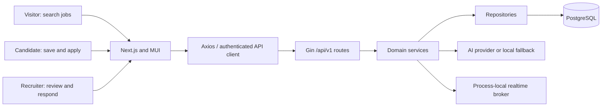

# Kirmya repository audit and growth plan

> **Local handoff — 6 September 2026:** Audit references have been repaired for this checkout. The [Step 1 baseline](../../docs/project-baseline-2026-09-06/README.md) records the current local inventory and consolidated backlog. Statements below about copied reports, original snapshots and verification folders describe the historical review; unavailable evidence is explicitly recorded, and no new runtime PASS is implied.

**Review date:** 5 September 2026  
**Repository:** [prashanthc1/kirmya_project](https://github.com/prashanthc1/kirmya_project)  
**Audited commit:** [5f6790a95ae0](https://github.com/prashanthc1/kirmya_project/commit/5f6790a95ae02d74666b668ab62e140d861424ec)  
**Decision:** **Hold broad public launch and traffic campaigns until the critical user journeys and privacy controls are dependable.** A controlled test environment is appropriate for resolving the findings.

Kirmya has a substantial implementation and a usable architectural foundation. Its main weakness is the gap between what the interface and reports promise and what several runtime paths actually do. The highest-value work is to make saving, applying, document handling, privacy controls and recruiter responses trustworthy, then improve acquisition. Another broad feature expansion or visual rewrite would leave those problems in place.

This review records **20 findings**, with priorities and acceptance tests below. These priorities are engineering judgments, not a numerical security scoring system. P1 means address before the affected feature is broadly released; P2 means fix in the next iteration or before the stated scaling condition. No P0 exploit or active compromise is claimed.

## 1. Scope and evidence limits

The downloaded, immutable GitHub snapshot contains **2,563 files**, including **526 Go files**, **940 TSX files**, **394 page.tsx routes**, **149 SQL files** (94 up-migration files), and **717 non-hidden Markdown documents**. There are 57 directories under backend/internal, including shared/router/docs rather than 57 independent business services. The inventory found 92 Go test files and 56 TypeScript/TSX test files. File counts are not test coverage or feature completeness percentages.

All 2,546 selected text files were loaded and screened programmatically: **469,823 lines**, including generated API specifications, lockfiles, tests and documentation. Focused source inspection used full files or excerpts from **60 files**, plus repository-wide search results. Documentation screening covered headings, claims and local links. **This is not a manual certification of every code line or every documentation assertion.** [review-coverage.json](review-coverage.json) records the distinction file by file. The requested exhaustive manual pass remains wider than this delivered evidence-based audit.

The older local checkout was not used as the current baseline. No production database, user data, deployment configuration, traffic analytics, Search Console data or rendered live site was inspected. No production penetration test, fresh dependency vulnerability assessment, load test, backup restore or complete browser journey was performed. Visual recommendations are based on component source and user flows, not screenshots or a visual conformance score.

## 2. How the project works

Kirmya is a career platform combining job discovery and applications with profiles, resumes, recruiter tools, companies, networking, messaging, communities and AI career assistance. There are also advanced modules for learning, referrals, verification, enterprise hiring, freelance work, analytics and administration.

| Layer | Actual role in the code | What to understand |
|---|---|---|
| Next.js web application | App Router pages, MUI components, theme tokens, React state and React Query | Public marketing/discovery and authenticated workflows share a large frontend. |
| API clients | Axios clients; authApiClient holds the access token in memory and refreshes on 401 | Several feature clients still bypass this path and use mock credentials or localhost. |
| Go modular monolith | Gin routes under /api/v1; handlers call services and repositories | A single application composes the modules. Keeping this structure is reasonable. |
| PostgreSQL | pgx repositories plus a database/sql bridge for some modules | SQL code exists in many modules, but some methods remain no-ops or hide errors. |
| Redis/cache | Shared caching infrastructure | Its presence does not mean all sessions or realtime events are distributed through Redis. |
| Realtime | WebSocket services use a process-local PubSub broker in main.go | Additional replicas need a shared delivery design and catch-up behavior. |
| AI | Configurable provider adapters with a deterministic local fallback | Some application analytics bypass genuine inference and return synthetic numbers. |
| Tests and operations | GitHub workflows, Vitest, Go tests, Playwright specifications, Docker and monitoring definitions | Definitions and green mock tests must be separated from verified production behavior. |

The core business loop should be: **a real employer publishes a useful job → a relevant candidate finds it → an accurate application reaches the recruiter → the recruiter responds → the candidate receives a reliable update**. Most traffic and retention work should strengthen this loop.

## 3. What has improved since the master audit

The August 28 master report is useful history, but it is no longer a reliable list of open defects.

- Password reset routes and frontend screens now exist. See [backend/internal/auth/delivery/http/routes.go:29](https://github.com/prashanthc1/kirmya_project/blob/5f6790a95ae02d74666b668ab62e140d861424ec/backend/internal/auth/delivery/http/routes.go#L29).
- Mentorship identity now comes from verified request context, rather than trusting an X-User-ID header. See [backend/internal/mentorship/delivery/http/mentorship_handler.go:38](https://github.com/prashanthc1/kirmya_project/blob/5f6790a95ae02d74666b668ab62e140d861424ec/backend/internal/mentorship/delivery/http/mentorship_handler.go#L38).
- Mentorship route registration is nil-guarded, and trust-safety handlers have typed mounting. See [backend/internal/router/router.go:254](https://github.com/prashanthc1/kirmya_project/blob/5f6790a95ae02d74666b668ab62e140d861424ec/backend/internal/router/router.go#L254) and [backend/internal/router/router.go:302](https://github.com/prashanthc1/kirmya_project/blob/5f6790a95ae02d74666b668ab62e140d861424ec/backend/internal/router/router.go#L302).
- Billing writes are authenticated and admin billing uses RequireAdmin. This corrects the old blanket unauthenticated-billing claim for the inspected registration code. See [backend/internal/billing/delivery/http/routes.go:19](https://github.com/prashanthc1/kirmya_project/blob/5f6790a95ae02d74666b668ab62e140d861424ec/backend/internal/billing/delivery/http/routes.go#L19).
- Formerly memory-only modules such as assessment and verification now contain SQL paths. No production RegisterEphemeral call sites were found. This does **not** establish that all methods persist correctly: F02, F03, F13 and F18 are counterexamples or limitations.
- Applications have transactional SQL, stage history and owner predicates in several operations. Their timeline path still needs its own ownership check.
- Local TypeScript checking passes. Existing theme tokens, common state components and a shared API client provide useful foundations.

## 4. Verification results

| Check | Result on the audited snapshot | What it establishes |
|---|---|---|
| GitHub backend workflow | **PASS** | The configured backend workflow completed for the audited commit. Because it permits database-free startup and some integration tests skip or use nil repositories, this is not proof of database-backed end-to-end behavior. |
| GitHub frontend workflow | **FAIL** | [Run 33975663395](https://github.com/prashanthc1/kirmya_project/actions/runs/33975663395) stopped at linting; its test and production-build steps were skipped. |
| GitHub security workflow | **Workflow completed, gate inconclusive** | The workflow converts npm audit and govulncheck failures to warnings and configures Trivy with exit code 0. A green result therefore does not certify a clean dependency or container scan. |
| Local TypeScript check | **PASS** | `tsc --noEmit --incremental false` completed without diagnostics. |
| Local ESLint | **FAIL** | The full frontend lint reproduced **3 errors and 141 warnings**. The errors are `transition: all` violations in the recommendations page, DiscoveryCard and FileUploadZone. |
| Targeted Vitest run | **INCOMPLETE** | The selected application, landing and jobs tests printed only the Vitest start banner and did not finish in the available session. It is not counted as a pass or failure. |
| Database, browser and production checks | **NOT RUN** | No PostgreSQL/Redis integration environment, production deployment, traffic dataset, Search Console property, accessibility browser pass, load test, penetration test or backup restore was available for this review. |

Verification labels in this report are deliberately narrow. A successful typecheck does not imply lint, tests or build success, and a successful workflow does not imply that checks configured as non-blocking found no issues.

## 5. Prioritized findings

| ID | Priority | Area | Finding |
|---|---|---|---|
| F01 | P1 | Security / applications | [Application timeline omits candidate ownership](#f01) |
| F02 | P1 | Privacy / data integrity | [Privacy and consent operations return success without persistence](#f02) |
| F03 | P1 | Applications / documents | [Candidate document registration returns 201 without saving](#f03) |
| F04 | P1 | Applications / conversion | [Application form drops contact edits and resume URL](#f04) |
| F05 | P1 | Jobs / API contracts | [Saved jobs use the wrong response shape](#f05) |
| F06 | P1 | Configuration / integration | [Production frontend CI supplies an incompatible API base URL](#f06) |
| F07 | P1 | Frontend / integration | [Several reachable feature clients still use mock authentication and localhost](#f07) |
| F08 | P1 | Trust / content | [Public homepage presents hardcoded social proof as real](#f08) |
| F09 | P2 | Growth / retention | [Newsletter success does not capture a subscription](#f09) |
| F10 | P1 | SEO / acquisition | [Search discovery is weakened by metadata and job indexing gaps](#f10) |
| F11 | P1 | QA / release evidence | [Database-free CI is mistaken for full workflow validation](#f11) |
| F12 | P1 | CI / security assurance | [Security workflow deliberately suppresses scan failures](#f12) |
| F13 | P1 | Reliability / retention | [Application data access hides database errors](#f13) |
| F14 | P2 | AI / product trust | [Application analytics present synthetic scores as personalized measurements](#f14) |
| F15 | P2 | Accessibility / UX | [Duplicate landmarks and unlabeled controls contradict accessibility claims](#f15) |
| F16 | P2 | Architecture / scaling | [Realtime delivery is process-local despite distributed-broker documentation](#f16) |
| F17 | P2 | API / applications | [Job-specific apply alias validates the body before reading its path ID](#f17) |
| F18 | P1 | Operations / data durability | [Production can enter unregistered nil-database fallback mode](#f18) |
| F19 | P1 | Build / release | [Frontend release check currently fails at linting](#f19) |
| F20 | P1 | Documentation / governance | [Audit scores and operational claims exceed their evidence](#f20) |

### F01 · P1 · Application timeline omits candidate ownership

**Observed behavior and impact:** An authenticated user who knows another application UUID can request its stage history, notes and actor IDs. The handler passes candidateID, but the service drops it and SQL filters only application_id. The generic tenant middleware does not add ownership checks. This is a statically traced authorization defect; no production account was probed.

**Evidence:** [backend/internal/applications/delivery/http/routes.go:20](https://github.com/prashanthc1/kirmya_project/blob/5f6790a95ae02d74666b668ab62e140d861424ec/backend/internal/applications/delivery/http/routes.go#L20); [backend/internal/applications/delivery/http/applications_handler.go:171](https://github.com/prashanthc1/kirmya_project/blob/5f6790a95ae02d74666b668ab62e140d861424ec/backend/internal/applications/delivery/http/applications_handler.go#L171); [backend/internal/applications/service/applications_service.go:60](https://github.com/prashanthc1/kirmya_project/blob/5f6790a95ae02d74666b668ab62e140d861424ec/backend/internal/applications/service/applications_service.go#L60); [backend/internal/applications/repository/applications_repository.go:419](https://github.com/prashanthc1/kirmya_project/blob/5f6790a95ae02d74666b668ab62e140d861424ec/backend/internal/applications/repository/applications_repository.go#L419).

**Required change:** Require application ownership in the timeline query through a join to job_applications and candidate_id. Return 404 for other candidates. Keep recruiter access in an explicitly authorized path.

**Acceptance test:** Create two candidates and an application in PostgreSQL. Owner timeline succeeds; the second candidate receives 404 with no event data; unknown IDs behave consistently.

### F02 · P1 · Privacy and consent operations return success without persistence

**Observed behavior and impact:** Acceptance, cookie consent, privacy updates, export creation and deletion requests include unconditional no-op methods. Privacy reads reconstruct defaults, while export reads report a completed synthetic export. These methods remain placeholders even with a database connection; this is not confined to the nil-database fallback. Users cannot rely on the displayed settings or request status.

**Evidence:** [backend/internal/legal/repository/legal_repo.go:98](https://github.com/prashanthc1/kirmya_project/blob/5f6790a95ae02d74666b668ab62e140d861424ec/backend/internal/legal/repository/legal_repo.go#L98); [backend/internal/legal/repository/legal_repo.go:111](https://github.com/prashanthc1/kirmya_project/blob/5f6790a95ae02d74666b668ab62e140d861424ec/backend/internal/legal/repository/legal_repo.go#L111); [backend/internal/legal/repository/legal_repo.go:129](https://github.com/prashanthc1/kirmya_project/blob/5f6790a95ae02d74666b668ab62e140d861424ec/backend/internal/legal/repository/legal_repo.go#L129); [backend/internal/legal/repository/legal_repo.go:159](https://github.com/prashanthc1/kirmya_project/blob/5f6790a95ae02d74666b668ab62e140d861424ec/backend/internal/legal/repository/legal_repo.go#L159); [backend/internal/legal/repository/legal_repo.go:191](https://github.com/prashanthc1/kirmya_project/blob/5f6790a95ae02d74666b668ab62e140d861424ec/backend/internal/legal/repository/legal_repo.go#L191); [backend/internal/legal/delivery/http/routes.go:22](https://github.com/prashanthc1/kirmya_project/blob/5f6790a95ae02d74666b668ab62e140d861424ec/backend/internal/legal/delivery/http/routes.go#L22).

**Required change:** Persist each preference and request, enforce preferences in consuming features, generate exports through a real worker and keep requests pending until completion. Replace fabricated histories with stored records. Until implemented, disclose feature unavailability instead of returning success.

**Acceptance test:** Update, read back, restart, and read again. Check user isolation, worker failures, signed export downloads, and cancellation. These are engineering findings, not a legal compliance certification.

### F03 · P1 · Candidate document registration returns 201 without saving

**Observed behavior and impact:** POST /documents/upload constructs a document with a new ID and hardcoded 1 MB/PDF metadata, then responds 201. It never calls a repository. GET /documents reads candidate_documents, so a newly registered document will not appear there.

**Evidence:** [backend/internal/applications/delivery/http/applications_handler.go:355](https://github.com/prashanthc1/kirmya_project/blob/5f6790a95ae02d74666b668ab62e140d861424ec/backend/internal/applications/delivery/http/applications_handler.go#L355); [backend/internal/applications/repository/applications_repository.go:683](https://github.com/prashanthc1/kirmya_project/blob/5f6790a95ae02d74666b668ab62e140d861424ec/backend/internal/applications/repository/applications_repository.go#L683).

**Required change:** Connect registration to an owned, verified storage object and persist its actual metadata. Use one canonical document service for profile uploads and applications.

**Acceptance test:** Register a document through HTTP, list it, reload the browser, restart the API and select it in an application. Invalid or foreign storage references must be rejected.

### F04 · P1 · Application form drops contact edits and resume URL

**Observed behavior and impact:** The form collects fullName, email, phone and customResumeUrl, but its submission sends none of them. Selecting a document sends resume_id, while the repository stores resume_url only from the absent payload field and does not resolve the selected document. The candidate-facing detail also does not populate SubmittedResume. Required screening flags are not enforced; blank answers become N/A.

**Evidence:** [frontend/src/components/applications/ApplyJobModal.tsx:145](https://github.com/prashanthc1/kirmya_project/blob/5f6790a95ae02d74666b668ab62e140d861424ec/frontend/src/components/applications/ApplyJobModal.tsx#L145); [frontend/src/components/applications/ApplyJobModal.tsx:179](https://github.com/prashanthc1/kirmya_project/blob/5f6790a95ae02d74666b668ab62e140d861424ec/frontend/src/components/applications/ApplyJobModal.tsx#L179); [frontend/src/components/applications/ApplyJobModal.tsx:280](https://github.com/prashanthc1/kirmya_project/blob/5f6790a95ae02d74666b668ab62e140d861424ec/frontend/src/components/applications/ApplyJobModal.tsx#L280); [backend/internal/applications/repository/applications_repository.go:96](https://github.com/prashanthc1/kirmya_project/blob/5f6790a95ae02d74666b668ab62e140d861424ec/backend/internal/applications/repository/applications_repository.go#L96).

**Required change:** Define the application snapshot contract. Persist intentional contact overrides or make profile-derived fields read-only. Resolve an owned resume ID server-side into an immutable attachment. Validate employer questions server-side and show missing fields before submission.

**Acceptance test:** Change contact details, choose a resume, submit, and inspect the recruiter view and reloaded application. Test a direct URL, a foreign document ID and an unanswered required question.

### F05 · P1 · Saved jobs use the wrong response shape

**Observed behavior and impact:** The server returns SavedJobDTO: id is the bookmark ID, job_id is the job ID, and job_title contains the title. jobsApi.getSavedJobs types these rows as JobSummary without mapping. JobCard uses job.id for links and unsave requests and job.title for its heading, causing wrong links/actions and missing titles.

**Evidence:** [backend/internal/applications/models/applications.go:200](https://github.com/prashanthc1/kirmya_project/blob/5f6790a95ae02d74666b668ab62e140d861424ec/backend/internal/applications/models/applications.go#L200); [frontend/src/features/jobs/api.ts:47](https://github.com/prashanthc1/kirmya_project/blob/5f6790a95ae02d74666b668ab62e140d861424ec/frontend/src/features/jobs/api.ts#L47); [frontend/src/app/saved-jobs/page.tsx:88](https://github.com/prashanthc1/kirmya_project/blob/5f6790a95ae02d74666b668ab62e140d861424ec/frontend/src/app/saved-jobs/page.tsx#L88); [frontend/src/components/jobs/JobCard.tsx:75](https://github.com/prashanthc1/kirmya_project/blob/5f6790a95ae02d74666b668ab62e140d861424ec/frontend/src/components/jobs/JobCard.tsx#L75).

**Required change:** Map the saved-job DTO explicitly to a job-card model, or use a dedicated SavedJobCard. Preserve bookmark IDs separately from job IDs.

**Acceptance test:** Use a fixture whose bookmark and job UUIDs differ. Assert the displayed title, destination URL and DELETE request use the job ID.

### F06 · P1 · Production frontend CI supplies an incompatible API base URL

**Observed behavior and impact:** The build workflow sets NEXT_PUBLIC_API_URL to https://api.kirmya.com, while clients append /auth/login or /jobs and the backend mounts /api/v1. The workflow-built client therefore targets unversioned endpoints unless an external rewrite compensates. No deployed rewrite was verified.

**Evidence:** [.github/workflows/frontend.yml:56](https://github.com/prashanthc1/kirmya_project/blob/5f6790a95ae02d74666b668ab62e140d861424ec/.github/workflows/frontend.yml#L56); [frontend/src/services/authService.ts:3](https://github.com/prashanthc1/kirmya_project/blob/5f6790a95ae02d74666b668ab62e140d861424ec/frontend/src/services/authService.ts#L3); [frontend/src/features/jobs/api.ts:5](https://github.com/prashanthc1/kirmya_project/blob/5f6790a95ae02d74666b668ab62e140d861424ec/frontend/src/features/jobs/api.ts#L5); [backend/internal/router/router.go:195](https://github.com/prashanthc1/kirmya_project/blob/5f6790a95ae02d74666b668ab62e140d861424ec/backend/internal/router/router.go#L195).

**Required change:** Use a validated base URL ending in /api/v1 consistently for builds and runtime configuration, or centralize version-prefix handling. Add a smoke test for the exact production artifact.

**Acceptance test:** Build with production configuration and inspect actual login, refresh, search and application request URLs. They must resolve to the mounted API routes.

### F07 · P1 · Several reachable feature clients still use mock authentication and localhost

**Observed behavior and impact:** Organization, referrals and verification clients include a fixed UUID bearer value and a hardcoded localhost base. Additional advanced and legacy clients have similar markers. A UUID is not a valid signed JWT; this is broken integration, not proof of an authentication bypass. Some legacy clients may be unused and require import tracing before removal.

**Evidence:** [frontend/src/features/organization/api.ts:10](https://github.com/prashanthc1/kirmya_project/blob/5f6790a95ae02d74666b668ab62e140d861424ec/frontend/src/features/organization/api.ts#L10); [frontend/src/features/referral/api.ts:10](https://github.com/prashanthc1/kirmya_project/blob/5f6790a95ae02d74666b668ab62e140d861424ec/frontend/src/features/referral/api.ts#L10); [frontend/src/features/verification/api.ts:9](https://github.com/prashanthc1/kirmya_project/blob/5f6790a95ae02d74666b668ab62e140d861424ec/frontend/src/features/verification/api.ts#L9); [frontend/src/app/organization/page.tsx:40](https://github.com/prashanthc1/kirmya_project/blob/5f6790a95ae02d74666b668ab62e140d861424ec/frontend/src/app/organization/page.tsx#L40); [frontend/src/app/referrals/page.tsx:37](https://github.com/prashanthc1/kirmya_project/blob/5f6790a95ae02d74666b668ab62e140d861424ec/frontend/src/app/referrals/page.tsx#L37).

**Required change:** Route authenticated calls through authApiClient, remove body identity placeholders where the server owns identity, and prohibit literal localhost bases in production feature clients.

**Acceptance test:** Sign in as two separate test users and exercise organization/referral/verification flows. Check the bearer token and API destination; no mock identity may be sent.

### F08 · P1 · Public homepage presents hardcoded social proof as real

**Observed behavior and impact:** StatisticsSection receives no stats and therefore displays fixed large counts. MetricsSection is wholly hardcoded. Testimonials fall back to invented-looking named success stories under REAL RECOVERY STORIES; the API client itself falls back to another story when its localhost request fails. The repository contains no evidence validating these claims.

**Evidence:** [frontend/src/components/landing/StatisticsSection.tsx:24](https://github.com/prashanthc1/kirmya_project/blob/5f6790a95ae02d74666b668ab62e140d861424ec/frontend/src/components/landing/StatisticsSection.tsx#L24); [frontend/src/components/landing/MetricsSection.tsx:11](https://github.com/prashanthc1/kirmya_project/blob/5f6790a95ae02d74666b668ab62e140d861424ec/frontend/src/components/landing/MetricsSection.tsx#L11); [frontend/src/components/landing/TestimonialsSection.tsx:26](https://github.com/prashanthc1/kirmya_project/blob/5f6790a95ae02d74666b668ab62e140d861424ec/frontend/src/components/landing/TestimonialsSection.tsx#L26); [frontend/src/features/landing/api.ts:4](https://github.com/prashanthc1/kirmya_project/blob/5f6790a95ae02d74666b668ab62e140d861424ec/frontend/src/features/landing/api.ts#L4); [frontend/src/app/page.tsx:77](https://github.com/prashanthc1/kirmya_project/blob/5f6790a95ae02d74666b668ab62e140d861424ec/frontend/src/app/page.tsx#L77).

**Required change:** Remove unverified counts and testimonials from production. Show dated, measured aggregates and consented case studies, or clearly labeled product examples. Handle unavailable landing content without manufacturing success evidence.

**Acceptance test:** Disconnect the landing API and verify no fictional employer, hire, member count, accuracy claim or testimonial appears as a real outcome.

### F09 · P2 · Newsletter success does not capture a subscription

**Observed behavior and impact:** Submitting the newsletter only changes React state and clears the email. No request or persistence occurs, so the site loses every lead despite saying Subscribed successfully.

**Evidence:** [frontend/src/components/landing/Footer.tsx:34](https://github.com/prashanthc1/kirmya_project/blob/5f6790a95ae02d74666b668ab62e140d861424ec/frontend/src/components/landing/Footer.tsx#L34); [frontend/src/components/landing/Footer.tsx:73](https://github.com/prashanthc1/kirmya_project/blob/5f6790a95ae02d74666b668ab62e140d861424ec/frontend/src/components/landing/Footer.tsx#L73).

**Required change:** Connect the form to a persistent subscription endpoint, record consent and source, confirm delivery, and provide unsubscribe handling. Show success only after acceptance.

**Acceptance test:** Submit, verify the stored subscription and confirmation delivery, reload, then unsubscribe. Network failure must preserve the email and show a retryable error.

### F10 · P1 · Search discovery is weakened by metadata and job indexing gaps

**Observed behavior and impact:** The root sets the homepage as canonical and no per-route canonical override was found in app source. Job details are fetched in an effect, have no job-specific metadata or JobPosting markup, and errors render a normal page instead of an HTTP not-found response. The sitemap has only six static URLs, including sign-in/up, and omits individual jobs and companies. Client rendering alone does not mean Google cannot index the site, but these choices impair reliable discovery and sharing.

**Evidence:** [frontend/src/app/layout.tsx:32](https://github.com/prashanthc1/kirmya_project/blob/5f6790a95ae02d74666b668ab62e140d861424ec/frontend/src/app/layout.tsx#L32); [frontend/src/app/jobs/[id]/page.tsx:23](https://github.com/prashanthc1/kirmya_project/blob/5f6790a95ae02d74666b668ab62e140d861424ec/frontend/src/app/jobs/[id]/page.tsx#L23); [frontend/src/app/sitemap.ts:6](https://github.com/prashanthc1/kirmya_project/blob/5f6790a95ae02d74666b668ab62e140d861424ec/frontend/src/app/sitemap.ts#L6); [frontend/src/app/robots.ts:5](https://github.com/prashanthc1/kirmya_project/blob/5f6790a95ae02d74666b668ab62e140d861424ec/frontend/src/app/robots.ts#L5).

**Required change:** Render public job content and metadata on the server; use self-canonicals, valid JobPosting data for active individual vacancies, real 404/410 handling, and a sitemap sourced from public inventory. Apply noindex to account-only screens; robots is not access control.

**Acceptance test:** Inspect initial HTML, status codes, canonical and social tags; validate job markup and inspect sample URLs in Search Console after deployment.

### F11 · P1 · Database-free CI is mistaken for full workflow validation

**Observed behavior and impact:** Backend CI sets ALLOW_NO_DB=true. The live database test skips, and the named cross-module candidate workflow directly creates repositories with nil pools. It bypasses HTTP, SQL migrations and actual event generation. The frontend step named Unit & E2E runs Vitest; its configured include excludes root Playwright specs. Green checks do not establish full-stack persistence or browser journeys.

**Evidence:** [.github/workflows/backend.yml:40](https://github.com/prashanthc1/kirmya_project/blob/5f6790a95ae02d74666b668ab62e140d861424ec/.github/workflows/backend.yml#L40); [backend/test/integration/db_integration_test.go:12](https://github.com/prashanthc1/kirmya_project/blob/5f6790a95ae02d74666b668ab62e140d861424ec/backend/test/integration/db_integration_test.go#L12); [backend/test/integration/cross_module_workflows_test.go:42](https://github.com/prashanthc1/kirmya_project/blob/5f6790a95ae02d74666b668ab62e140d861424ec/backend/test/integration/cross_module_workflows_test.go#L42); [frontend/vitest.config.ts:14](https://github.com/prashanthc1/kirmya_project/blob/5f6790a95ae02d74666b668ab62e140d861424ec/frontend/vitest.config.ts#L14); [.github/workflows/frontend.yml:48](https://github.com/prashanthc1/kirmya_project/blob/5f6790a95ae02d74666b668ab62e140d861424ec/.github/workflows/frontend.yml#L48).

**Required change:** Add a required PostgreSQL/Redis job with migrations and real HTTP journeys. Run Playwright against the built frontend and real test API. Report skipped tests and preserve artifacts.

**Acceptance test:** Break an application SQL column or ownership predicate in a temporary test branch and confirm the required integration gate fails. Validate signup-to-apply and recruiter-stage-to-candidate-notification journeys.

### F12 · P1 · Security workflow deliberately suppresses scan failures

**Observed behavior and impact:** npm audit and govulncheck failures are converted into warnings; Trivy uses exit-code 0 even for HIGH/CRITICAL findings. Thus the successful security run on this commit is not evidence of a clean scan. Tool errors are also masked. The workflow uses a moving Trivy master reference.

**Evidence:** [.github/workflows/security.yml:30](https://github.com/prashanthc1/kirmya_project/blob/5f6790a95ae02d74666b668ab62e140d861424ec/.github/workflows/security.yml#L30); [.github/workflows/security.yml:35](https://github.com/prashanthc1/kirmya_project/blob/5f6790a95ae02d74666b668ab62e140d861424ec/.github/workflows/security.yml#L35); [.github/workflows/security.yml:41](https://github.com/prashanthc1/kirmya_project/blob/5f6790a95ae02d74666b668ab62e140d861424ec/.github/workflows/security.yml#L41).

**Required change:** Make scan failures fail the gate. Use explicit, reviewed exceptions with expiry where needed; pin scanner versions/actions and retain machine-readable output.

**Acceptance test:** A known vulnerable fixture or deliberate scanner failure must produce a failed check. Do not claim zero vulnerabilities until fresh results support it.

### F13 · P1 · Application data access hides database errors

**Observed behavior and impact:** The registered saved-job and candidate-document reads return empty successful results on SQL failures. The application repository also has a CreateJobAlert method that returns success when INSERT fails; its handler is not mounted by applications/routes.go, so that alert-specific issue is a latent duplicate-path defect, not a verified live alert endpoint failure. Empty success responses conceal outages from users and monitoring.

**Evidence:** [backend/internal/applications/repository/applications_repository.go:591](https://github.com/prashanthc1/kirmya_project/blob/5f6790a95ae02d74666b668ab62e140d861424ec/backend/internal/applications/repository/applications_repository.go#L591); [backend/internal/applications/repository/applications_repository.go:623](https://github.com/prashanthc1/kirmya_project/blob/5f6790a95ae02d74666b668ab62e140d861424ec/backend/internal/applications/repository/applications_repository.go#L623); [backend/internal/applications/repository/applications_repository.go:529](https://github.com/prashanthc1/kirmya_project/blob/5f6790a95ae02d74666b668ab62e140d861424ec/backend/internal/applications/repository/applications_repository.go#L529); [backend/internal/applications/repository/applications_repository.go:695](https://github.com/prashanthc1/kirmya_project/blob/5f6790a95ae02d74666b668ab62e140d861424ec/backend/internal/applications/repository/applications_repository.go#L695); [backend/internal/applications/delivery/http/routes.go:48](https://github.com/prashanthc1/kirmya_project/blob/5f6790a95ae02d74666b668ab62e140d861424ec/backend/internal/applications/delivery/http/routes.go#L48).

**Required change:** Propagate repository errors, check row iteration errors, distinguish missing data from unavailable data, and return stable retryable API errors. Use honest error states in the client.

**Acceptance test:** Force insert/select failures in a disposable database; assert no success acknowledgment or empty-state substitution and verify that retry succeeds without duplication.

### F14 · P2 · Application analytics present synthetic scores as personalized measurements

**Observed behavior and impact:** AI insights use fixed match scores, a default 75% success rate, generic missing skills and an application-count formula unrelated to outcomes. TimeToResponseDays is always 3.5. These numbers are not measurements of the candidate or an evaluated prediction.

**Evidence:** [backend/internal/applications/service/applications_service.go:137](https://github.com/prashanthc1/kirmya_project/blob/5f6790a95ae02d74666b668ab62e140d861424ec/backend/internal/applications/service/applications_service.go#L137); [backend/internal/applications/service/applications_service.go:244](https://github.com/prashanthc1/kirmya_project/blob/5f6790a95ae02d74666b668ab62e140d861424ec/backend/internal/applications/service/applications_service.go#L244).

**Required change:** Calculate observable metrics from dated events, publish definitions and sample sizes, return insufficient-data states, and label deterministic advice separately from model inference.

**Acceptance test:** Zero-data users must not receive fabricated success probabilities. Known application histories should yield reproducible rates and response times.

### F15 · P2 · Duplicate landmarks and unlabeled controls contradict accessibility claims

**Observed behavior and impact:** The root main wraps a second main with the same main-content ID on the homepage; job details also repeat it. Carousel arrow buttons lack accessible labels. The newsletter email field uses a placeholder without a label, and the send icon button has no accessible name. These are concrete source issues; contrast and WCAG conformance were not visually certified.

**Evidence:** [frontend/src/app/layout.tsx:101](https://github.com/prashanthc1/kirmya_project/blob/5f6790a95ae02d74666b668ab62e140d861424ec/frontend/src/app/layout.tsx#L101); [frontend/src/app/page.tsx:72](https://github.com/prashanthc1/kirmya_project/blob/5f6790a95ae02d74666b668ab62e140d861424ec/frontend/src/app/page.tsx#L72); [frontend/src/components/landing/TestimonialsSection.tsx:157](https://github.com/prashanthc1/kirmya_project/blob/5f6790a95ae02d74666b668ab62e140d861424ec/frontend/src/components/landing/TestimonialsSection.tsx#L157); [frontend/src/components/landing/Footer.tsx:80](https://github.com/prashanthc1/kirmya_project/blob/5f6790a95ae02d74666b668ab62e140d861424ec/frontend/src/components/landing/Footer.tsx#L80).

**Required change:** Keep one main landmark and one skip target. Add persistent field labels and meaningful button names. Verify keyboard focus, zoom, reduced motion and mobile targets.

**Acceptance test:** Run an accessibility scanner and keyboard/screen-reader checks on homepage, jobs and application dialog at desktop and narrow widths.

### F16 · P2 · Realtime delivery is process-local despite distributed-broker documentation

**Observed behavior and impact:** The running composition uses NewInMemoryPubSub for messaging and notifications. Separate API replicas do not share subscriptions, and a full subscriber buffer silently drops events. SQL persistence may retain messages, but live cross-replica notification delivery is not established. Docs alternately claim Redis and NATS.

**Evidence:** [backend/cmd/kirmya/main.go:407](https://github.com/prashanthc1/kirmya_project/blob/5f6790a95ae02d74666b668ab62e140d861424ec/backend/cmd/kirmya/main.go#L407); [backend/internal/messaging/pubsub/pubsub.go:58](https://github.com/prashanthc1/kirmya_project/blob/5f6790a95ae02d74666b668ab62e140d861424ec/backend/internal/messaging/pubsub/pubsub.go#L58); [docs/messaging/messaging-platform-audit.md:10](https://github.com/prashanthc1/kirmya_project/blob/5f6790a95ae02d74666b668ab62e140d861424ec/docs/messaging/messaging-platform-audit.md#L10); [docs/notifications/notifications-audit.md:10](https://github.com/prashanthc1/kirmya_project/blob/5f6790a95ae02d74666b668ab62e140d861424ec/docs/notifications/notifications-audit.md#L10).

**Required change:** Document current single-process behavior. Before horizontal scaling, wire a shared broker and implement reconnect/catch-up from durable records; use a durable queue where delivery guarantees are required.

**Acceptance test:** Connect users to different replicas and test message delivery, reconnect, subscriber overload and broker restart.

### F17 · P2 · Job-specific apply alias validates the body before reading its path ID

**Observed behavior and impact:** POST /jobs/:id/apply binds CreateApplicationPayload with job_id marked required, then tries to fill job_id from the URL afterward. A normal empty object request fails binding before that fallback. If both IDs are supplied and disagree, the body currently wins.

**Evidence:** [backend/internal/applications/delivery/http/applications_handler.go:29](https://github.com/prashanthc1/kirmya_project/blob/5f6790a95ae02d74666b668ab62e140d861424ec/backend/internal/applications/delivery/http/applications_handler.go#L29); [backend/internal/applications/models/applications.go:239](https://github.com/prashanthc1/kirmya_project/blob/5f6790a95ae02d74666b668ab62e140d861424ec/backend/internal/applications/models/applications.go#L239); [frontend/src/features/jobs/api.ts:72](https://github.com/prashanthc1/kirmya_project/blob/5f6790a95ae02d74666b668ab62e140d861424ec/frontend/src/features/jobs/api.ts#L72).

**Required change:** Read and validate the path ID first for the alias, use an appropriate request DTO, and reject mismatched IDs. Keep the canonical /applications contract explicit.

**Acceptance test:** The alias accepts a valid path with a valid application body lacking job_id; invalid and mismatched IDs are rejected predictably.

### F18 · P1 · Production can enter unregistered nil-database fallback mode

**Observed behavior and impact:** If ALLOW_NO_DB=true and database connection fails, startup continues with nil pools. No production RegisterEphemeral call sites were found, so the registry audit can report every repository database-backed while fallback code handles requests. This risk requires that configuration and database failure; it is not a claim that the deployed site is running this way.

**Evidence:** [backend/cmd/kirmya/main.go:307](https://github.com/prashanthc1/kirmya_project/blob/5f6790a95ae02d74666b668ab62e140d861424ec/backend/cmd/kirmya/main.go#L307); [backend/cmd/kirmya/main.go:327](https://github.com/prashanthc1/kirmya_project/blob/5f6790a95ae02d74666b668ab62e140d861424ec/backend/cmd/kirmya/main.go#L327); [backend/internal/shared/persistence/ephemeral.go:78](https://github.com/prashanthc1/kirmya_project/blob/5f6790a95ae02d74666b668ab62e140d861424ec/backend/internal/shared/persistence/ephemeral.go#L78); [backend/internal/applications/repository/applications_repository.go:130](https://github.com/prashanthc1/kirmya_project/blob/5f6790a95ae02d74666b668ab62e140d861424ec/backend/internal/applications/repository/applications_repository.go#L130).

**Required change:** Reject ALLOW_NO_DB in production and fail readiness when the database is unavailable. Move test stores behind explicit test construction rather than production nil-pointer branches.

**Acceptance test:** Start in production mode with ALLOW_NO_DB=true and an unavailable database. The process must refuse to serve write traffic.

### F19 · P1 · Frontend release check currently fails at linting

**Observed behavior and impact:** GitHub run 33975663395 for the audited commit failed the lint step, skipping unit tests and production build. Local typechecking passes, which does not clear lint or establish a passing production build. See the verification section for local lint/test details. Local ESLint reproduced 3 errors (all no-restricted-syntax transition: all violations) and 141 warnings. The three errors are in jobs/recommendations/page.tsx:365, recommendations/DiscoveryCard.tsx:75 and upload/FileUploadZone.tsx:156.

**Evidence:** [.github/workflows/frontend.yml:45](https://github.com/prashanthc1/kirmya_project/blob/5f6790a95ae02d74666b668ab62e140d861424ec/.github/workflows/frontend.yml#L45); [frontend/src/app/jobs/recommendations/page.tsx:365](https://github.com/prashanthc1/kirmya_project/blob/5f6790a95ae02d74666b668ab62e140d861424ec/frontend/src/app/jobs/recommendations/page.tsx#L365); [frontend/src/components/recommendations/DiscoveryCard.tsx:75](https://github.com/prashanthc1/kirmya_project/blob/5f6790a95ae02d74666b668ab62e140d861424ec/frontend/src/components/recommendations/DiscoveryCard.tsx#L75); [frontend/src/components/upload/FileUploadZone.tsx:156](https://github.com/prashanthc1/kirmya_project/blob/5f6790a95ae02d74666b668ab62e140d861424ec/frontend/src/components/upload/FileUploadZone.tsx#L156).

**Required change:** Resolve the current lint failures and rerun the complete pipeline on the same release commit. Preserve failure output and avoid disabling the gate to produce a green badge.

**Acceptance test:** Required frontend lint, tests and production build all complete successfully on the chosen release SHA.

### F20 · P1 · Audit scores and operational claims exceed their evidence

**Observed behavior and impact:** Reports claim 98–100 readiness, zero mock data, zero IDOR and complete E2E validation despite current counterexamples. The old master audit also lists defects that source now addresses. Automated link checking found 281 file:// links pointing at another local checkout. Benchmark and restore figures were not independently reproduced.

**Evidence:** [docs/production_readiness_audit.md:5](https://github.com/prashanthc1/kirmya_project/blob/5f6790a95ae02d74666b668ab62e140d861424ec/docs/production_readiness_audit.md#L5); [docs/qa/production-readiness-report.md:12](https://github.com/prashanthc1/kirmya_project/blob/5f6790a95ae02d74666b668ab62e140d861424ec/docs/qa/production-readiness-report.md#L12); [docs/audits/KIRMYA_HOME_LANDING_AUDIT.md:32](https://github.com/prashanthc1/kirmya_project/blob/5f6790a95ae02d74666b668ab62e140d861424ec/docs/audits/KIRMYA_HOME_LANDING_AUDIT.md#L32); [docs/audits/KIRMYA_FULL_STACK_INTEGRATION_AUDIT_REPORT.md:24](https://github.com/prashanthc1/kirmya_project/blob/5f6790a95ae02d74666b668ab62e140d861424ec/docs/audits/KIRMYA_FULL_STACK_INTEGRATION_AUDIT_REPORT.md#L24).

**Required change:** Replace global percentages with dated, commit-linked gates and evidence. Preserve historical reports with clearly scoped addenda, reconcile contradicted claims, and distinguish plans, source inspection, CI observations and measured production results.

**Acceptance test:** Each current PASS links to a command/result on the audited SHA; remaining claims are marked historical or unverified. Documentation links resolve portably.

## 6. Make the site more attractive and easier to use

The homepage currently renders about fourteen major content sections plus navigation and footer, mixes candidate and recruiter messages, and repeats numerical proof. That is a source-level observation; the amount of scrolling and visual performance still need browser measurement.

### Recommended homepage structure

1. **A focused promise and immediate job search.** Example for a validated initial niche: “Find your next facilities role in the UAE.” Follow with “Explore current openings, improve your application and track recruiter responses.” Use the verified-employer claim only when verification is real.
2. **Keyword and location fields above the fold.** Make “Find jobs” the primary action. “For employers” can be a quieter, separate route. Let visitors inspect real opportunities before requiring registration.
3. **A small set of fresh, real jobs.** Show title, company, location, work mode, salary and currency where available, freshness and employer verification status. Link directly to the job.
4. **A three-step explanation.** Find a role, submit the right resume, track the response. Use a real product screenshot or a clearly labeled example.
5. **Credible proof.** Use consented beta feedback with its date and context. If no outcomes are verified, explain how employers and jobs are reviewed instead of publishing large counts.
6. **A short FAQ and one final action.** Explain who the platform serves, what is free, how applications work and how candidates control their data.

Preserve the existing MUI/token system. Reduce decorative blur and repeated gradients around working content; use strong text hierarchy, restrained accent colors and consistent spacing. Make job cards scan quickly. On mobile, prioritize search, readable job details and an accessible apply/save action. A recruiter workspace should prioritize applications needing action rather than decorative metrics.

Make the apply flow shorter after fixing the data contract: profile-derived contact information, owned resume selection, only required screening, then a meaningful review. Skip empty steps and optional cover letters when they add no value. Preserve the selected job through login with a validated internal return URL. Show the submitted attachment and a persistent application ID after success.

Validate these changes through task completion, keyboard access and mobile testing. Source-level accessibility defects are listed in F15. W3C guidance supports testing labels, focus, contrast, keyboard operation and target sizes; no AA/AAA certification is implied here. [WCAG 2.2 reference](https://www.w3.org/WAI/WCAG22/quickref/).

## 7. Attract qualified traffic and earn return visits

### Choose a narrow market first

The documents describe a broad professional ecosystem and UAE/GCC ambitions. The homepage also names facilities and technology roles. My recommendation is to validate **one initial occupation group and one geography**, then expand when employers consistently respond. UAE facilities/operations is one hypothesis supported by the existing copy; it is not a proven market recommendation or a search-volume claim.

Interview candidates and hiring teams about recent searches, rejected applications, missing salary information and hiring bottlenecks. Confirm which job categories you can keep fresh. A useful small marketplace with responsive employers gives visitors a stronger reason to return than hundreds of thin feature pages.

### Establish the search foundation

Fix F10 before producing a large volume of content. Public job detail pages should have unique URLs, self-canonicals, useful initial HTML and valid job data. Add JobPosting markup only to real individual vacancies and expire closed roles correctly. Submit a sitemap of public inventory and consider the Indexing API for job updates. Validate markup and sample crawl results. These changes provide eligibility and better discovery, not guaranteed ranking. [Google job posting guidance](https://developers.google.com/search/docs/appearance/structured-data/job-posting).

Build role/location landing pages only when there is enough real inventory and distinct useful information. A Dubai facilities page could combine active jobs, common employer requirements, salary methodology and an original application guide. Avoid generating thousands of empty city-role combinations.

Create a small editorial series answering questions your candidates actually ask: role-specific resume examples, interview preparation drawn from hiring-manager input, application checklists and transparent salary research. Include author/reviewer information, dates and supporting sources. Measure usefulness before expanding. [Google guidance on helpful content](https://developers.google.com/search/docs/fundamentals/creating-helpful-content).

### Build distribution around genuine utility

| Channel | First experiment | What would justify expansion |
|---|---|---|
| Employer partnerships | Recruit a small initial set of employers in the chosen niche and help them publish accurate jobs | Jobs remain fresh and employers review submitted applications |
| Professional communities | Share an opt-in weekly collection of relevant openings and one original practical guide | Qualified visits lead to saved jobs, applications and repeat visits |
| Founder-led social content | Show an actual product workflow, hiring insight or consented candidate result | Useful discussion and completed user journeys, not impressions alone |
| Search | Improve job details and a few well-supported niche pages | Indexed relevant pages, qualified non-brand clicks and application conversion |
| Referrals | Offer a clear, honest request/introduction workflow once F07 is fixed | Introductions receive responses and users return voluntarily |
| Email | Deliver relevant saved-search alerts after reliable subscription persistence exists | Deliveries lead to useful actions without high complaints/unsubscribes |

No outreach, posts, subscriptions or campaigns were sent during this review. Do not purchase traffic until a new visitor can successfully search, sign in, attach a real document and submit an application that a recruiter can review.

### Give people a reason to return

Use a small daily or weekly summary of **new relevant opportunities, genuine recruiter responses and interview reminders**. Let the user set frequency and channels. Empty results should suggest a useful broader search or a saved alert; outages should say the service is temporarily unavailable. Never replace an outage with fictional activity.

For a career product, long time-on-site is not necessarily success. Faster completion of a useful application can be a better outcome. A suitable proposed north-star metric is **weekly candidates receiving a meaningful employer response through Kirmya**, supported by timely recruiter review and accurate data.

## 8. Measurement plan

There is no traffic baseline in this audit. The following are proposed measurement definitions, not existing results or promised improvements.

| Funnel / quality measure | Definition |
|---|---|
| Search usefulness | Searches yielding at least one relevant, active result; report zero-result searches separately |
| Search-to-detail | Unique search visitors opening a job detail / unique search visitors |
| Apply completion | Successful server-confirmed applications / application starts, excluding duplicates |
| First useful action | New users saving a job or submitting a valid application within seven days / new users |
| Employer response | Applications with a documented employer action within a defined period / eligible submitted applications |
| Candidate return | Cohort members completing a useful action again in week two or week four |
| Inventory health | Active jobs verified as still open; stale and reported jobs tracked separately |
| Reliability | Write error rate, latency, missing attachments, duplicate submissions and notification failures |

Instrument job search, detail views, save success, apply start, each required step, apply success/failure and employer response with stable event names. Store source/campaign, device category and relevant job identifiers where appropriate; avoid logging resumes, private notes or message bodies. Count application success from the server after commit. Exclude test users and automated traffic. Fix F02 before relying on consent controls for optional analytics.

Measure mobile performance at the 75th percentile using real-user data. Initial quality targets are LCP ≤2.5 seconds, INP ≤200 ms and CLS ≤0.1; these are standard good-experience thresholds, not observed Kirmya scores. [Web Vitals guidance](https://web.dev/articles/vitals).

Run one major conversion experiment at a time after instrumentation is verified. Establish the baseline first, choose a primary metric and guardrails, and allow sufficient observations. Do not announce conversion gains from a small or biased sample.

## 9. Delivery plan and release gates

The timing below is illustrative and depends on engineering capacity. Completion criteria are more important than the calendar.

| Phase | Work | Exit condition |
|---|---|---|
| First week: correctness | Fix ownership, privacy persistence, document registration, application payloads, saved-job mapping, mock clients and API URL configuration; remove invented proof | Two-user HTTP tests with PostgreSQL pass; save/apply/reload/recruiter-review works; no fabricated success states |
| Second week: release confidence | Clear lint, run full frontend/build checks, add required database and Playwright jobs, make security gates fail correctly, disallow production no-DB mode | Green required checks on one SHA with logs and no hidden skips; failure paths verified |
| Weeks 3–4: public experience | Server-render job pages and metadata, repair indexing, simplify landing/apply flows, fix labels and landmarks, implement real newsletter/alerts | Public HTML and statuses validated; mobile and keyboard journeys pass; opt-in delivery verified |
| Weeks 5–8: focused beta growth | Validate a niche, onboard responsive employers, publish a few original guides, run measured distribution experiments | Evidence of relevant inventory, completed applications, employer responses and voluntary return visits |
| Later: expansion | Add categories or regions; shared realtime broker before multiple replicas; prove backup/restore and load capacity | Expansion justified by outcomes and operational evidence |

Broad-launch gates:

- F01 ownership failure is closed with a negative authorization test.
- Privacy settings, consent, exports and deletion requests are persisted and their displayed status is true.
- A fresh user can register, recover access, save a job, upload/select a document, apply and view the persisted result.
- A recruiter can view the correct application and attachment, respond, and the candidate receives the update.
- Required lint, typecheck, tests and build pass on the release commit; real database tests do not skip.
- Public job metadata and status codes are correct; no fictional proof is presented as measured fact.
- Production refuses database-free write mode; recovery and capacity claims have linked evidence before use.

## 10. Audit-report reconciliation and handoff

[Audit reconciliation](AUDIT_RECONCILIATION.md) maps the previous reports to current findings. **92 report copies** in [updated-audit-reports — unavailable reference](../../docs/project-baseline-2026-09-06/MISSING_REFERENCES.md#m001) contain dated addenda that qualify historical sign-offs and link current evidence. Their original text is preserved below the addendum. This updates their interpretation without pretending that every assertion has been re-tested. The untouched source snapshot remains available separately; **no changes were pushed to GitHub and no application fixes were applied**.

The old 98/100, 97/100 and 100% production-readiness statements should not be used as current sign-off. Conversely, the old master report should not keep solved mentorship/reset issues in the current open-risk total. Use one current issue register with owner, severity, affected commit, evidence, acceptance test and status, supported by historical reports rather than competing scorecards.

Delivery files:

- [LOCAL_IMPLEMENTATION_GUIDE.md](LOCAL_IMPLEMENTATION_GUIDE.md): step-by-step local remediation, release, SEO, design and measurement sequence.
- [findings.json](findings.json): structured finding register.
- [review-coverage.json](review-coverage.json): file inventory, line counts, source hashes and coverage labels.
- [MODULE_INVENTORY.md](MODULE_INVENTORY.md): module-level structural screening and remaining validation scope.
- [documentation-link-issues.json](documentation-link-issues.json): 281 nonportable local links found in documentation.
- [AUDIT_RECONCILIATION.md](AUDIT_RECONCILIATION.md): current qualification of previous audit/report documents.
- [verification](verification): saved tool outputs and available local validation logs.

A full manual review of every remaining source file, a deployed visual review, full vulnerability validation, database-backed journeys, load testing and recovery exercises remain uncompleted. The coverage inventory is the handoff for that deeper work; none of those areas is marked passed by this report.
