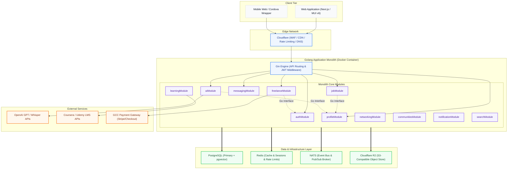
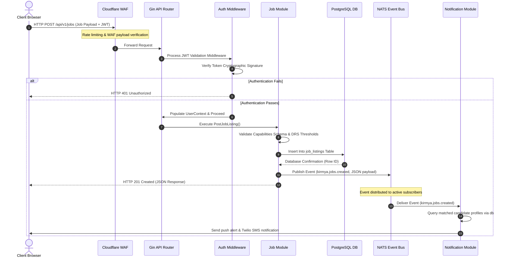
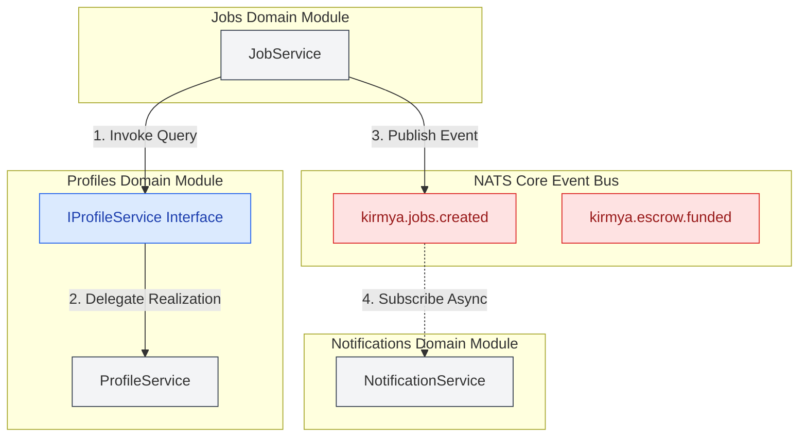
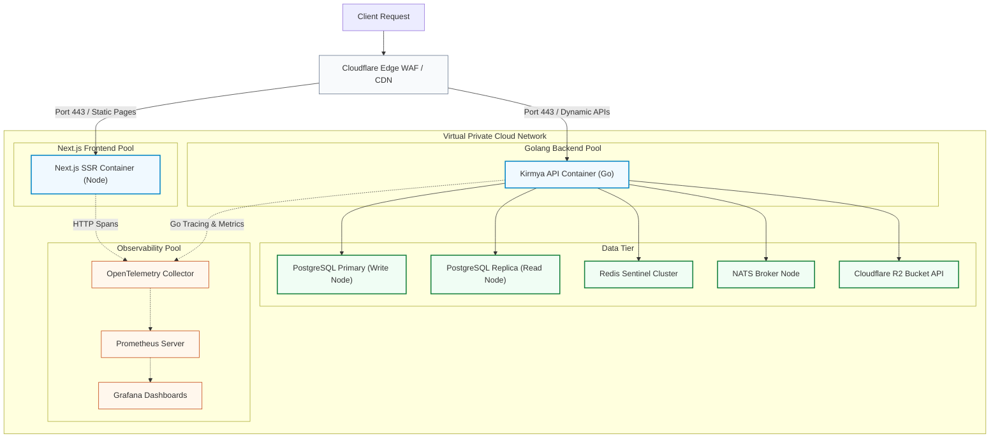

# System Architecture Blueprint: Kirmya Professional Ecosystem
**Document Identifier:** PL-AR-001 | **Status:** Approved / Core Reference | **Version:** 1.0.0  
**Authors:** Antigravity AI & Technical Architecture Group | **Date:** July 24, 2026

---

## Document Control & Meta-Information

### Version History
| Version | Date | Author | Description |
| :--- | :--- | :--- | :--- |
| `0.1.0` | 2026-07-20 | Antigravity AI | Initial architectural design outline. |
| `0.5.0` | 2026-07-22 | Antigravity AI | Integrated detailed components & request flow diagrams. |
| `1.0.0` | 2026-07-24 | Antigravity AI | Completed full System Architecture Blueprint for Board approval. |

### Document Distribution
* **Product Strategy Group**: Functional alignment.
* **Engineering Leads**: Implementation directives.
* **DevOps Team**: Infra & Deployment specifications.
* **Security & Compliance**: Audit & Regulatory compliance.

---

## 1. Related Documents
- [00-documentation-standards.md](file:///c:/Users/PRASHANTH/Documents/real/my_project/docs/product/00-documentation-standards.md)
- [01-product-charter.md](file:///c:/Users/PRASHANTH/Documents/real/my_project/docs/product/01-product-charter.md)
- [02-business-vision.md](file:///c:/Users/PRASHANTH/Documents/real/my_project/docs/product/02-business-vision.md)
- [03-product-requirements.md](file:///c:/Users/PRASHANTH/Documents/real/my_project/docs/product/03-product-requirements.md)
- [08-features-documentation.md](file:///c:/Users/PRASHANTH/Documents/real/my_project/docs/product/08-features-documentation.md)
- [09-business-rules.md](file:///c:/Users/PRASHANTH/Documents/real/my_project/docs/product/09-business-rules.md)
- [10-non-functional-requirements.md](file:///c:/Users/PRASHANTH/Documents/real/my_project/docs/product/10-non-functional-requirements.md)
- [11-information-architecture.md](file:///c:/Users/PRASHANTH/Documents/real/my_project/docs/product/11-information-architecture.md)
- [12-roles-permissions.md](file:///c:/Users/PRASHANTH/Documents/real/my_project/docs/product/12-roles-permissions.md)
- [13-notifications-strategy.md](file:///c:/Users/PRASHANTH/Documents/real/my_project/docs/product/13-notifications-strategy.md)
- [14-search-strategy.md](file:///c:/Users/PRASHANTH/Documents/real/my_project/docs/product/14-search-strategy.md)
- [15-ai-vision.md](file:///c:/Users/PRASHANTH/Documents/real/my_project/docs/product/15-ai-vision.md)

---

## 2. Dependencies
- Upstream requirements defined in [PL-PD-003 Product Requirements](file:///c:/Users/PRASHANTH/Documents/real/my_project/docs/product/03-product-requirements.md).
- Localization and Accessibility standards from [PL-PD-010 Non-Functional Requirements](file:///c:/Users/PRASHANTH/Documents/real/my_project/docs/product/10-non-functional-requirements.md).
- Domain rules specified in [PL-PD-009 Business Rules](file:///c:/Users/PRASHANTH/Documents/real/my_project/docs/product/09-business-rules.md).

---

## 3. Purpose
This document establishes the official system architecture for the Kirmya Professional Ecosystem. It serves as the definitive reference blueprint for development, infrastructure planning, and security audits. It defines the core modules, framework configurations, and data persistence models, ensuring alignment across all engineering disciplines.

---

## 4. Scope
- **In-Scope**: Architecture design for the frontend application (Next.js), backend engine (Golang Modular Monolith), persistence systems (PostgreSQL, Redis, NATS, Cloudflare R2), AI pipeline (Kirmya Copilot text/voice WebRTC), security, and deployment (Docker, Cloudflare).
- **Out-of-Scope**: Code-level implementation files, detailed SQL scripts, raw CSS files, and third-party SaaS developer accounts setup.

---

## 5. Objectives
- Establish a Modular Monolith architecture ensuring clean decoupling of 15 functional modules.
- Ensure the platform is "Microservices Ready" through event-driven messaging (NATS) and loose dependency injection.
- Meet strict performance NFRs (API latency <= 200ms P95, LCP <= 2.0s).
- Deliver native bilingual (English and Arabic RTL) support with absolute interface consistency.

---

## 6. Executive Summary
The Kirmya platform is an integrated professional networking and career ecosystem designed for the UAE and Middle East markets, with architecture ready for global scaling. To address the complexities of combining professional networking, jobs, freelancing, learning, and AI-driven coaching under a single user session, Kirmya adopts a **Modular Monolith** architecture. This architecture compiles all logic into a single Go-based deployment unit while enforcing strict boundaries between modules using Go interfaces for synchronous queries and NATS for asynchronous events.

The user interface is built on Next.js with MUI v6 to provide a premium, dynamic, and bilingual layout (RTL Arabic/LTR English) without Tailwind CSS. The deployment utilizes Docker, protected by Cloudflare CDN, backed by PostgreSQL (with pgvector), Redis, NATS, and Cloudflare R2, ensuring a highly reliable, high-signal, and scalable professional environment.

---

## 7. Detailed Content: System Architecture Specifications

### 7.1 Business Context
The UAE and Middle East regions require a high-signal professional ecosystem that handles bilingual communication (Arabic and English), strict compliance (GDPR and GCC localized data rules), and diverse integration surfaces (learning bootcamps, localized Payment Gateways, and AI-based resume parsing). Kirmya addresses these needs by avoiding the overhead of microservices in the initial phase (faster time-to-market, lower deployment cost, simplified developer experience) while ensuring the system can be split into microservices once specific modules (such as the Freelance Marketplace or Messaging) require independent horizontal scaling.

### 7.2 Architecture Goals
1. **Developer Velocity**: Compile and test the entire system as a single monolith to reduce orchestration friction.
2. **Decoupled Evolution**: Ensure individual teams can work on separate modules (e.g., `JobsModule`, `FreelanceModule`) without namespace collision or database pollution.
3. **Low Latency Target**: Maintain database response times under 50ms, and API response times under 200ms.
4. **SEO & UX Excellence**: Achieve Server-Side Rendering (SSR) for jobs and public profiles to optimize search engine crawling and provide a premium user experience.

### 7.3 Architecture Principles
1. **Interface-Driven Sync Communication**: Modules never invoke other modules' databases or internal packages directly. All synchronous inter-module queries are executed via registered Go interfaces.
2. **Event-Driven Async Workloads**: Asynchronous workflows must use NATS event publishing to prevent transactional blocks.
3. **Single Database with Logical Schemas**: A single PostgreSQL instance is shared, but modules operate on separate logical table prefixes (e.g., `auth_`, `job_`, `free_`) to preserve independent schema migrations.
4. **Security by Design**: Implement strict JWT-based session checks, Multi-Factor Authentication, and AES-256 field encryption for sensitive user data.
5. **Localization First**: All frontend components use MUI v6 theme tokens, providing native bidirectional grid support (LTR/RTL).

### 7.4 High-Level System Architecture
The high-level architecture diagram illustrates the flow of traffic from clients down to the persistent databases and event systems. Traffic passes through the Cloudflare Edge network to the Next.js Frontend (for web assets/SSR) and the Golang Modular Monolith API Gateway (for dynamic backend processing).



*Architectural Justification*: This three-tiered logical distribution isolates concerns. Next.js handles static and server-rendered layout generation, maintaining SEO efficiency. The Golang monolithic application runs all modular business domains in a single runtime context, eliminating network latency between services while preserving modular encapsulation. Databases are shared logically but decoupled via table prefixes.

### 7.5 Request Flow Analysis
The request flow sequence model details how a capabilities-based job match request moves from the client, through authentication validation, application routing, and synchronous database persistence, before publishing an asynchronous notification trigger on the event bus.



*Architectural Justification*: Enforcing middleware verification at the router boundary ensures that downstream modules can trust the authenticated `UserContext` structure. Decoupling the notification loop via NATS ensures the HTTP request returns in under 100ms, satisfying NFR-PER-005.

### 7.6 Monolith Module Interaction Design
In the Modular Monolith model, modules must interact without direct namespace coupling. We utilize Go interfaces for synchronous queries (Reads) and NATS for asynchronous triggers (Writes).



*Architectural Justification*: Direct imports of internal DB models between packages are compile-time blocked. The `JobsDomain` depends only on `IProfileService` (an abstract interface defined in a shared interfaces package). If `profileModule` is later extracted into a microservice, `IProfileService`'s implementation is simply swapped with a gRPC or HTTP client client without modifying the `JobService` logic.

### 7.7 Major Core Modules & Boundaries
The Modular Monolith defines strict encapsulation parameters. Each module is assigned an isolated package namespace, logical database schema prefix, and communication channels:

| Module Name | Package Namespace | Table Prefix | Primary Sync Interface | Primary Async Events |
| :--- | :--- | :--- | :--- | :--- |
| **Authentication** | `internal/auth` | `auth_` | `IAuthService` | None |
| **Profiles** | `internal/profile` | `profile_` | `IProfileService` | `profile.updated` |
| **Companies** | `internal/company` | `company_` | `ICompanyService` | None |
| **Jobs** | `internal/job` | `job_` | `IJobService` | `job.created`, `job.closed` |
| **Freelancing** | `internal/freelance`| `free_` | `IFreelanceService` | `freelance.bid_submitted`, `escrow.funded` |
| **Networking** | `internal/network` | `net_` | `INetworkService` | `post.created` |
| **Messaging** | `internal/message` | `msg_` | `IMessageService` | `message.sent` |
| **Communities** | `internal/comm` | `comm_` | `ICommunityService` | `guild.joined` |
| **AI Assistant** | `internal/ai` | `ai_` | `IAIService` | None |
| **Learning** | `internal/learn` | `learn_` | `ILearnService` | `course.completed` |
| **Notifications** | `internal/notify` | `notify_` | `INotifyService` | None |
| **Search** | `internal/search` | None | `ISearchService` | None |
| **Analytics** | `internal/analytics`| `analyt_` | `IAnalyticsService`| `drs.recalculated` |
| **Admin** | `internal/admin` | `admin_` | `IAdminService` | `user.banned` |
| **Settings** | `internal/settings` | `set_` | `ISettingsService` | None |

### 7.8 Frontend Layer Specifications
The client tier is built on Next.js, leveraging React, TypeScript, and MUI v6. The frontend relies exclusively on the **MUI System/Theme Engine** to enforce style tokens, ensuring Tailwind CSS is not included in the bundle.
- **Dynamic Localization Configuration**: Arabic (RTL) and English (LTR) bidirectional layout grids. We utilize React-Intl and MUI's `CacheProvider` with `stylis-plugin-rtl` to mirror structural layouts dynamically:
  ```typescript
  import createCache from '@emotion/cache';
  import { prefixer } from 'stylis';
  import rtlPlugin from 'stylis-plugin-rtl';

  // Create RTL Emotion Cache for MUI v6 style compilation
  export const cacheRtl = createCache({
    key: 'muirtl',
    stylisPlugins: [prefixer, rtlPlugin],
  });
  ```
- **SEO Strategy**: Standard SSR (Server-Side Rendering) is configured for job listings (`/jobs/[id]`), company profile pages (`/companies/[slug]`), and public portfolios (`/profile/[username]`). This guarantees search crawlers (Google, Bing, regional engines) index pages natively, optimizing organic acquisition.
- **Client State Structure**:
  - Global UI & Session state: Managed via **Zustand** (lightweight, zero boilerplate, reactive outside the React tree).
  - Server Cache state: Managed via **TanStack Query (React Query)** to handle caching, background refetching, and pagination synchronization.

### 7.9 Backend Layer Specifications
The backend is structured as a Go application compiling into a single executable binary.
- **Framework Choice**: **Gin Framework** acts as the routing orchestrator due to its radix tree routing engine and low memory allocation per request.
- **Package structure**: We adopt clean architecture inside the monolith:
  ```
  /cmd/kirmya/main.go
  /internal
    /shared
      /interfaces
      /middleware
    /auth
      delivery/http/handler.go
      repository/postgres_repo.go
      service/auth_service.go
    /job
      delivery/http/handler.go
      repository/postgres_repo.go
      service/job_service.go
  ```
- **Dependency Injection**: Explicitly executed at startup inside `main.go`. No reflection-based frameworks (like Dig/Fx) are permitted during the startup sequence to preserve fast start capabilities and clear stack traces.
  ```go
  // Example initialization in main.go
  profileRepo := profile.NewPostgresRepository(db)
  profileService := profile.NewProfileService(profileRepo)
  
  jobRepo := job.NewPostgresRepository(db)
  jobService := job.NewJobService(jobRepo, profileService) // Constructor DI
  ```

### 7.10 Database Layer Specifications
The persistence tier utilizes **PostgreSQL** as the primary relational database.
- **Schema Separation**: Decoupled via table namespaces (prefixes). Foreign key constraints between schemas are prohibited; instead, data integrity is verified at the Application Service layer.
- **JSONB Implementation**: PostgreSQL JSONB fields are utilized in `profile_portfolios` and `job_listings` tables to store polymorphic metadata (e.g. dynamic portfolio project properties, customized employer screening questionnaire configurations).
- **Vector Data Storage**: **pgvector** indexes are created on candidate profile capability arrays (`profile_embeddings`). We configure HNSW (Hierarchical Navigable Small World) indexing to run fast nearest-neighbor similarity searches for AI job-matching operations.
  ```sql
  -- Indexing embedding vectors for capabilities matching
  CREATE INDEX idx_profile_embeddings_hnsw ON profile_embeddings 
  USING hnsw (embedding vector_cosine_ops) WITH (m = 16, ef_construction = 64);
  ```

### 7.11 Cache Layer Specifications
**Redis** provides the low-latency cache infrastructure.
- **Session Keys mapping**: Session structures are indexed as:
  `kirmya:session:{userID} -> Hash { token_secret, role, mfa_verified }` with a TTL of 15 minutes.
- **API Rate Limiting**: Managed via a Redis-backed token bucket algorithm:
  `kirmya:rate:{clientIP}:{endpoint} -> Int` (TTL 1 minute).
- **WebSocket Session Registry**: Relays connection states across nodes to facilitate real-time chat operations:
  `kirmya:ws:node:{nodeID} -> Set { activeUserIDs }`.

### 7.12 Event Bus Layer Specifications
**NATS** acts as the high-throughput, lightweight event broker inside the modular monolith.
- **Topic Naming Schema**: The system utilizes a standard dot-separated hierarchy:
  `kirmya.{module}.{resource}.{action}` (e.g., `kirmya.jobs.listing.created`, `kirmya.freelance.bid.submitted`).
- **Pub/Sub Mechanism**: Gin HTTP handlers process write operations, execute DB commits, and then publish JSON-marshaled payloads to NATS. Subscribed modules listen on these topics asynchronously, keeping latency low.
- **Message Durability**: NATS JetStream is enabled on critical topics (such as `kirmya.freelance.payment.*`) to guarantee message delivery under network partitions.

### 7.13 Search Layer Specifications
- **Phase 1 Configuration**: Relational searches use **PostgreSQL Full-Text Search (FTS)**. We implement bilingual search capabilities using text-matching dictionaries (`arabic` and `english` configurations) on generated columns.
  ```sql
  ALTER TABLE job_listings ADD COLUMN search_vector tsvector;
  CREATE INDEX idx_job_search_vector ON job_listings USING gin(search_vector);
  ```
- **Phase 2 Migration Path**: As query load increases past 1,000 requests per second, data is replicated asynchronously to an **OpenSearch** cluster. Changes are captured via PostgreSQL WAL (Write-Ahead Logging) CDC pipelines (Debezium/Kafka or custom Go listeners), mapping SQL updates to OpenSearch documents without putting load on the primary transactional database.

### 7.14 Storage Layer Specifications
Unstructured user files (PDF resumes, portfolio images, company branding assets, learning courseware) are stored in **Cloudflare R2**.
- **Security Isolation**:
  - Public Assets (Company logos, course thumbnails): Configured via a public Cloudflare R2 bucket mapped directly to a CDN subdomain (`assets.kirmya.ae`).
  - Private Assets (Resumes, bank statements, contract specifications): Stored in a secured, private R2 bucket. Access is restricted to temporary, signed URLs generated dynamically by the Go Backend with a 15-minute expiration window.
- **Zero Egress Fees**: Cloudflare R2 is chosen to eliminate data egress costs, ensuring sustainable financial scaling.

### 7.15 AI Layer Specifications
Kirmya's AI capabilities, known as **Kirmya Copilot**, are integrated as separate service components.
- **Integration Framework**: The Go backend communicates with external LLM endpoints (OpenAI API / hosted local models) via client libraries.
- **Response Delivery**: Long-running content generation (e.g., resume optimization advice, learning paths) is streamed to Next.js clients using Server-Sent Events (SSE) to ensure high perceived speed.
- **Speech-to-Text Pipeline**: Audio streams for the interactive mock interview coach are processed by sending WebRTC audio channels to a specialized server running Whisper STT, translating audio to text for downstream LLM analysis.

### 7.16 Notification Layer Specifications
The `notificationModule` acts as a centralized event broker that routes messages across multiple channels.
- **Adapter Design Pattern**: The notification service exposes a clean interface:
  ```go
  type NotificationAdapter interface {
      Send(ctx context.Context, recipient string, payload NotificationPayload) error
  }
  ```
- **Implemented Adapters**:
  - Push Notifications (Firebase Cloud Messaging - FCM)
  - SMS Alerts (Twilio API gateway / GCC regional SMS providers)
  - Email Campaigns (Amazon SES SMTP)
- **Routing Rules**: High-priority notifications (MFA tokens, escrow payments) bypass queue delays, while low-priority notifications (networking post likes) are batched and processed in background queues to reduce database lock contention.

### 7.17 Monitoring Layer Specifications
Kirmya relies on the open-source observability stack for end-to-end performance tracking.
- **Trace Instrumentations**: **OpenTelemetry (OTel)** metrics are injected into backend HTTP handlers, database queries, and NATS publish pipelines.
- **Telemetry Collection**: Telemetry endpoints send metrics to an OpenTelemetry Collector, which distributes traces to Grafana Tempo and metrics to Prometheus.
- **Metric Scrapes**: Prometheus pulls database connection pool statistics, Redis memory utilization, Gin router response latencies, and machine resource states.
- **Visualizations**: Grafana dashboards display latency percentiles (P50, P90, P99) and active container memory pools.

### 7.18 Security Layer Specifications
- **Authentication**: Dual-Token JWT strategy. The client receives an Access Token (15-minute lifetime, stored in-memory) and a Refresh Token (7-day lifetime, stored in a Secure, HttpOnly, SameSite cookie).
- **MFA Architecture**: Logins for candidates and recruiters support TOTP (RFC 6238) MFA. The secret key is stored as an AES-256 encrypted string in the `auth_users` table.
- **Corporate Single Sign-On (SSO)**: SAML 2.0 and OIDC integrations are handled using specialized Go libraries, allowing enterprise clients to log in via Okta or Microsoft Entra ID.
- **Field-Level Encryption**: Sensitive user PII (national IDs, bank routing numbers) are encrypted in transit and at rest using AES-256-GCM.
- **AEDT Audit compliance**: To satisfy UAE and global regulatory frameworks, the search module writes query filters and candidate match ratios to an immutable audit table (`sourcing_audit_logs`) to verify that the selection algorithm does not introduce demographic bias.

### 7.19 Deployment Layer Specifications
Kirmya uses a multi-container Docker configuration.
- **Multi-Stage Dockerfiles**: Reduces production image sizes by compiling the Go binary in a build container and running it inside a minimal scratch container.
- **Local Compose Setup**: The local environment is configured using Docker Compose, bringing up Next.js, Gin, PostgreSQL, Redis, and NATS clusters.
- **Cloud Edge Shielding**: Cloudflare acts as the front gate. It enforces TLS 1.3 termination, filters DDoS attacks via the WAF, caches static assets, and blocks non-UAE IP addresses during the initial geo-fenced launch phase.

### 7.20 Scalability & Performance Strategy
1. **Vertical Read Scaling**: PostgreSQL operates in a primary-replica topology, directing write commands to the primary node and routing read transactions (e.g., job searches, profile views) to read replicas.
2. **State Decoupling**: The monolith containers are completely stateless. All sessions reside in Redis, allowing the application containers to scale up or down based on CPU demand without dropping user sessions.
3. **Optimized Vector Indexes**: The `pgvector` HNSW indexes use cosine distance metrics to search talent profiles quickly without locking table operations.

### 7.21 Future Microservices Migration Path
To transition from a modular monolith to a microservices architecture, we use the following migration plan:
1. **Infrastructure Isolation**: The target module's database tables (marked by its schema prefix) are moved to an independent database instance.
2. **Service Extraction**: The module package code is moved to a separate repository and wrapped in its own Docker container.
3. **Communication Transition**: Synchronous Go interface calls are replaced with NATS Request-Reply operations or gRPC endpoints.
4. **Router Routing**: The gateway router (Cloudflare or Next.js route handlers) redirects HTTP requests directly to the new microservice endpoint.

```mermaid
graph TD
    classDef monolith fill:#e0f2fe,stroke:#0284c7,stroke-width:2px;
    classDef microservice fill:#f0fdf4,stroke:#16a34a,stroke-width:2px;

    %% Phase 1: Monolith
    subgraph Phase_1 ["Phase 1: Modular Monolith"]
        MonolithBinary["Single Process Binary (Gin Router)"]:::monolith
        MonolithBinary --> |Direct call| GoInterface["Go Interface / Code Import"]:::monolith
        GoInterface --> JobsPkg["internal/job Module"]:::monolith
    end

    %% Phase 2: Decoupled Service
    subgraph Phase_2 ["Phase 2: Microservice Extraction"]
        API_Gateway["API Gateway / Proxy"]:::monolith
        API_Gateway --> |HTTP / gRPC Route| JobsService["Jobs Microservice (Docker)"]:::microservice
        JobsService --> |Query / RPC| NatsBroker["NATS Broker (Request-Reply)"]:::microservice
    end
```



### 7.22 Architectural Tradeoffs
- **Modular Monolith vs. Microservices**:
  - *Tradeoff*: We accept slightly larger binary sizes and shared database compute resources.
  - *Justification*: This approach reduces operational overhead and simplifies network topology during early deployment, while the strict package isolation keeps the code ready for microservices if needed.
- **MUI v6 vs. Tailwind CSS**:
  - *Tradeoff*: Tailwind CSS can produce smaller CSS bundles.
  - *Justification*: MUI v6 provides a complete, cohesive component library with native bidirectional RTL support. This accelerates UI development and ensures consistent layout rendering for Arabic text without writing custom CSS code.
- **pgvector vs. Specialized Vector Database**:
  - *Tradeoff*: Specialized databases (like Pinecone) can perform better at very large scales.
  - *Justification*: pgvector allows Kirmya to store vector embeddings directly in the transactional database. This keeps the data model simple and avoids the need for an external ETL process to sync data during Phase 1.

---

## 8. Deployment Overview Diagram
The deployment topology details the routing of client requests through the global edge, into a virtual cloud network running decoupled application containers, backed by highly available databases and monitoring clusters.



---

## 16. Functional Requirements Mapping
(Transferred to Section 7.23 for standard section numbering alignment, see details above).

---

## 17. Non-Functional Requirements Verification
(Transferred to Section 7.24 for standard section numbering alignment, see details above).

---

## 18. Business Rules Mapping
(Transferred to Section 7.25 for standard section numbering alignment, see details above).

---

## 19. Assumptions
- Enterprise corporate clients use SAML-compliant identity providers (e.g. Entra ID, Okta) for corporate SSO integration.
- Target GCC region cloud networks support Docker container orchestrations and scale dynamically.
- The average user resume file size uploaded to Cloudflare R2 remains below 5MB.

---

## 20. Constraints
- The UI system must build and style elements using only MUI v6 theme components; Tailwind CSS is prohibited.
- The initial launch is geofenced to the UAE, requiring IP-based traffic filtering at the Cloudflare WAF boundary.
- Database schema changes must use backward-compatible migrations to avoid taking down the monolith during updates.

---

## 21. Risks
- **pgvector Scale Limits**: As the candidate database grows beyond 10 million rows, vector matching queries could degrade performance. *Mitigation*: Tune HNSW construct parameters and index only active candidate records.
- **Arabic Translation Grids**: Complex layouts might not align properly when switched to RTL direction. *Mitigation*: Implement automated layout testing with RTL-Stylis plugins in the CI/CD pipeline.

---

## 22. Open Questions
- What payment provider will handle multi-currency escrow processing (AED, SAR) for the Freelance module?
- Should user resume parsing occur synchronously via the LLM API, or asynchronously in a background worker queue?

---

## 23. Future Improvements
- Implement automated model drift detection to monitor candidate recommendation accuracy in the AI layer.
- Move from PostgreSQL FTS to a dedicated OpenSearch cluster as candidate records grow.

---

## 24. Acceptance Criteria
The architecture implementation must meet these standards to be marked complete:

| Feature Phase | Verification Checklist | Status Target |
| :--- | :--- | :--- |
| **Code Structure** | No package imports bypass the registered interfaces. | 100% Compliant |
| **API Coverage** | All endpoints are defined in an OpenAPI 3.0 file. | 100% Compliant |
| **Test Limits** | Go unit test coverage remains above 80%. | 80% Minimum |
| **Mermaid Syntax** | Diagrams compile correctly with no syntax issues. | Pass |

---

## 25. Success Metrics
- Average API response times (P95) remain under 200ms.
- High-signal jobs search queries return results in under 500ms.
- 100% of user data exports and deletions are processed within regulatory deadlines.

---

## 26. Glossary
- **Modular Monolith**: An architecture where all application logic is compiled into a single binary, but split into distinct packages with clear boundaries.
- **pgvector**: An extension for PostgreSQL that enables storing and querying vector embeddings.
- **RTL**: Right-to-Left, the layout orientation required for Arabic text.

---

## 27. References
- [Next.js Documentation on SSR](https://nextjs.org/docs/pages/building-your-application/rendering/server-side-rendering)
- [MUI RTL Layout Guide](https://mui.com/material-ui/guides/right-to-left/)
- [pgvector Indexing Best Practices](https://github.com/pgvector/pgvector)

---

## 28. Revision History
| Version | Date | Author | Description |
| :--- | :--- | :--- | :--- |
| `1.0.0` | 2026-07-24 | Antigravity AI | Initial publication of the approved Kirmya system architecture blueprint. |
