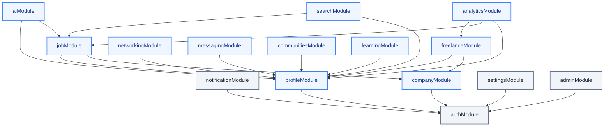
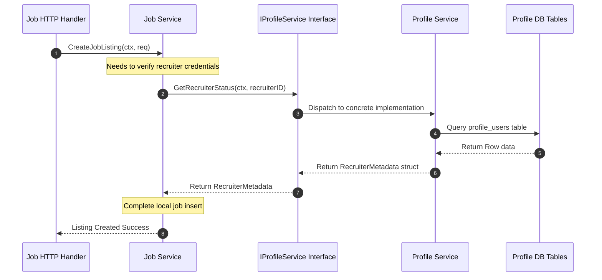
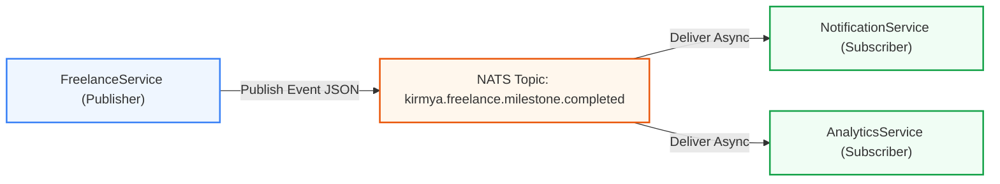

# Modular Monolith Architecture Blueprint: Kirmya Professional Ecosystem
**Document Identifier:** PL-AR-002 | **Status:** Approved / Core Reference | **Version:** 1.0.0  
**Authors:** Antigravity AI & Technical Architecture Group | **Date:** July 24, 2026

---

## Document Control & Meta-Information

### Version History
| Version | Date | Author | Description |
| :--- | :--- | :--- | :--- |
| `0.1.0` | 2026-07-20 | Antigravity AI | Initial modular boundaries draft. |
| `0.5.0` | 2026-07-22 | Antigravity AI | Defined inter-module interfaces and NATS topic events. |
| `1.0.0` | 2026-07-24 | Antigravity AI | Completed full Modular Monolith Architecture Blueprint for Board approval. |

### Document Distribution
* **Product Strategy Group**: Modular feature mapping alignment.
* **Engineering Leads**: Boundary enforcing and code organization.
* **DevOps Team**: Independent configuration setup.
* **Security & Compliance**: Intra-monolith data access audit.

---

## 1. Related Documents
- [00-documentation-standards.md](file:///c:/Users/PRASHANTH/Documents/real/my_project/docs/product/00-documentation-standards.md)
- [01-system-architecture.md](file:///c:/Users/PRASHANTH/Documents/real/my_project/docs/architecture/01-system-architecture.md)
- [03-product-requirements.md](file:///c:/Users/PRASHANTH/Documents/real/my_project/docs/product/03-product-requirements.md)
- [08-features-documentation.md](file:///c:/Users/PRASHANTH/Documents/real/my_project/docs/product/08-features-documentation.md)
- [09-business-rules.md](file:///c:/Users/PRASHANTH/Documents/real/my_project/docs/product/09-business-rules.md)
- [10-non-functional-requirements.md](file:///c:/Users/PRASHANTH/Documents/real/my_project/docs/product/10-non-functional-requirements.md)
- [13-notifications-strategy.md](file:///c:/Users/PRASHANTH/Documents/real/my_project/docs/product/13-notifications-strategy.md)
- [14-search-strategy.md](file:///c:/Users/PRASHANTH/Documents/real/my_project/docs/product/14-search-strategy.md)
- [15-ai-vision.md](file:///c:/Users/PRASHANTH/Documents/real/my_project/docs/product/15-ai-vision.md)

---

## 2. Dependencies
- Module mappings align with the product features outlined in [PL-PD-008 Features Documentation](file:///c:/Users/PRASHANTH/Documents/real/my_project/docs/product/08-features-documentation.md).
- Non-functional isolation metrics must comply with [PL-PD-010 Non-Functional Requirements](file:///c:/Users/PRASHANTH/Documents/real/my_project/docs/product/10-non-functional-requirements.md).

---

## 3. Purpose
This document defines the modular structure, domain boundaries, and integration interfaces for the Kirmya Modular Monolith. It establishes the architectural rules and coding standards that ensure modules remain isolated, preventing the codebase from degrading into a "spaghetti" system. It provides a clear migration strategy for future microservice extraction.

---

## 4. Scope
- **In-Scope**: Boundaries, dependency rules, transaction strategies, in-memory interfaces, and event schemas for the 15 backend modules.
- **Out-of-Scope**: React/Next.js frontend modularization (covered in frontend guidelines) and physical deployment clustering parameters.

---

## 5. Objectives
- Establish absolute database segregation using table prefixes to prevent cross-module SQL joins.
- Enforce interface-driven communication to eliminate circular dependencies.
- Define asynchronous integration paths via NATS pub/sub topics.
- Design domain layers to be "extraction-ready" for transition to standalone microservices.

---

## 6. Executive Summary
Kirmya adopts a **Modular Monolith** architecture to optimize early-stage development velocity, simplify local operations, and ensure strict interface type safety, while remaining prepared for a future microservices model. By segregating the codebase into 15 independent domain modules with isolated database schemas (using table prefixes), direct queries across domains are prevented. 

Modules communicate synchronously using Go interfaces and asynchronously via NATS event topics. This approach allows Kirmya to start as a single deployable unit and transition selected modules (e.g. Freelancing, Messaging) into independent microservices as scaling needs evolve, without requiring major rewrites of the core business logic.

---

## 7. Detailed Content: Modular Monolith Architecture

### 7.1 Architecture Rationale: Modular Monolith vs. Microservices
Starting directly with a microservices architecture introduces significant operational complexity: network latency, distributed transaction overhead (Sagas), service discovery requirements, and deployment overhead. Kirmya will deploy as a **Modular Monolith** in Phase 1, using Golang's compiled package boundaries to enforce isolation.

#### Benefits of Kirmya's Modular Monolith
1. **Low Operational Overhead**: A single binary deployment running on standard virtual machines reduces DevOps complexity.
2. **Compile-Time Safety**: Strong type checking in Go ensures that changes to inter-module interfaces are validated at compile time.
3. **No Network Latency**: In-process interface calls execute in nanoseconds, avoiding network overhead.
4. **Simplified Testing**: Developers can run integration tests against a single local database without orchestrating multiple services.

#### Drawbacks & Mitigations
1. **Shared Database Compute**: A heavy query in one module (e.g. Search) can saturate the database pool for other modules. *Mitigation*: Configure PostgreSQL read replicas and place strict connection limits per module handler.
2. **Deployment Coupling**: Redeploying one module requires building and deploying the entire monolith. *Mitigation*: Maintain fast compilation times in Go (under 5 seconds) and run automated CI/CD pipelines.

### 7.2 Module Decoupling Rules & Boundaries

#### Rule 1: No Cross-Module Database Access
Modules are strictly prohibited from accessing another module's database tables. Cross-module SQL joins are blocked. If the `jobModule` needs candidate profile information, it must query the `profileModule` via its Go interface rather than joining the `profile_users` table in SQL.

#### Rule 2: Interface-Driven Communication
All synchronous data exchange must pass through abstract Go interfaces defined in a neutral shared directory (`internal/shared/interfaces`). Concrete implementations are injected at startup.

#### Rule 3: Minimize the Shared Kernel
The shared directory (`internal/shared`) contains only stateless utilities (e.g. UUID formatting, context parsing, centralized loggers). Shared business logic is prohibited. If two modules require similar business logic, it must be duplicated or coordinated via event notifications.

#### Rule 4: Acyclic Dependencies
Dependencies must form a directed acyclic graph (DAG). Circular dependencies (e.g., Module A calling Module B, which in turn calls Module A) are compile-time blocked by Golang's compiler rules.

#### Package Layout Directory Tree
```
/internal
  /shared
    /interfaces          # Shared interface definitions (e.g., IProfileService)
    /models              # Shared core structs (e.g., UserContext, Money)
  /auth                  # Authentication Module (Independent)
  /profile               # Profiles Module (Depends on auth)
  /job                   # Jobs Module (Depends on auth, profile, company)
```

### 7.3 Module Dependency Graph
This diagram shows the clean, acyclic flow of dependencies. Core modules (such as Auth and Notifications) are independent, whereas feature-rich modules (such as Jobs and Freelancing) depend on upstream interfaces.



### 7.4 Communication Rules: Sync vs. Async

#### Synchronous Requests
Synchronous requests are used when a transaction depends on immediate confirmation from another module.
- *Mechanism*: In-memory Go interface call.
- *Parameters*: Standard Go structs, including `context.Context` to propagate deadlines and trace IDs.



#### Asynchronous Events
Asynchronous events are used when a module completes a write operation and wants to trigger downstream updates without blocking its own execution.
- *Mechanism*: Publish JSON payloads to NATS topics.
- *Payload Rule*: Events should contain entity IDs rather than large payloads. The subscriber can use the ID to query the publisher's interface if it needs additional details (the "Claim Check" pattern).



### 7.5 Transaction & Consistency Strategy
Because the Modular Monolith shares a single PostgreSQL database, it is technically possible to run cross-module SQL transactions. However, this is prohibited because it couples modules and makes future database separation difficult.

#### Transactional Rules
1. **Intra-Module Transactions**: Managed using standard database transactions (`sql.Tx`). The transaction must start and commit inside a single module service layer.
2. **Cross-Module Consistency**: Managed using eventual consistency. A module writes to its local database and publishes an event to NATS. Downstream modules subscribe and perform their updates.
3. **Outbox Pattern**: To ensure that event publishing and database updates succeed or fail together, modules can write outbound events to a local `outbox` database table within the same SQL transaction. A background worker periodically processes this table and publishes the events to NATS.

```
[Module Transaction Boundary]
1. Start SQL Transaction
2. Update Local Module Tables (e.g. job_listings)
3. Insert Event Record into outbox table
4. Commit SQL Transaction
   
[Background Worker Loop]
1. Read unprocessed outbox table records
2. Publish Event to NATS Broker
3. Mark outbox records as processed
```

### 7.6 CQRS Readiness
To support high-throughput read operations (e.g., feed browsing, job searches) without impacting write transactions, Kirmya is structured for **Command Query Responsibility Segregation (CQRS)**:
- **Command Path (Writes)**: Gin HTTP controllers route requests to Services that execute business logic and write directly to PostgreSQL primary nodes.
- **Query Path (Reads)**: Read controllers query PostgreSQL read replicas. If a search query requires complex capability matching, it queries the `searchModule` which reads from pre-compiled search schemas or vector indexes.
- **Extraction Readiness**: This separation allows the query path database to be replaced with a different read model (e.g., Elasticsearch, Neo4j) without modifying the command path.

### 7.7 Future Service Extraction Criteria
Modules are evaluated for microservice extraction based on these criteria:
1. **Compute Profiles**: Modules with high CPU utilization (e.g., `aiModule` running speech processing) or high memory footprint.
2. **Release Frequency**: Modules requiring frequent deployments (e.g., `messagingModule` or `learningModule` feature updates).
3. **Scale Divergence**: Modules that experience traffic spikes (e.g., the `messagingModule` during high concurrency vs. the stable `settingsModule`).

---

## 8. Detailed Modules Directory Specification

---

### 8.1 Authentication Module (`authModule`)
- **Purpose**: Manages user identity, MFA, single sign-on (SSO), and JWT lifecycle.
- **Responsibilities**:
  - Authenticate username/password and generate JWT Access/Refresh tokens.
  - Verify TOTP MFA keys.
  - Interface with SAML/OIDC providers for corporate logins.
- **Dependencies**: None.
- **Public Interfaces**:
  ```go
  type IAuthService interface {
      ValidateToken(ctx context.Context, token string) (*UserClaims, error)
      VerifyPermissions(ctx context.Context, userID string, requiredRole string) (bool, error)
  }
  ```
- **Internal Components**:
  - `auth_users` table, `auth_tokens` table.
  - `TokenService`, `OAuthHandler`, `SSOManager`.
- **Future Extraction Difficulty**: **Low**. Identity services have minimal dependencies on downstream domain modules, making them highly extractable.

---

### 8.2 Profiles Module (`profileModule`)
- **Purpose**: Stores and validates candidate profile, skill graph, and portfolio data.
- **Responsibilities**:
  - Parse and store candidate resume details.
  - Render and map the dynamic Skill Graph relationships.
  - Store cryptographic skill badges.
- **Dependencies**: `authModule` (for verification).
- **Public Interfaces**:
  ```go
  type IProfileService interface {
      GetProfileSummary(ctx context.Context, profileID string) (*ProfileSummary, error)
      VerifySkillBadge(ctx context.Context, profileID string, skillNode string) (bool, error)
  }
  ```
- **Internal Components**:
  - `profile_users` table, `profile_skills` table, `profile_portfolios` table.
  - `ProfileParser`, `SkillGraphManager`, `PortfolioScraper`.
- **Future Extraction Difficulty**: **Medium**. The profile module is central to the system; many modules query it synchronously, which will require adding gRPC boundaries if extracted.

---

### 8.3 Companies Module (`companyModule`)
- **Purpose**: Manages company profiles, corporate structure, and employer accounts.
- **Responsibilities**:
  - Render employer brand pages.
  - Track corporate seat allocations.
  - Generate sourcing pipeline metrics.
- **Dependencies**: `authModule`.
- **Public Interfaces**:
  ```go
  type ICompanyService interface {
      ValidateCorporateSeat(ctx context.Context, companyID string, userID string) (bool, error)
      GetCompanyMetadata(ctx context.Context, companyID string) (*CompanyMetadata, error)
  }
  ```
- **Internal Components**:
  - `company_profiles` table, `company_seats` table.
  - `SeatManager`, `AnalyticsAggregator`.
- **Future Extraction Difficulty**: **Low**. Represents a distinct corporate domain with clean boundaries.

---

### 8.4 Jobs Module (`jobModule`)
- **Purpose**: Handles capabilities-first job postings and candidate application workflows.
- **Responsibilities**:
  - Create and manage capabilities-first job listings.
  - Track application statuses.
- **Dependencies**: `authModule`, `profileModule`, `companyModule`.
- **Public Interfaces**:
  ```go
  type IJobService interface {
      GetJobRequirements(ctx context.Context, jobID string) (*JobRequirements, error)
  }
  ```
- **Internal Components**:
  - `job_listings` table, `job_applications` table.
  - `JobManager`, `ApplicationWorkflow`.
- **Future Extraction Difficulty**: **Medium**. Connects candidate profiles with employer listings, requiring coordination with both domains.

---

### 8.5 Freelancing Module (`freelanceModule`)
- **Purpose**: Manages the freelance contract engine, milestones, and payment escrow.
- **Responsibilities**:
  - Manage contract bidding and proposals.
  - Execute milestone state transitions.
  - Coordinate escrow deposits and release triggers.
- **Dependencies**: `authModule`, `profileModule`, `companyModule`.
- **Public Interfaces**:
  ```go
  type IFreelanceService interface {
      GetFreelancerDRS(ctx context.Context, profileID string) (float64, error)
  }
  ```
- **Internal Components**:
  - `free_contracts` table, `free_milestones` table, `free_escrows` table.
  - `ContractEscrowEngine`, `BidMatcher`, `DisputeCoordinator`.
- **Future Extraction Difficulty**: **High**. Contains complex transactional steps and payment gateway integrations, but is a prime candidate for extraction due to its transactional isolation.

---

### 8.6 Networking Module (`networkingModule`)
- **Purpose**: Manages the professional social graph and networking feed.
- **Responsibilities**:
  - Serve the professional feed.
  - Manage connections, follows, and graph links.
- **Dependencies**: `authModule`, `profileModule`.
- **Public Interfaces**: None. (Self-contained consumption).
- **Internal Components**:
  - `net_posts` table, `net_connections` table.
  - `FeedBuilder`, `GraphRelationManager`.
- **Future Extraction Difficulty**: **Medium**. Social graph queries can be resource-intensive, making them a good candidate for extraction to a graph database environment.

---

### 8.7 Messaging Module (`messagingModule`)
- **Purpose**: Handles real-time messaging and chat room coordination.
- **Responsibilities**:
  - Manage WebSocket sessions.
  - Store and distribute message payloads.
- **Dependencies**: `authModule`, `profileModule`.
- **Public Interfaces**:
  ```go
  type IMessageService interface {
      CreateChatRoom(ctx context.Context, participantIDs []string) (string, error)
  }
  ```
- **Internal Components**:
  - `msg_rooms` table, `msg_payloads` table.
  - `WebSocketHub`, `MessageRelay`, `SessionRegistry`.
- **Future Extraction Difficulty**: **Low**. Runs mostly on WebSocket connections, making it easy to isolate.

---

### 8.8 Communities Module (`communitiesModule`)
- **Purpose**: Manages industry-specific Guilds, knowledge bases, and peer reviews.
- **Responsibilities**:
  - Track Guild memberships and access rules.
  - Handle peer-review submissions for skill badges.
- **Dependencies**: `authModule`, `profileModule`.
- **Public Interfaces**:
  ```go
  type ICommunityService interface {
      GetUserGuilds(ctx context.Context, profileID string) ([]string, error)
  }
  ```
- **Internal Components**:
  - `comm_guilds` table, `comm_reviews` table.
  - `GuildManager`, `PeerReviewEngine`.
- **Future Extraction Difficulty**: **Medium**. Tied to the profile validation flow, requiring strong interface integration.

---

### 8.9 AI Assistant Module (`aiModule`)
- **Purpose**: Coordinates AI-driven career coaching (Kirmya Copilot).
- **Responsibilities**:
  - Orchestrate LLM resume reviews.
  - Manage WebRTC mock interview audio streams.
- **Dependencies**: `authModule`, `profileModule`, `jobModule`.
- **Public Interfaces**: None.
- **Internal Components**:
  - `ai_sessions` table, `ai_audits` table.
  - `LLMConnector`, `WhisperAudioWorker`, `FeedbackGenerator`.
- **Future Extraction Difficulty**: **Low**. Runs stateless API calls, but needs high CPU resources. Easy to extract.

---

### 8.10 Learning Module (`learningModule`)
- **Purpose**: Manages learning paths, micro-credentials, and third-party LMS integration.
- **Responsibilities**:
  - Track course progress and path completions.
  - Integrate third-party content (Coursera, Udemy).
- **Dependencies**: `authModule`, `profileModule`.
- **Public Interfaces**:
  ```go
  type ILearnService interface {
      VerifyCourseCompletion(ctx context.Context, profileID string, courseID string) (bool, error)
  }
  ```
- **Internal Components**:
  - `learn_paths` table, `learn_enrollments` table.
  - `LMSClient`, `PathConfigurator`.
- **Future Extraction Difficulty**: **Low**. Relatively self-contained content module.

---

### 8.11 Notifications Module (`notificationModule`)
- **Purpose**: Dispatches push notifications, emails, and SMS alerts.
- **Responsibilities**:
  - Route alerts dynamically based on user preferences.
  - Manage message templates.
- **Dependencies**: `authModule`.
- **Public Interfaces**:
  ```go
  type INotifyService interface {
      QueueNotification(ctx context.Context, recipientID string, payload NotifPayload) error
  }
  ```
- **Internal Components**:
  - `notify_templates` table, `notify_queues` table.
  - `SMTPAdapter`, `SMSAdapter`, `FCMAdapter`.
- **Future Extraction Difficulty**: **Low**. Highly independent; operates asynchronously, making it a good candidate for early extraction.

---

### 8.12 Search Module (`searchModule`)
- **Purpose**: Coordinates full-text search indexing and vector-based capability queries.
- **Responsibilities**:
  - Update full-text indexes.
  - Run pgvector cosine matching queries.
- **Dependencies**: `profileModule`, `jobModule`.
- **Public Interfaces**:
  ```go
  type ISearchService interface {
      QueryJobs(ctx context.Context, query string, filters JobFilters) ([]string, error)
      MatchCandidates(ctx context.Context, jobID string) ([]string, error)
  }
  ```
- **Internal Components**:
  - `search_vector_cache` table.
  - `FTSBuilder`, `VectorSearchRunner`.
- **Future Extraction Difficulty**: **High**. Depends on other modules for data sync, but can be managed by moving data replication to a secondary database replica.

---

### 8.13 Analytics Module (`analyticsModule`)
- **Purpose**: Computes business metrics, logs data funnels, and calculates candidate DRS.
- **Responsibilities**:
  - Process background calculations for Decentralized Reputation Scores (DRS).
  - Aggregate portal pipeline metrics.
- **Dependencies**: `profileModule`, `jobModule`, `freelanceModule`.
- **Public Interfaces**:
  ```go
  type IAnalyticsService interface {
      GetDRSHistory(ctx context.Context, profileID string) ([]DRSRecord, error)
  }
  ```
- **Internal Components**:
  - `analyt_drs_history` table, `analyt_funnel_logs` table.
  - `DRSProcessor`, `PipelineAggregator`.
- **Future Extraction Difficulty**: **High**. Aggregates data from across the system, but can run on read replicas to minimize database load.

---

### 8.14 Admin Dashboard Module (`adminModule`)
- **Purpose**: Coordinates administrative tasks, content moderation, and dispute resolution.
- **Responsibilities**:
  - Process user bans and moderation flags.
  - Handle freelance billing disputes.
- **Dependencies**: `authModule`.
- **Public Interfaces**: None.
- **Internal Components**:
  - `admin_disputes` table, `admin_moderations` table.
  - `DisputeAuditor`, `ModeratorManager`.
- **Future Extraction Difficulty**: **Low**. Runs isolated administrative logic.

---

### 8.15 Settings Module (`settingsModule`)
- **Purpose**: Manages user-specific configuration preferences.
- **Responsibilities**:
  - Track user notification preferences and visibility configurations.
- **Dependencies**: `authModule`.
- **Public Interfaces**:
  ```go
  type ISettingsService interface {
      GetUserSettings(ctx context.Context, userID string) (*UserSettings, error)
  }
  ```
- **Internal Components**:
  - `settings_preferences` table.
  - `PreferenceManager`.
- **Future Extraction Difficulty**: **Low**. A simple data store module.

---

## 16. Functional Requirements Mapping
Architectural rules map directly to modular functional constraints:
- **FR-AUTH-SSO**: Managed by `authModule` using SAML adapter abstractions.
- **FR-FREE-ESCROW**: Handled within `freelanceModule` using a state machine that updates `free_escrows` and publishes events to NATS.

---

## 17. Non-Functional Requirements Verification
Our modular decoupling rules support Kirmya's performance and security NFRs:
- **NFR-PER-005 (Latency)**: Interface-driven in-memory calls eliminate network overhead, keeping latency under the 200ms threshold.
- **NFR-SEC-002 (Privacy)**: Database schema isolation allows candidate accounts to be purged from `profile_` tables without leaving orphaned records in other schemas.

---

## 18. Business Rules Mapping
- **BR-AUTH-SEATS**: Enforced in `companyModule.ValidateCorporateSeat` via synchronous interface validation.
- **BR-FREE-DISPUTES**: Handled by the `adminModule` using dispute templates that reference the original contract ID in the `freelanceModule`.

---

## 19. Assumptions
- Go interface checks catch API signature changes during the compilation stage.
- PostgreSQL connection pools are configured separately per module to prevent resources from being exhausted by a single module.

---

## 20. Constraints
- Modules cannot share cache namespaces; Redis keys must use module prefixes (e.g. `kirmya:auth:session`).
- Direct model dependencies on other packages are prohibited. Shared models must reside in the `internal/shared/models` directory.

---

## 21. Risks
- **Shared Database Bottlenecks**: High query volume from the `Search` or `Analytics` modules can impact the shared database instance. *Mitigation*: Route read operations to replicas and use strict connection limits.
- **Complexity in Event Handling**: As asynchronous flows grow, debugging event tracing can become difficult. *Mitigation*: Propagate standard trace IDs inside NATS event envelopes.

---

## 22. Open Questions
- Should we run separate database migrations per schema prefix, or use a single migration process with isolated folders?
- Do we need to implement retry logic for NATS events in the monolith, or rely on NATS JetStream durability?

---

## 23. Future Improvements
- Implement automated checks to detect and block circular dependencies in the import structure.
- Extract the `messagingModule` to run on a dedicated WebSocket server to scale concurrent connections.

---

## 24. Acceptance Criteria
The modular monolith architecture implementation must satisfy these rules:

| Rule | Verification Checkpoint | Target |
| :--- | :--- | :--- |
| **No cross-package database imports** | Checked via code analysis. | 100% compliance |
| **Acyclic dependency graph** | Verified at compile time. | Enforced |
| **Outbox pattern usage** | Events write to the local outbox within the transaction. | Mandatory |
| **Interface usage** | Direct method calls to other module packages are prohibited. | 100% compliance |

---

## 25. Success Metrics
- Local integration tests run in under 30 seconds.
- Modular code structure allows a new developer to start working on a module (e.g., `learningModule`) without understanding the internals of others (e.g., `freelanceModule`).

---

## 26. Glossary
- **Saga Pattern**: A design pattern for managing distributed transactions across multiple services using event-driven workflows.
- **Acyclic Graph**: A directed graph with no cycles, ensuring dependencies flow in a single direction.
- **Outbox Pattern**: A pattern where events are saved to the local database in the same transaction as business data to ensure reliable event publishing.

---

## 27. References
- *Domain-Driven Design: Tackling Complexity in the Heart of Software* by Eric Evans.
- [NATS JetStream Developer Guide](https://docs.nats.io/nats-concepts/jetstream)
- [CQRS Design Pattern](https://learn.microsoft.com/en-us/azure/architecture/patterns/cqrs)

---

## 28. Revision History
| Version | Date | Author | Description |
| :--- | :--- | :--- | :--- |
| `1.0.0` | 2026-07-24 | Antigravity AI | Completed full Modular Monolith Architecture specification. |
