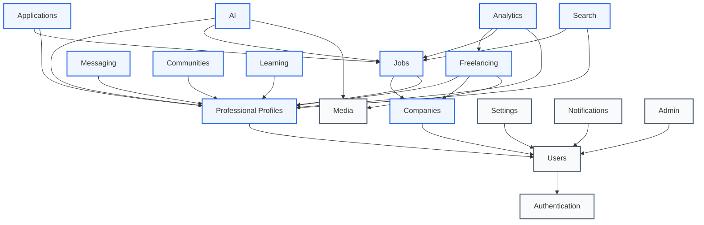
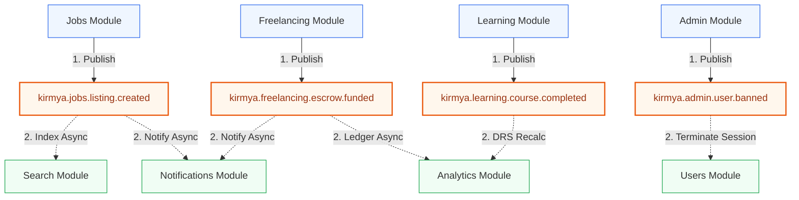

# Module Boundaries Specification: Kirmya Professional Ecosystem
**Document Identifier:** PL-AR-003 | **Status:** Approved / Core Reference | **Version:** 1.0.0  
**Authors:** Antigravity AI & Technical Architecture Group | **Date:** July 24, 2026

---

## Document Control & Meta-Information

### Version History
| Version | Date | Author | Description |
| :--- | :--- | :--- | :--- |
| `0.1.0` | 2026-07-20 | Antigravity AI | Initial identification of modular namespaces. |
| `0.5.0` | 2026-07-22 | Antigravity AI | Integrated database schema prefixes and API listings. |
| `1.0.0` | 2026-07-24 | Antigravity AI | Completed full Module Boundaries Specification document. |

### Document Distribution
* **Product Strategy Group**: Alignment on module capabilities.
* **Engineering Leads**: Boundary enforcement rules.
* **DevOps Team**: Microservices migration planning.
* **Security & Compliance**: Field-level encryption checks.

---

## 1. Related Documents
- [00-documentation-standards.md](file:///c:/Users/PRASHANTH/Documents/real/my_project/docs/product/00-documentation-standards.md)
- [01-system-architecture.md](file:///c:/Users/PRASHANTH/Documents/real/my_project/docs/architecture/01-system-architecture.md)
- [02-modular-monolith-architecture.md](file:///c:/Users/PRASHANTH/Documents/real/my_project/docs/architecture/02-modular-monolith-architecture.md)
- [08-features-documentation.md](file:///c:/Users/PRASHANTH/Documents/real/my_project/docs/product/08-features-documentation.md)
- [09-business-rules.md](file:///c:/Users/PRASHANTH/Documents/real/my_project/docs/product/09-business-rules.md)
- [10-non-functional-requirements.md](file:///c:/Users/PRASHANTH/Documents/real/my_project/docs/product/10-non-functional-requirements.md)

---

## 2. Dependencies
- Aligns with the core entities mapped out in [PL-PD-011 Information Architecture](file:///c:/Users/PRASHANTH/Documents/real/my_project/docs/product/11-information-architecture.md).
- Security parameters conform to [PL-PD-012 Roles & Permissions](file:///c:/Users/PRASHANTH/Documents/real/my_project/docs/product/12-roles-permissions.md).

---

## 3. Purpose
This document provides the definitive boundary definitions for the 18 modules comprising the Kirmya backend. It specifies the API endpoints, database schemas, events, performance limits, security regulations, and data ownership rules for each module, establishing a clear path for future microservices partitioning.

---

## 4. Scope
- **In-Scope**: Architectural boundaries, entities, API definitions, event contracts, database table schemas, security policies, and performance constraints for the 18 specified modules.
- **Out-of-Scope**: Frontend Next.js component layouts and code-level database connection pool implementations.

---

## 5. Objectives
- Establish a comprehensive responsibility matrix mapping platform domains to modules.
- Define a dependency graph to ensure clean integration boundaries.
- Document clear data ownership rules to prevent database-level coupling.
- Map out the transition roadmap for future microservices extraction.

---

## 6. Executive Summary
Kirmya is organized into 18 distinct backend modules. Each module operates as a separate logical domain with isolated tables, explicit API layers, and defined NATS event endpoints. This document catalogs these modules, providing a detailed reference for development teams. The catalog defines the interfaces, schemas, and performance requirements for each module. 

A central responsibility matrix clarifies which module is responsible for specific system features, and a migration roadmap identifies the order in which modules will transition to standalone microservices as the platform scales.

---

## 7. Detailed Content: Module Boundary Specifications

### 7.1 Responsibility Matrix
The following matrix defines which module is responsible for core capabilities across the Kirmya ecosystem:

| Feature / Domain | Primary Owner Module | Secondary Collaborator Modules | Persistence Mode |
| :--- | :--- | :--- | :--- |
| User Session & Auth | `Authentication` | `Users`, `Notifications` | Redis + SQL |
| Account Details (Email/Phone) | `Users` | `Authentication`, `Admin` | SQL |
| Resume & Skill Graph | `Professional Profiles` | `Search`, `AI`, `Learning` | SQL + pgvector |
| Company Brand Pages | `Companies` | `Users` | SQL |
| Job Listing | `Jobs` | `Companies`, `Search` | SQL |
| Application Funnel | `Applications` | `Jobs`, `Notifications` | SQL |
| Social Graph Feed | `Networking` | `Professional Profiles` | SQL |
| WebSocket Messages Chat | `Messaging` | `Notifications` | SQL + Redis |
| Communities / Guilds | `Communities` | `Professional Profiles` | SQL |
| Escrow, Bids & Contracts | `Freelancing` | `Analytics` | SQL |
| Sourcing Indexes | `Search` | `Professional Profiles`, `Jobs` | SQL (pgvector) / OpenSearch |
| Push, SMS, Email Dispatch | `Notifications` | None | SQL |
| Copilot & Voice Coaching | `AI` | `Media` | SQL (Audits) |
| Upskilling Courses | `Learning` | `Analytics` | SQL |
| User Preferences | `Settings` | None | SQL + Redis |
| Platform Moderation | `Admin` | `Messaging`, `Networking` | SQL |
| DRS Computations | `Analytics` | `Learning`, `Freelancing` | SQL |
| Files & CDN Transcoding | `Media` | None | SQL + Object Store |

### 7.2 Module Dependency Diagrams

#### Synchronous API Integration Graph
The synchronous dependency diagram shows the hierarchy of Go interface references. The graph is acyclic, ensuring that dependencies flow in a single direction without circular loops.



#### Asynchronous Event Integration Graph (NATS Hub)
Downstream actions (e.g. notifications, search index updates, metric aggregations) are triggered asynchronously using NATS topics. This approach keeps module domains decoupled.



### 7.3 Detailed Modules Specification Catalog

---

#### 1. Authentication Module
- **Business Purpose**: Core access validation, TOTP MFA validation, corporate federated SSO.
- **Responsibilities**:
  - Issue JWT Access/Refresh tokens.
  - Verify TOTP tokens.
  - Handle SAML/OIDC SSO integrations.
- **Entities**: Session, VerificationCode.
- **Database Tables**: `auth_sessions`, `auth_mfa_secrets`.
- **REST APIs**:
  - `POST /api/v1/auth/login` (Standard credentials login)
  - `POST /api/v1/auth/refresh` (Renew expired access tokens)
  - `POST /api/v1/auth/mfa/verify` (TOTP validator checkpoint)
- **Events Published**: `kirmya.auth.session.started`
- **Events Consumed**: None.
- **External Dependencies**: SAML Identity Providers (e.g. Entra ID, Okta).
- **Shared Components**: HTTP router token authentication middleware.
- **Future Microservice Name**: `kirmya-auth-service`.
- **Data Ownership**: Cryptographic secrets and session states.
- **Security Requirements**: TLS 1.3,bcrypt hashing (cost >= 12) for credentials.
- **Performance Requirements**: Authentication latency < 80ms P99.
- **Caching Strategy**: Redis caches active session models (TTL 15m).
- **Search Requirements**: ID lookup only.

---

#### 2. Users Module
- **Business Purpose**: Coordinate base account identity data, user roles, and profile statuses.
- **Responsibilities**:
  - Manage user registration and account lifecycle status.
  - Assign system roles (Job Seeker, Recruiter, Admin).
- **Entities**: UserAccount.
- **Database Tables**: `usr_accounts`, `usr_roles`.
- **REST APIs**:
  - `POST /api/v1/users` (Account creation)
  - `GET /api/v1/users/me` (Fetch current identity context)
- **Events Published**: `kirmya.users.account.created`, `kirmya.users.status.updated`
- **Events Consumed**: `kirmya.admin.user.banned`
- **External Dependencies**: None.
- **Shared Components**: User Context Struct model definition.
- **Future Microservice Name**: `kirmya-user-service`.
- **Data Ownership**: User account configurations (email, phone, status, system roles).
- **Security Requirements**: RBAC authorization, field-level encryption for phone numbers.
- **Performance Requirements**: Read queries < 50ms.
- **Caching Strategy**: Redis caches user records (TTL 30m) invalidated on status changes.
- **Search Requirements**: Index lookup by email address.

---

#### 3. Professional Profiles Module
- **Business Purpose**: Candidate resume metadata management and Skill Graph representation.
- **Responsibilities**:
  - Store and parse CV items (work history, education).
  - Manage candidate skill nodes and cryptographic verifications.
- **Entities**: CandidateProfile, SkillNode, PortfolioMeta.
- **Database Tables**: `profile_cvs`, `profile_skills`, `profile_portfolios`.
- **REST APIs**:
  - `GET /api/v1/profiles/:username` (Fetch candidate profile page)
  - `PUT /api/v1/profiles/me` (Update resume details)
  - `POST /api/v1/profiles/skills` (Request peer verification for a skill)
- **Events Published**: `kirmya.profile.cv.updated`, `kirmya.profile.skill.verified`
- **Events Consumed**: `kirmya.users.account.created` (Initializes empty profile)
- **External Dependencies**: GitHub and Figma APIs (to pull portfolio assets).
- **Shared Components**: Profile summary structs.
- **Future Microservice Name**: `kirmya-profile-service`.
- **Data Ownership**: Candidate CVs, skill nodes, and portfolio records.
- **Security Requirements**: XSS sanitization on rich-text input fields.
- **Performance Requirements**: Profile retrieval < 120ms P95.
- **Caching Strategy**: Redis caches public profiles (TTL 1h).
- **Search Requirements**: pgvector cosine similarity search on candidate embeddings.

---

#### 4. Companies Module
- **Business Purpose**: Coordinate brand pages and team membership seat limits for employers.
- **Responsibilities**:
  - Render public employer profiles and tech stacks.
  - Track corporate seat assignments.
- **Entities**: CompanyProfile, RecruiterSeat.
- **Database Tables**: `company_profiles`, `company_seats`.
- **REST APIs**:
  - `POST /api/v1/companies` (Initialize corporate page)
  - `GET /api/v1/companies/:slug` (Get company public page details)
  - `POST /api/v1/companies/seats` (Allocate seats to team recruiters)
- **Events Published**: `kirmya.company.created`, `kirmya.company.seat.assigned`
- **Events Consumed**: None.
- **External Dependencies**: None.
- **Shared Components**: Company metadata structs.
- **Future Microservice Name**: `kirmya-company-service`.
- **Data Ownership**: Company profile layouts and corporate seat allocations.
- **Security Requirements**: Validate domain name ownership before verifying pages.
- **Performance Requirements**: Render public pages < 100ms.
- **Caching Strategy**: Redis caches company pages (TTL 2h).
- **Search Requirements**: FTS on company descriptions.

---

#### 5. Jobs Module
- **Business Purpose**: Capabilities-first job listing creation and status management.
- **Responsibilities**:
  - Create and manage capabilities-first job postings.
  - Map required skills and required DRS thresholds.
- **Entities**: JobListing.
- **Database Tables**: `job_listings`, `job_requirements`.
- **REST APIs**:
  - `POST /api/v1/jobs` (Create job listing)
  - `GET /api/v1/jobs/:id` (Fetch job details)
  - `PUT /api/v1/jobs/:id` (Modify listing parameters)
- **Events Published**: `kirmya.jobs.listing.created`, `kirmya.jobs.listing.closed`
- **Events Consumed**: None.
- **External Dependencies**: None.
- **Shared Components**: Required skills structs.
- **Future Microservice Name**: `kirmya-job-service`.
- **Data Ownership**: Job postings and required competency profiles.
- **Security Requirements**: Only verified corporate recruiter accounts can create listings.
- **Performance Requirements**: Write operations < 100ms.
- **Caching Strategy**: Redis caches active job detail payloads (TTL 15m).
- **Search Requirements**: FTS on job titles and descriptions.

---

#### 6. Applications Module
- **Business Purpose**: Track candidate job application workflows.
- **Responsibilities**:
  - Process application submissions.
  - Track candidates through evaluation stages (Submitted, Review, Interview, Hired).
- **Entities**: JobApplication, ApplicationHistory.
- **Database Tables**: `app_applications`, `app_history`.
- **REST APIs**:
  - `POST /api/v1/applications` (Apply for a job)
  - `GET /api/v1/applications/:id` (Fetch application status details)
  - `PATCH /api/v1/applications/:id/stage` (Transition application status)
- **Events Published**: `kirmya.applications.submitted`, `kirmya.applications.stage_changed`
- **Events Consumed**: `kirmya.jobs.listing.closed` (Cancels active applications)
- **External Dependencies**: None.
- **Shared Components**: Application status enumerations.
- **Future Microservice Name**: `kirmya-application-service`.
- **Data Ownership**: Candidate applications and status histories.
- **Security Requirements**: Candidates can view only their own applications; employers can view applications for their posted jobs.
- **Performance Requirements**: Application submittal < 120ms P95.
- **Caching Strategy**: Redis caches application funnel analytics.
- **Search Requirements**: Filter applications by status.

---

#### 7. Networking Module
- **Business Purpose**: Professional connection management and professional social graph feed.
- **Responsibilities**:
  - Process connection requests and connections.
  - Build connection-based activity feeds.
- **Entities**: SocialConnection, NetworkPost, PostComment.
- **Database Tables**: `net_connections`, `net_posts`, `net_comments`.
- **REST APIs**:
  - `POST /api/v1/networking/connect` (Request connection)
  - `GET /api/v1/networking/feed` (Fetch connections feed)
- **Events Published**: `kirmya.networking.post.created`, `kirmya.networking.connection.accepted`
- **Events Consumed**: None.
- **External Dependencies**: None.
- **Shared Components**: Feed payload structures.
- **Future Microservice Name**: `kirmya-networking-service`.
- **Data Ownership**: Connections and posts/comments.
- **Security Requirements**: Author-only edit rights on posts.
- **Performance Requirements**: Feed aggregation < 200ms P95.
- **Caching Strategy**: Feed list cached in Redis per user (TTL 5m).
- **Search Requirements**: Post content full-text search.

---

#### 8. Messaging Module
- **Business Purpose**: Secure in-app real-time messaging between users.
- **Responsibilities**:
  - Manage WebSocket sessions.
  - Store and distribute message payloads.
- **Entities**: ChatRoom, MessagePayload.
- **Database Tables**: `msg_rooms`, `msg_payloads`, `msg_receipts`.
- **REST APIs**:
  - `POST /api/v1/messaging/rooms` (Create chat room)
  - `GET /api/v1/messaging/rooms/:id/messages` (Fetch message logs)
- **Events Published**: `kirmya.messaging.message.sent`, `kirmya.messaging.room.created`
- **Events Consumed**: None.
- **External Dependencies**: WebSocket protocols.
- **Shared Components**: Session context.
- **Future Microservice Name**: `kirmya-messaging-service`.
- **Data Ownership**: Messages, attachments, and rooms.
- **Security Requirements**: End-to-end access validation for participants.
- **Performance Requirements**: Message dispatch latency < 50ms.
- **Caching Strategy**: Recent 50 messages cached per room (TTL 1h).
- **Search Requirements**: Chat message search.

---

#### 9. Communities Module
- **Business Purpose**: Coordinate industry-specific peer-reviewed Guilds.
- **Responsibilities**:
  - Manage Guild structures and moderator rules.
  - Handle peer-review submissions for skill badges.
- **Entities**: Guild, MemberLink, PeerReview.
- **Database Tables**: `comm_guilds`, `comm_members`, `comm_reviews`.
- **REST APIs**:
  - `POST /api/v1/communities/guilds` (Create new Guild)
  - `POST /api/v1/communities/reviews` (Submit peer assessment review)
- **Events Published**: `kirmya.communities.guild.joined`, `kirmya.communities.review.completed`
- **Events Consumed**: None.
- **External Dependencies**: None.
- **Shared Components**: Guild profile models.
- **Future Microservice Name**: `kirmya-communities-service`.
- **Data Ownership**: Guild memberships, peer-review outcomes.
- **Security Requirements**: Strict verification of reviewer capability score before badges are awarded.
- **Performance Requirements**: Guild details loading < 100ms P95.
- **Caching Strategy**: Guild metadata cached (TTL 1d).
- **Search Requirements**: FTS on Guild names and categories.

---

#### 10. Freelancing Module
- **Business Purpose**: Coordinate the freelance marketplace, milestone tracking, and payment escrow.
- **Responsibilities**:
  - Track bids and proposals.
  - Coordinate contract signoffs.
  - Manage escrow transactions and milestone states.
- **Entities**: FreelanceContract, JobBid, ProjectMilestone, EscrowLedger.
- **Database Tables**: `free_proposals`, `free_contracts`, `free_milestones`, `free_escrows`.
- **REST APIs**:
  - `POST /api/v1/freelancing/proposals` (Submit proposal bid)
  - `POST /api/v1/freelancing/contracts` (Generate formal contract)
  - `POST /api/v1/freelancing/milestones/:id/fund` (Lock funds in escrow)
- **Events Published**: `kirmya.freelancing.contract.signed`, `kirmya.freelancing.escrow.funded`
- **Events Consumed**: None.
- **External Dependencies**: Payment Gateways (GCC regional provider).
- **Shared Components**: Payment status models.
- **Future Microservice Name**: `kirmya-freelance-service`.
- **Data Ownership**: Bids, contracts, and escrow transaction ledgers.
- **Security Requirements**: Signed contracts, strict transactional audit logging.
- **Performance Requirements**: Escrow transaction processing < 200ms.
- **Caching Strategy**: Active contracts cached in Redis (TTL 30m).
- **Search Requirements**: Filtering contracts by status.

---

#### 11. Search Module
- **Business Purpose**: Central search orchestrator for candidates, jobs, and companies.
- **Responsibilities**:
  - Aggregate profiles and jobs into search indexes.
  - Process complex full-text and vector search queries.
- **Entities**: SearchIndex.
- **Database Tables**: `search_cache`.
- **REST APIs**:
  - `GET /api/v1/search/jobs` (Query jobs)
  - `GET /api/v1/search/candidates` (Query candidates)
- **Events Published**: None.
- **Events Consumed**: `kirmya.jobs.listing.created`, `kirmya.profile.cv.updated`
- **External Dependencies**: OpenSearch.
- **Shared Components**: Full-text indexing tools.
- **Future Microservice Name**: `kirmya-search-service`.
- **Data Ownership**: Index cache and mapping rules.
- **Security Requirements**: Only recruiters can query candidates; public can query jobs.
- **Performance Requirements**: Search response < 500ms P95.
- **Caching Strategy**: Cache common search results (TTL 10m).
- **Search Requirements**: Vector search and full-text search dictionaries.

---

#### 12. Notifications Module
- **Business Purpose**: Multi-channel alert dispatcher (email, SMS, push notifications).
- **Responsibilities**:
  - Format messages from templates.
  - Route alerts based on user settings.
- **Entities**: NotificationTemplate, UserNotificationSetting.
- **Database Tables**: `notify_templates`, `notify_logs`.
- **REST APIs**:
  - `POST /api/v1/notifications/test`
- **Events Published**: None.
- **Events Consumed**: `kirmya.auth.session.started`, `kirmya.jobs.listing.created`, `kirmya.freelancing.escrow.funded`.
- **External Dependencies**: SendGrid/Twilio.
- **Shared Components**: Email formatting libraries.
- **Future Microservice Name**: `kirmya-notification-service`.
- **Data Ownership**: Email templates and audit logs.
- **Security Requirements**: Verify template variables to prevent template injection.
- **Performance Requirements**: Notification queueing < 20ms.
- **Caching Strategy**: Cache templates in memory.
- **Search Requirements**: Log search by date.

---

#### 13. AI Module
- **Business Purpose**: Coordinates AI coaching (Kirmya Copilot) and vector generation.
- **Responsibilities**:
  - Handle LLM conversations and prompt configurations.
  - Process speech-to-text WebRTC audio streams.
- **Entities**: AISession.
- **Database Tables**: `ai_sessions`, `ai_interactions`.
- **REST APIs**:
  - `POST /api/v1/ai/copilot/chat` (Send chat payload)
  - `POST /api/v1/ai/interviews/session` (Initialize voice interview socket)
- **Events Published**: `kirmya.ai.coaching.completed`.
- **Events Consumed**: None.
- **External Dependencies**: OpenAI, Whisper.
- **Shared Components**: OpenAI client.
- **Future Microservice Name**: `kirmya-ai-service`.
- **Data Ownership**: AI conversation logs and prompt configurations.
- **Security Requirements**: Anonymize candidate PII before sending to external APIs.
- **Performance Requirements**: LLM first token < 1.0s.
- **Caching Strategy**: Cache active AI sessions (TTL 30m).
- **Search Requirements**: Conversation log search.

---

#### 14. Learning Module
- **Business Purpose**: Tracks candidate upskilling pathways and course completions.
- **Responsibilities**:
  - Map curriculum requirements.
  - Ingest course completions from third-party platforms.
- **Entities**: Course, Path.
- **Database Tables**: `learn_courses`, `learn_paths`, `learn_completions`.
- **REST APIs**:
  - `GET /api/v1/learning/paths` (Fetch available paths)
  - `POST /api/v1/learning/paths/:id/enroll` (Enroll in a path)
- **Events Published**: `kirmya.learning.course.completed`.
- **Events Consumed**: None.
- **External Dependencies**: Coursera, Udemy APIs.
- **Shared Components**: LMS clients.
- **Future Microservice Name**: `kirmya-learning-service`.
- **Data Ownership**: Enrollment histories, custom training pathways.
- **Security Requirements**: Validate LMS completion signatures.
- **Performance Requirements**: Ingest completion APIs < 200ms.
- **Caching Strategy**: Cache course list metadata in Redis (TTL 24h).
- **Search Requirements**: FTS on course titles.

---

#### 15. Settings Module
- **Business Purpose**: Central user preference configuration.
- **Responsibilities**:
  - Store interface preferences and notifications settings.
- **Entities**: Settings.
- **Database Tables**: `set_user_preferences`.
- **REST APIs**:
  - `GET /api/v1/settings`
  - `PUT /api/v1/settings`
- **Events Published**: `kirmya.settings.updated`.
- **Events Consumed**: None.
- **External Dependencies**: None.
- **Shared Components**: Preferences model.
- **Future Microservice Name**: `kirmya-settings-service`.
- **Data Ownership**: User-configured preferences.
- **Security Requirements**: Write access restricted to the user who owns the settings.
- **Performance Requirements**: Read settings < 30ms P95.
- **Caching Strategy**: Cache preferences in Redis (TTL 24h).
- **Search Requirements**: Primary key lookup only.

---

#### 16. Admin Module
- **Business Purpose**: System administration and content moderation.
- **Responsibilities**:
  - Moderate content flags.
  - Handle billing disputes.
- **Entities**: AuditLog, ModerationTicket.
- **Database Tables**: `admin_tickets`, `admin_audits`.
- **REST APIs**:
  - `POST /api/v1/admin/moderation`
  - `GET /api/v1/admin/audits`
- **Events Published**: `kirmya.admin.user.banned`.
- **Events Consumed**: None.
- **External Dependencies**: None.
- **Shared Components**: Log context formatters.
- **Future Microservice Name**: `kirmya-admin-service`.
- **Data Ownership**: System audit records.
- **Security Requirements**: MFA verification for admins.
- **Performance Requirements**: Fetch audits < 200ms.
- **Caching Strategy**: None (to ensure accuracy of real-time audit data).
- **Search Requirements**: Audit log filtering.

---

#### 17. Analytics Module
- **Business Purpose**: Core metric tracking and DRS score computation.
- **Responsibilities**:
  - Log metric funnels.
  - Calculate candidate Decentralized Reputation Scores (DRS).
- **Entities**: AnalyticsRecord, DRSLog.
- **Database Tables**: `analyt_metrics`, `analyt_drs`.
- **REST APIs**:
  - `GET /api/v1/analytics/drs/:profile_id`
- **Events Published**: `kirmya.analytics.drs.recalculated`.
- **Events Consumed**: `kirmya.learning.course.completed`, `kirmya.communities.review.completed`, `kirmya.freelancing.contract.signed`.
- **External Dependencies**: None.
- **Shared Components**: DRS algorithms.
- **Future Microservice Name**: `kirmya-analytics-service`.
- **Data Ownership**: Raw metrics logs and compiled DRS scores.
- **Security Requirements**: Read access restricted to authenticated recruiters and admins.
- **Performance Requirements**: DRS calculations < 100ms.
- **Caching Strategy**: Cache current DRS (TTL 10m).
- **Search Requirements**: Historical DRS logs.

---

#### 18. Media Module
- **Business Purpose**: Centralized media processing, storage management, and content delivery.
- **Responsibilities**:
  - Process image/video uploads and transcode formats.
  - Manage resume uploads and private/public files.
- **Entities**: MediaUpload.
- **Database Tables**: `media_uploads`.
- **REST APIs**:
  - `POST /api/v1/media/upload` (Upload media asset)
  - `GET /api/v1/media/:id` (Fetch media metadata)
- **Events Published**: `kirmya.media.processed`
- **Events Consumed**: None.
- **External Dependencies**: FFmpeg (for video compression), Cloudflare R2 APIs.
- **Shared Components**: Cloudflare R2 client.
- **Future Microservice Name**: `kirmya-media-service`.
- **Data Ownership**: Media metadata, raw object assets.
- **Security Requirements**: Validate file types to prevent arbitrary code execution, sign URLs for private files.
- **Performance Requirements**: File upload verification < 50ms.
- **Caching Strategy**: Edge-cached portfolio assets on Cloudflare CDN.
- **Search Requirements**: Media ID lookup.

---

### 7.4 Independent Services Roadmap & Extraction Strategy
As Kirmya scales, target modules will be extracted into independent microservices. We prioritize extraction based on scale requirements, database write loads, and performance constraints.

```
[ EXTRACTION DECOUPLING TIMELINE ]
Phase 1: Modular Monolith (Launch)
  └── Phase 2: High Concurrency (6-12 Months)
        ├── Extract "Messaging" (WebSocket scale limits)
        └── Extract "Media" (Compute limits for file conversions)
  └── Phase 3: Domain Isolation (12-18 Months)
        ├── Extract "Freelancing" (Transaction complexity isolation)
        └── Extract "AI" (Resource consumption isolation)
  └── Phase 4: Full Split (18-24 Months)
        ├── Extract "Authentication" & "Users"
        └── Extract "Search" to dedicated cluster
```

1. **Messaging Module (Priority 1)**: WebSocket connections require high concurrency. Extracting it prevents connections from blocking CPU limits on the core application server.
2. **Media Module (Priority 2)**: Video transcoding and resume uploads are compute-heavy. Extracting this domain prevents high file processing loads from impacting core application servers.
3. **Freelancing Module (Priority 3)**: Freelancing manages contracts, escrow accounts, and payments. Extracting this module isolates payment processing transactions, simplifying security auditing.
4. **AI Module (Priority 4)**: Speech processing and LLM connections are resource-intensive. Isolating the AI module allows it to scale on hardware tailored for ML workloads.

---

## 16. Functional Requirements Mapping
The 18 modules mapped in this document align with the functional requirements catalog:
- **FR-SEC-MFA**: Managed in `Authentication` via TOTP secrets tables.
- **FR-MED-UPLOAD**: Handled by the new `Media` module, integrating with Cloudflare R2 buckets.

---

## 17. Non-Functional Requirements Verification
- **NFR-PER-004 (Mock Interview)**: In-app voice chat latency is managed by the `AI` module using WebRTC streams, with media processing offloaded to the `Media` module.
- **NFR-SCA-004 (WebSocket connections)**: Messaging WS sessions are isolated to the `Messaging` module, allowing it to scale independently when extracted.

---

## 18. Business Rules Mapping
- **BR-FREE-ESCROW**: Handled inside `Freelancing`, generating transactions that require verification from the `Authentication` module.
- **BR-AUTH-SEATS**: Evaluated in `Companies` before recruiter searches are forwarded to the `Search` module.

---

## 19. Assumptions
- Modules share a single PostgreSQL cluster, using prefix namespaces to isolate schemas.
- External dependencies (e.g. Twilio, Coursera, payment gateways) communicate using asynchronous handlers.

---

## 20. Constraints
- Direct imports across domain packages are prohibited; modules must communicate using interfaces.
- The `Media` module is the sole owner of files stored in Cloudflare R2; other modules retrieve files using temporary signed URLs.

---

## 21. Risks
- **Data Integrity across Modules**: Lack of foreign keys across schemas can lead to orphaned records. *Mitigation*: Ensure database cleanups are triggered asynchronously using NATS events.
- **LMS API Failures**: Downtime on Coursera or Udemy APIs can block the learning pathways. *Mitigation*: Implement circuit-breaker rules to route users to cached paths.

---

## 22. Open Questions
- What database cleanups should occur when a user account is deleted?
- Should the `Search` index update synchronously, or asynchronously using NATS events?

---

## 23. Future Improvements
- Move the `Search` module to a dedicated OpenSearch cluster.
- Implement automated checks to detect and block circular imports.

---

## 24. Acceptance Criteria
The module boundary implementations must satisfy these parameters:

| Metric | Verification Standard | Target |
| :--- | :--- | :--- |
| **Schema Prefixes** | Isolated database schemas per module. | 100% compliance |
| **Interface Checks** | Direct method calls to other packages are prohibited. | 100% compliance |
| **File Access** | All files must be accessed through the `Media` module interface. | Mandatory |
| **Event Envelopes** | All event payloads must use a standard JSON envelope. | Pass |

---

## 25. Success Metrics
- Average API latencies (P95) remain under 200ms.
- 100% of user data requests are processed within regulatory timelines.

---

## 26. Glossary
- **SAML**: Security Assertion Markup Language, an XML-based standard for exchanging authentication data.
- **LMS**: Learning Management System, used to deliver and track training courses.
- **FTS**: Full-Text Search, a search technique that matches terms against text documents.

---

## 27. References
- *Designing Data-Intensive Applications* by Martin Kleppmann.
- [Cloudflare R2 developer guides](https://developers.cloudflare.com/r2/)
- [NATS JetStream documentation](https://docs.nats.io/)

---

## 28. Revision History
| Version | Date | Author | Description |
| :--- | :--- | :--- | :--- |
| `1.0.0` | 2026-07-24 | Antigravity AI | Finished full Kirmya Module Boundaries specification. |
