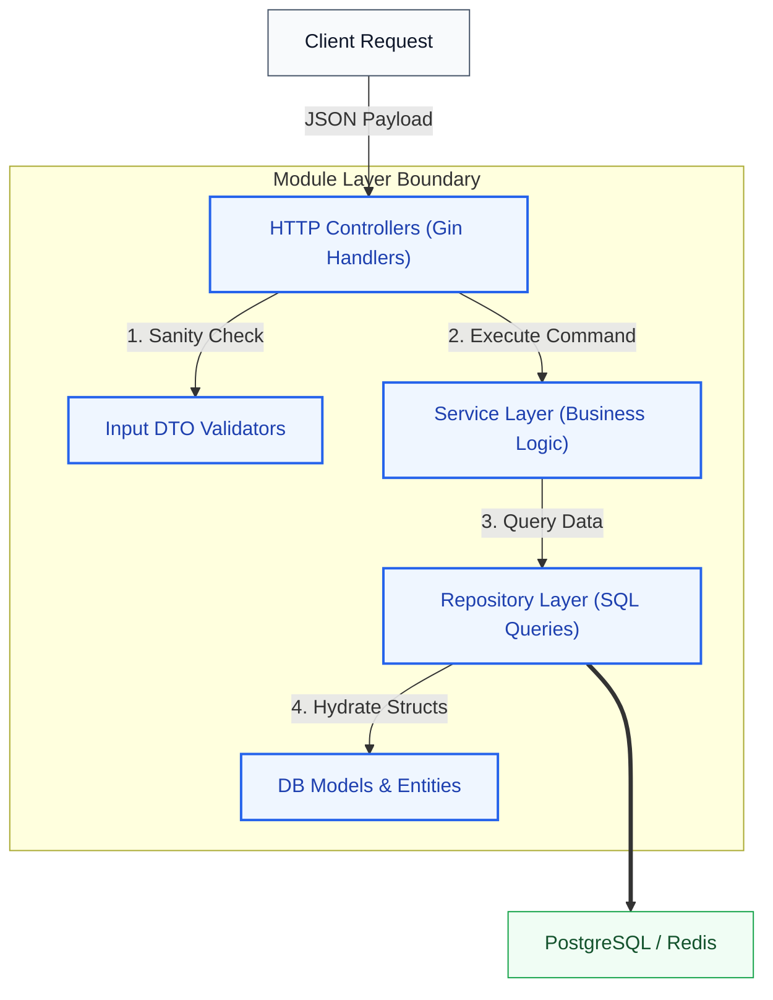
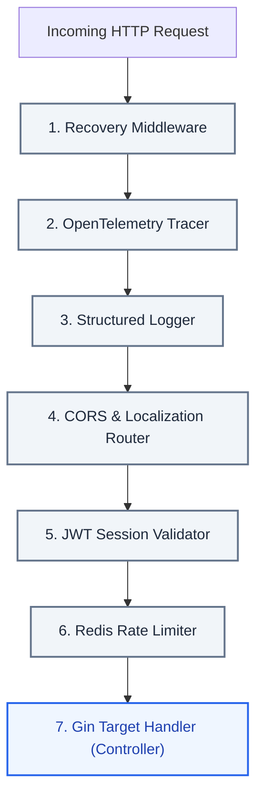
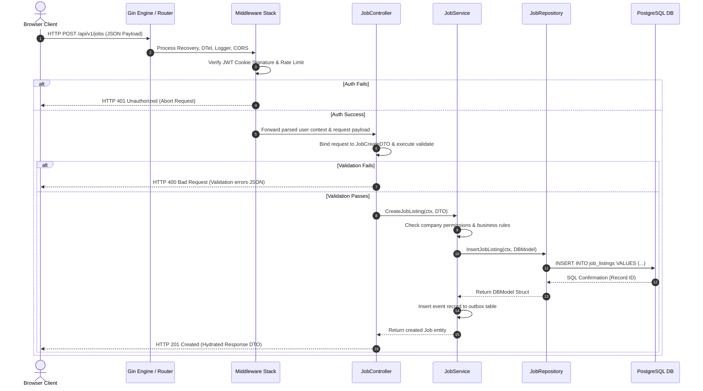
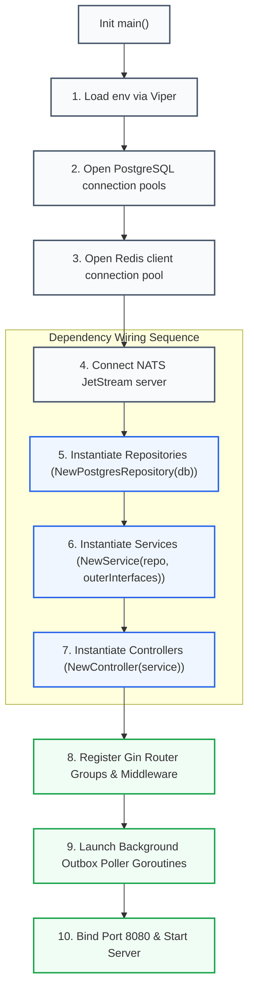
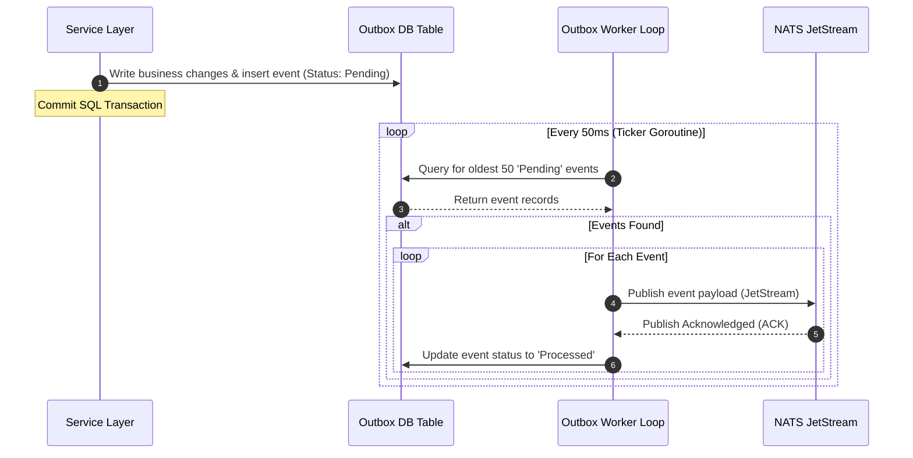

# Backend Architecture Blueprint: Kirmya Go Monolith
**Document Identifier:** PL-AR-004 | **Status:** Approved / Core Reference | **Version:** 1.0.0  
**Authors:** Antigravity AI & Technical Architecture Group | **Date:** July 24, 2026

---

## Document Control & Meta-Information

### Version History
| Version | Date | Author | Description |
| :--- | :--- | :--- | :--- |
| `0.1.0` | 2026-07-20 | Antigravity AI | Initial Go package structure layout. |
| `0.5.0` | 2026-07-22 | Antigravity AI | Defined Gin routing groups, dependency injection constructor models. |
| `1.0.0` | 2026-07-24 | Antigravity AI | Completed full Backend Architecture Blueprint for Board approval. |

### Document Distribution
* **Product Strategy Group**: Technical framework overview.
* **Engineering Leads**: Mandatory coding standards and package layers.
* **DevOps Team**: Docker multi-stage configurations.
* **Security & Compliance**: Cryptographic token management.

---

## 1. Related Documents
- [00-documentation-standards.md](file:///c:/Users/PRASHANTH/Documents/real/my_project/docs/product/00-documentation-standards.md)
- [01-system-architecture.md](file:///c:/Users/PRASHANTH/Documents/real/my_project/docs/architecture/01-system-architecture.md)
- [02-modular-monolith-architecture.md](file:///c:/Users/PRASHANTH/Documents/real/my_project/docs/architecture/02-modular-monolith-architecture.md)
- [03-module-boundaries.md](file:///c:/Users/PRASHANTH/Documents/real/my_project/docs/architecture/03-module-boundaries.md)
- [10-non-functional-requirements.md](file:///c:/Users/PRASHANTH/Documents/real/my_project/docs/product/10-non-functional-requirements.md)

---

## 2. Dependencies
- Package dependencies conform to the modular isolation rules defined in [PL-AR-002 Modular Monolith Architecture Blueprint](file:///c:/Users/PRASHANTH/Documents/real/my_project/docs/architecture/02-modular-monolith-architecture.md).
- Error boundaries align with [PL-PD-009 Business Rules](file:///c:/Users/PRASHANTH/Documents/real/my_project/docs/product/09-business-rules.md).

---

## 3. Purpose
This document specifies the complete backend architecture for Kirmya, built in Go using the Gin framework. It maps the directory structures, layered components, middleware flows, dependency injection lifecycle, transaction boundaries, and database query patterns, establishing a consistent coding standard across the engineering team.

---

## 4. Scope
- **In-Scope**: Golang project directory layouts, layered patterns (Controllers, Services, Repositories, DTOs, Validators), configuration management, Gin middleware, DI constructor logic, error handling, NATS outbox polling, and testing strategies.
- **Out-of-Scope**: Frontend Next.js configurations and Cloudflare edge network provisioning scripts.

---

## 5. Objectives
- Establish a uniform Go package layout that enforces modular boundaries.
- Define a clear layered architecture separating HTTP routing, business logic, and database access.
- Implement explicit, reflection-free constructor dependency injection inside `main.go`.
- Design a transactional outbox worker pipeline to guarantee event delivery.
- Create 6 detailed Mermaid diagrams tracing request and configuration lifecycles.

---

## 6. Executive Summary
Kirmya's backend is built as a highly structured **Modular Monolith** in **Go** using the **Gin** web framework. The backend compiles all 18 domain modules into a single deployment binary while enforcing strict package-level decoupling. 

Each module isolates its HTTP request translation (Controllers), business rules execution (Services), database queries (Repositories), and data mapping configurations (DTOs, Validators). Modules communicate synchronously through registered Go interfaces and asynchronously via NATS pub/sub event topics. A background transactional outbox worker ensures that database commits and event dispatches are processed atomically. 

This document defines the folder structures, layered patterns, middleware configurations, error strategies, and testing plans that govern Kirmya's backend engineering.

---

## 7. Detailed Content: Backend Architecture Specifications

### 7.1 Project Folder Structure
Kirmya adopts a standardized Go directory layout that separates the main runtime entry point from configuration files and modular domain logic:

```
/cmd
  /kirmya
    main.go                   # Platform entry point (wires dependencies and starts Gin)
/config
  config.go                   # Viper struct loading environment variables
  dev.env                     # Local environment development configs
/internal
  /shared                     # Stateless Shared Kernel (No domain business logic)
    /interfaces               # System-wide Go interfaces (e.g. IProfileService)
    /models                   # Shared value objects (e.g. UserContext, Money)
    /middleware               # Central Gin middlewares (JWT, OTel, Logger)
    /database                 # Connection pools loaders (PostgreSQL, Redis, NATS)
    /outbox                   # Transactional outbox table schema and publisher logic
    /errors                   # Custom system error codes mappings
  /auth                       # Authentication Module
    /delivery/http            # HTTP controller mappings & JSON translators
    /service                  # Domain business logic implementation
    /repository               # PostgreSQL CRUD operations
    /models                   # Module internal DB database models
  /user                       # Users Module
  /profile                    # Professional Profiles Module
  /job                        # Jobs Module
  /media                      # Media Module (Handles Cloudflare R2 uploads)
```

*Architectural Justification*: This structure separates the entry point (`/cmd`), configurations (`/config`), domain logic (`/internal`), and shared utilities (`/internal/shared`). Domain packages contain `delivery`, `service`, and `repository` subdirectories, preventing code tangling and keeping each module ready for future extraction into standalone microservices.

### 7.2 Layered Architecture Components
Each domain module contains three internal layers, maintaining a strict one-way flow of dependencies: `Delivery -> Service -> Repository`.



1. **Controllers (Delivery Layer)**: Gin handlers parse incoming requests (multipart forms, JSON payloads), bind parameters to Input DTO structs, trigger input validation, invoke the Service layer, and return standard JSON or Server-Sent Events (SSE).
2. **DTOs & Validators**: Simple structs that define request and response payloads. Input validation is handled using the `go-playground/validator/v10` library, validating fields (e.g. email formats, character length, UAE phone patterns) before business logic is executed.
3. **Services (Business Logic Layer)**: The core engine of the domain. It evaluates business rules, coordinates domain models, and manages transactions. It communicates with other modules using their interfaces.
4. **Repositories (Data Access Layer)**: Houses SQL logic. Repositories accept structural parameters from Services and query the database using connection pools, returning hydrated DB model structs.
5. **Models (Persistence Entities)**: Database table schemas represented as Go structs with snake_case metadata tags mapping directly to PostgreSQL columns.

---

### 7.3 Middleware Pipeline Flow
Gin interceptors process incoming requests before they reach the controller. This sequence ensures all requests are logged, traced, and validated.



- **Recovery Middleware**: Catches uncaught panics inside goroutines, returns a standard `500 Internal Server Error` JSON response, and prevents the monolith process from crashing.
- **OpenTelemetry Tracer**: Injects trace contexts and creates spans for incoming requests. Trace IDs are propagated through Go context structures.
- **Structured Logger**: Logs request parameters (HTTP method, client IP, path, status, latency) in JSON format using a logger (e.g. Zerolog). It includes trace and span IDs in log messages.
- **CORS & Localization**: Sets cross-origin headers and parses `Accept-Language` headers (e.g., Modern Standard Arabic `ar` vs English `en`), configuring the context language flag to handle bidirectional layout configurations.
- **JWT Session Validator**: Parses HttpOnly cookie payloads, validates signatures, and injects validated user identities (User ID, roles) into the Gin context.
- **Redis Rate Limiter**: Implements a token bucket algorithm to prevent DDoS attacks and API scraping, returning `429 Too Many Requests` when limits are exceeded.

---

### 7.4 Request Lifecycle Trace
This diagram illustrates the complete lifecycle of a request, showing how authentication, database interactions, and event publishing are coordinated across packages.



---

### 7.5 Dependency Injection (DI) Lifecycle
At startup (`main.go`), dependencies are initialized and injected using constructors. This approach ensures type safety and makes it easier to mock components during testing.



*Architectural Justification*: Reflection-based dependency injection frameworks are prohibited. Explicit wiring in `main.go` ensures clear compile-time error checks and simplifies tracking dependencies as the monolith scales.

---

### 7.6 Transaction Management with Context Propagation
Cross-layer database transactions are coordinated using Go's `context.Context` object to pass transaction handles.

#### Transaction Pattern
```go
// Begin transaction wrapper inside the Service Layer
func (s *JobService) CreateJobListing(ctx context.Context, job *models.JobListing) error {
    // Begin transaction on PostgreSQL pool
    tx, err := s.db.BeginTx(ctx, nil)
    if err != nil {
        return err
    }
    defer tx.Rollback() // Automatically rollback on error/panic

    // Inject tx handle into context
    txCtx := context.WithValue(ctx, shared.TxKey, tx)

    // Call Repository layers passing the tx context
    if err := s.jobRepo.Save(txCtx, job); err != nil {
        return err
    }

    // Insert outbox event record in the same transaction
    if err := s.outboxRepo.SaveEvent(txCtx, &models.OutboxEvent{
        Topic: "kirmya.jobs.listing.created",
        Payload: jsonPayload,
    }); err != nil {
        return err
    }

    return tx.Commit() // Commit transaction atomic block
}
```

#### Repository SQL Exec Handler
```go
func (r *PostgresJobRepository) Save(ctx context.Context, job *models.JobListing) error {
    // Check for active transaction pointer in context
    var executor sqlester = r.dbPool
    if tx, ok := ctx.Value(shared.TxKey).(*sql.Tx); ok {
        executor = tx
    }
    
    // Execute query using determined executor
    _, err := executor.ExecContext(ctx, "INSERT INTO job_listings...", ...)
    return err
}
```

*Architectural Justification*: Passing transaction pointers inside the context object decouples repository layers from service transaction logic. This pattern allows repositories to run inside or outside transactions without changing their signatures.

---

### 7.7 Transactional Outbox Background Worker
To ensure that database commits and NATS event dispatches are processed atomically, Kirmya uses a background transactional outbox poller. This pattern prevents data inconsistencies that can occur if database writes succeed but event publishing fails.



- **Reliability (At-Least-Once)**: If the outbox worker fails to publish an event or crashes before updating the status to 'Processed', the event is picked up by another worker instance in the next poll, guaranteeing delivery.
- **Deduplication**: Subscribers handle potential duplicate events by verifying event IDs against their local datastores before processing.

---

### 7.8 Error Handling and API Versioning
- **Error Handling**: Custom domain errors are mapped to system-wide error codes, which are translated to standard HTTP status codes in the delivery layer:
  ```go
  // Core Domain Error Struct
  type AppError struct {
      Code    string `json:"error_code"`
      Message string `json:"message"`
      Details string `json:"details,omitempty"`
  }
  ```
  Example Codes: `ERR_AUTH_INVALID_TOKEN` (401), `ERR_VALIDATION_FAILED` (400), `ERR_PORTFOLIO_NOT_FOUND` (404), `ERR_ESCROW_INSUFFICIENT_FUNDS` (402).
- **API Versioning**: Enforced via path prefix namespaces at the Gin routing layer. Changes to route behaviors require creating a new route group:
  ```go
  v1 := router.Group("/api/v1")
  {
      v1.POST("/jobs", jobController.CreateJob)
  }
  v2 := router.Group("/api/v2")
  {
      v2.POST("/jobs", jobController.CreateJobV2)
  }
  ```

---

### 7.9 Testing and Mocking Strategy
The testing strategy enforces boundary validation across layers:
- **Mock Generation**: We use `mockery` to automatically generate mocks for all public interface abstractions. Mocks are saved in local module `mocks/` folders.
- **Unit Testing**: Services are unit tested in isolation by mocking repository interfaces:
  ```go
  func TestCreateJobListing(t *testing.T) {
      mockRepo := new(mocks.JobRepository)
      mockRepo.On("Save", mock.Anything, mock.Anything).Return(nil)
      
      service := NewJobService(mockRepo)
      err := service.CreateJobListing(context.Background(), &models.JobListing{})
      assert.Nil(t, err)
  }
  ```
- **Integration Testing**: Database queries are tested using **Testcontainers Go** to spin up temporary PostgreSQL and Redis containers, ensuring SQL assertions run against clean, isolated databases.

---

## 16. Functional Requirements Mapping
The layered backend architecture maps directly to the following functional requirements:
- **FR-AUTH-SSO**: Handled by SSO adapters injected into the `authModule` controller layer.
- **FR-MED-TRANSCODE**: Executed by background workers triggered by events in the `mediaModule` outbox.

---

## 17. Non-Functional Requirements Verification
- **NFR-PER-005 (API Latency <= 200ms)**: Achieved by optimizing DB queries, routing read operations to PostgreSQL replicas, and using Redis caches in the controller pipeline.
- **NFR-MNT-001 (Test Coverage >= 80%)**: Enforced in CI/CD pipelines by running automated test suites with code coverage validation.

---

## 18. Business Rules Mapping
- **BR-AUTH-SEATS**: Evaluated in `companyService.ValidateSeat` before job posting queries are executed.
- **BR-FREE-DISPUTES**: Logged in `adminService.CreateDisputeTicket` within a single transactional commit.

---

## 19. Assumptions
- Go's memory safety and concurrency models (goroutines, channels) support concurrent WebSocket chat rooms and outbox pollers.
- DB pools are scaled to manage maximum concurrent connections without resource exhaustion.

---

## 20. Constraints
- Domain modules cannot import models from other modules directly. Shared structs must reside in `internal/shared/models`.
- Third-party packages must undergo vulnerability scanning (SAST/DAST) in the CI/CD pipeline.

---

## 21. Risks
- **Concurrency Conflicts**: High-frequency updates to user DRS scores could cause database locks. *Mitigation*: Batch DRS calculations using background workers.
- **Outbox Poller Saturation**: High write loads could saturate the outbox table. *Mitigation*: Partition the outbox table by timestamp and run multiple parallel workers.

---

## 22. Open Questions
- What database migration tool (e.g. Golang-Migrate, Liquibase) will manage modular PostgreSQL schemas?
- What tracing platform (e.g., Datadog, Jaeger, OpenSearch) will host the OpenTelemetry spans in production?

---

## 23. Future Improvements
- Move the transactional outbox worker to use Change Data Capture (CDC) with Debezium to replicate events directly from PostgreSQL WAL logs.
- Introduce gRPC boundaries to replace Go interfaces once modules are ready to be extracted.

---

## 24. Acceptance Criteria
The backend implementation must meet these standards to be marked complete:

| Phase | Verification Checklist | Status Target |
| :--- | :--- | :--- |
| **Wiring** | Explicit, reflection-free constructor dependency injection inside `main.go`. | 100% |
| **Isolation** | No cross-module database imports. | 100% |
| **Transactions** | Transactions are managed using context propagation. | Mandatory |
| **Test Coverage** | Unit and integration test coverage remains above 80%. | 80% Minimum |

---

## 25. Success Metrics
- Local monolith startup times are under 3 seconds.
- Database connection pool utilization remains below 70% under standard loads.

---

## 26. Glossary
- **OTel**: OpenTelemetry, an open-source observability framework for instrumenting, generating, collecting, and exporting telemetry data.
- **CDC**: Change Data Capture, a set of software design patterns used to determine and track the data that has changed.
- **DI**: Dependency Injection, a design pattern in which an object or function receives other objects or functions that it depends on.

---

## 27. References
- [Go Standard Project Layout Guidelines](https://github.com/golang-standards/project-layout)
- [Gin Web Framework Documentation](https://gin-gonic.com/docs/)
- [Viper Configuration Loader](https://github.com/spf13/viper)

---

## 28. Revision History
| Version | Date | Author | Description |
| :--- | :--- | :--- | :--- |
| `1.0.0` | 2026-07-24 | Antigravity AI | Finished full Go Monolith Backend Architecture blueprint. |
