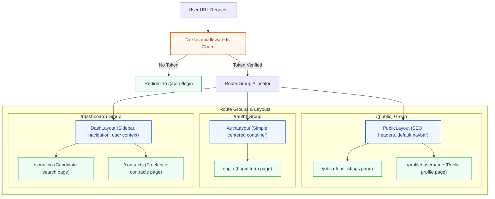
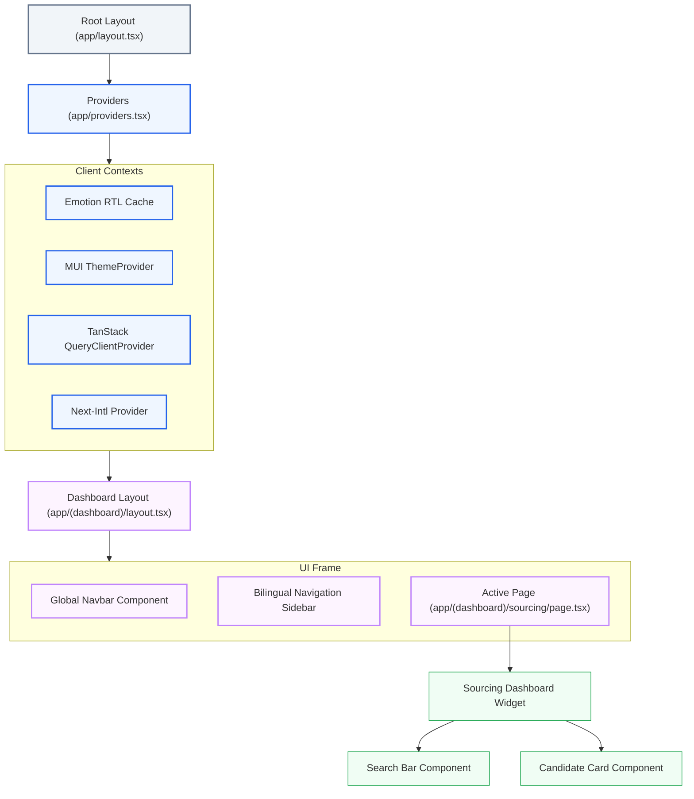
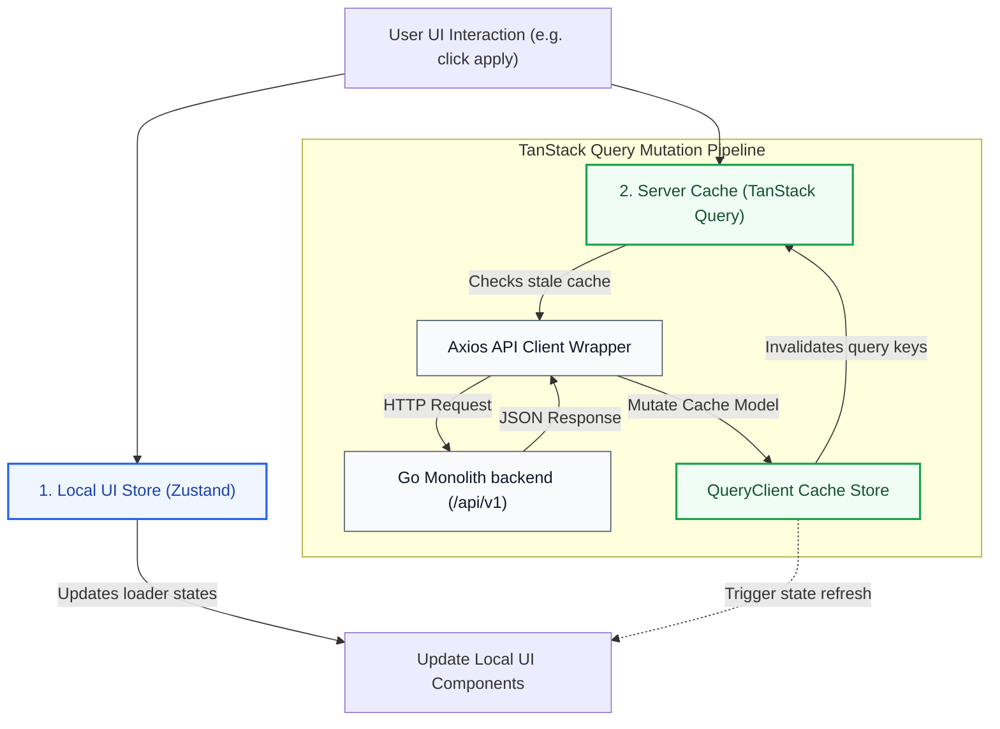
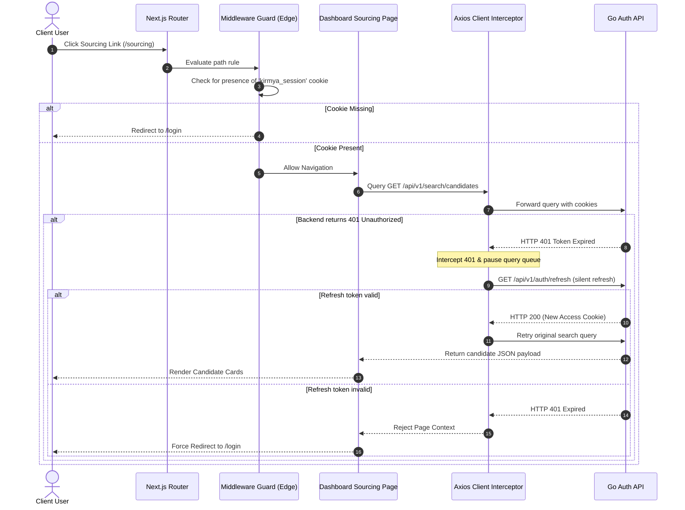

# Frontend Architecture Blueprint: Kirmya Next.js Client
**Document Identifier:** PL-AR-005 | **Status:** Approved / Core Reference | **Version:** 1.0.0  
**Authors:** Antigravity AI & Technical Architecture Group | **Date:** July 24, 2026

---

## Document Control & Meta-Information

### Version History
| Version | Date | Author | Description |
| :--- | :--- | :--- | :--- |
| `0.1.0` | 2026-07-20 | Antigravity AI | Initial Next.js App Router tree outline. |
| `0.5.0` | 2026-07-22 | Antigravity AI | Integrated MUI v6 RTL cache, TanStack Query cache key rules. |
| `1.0.0` | 2026-07-24 | Antigravity AI | Completed full Frontend Architecture Blueprint for Board approval. |

### Document Distribution
* **Product Strategy Group**: User Interface guidelines.
* **Engineering Leads**: Frontend coding standards and component rules.
* **DevOps Team**: Next.js build optimization and static caching.
* **Security & Compliance**: CSP header rules.

---

## 1. Related Documents
- [00-documentation-standards.md](file:///c:/Users/PRASHANTH/Documents/real/my_project/docs/product/00-documentation-standards.md)
- [01-system-architecture.md](file:///c:/Users/PRASHANTH/Documents/real/my_project/docs/architecture/01-system-architecture.md)
- [02-modular-monolith-architecture.md](file:///c:/Users/PRASHANTH/Documents/real/my_project/docs/architecture/02-modular-monolith-architecture.md)
- [03-module-boundaries.md](file:///c:/Users/PRASHANTH/Documents/real/my_project/docs/architecture/03-module-boundaries.md)
- [10-non-functional-requirements.md](file:///c:/Users/PRASHANTH/Documents/real/my_project/docs/product/10-non-functional-requirements.md)

---

## 2. Dependencies
- UI component boundaries align with [PL-AR-003 Module Boundaries Specification](file:///c:/Users/PRASHANTH/Documents/real/my_project/docs/architecture/03-module-boundaries.md).
- Typography and branding conform to the style guides in [PL-FE-001 Frontend Layout Specifications](file:///c:/Users/PRASHANTH/Documents/real/my_project/docs/frontend/01-frontend-standards.md).

---

## 3. Purpose
This document establishes the official frontend architecture for the Kirmya Professional Ecosystem. It specifies the client-side directory layouts, App Router configurations, MUI v6 theme system, state management patterns, and security guidelines, ensuring a consistent development standard.

---

## 4. Scope
- **In-Scope**: Next.js application directory structure, App Router layout nesting, MUI v6 HSL theme system, internationalization mechanics (English/Arabic), state management (Zustand + TanStack Query), form engineering, client security, and testing strategies.
- **Out-of-Scope**: Node.js backend server hosting specifications and third-party analytics dashboard configurations.

---

## 5. Objectives
- Define a scalable frontend directory structure using Next.js.
- Configure MUI v6 theme tokens to support light, dark, and bidirectional (Arabic RTL) rendering.
- Enforce strict state management boundaries separating local UI states from server-cached state keys.
- Map frontend components to backend module HTTP boundaries.
- Build a structure that supports future mobile application compilation and micro-frontend zones.

---

## 6. Executive Summary
Kirmya's frontend is built on **Next.js** using the **App Router** layout model, with UI components written in **React**, compiled in **TypeScript**, and styled using **MUI v6**. To maintain high visual quality, the frontend relies on tokenized MUI HSL palettes and dynamic RTL caches (for bilingual English/Arabic layout support), avoiding Tailwind CSS. 

State management is split between **Zustand** (for local states and sessions) and **TanStack Query** (for API request caching). Access guards and Next.js middleware manage role-based page rendering and JWT redirects. 

The application is structured to support future mobile app compilation (via Capacitor or React Native Web bridges) and micro-frontend extraction (via Next.js Multi-Zones) if required as the platform scales.

---

## 7. Detailed Content: Frontend Architecture Specifications

### 7.1 Frontend Project Layout
Kirmya organizes its Next.js source code inside the `/src` directory to isolate components, global stores, configuration hooks, and domain modules:

```
/src
  /app                        # Next.js App Router (Routing, Layouts, and Root Providers)
    /(auth)                   # Route Group: Authenticated login/register routes
    /(dashboard)              # Route Group: Recruiter/Freelancer dashboard routes
    /(public)                 # Route Group: Jobs feed, brand pages, public SEO views
    /layout.tsx               # Global Root Layout (Common HTML/Body wrappers)
    /providers.tsx            # Context wrappers (MUI, QueryClient, Intl)
  /components                 # Shared Global Reusable UI Components
    /ui                       # Base buttons, input widgets, dialog wrappers
    /layout                   # Navigation headers, footers, bilingual sidebar menus
  /features                   # Independent Feature Modules (corresponds to backend modules)
    /auth                     # Feature Domain: Authentication widgets & forms
      /components             # Feature-specific components (e.g., LoginForm)
      /hooks                  # Feature hooks (e.g., useAuthSession)
      /services               # API clients (calls to /api/v1/auth)
      /types                  # Feature TypeScript typings definitions
    /profile                  # Feature Domain: Candidate profiles & skill graphs
    /jobs                     # Feature Domain: Capabilities job listings
  /hooks                      # Shared global hooks (e.g. useDebounce, useMediaQuery)
  /store                      # Zustand global state stores (UI settings, user sessions)
  /theme                      # MUI v6 theme declarations, tokens, light/dark configurations
  /utils                      # Stateless shared utilities (formatters, dynamic cache loaders)
```

*Architectural Justification*: Enforcing a feature-based folder structure ensures that all logic related to a specific domain (e.g. `jobs`) resides within a single feature directory. This layout prevents file clutter and simplifies future extraction into independent micro-frontends.

### 7.2 Routing Architecture & App Router Layout
Next.js App Router organizes pages into Route Groups to isolate layouts without polluting URL paths:



- **Root Layout (`app/layout.tsx`)**: The base wrapper containing HTML and body tags. It executes server-side, injecting core metadata tags for SEO.
- **Root Providers (`app/providers.tsx`)**: Renders client-side provider wrappers:
  - MUI v6 `<ThemeProvider>` injecting tokenized styles.
  - Emotion RTL/LTR cache provider.
  - TanStack `<QueryClientProvider>` containing the API cache.
  - i18n localization contexts.
- **Next.js Middleware (`src/middleware.ts`)**: Runs on edge nodes. It inspects HttpOnly session cookies, blocking access to `/(dashboard)` paths and redirecting unauthorized traffic to `/login`.

---

### 7.3 Component Hierarchy
The component hierarchy ensures that providers, navigation elements, and feature-specific components are nested correctly:



---

### 7.4 State Management and Server Cache Data Flow
Kirmya separates local UI states (Zustand) from server-cached state models (TanStack Query):



- **Zustand (Local State)**: Manages transient UI configurations, including sidebar toggles, current language settings, and user session details.
- **TanStack Query (React Query) (Server State)**: Manages data fetched from backend APIs, including job feeds, candidate lists, and contracts. It handles caching, pagination state, background updates, and automatic cache invalidation using key patterns (e.g. `['jobs', jobId]`).

---

### 7.5 MUI v6 Theme and Bidirectional Localization System
The UI utilizes the **MUI v6 Theme Engine** with dynamic cache swaps to support Arabic RTL layouts without Tailwind CSS.

- **Bidirectional Style Setup**: The application uses a custom cache provider to switch between LTR and RTL orientations:
  ```typescript
  import { prefixer } from 'stylis';
  import rtlPlugin from 'stylis-plugin-rtl';
  import createCache from '@emotion/cache';

  // Create RTL Stylis plugin instance
  export const cacheRtl = createCache({
    key: 'muirtl',
    stylisPlugins: [prefixer, rtlPlugin],
  });
  
  export const cacheLtr = createCache({
    key: 'muiltr',
  });
  ```
- **Theme Configurations**: Custom colors are defined using tokenized HSL CSS variables inside the MUI theme constructor:
  ```typescript
  import { createTheme } from '@mui/material/styles';

  export const lightTheme = createTheme({
    palette: {
      mode: 'light',
      primary: {
        main: 'hsl(220, 89%, 45%)', // sleeker deep blue
      },
      secondary: {
        main: 'hsl(142, 70%, 40%)', // premium emerald green
      },
      background: {
        default: 'hsl(0, 0%, 98%)',
        paper: 'hsl(0, 0%, 100%)',
      },
    },
    direction: 'ltr', // Toggled dynamically to 'rtl' for Arabic
  });
  ```
- **Accessibility Constraints**: Contrasts are verified dynamically during build time to meet WCAG 2.1 Level AA standards, ensuring a minimum contrast ratio of 4.5:1 for standard text elements.

---

### 7.6 Authentication and Protected Page Guard Flow
The frontend validates user access tokens and handles session expiration redirects:



---

### 7.7 Form Engineering & Validation Strategy
Forms are managed using **React Hook Form** for state tracking and performance optimization, paired with **Zod** for schema validation.
- **Validation Engine**: Prevents invalid API requests by checking input data on the client side:
  ```typescript
  import { z } from 'zod';

  // Strict capabilities-first job posting Zod validator
  export const JobCreationSchema = z.object({
    title: z.string().min(5, 'Arabic/English Title must exceed 5 characters'),
    companyId: z.string().uuid('Invalid Company ID'),
    requiredSkills: z.array(z.string()).min(1, 'At least one skill badge is required'),
    drsThreshold: z.number().min(1, 'Minimum DRS level must be at least 1').max(100),
  });
  ```
- **Binding Resolver**: Hook forms use the `@hookform/resolvers/zod` package to bind Zod validation schemas directly to form components.

---

### 7.8 Frontend Module to Backend Monolith Mappings
The Next.js App Router routing structures map directly to the corresponding Go monolith API modules:

| App Route Path | Feature Module | Primary Backend API Endpoint | WebSocket / SSE integration |
| :--- | :--- | :--- | :--- |
| `/login`, `/register` | `auth` | `/api/v1/auth/login` | None |
| `/profile/[username]` | `profile` | `/api/v1/profiles/:username` | None |
| `/jobs`, `/jobs/[id]` | `jobs` | `/api/v1/jobs` | None |
| `/sourcing` | `search` | `/api/v1/search/candidates` | None |
| `/contracts/[id]` | `freelance`| `/api/v1/freelancing/contracts` | SSE (Contract updates) |
| `/messages` | `messaging`| `/api/v1/messaging/rooms` | WebSockets (Chat relay) |
| `/learning/paths` | `learning` | `/api/v1/learning/paths` | None |
| `/admin/moderation` | `admin` | `/api/v1/admin/moderation` | None |

---

### 7.9 Future Micro-Frontends & Mobile Readiness
- **Micro-Frontend Transition**: Next.js is configured to support **Multi-Zones**. This allows different teams to develop and deploy separate pages (e.g. `/jobs` vs `/messages`) as independent Next.js projects. An edge router (e.g., Cloudflare Workers) routes traffic to the appropriate application zone, presenting them as a single unified portal to the user.
- **Mobile Compatibility**: To prepare the application for hybrid mobile wrapping (using Capacitor or Cordova), the codebase:
  - Avoids importing Node-specific runtime packages.
  - Wraps Axios configurations to support native mobile cookie jar handling.
  - Implements responsive layouts using MUI's mobile breakpoints.

---

## 16. Functional Requirements Mapping
- **FR-LOC-AR**: Supported by the bidirectional theme cache provider.
- **FR-MSG-CHAT**: Powered by the WebSocket connection hook in `/src/features/messaging`.

---

## 17. Non-Functional Requirements Verification
- **NFR-PER-001 (LCP <= 2.0s)**: Achieved by server-side rendering public views and using Next.js automatic image optimization.
- **NFR-ACC-001 (WCAG AA)**: Enforced in the theme design by specifying contrast ratios and using semantic HTML elements.

---

## 18. Business Rules Mapping
- **BR-FREE-DEPOSITS**: Handled by form screens in the `freelancing` feature, validating deposit amounts against contract thresholds before sending requests.
- **BR-AUTH-SEATS**: Verified on the client side by hiding Sourcing search fields if the recruiter does not have an active corporate seat.

---

## 19. Assumptions
- Next.js App Router performs server-side compilation of public pages correctly.
- User browsers support standard CSS HSL variable rendering.

---

## 20. Constraints
- The UI system must build and style elements using only MUI v6 theme components; Tailwind CSS is prohibited.
- All file uploads must route through the `Media` module api, using temporary signed URLs.

---

## 21. Risks
- **RTL Mirroring Conflicts**: Dynamic layout switching (Arabic to English) could cause layout shifts. *Mitigation*: Run visual regression testing for both LTR and RTL orientations in the CI/CD pipeline.
- **Cookie Blockers**: Strict browser settings might block HttpOnly cookies. *Mitigation*: Provide an fallback header token storage strategy if cookie access is restricted.

---

## 22. Open Questions
- What translation library (e.g. Next-Intl, i18next) will manage localization dictionaries?
- Will the mobile application use a Capacitor wrapper or a dedicated React Native repository?

---

## 23. Future Improvements
- Implement micro-frontend multi-zone routing as development teams scale.
- Configure module federation support for runtime component sharing.

---

## 24. Acceptance Criteria
The frontend implementation must satisfy these rules:

| Metric | Verification Standard | Target |
| :--- | :--- | :--- |
| **No Tailwind** | Zero Tailwind classes or utility imports. | 100% compliance |
| **A11y Check** | Color contrast ratio meets WCAG AA standards. | 4.5:1 Minimum |
| **Bilingual Layout** | Seamless switching between RTL and LTR orientations. | Pass |
| **State Separation** | API responses are managed within React Query caches. | Mandatory |

---

## 25. Success Metrics
- Average Largest Contentful Paint (LCP) time remains under 2.0s.
- 100% of forms include schema validation using Zod.

---

## 26. Glossary
- **Multi-Zones**: A Next.js feature that allows developers to merge multiple independent Next.js applications into a single domain.
- **RTL**: Right-to-Left, the layout orientation required for Arabic text.
- **SSE**: Server-Sent Events, a technology that allows servers to push real-time updates to client browsers.

---

## 27. References
- [Next.js App Router Documentation](https://nextjs.org/docs/app)
- [MUI v6 Theme System Guidelines](https://mui.com/material-ui/customization/theming/)
- [TanStack Query Developer Guide](https://tanstack.com/query/latest)

---

## 28. Revision History
| Version | Date | Author | Description |
| :--- | :--- | :--- | :--- |
| `1.0.0` | 2026-07-24 | Antigravity AI | Finished full Next.js Frontend Architecture specification. |
