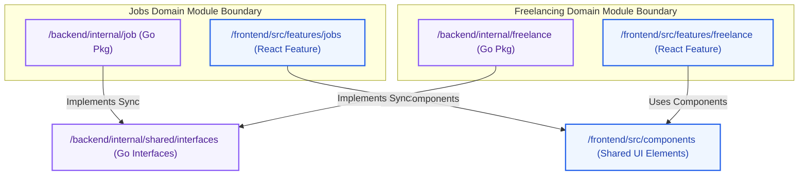

# Project Folder Structure Specification: Kirmya Workspace
**Document Identifier:** PL-AR-006 | **Status:** Approved / Core Reference | **Version:** 1.0.0  
**Authors:** Antigravity AI & Technical Architecture Group | **Date:** July 24, 2026

---

## Document Control & Meta-Information

### Version History
| Version | Date | Author | Description |
| :--- | :--- | :--- | :--- |
| `0.1.0` | 2026-07-20 | Antigravity AI | Initial workspace folder maps outline. |
| `0.5.0` | 2026-07-22 | Antigravity AI | Added detailed folder specification metrics (Allowed/Prohibited files). |
| `1.0.0` | 2026-07-24 | Antigravity AI | Completed full Project Folder Structure specification document. |

### Document Distribution
* **Product Strategy Group**: Documentation layout validation.
* **Engineering Leads**: Mandatory directory compliance.
* **DevOps Team**: Docker context routing definitions.
* **Security & Compliance**: Audit trail files checks.

---

## 1. Related Documents
- [00-documentation-standards.md](file:///c:/Users/PRASHANTH/Documents/real/my_project/docs/product/00-documentation-standards.md)
- [01-system-architecture.md](file:///c:/Users/PRASHANTH/Documents/real/my_project/docs/architecture/01-system-architecture.md)
- [02-modular-monolith-architecture.md](file:///c:/Users/PRASHANTH/Documents/real/my_project/docs/architecture/02-modular-monolith-architecture.md)
- [03-module-boundaries.md](file:///c:/Users/PRASHANTH/Documents/real/my_project/docs/architecture/03-module-boundaries.md)
- [04-backend-architecture.md](file:///c:/Users/PRASHANTH/Documents/real/my_project/docs/architecture/04-backend-architecture.md)
- [05-frontend-architecture.md](file:///c:/Users/PRASHANTH/Documents/real/my_project/docs/architecture/05-frontend-architecture.md)

---

## 2. Dependencies
- Root directories align with configuration file mappings in [PL-AR-004 Backend Architecture Blueprint](file:///c:/Users/PRASHANTH/Documents/real/my_project/docs/architecture/04-backend-architecture.md).
- Frontend structures align with Next.js App Router rules in [PL-AR-005 Frontend Architecture Blueprint](file:///c:/Users/PRASHANTH/Documents/real/my_project/docs/architecture/05-frontend-architecture.md).

---

## 3. Purpose
This document provides the official project folder structure for the Kirmya ecosystem. It defines the workspace directories, folder ownership, contents, and naming standards, ensuring a consistent repository layout across all teams.

---

## 4. Scope
- **In-Scope**: Project folder structure trees (Root, Backend, Frontend, Docs, Deploy, Scripts, Tests), directory property files rules, naming standards for all codebase items, and microservices extraction directories.
- **Out-of-Scope**: Detailed code implementation files.

---

## 5. Objectives
- Establish a uniform mono-repository structure that houses backend, frontend, infrastructure, and documentation.
- Document clear ownership, dependency rules, and file restrictions for every directory.
- Define naming standards for packages, modules, components, hooks, DTOs, interfaces, repositories, services, and configurations.
- Map out directory structures that support future microservices extraction.

---

## 6. Executive Summary
Kirmya is organized as a structured repository containing backend (Go Modular Monolith), frontend (Next.js client), devops infrastructure, and documentation. 

This document defines the folder structure and enforces strict rules regarding allowed and prohibited files, ownership, and dependencies for each directory. 

By standardizing naming conventions and component boundaries, the repository maintains clear isolation between domains, allowing future teams to extract services with minimal friction.

---

## 7. Detailed Content: Project Folder Structure

### 7.1 Folder Hierarchy Diagram
This diagram shows the high-level relationship between Kirmya's root project directories:

```mermaid
graph TD
    classDef root fill:#f1f5f9,stroke:#64748b,stroke-width:2px,color:#0f172a;
    classDef client fill:#eff6ff,stroke:#2563eb,stroke-width:2px,color:#1e40af;
    classDef server fill:#f5f3ff,stroke:#8b5cf6,stroke-width:2px,color:#4c1d95;
    classDef infra fill:#f0fdf4,stroke:#16a34a,stroke-width:2px,color:#14532d;

    %% Root
    Root["Root Workspace (kirmya)"]:::root

    %% Root Children
    Github["/.github (CI/CD Workflows)"]:::infra
    Assets["/assets (Static Branding)"]:::root
    Config["/config (Local Environment Files)"]:::root
    Deploy["/deploy (Docker / Db / Monitoring / Terraform)"]:::infra
    Docs["/docs (Architecture / Product PRDs)"]:::root
    Scripts["/scripts (Database Migrations & Automation)"]:::root
    Tests["/tests (End-to-End E2E Playwright)"]:::root
    Backend["/backend (Golang Monolith Core)"]:::server
    Frontend["/frontend (Next.js / MUI v6 Web Client)"]:::client

    Root --> Github
    Root --> Assets
    Root --> Config
    Root --> Deploy
    Root --> Docs
    Root --> Scripts
    Root --> Tests
    Root --> Backend
    Root --> Frontend
```



---

### 7.2 Module Organization Diagram
This diagram shows how modular domains are mapped to backend packages and frontend feature directories to enforce isolation:



---

### 7.3 Workspace Root Directory Structure
The root workspace coordinates compilation and deployment for both the backend and frontend:

```
/ (Workspace Root)
  ├── .github/                # CI/CD workflows and action configurations
  ├── assets/                 # Shared static assets (logos, branding design files)
  ├── backend/                # Go Backend Monolith (Standard Go Project Layout)
  ├── config/                 # Shared local development environment configurations
  ├── deploy/                 # Docker, database, and monitoring orchestrations
  ├── docs/                   # Documentation suite (product, architecture, API)
  ├── frontend/               # Next.js Frontend Web Application
  ├── scripts/                # Database migrations and utility automation scripts
  ├── tests/                  # Cross-project E2E Playwright test suites
  ├── docker-compose.yml      # Local orchestration file
  ├── .gitignore              # Project-wide git exclusion rules
  └── README.md               # Quickstart guide
```

---

### 7.4 Backend Directory Structure
The backend utilizes the standard Go project layout, isolating application commands from domain modules:

```
/backend
  ├── cmd/
  │   └── kirmya/
  │       └── main.go         # Monolith entry point (DI and HTTP listeners)
  ├── internal/
  │   ├── shared/             # Shared Kernel (Stateless helpers)
  │   │   ├── database/       # Postgres/Redis/NATS pool initiators
  │   │   ├── interfaces/     # Shared Go interfaces (e.g. IProfileService)
  │   │   ├── middleware/     # Core Gin HTTP middlewares
  │   │   └── models/         # System-wide structs (e.g. UserContext)
  │   ├── auth/               # Domain Module: Authentication
  │   │   ├── delivery/http/  # HTTP Controller and JSON validator
  │   │   ├── service/        # Business Logic
  │   │   └── repository/     # SQL Database CRUD operations
  │   ├── profile/            # Domain Module: Professional Profiles
  │   └── job/                # Domain Module: Jobs
  ├── go.mod                  # Go module definition file
  └── go.sum                  # Cryptographic dependencies lock
```

---

### 7.5 Frontend Directory Structure
The frontend uses the Next.js App Router structure, organizing files into public views, authentication flows, and feature modules:

```
/frontend
  ├── public/                 # Static assets served by Next.js (favicons, SVG icons)
  ├── src/
  │   ├── app/                # App Router Pages and Layouts
  │   │   ├── (auth)/         # Login / registration flows
  │   │   ├── (dashboard)/    # Secured dashboard views
  │   │   ├── (public)/       # Jobs lists, SEO landing pages
  │   │   ├── layout.tsx      # Root html/body layout
  │   │   └── providers.tsx   # MUI / React Query providers
  │   ├── components/         # Shared UI elements (buttons, layout grids)
  │   ├── features/           # Feature Modules (matches backend packages)
  │   │   ├── auth/           # Login / register features
  │   │   │   ├── components/ # LoginForm, RegistrationForm components
  │   │   │   ├── hooks/      # useAuth hook
  │   │   │   └── services/   # Axios client request mappings
  │   │   └── jobs/           # Jobs features
  │   ├── store/              # Zustand global state configurations
  │   ├── theme/              # MUI v6 design tokens HSL configuration
  │   └── utils/              # Client-side utility functions
  ├── package.json            # Node.js dependencies catalog
  └── tsconfig.json           # TypeScript compilation rules
```

---

### 7.6 Folder-by-Folder Mappings

#### 1. Root Workspace Root (`/`)
- **Purpose**: Wires backend, frontend, infrastructure, and documentation components.
- **Owner**: DevOps Architect / Principal Software Architect.
- **Contents**: Configuration files, project-wide ignore files, docker compose templates, and root subdirectories.
- **Naming Conventions**: Lowercase, kebab-case directory routing.
- **Dependency Rules**: Children directories are isolated. The root configures orchestration but does not import child code files.
- **Files Allowed**: `.gitignore`, `docker-compose.yml`, `README.md`, `.editorconfig`.
- **Files Prohibited**: Direct Go source files (`*.go`), TypeScript components (`*.tsx`), and secret key files (`*.pem`, `*.key`).

#### 2. CI/CD Workflows (`/.github`)
- **Purpose**: Defines GitHub Actions workflows for automated testing, linting, and deployments.
- **Owner**: DevOps Architect.
- **Contents**: GitHub Actions YAML files, pull request templates.
- **Naming Conventions**: Lowercase hyphenated names.
- **Dependency Rules**: Triggered on code modifications inside `/backend` and `/frontend`.
- **Files Allowed**: `.github/workflows/*.yml`, `.github/pull_request_template.md`.
- **Files Prohibited**: Private keys and environment configurations.

#### 3. Shared Static Assets (`/assets`)
- **Purpose**: Stores shared non-code media assets like logos, banners, and layout designs.
- **Owner**: Design Guild.
- **Contents**: SVG vector branding elements, PNG assets, design system PDF guidelines.
- **Naming Conventions**: Lowercase kebab-case names.
- **Dependency Rules**: Static assets; cannot import code files.
- **Files Allowed**: `.svg`, `.png`, `.jpg`, `.pdf`.
- **Files Prohibited**: Code scripts (`*.js`, `*.go`), stylesheet files (`*.css`).

#### 4. Shared Configurations (`/config`)
- **Purpose**: Local environment configurations for dockerized setups.
- **Owner**: DevOps Team.
- **Contents**: `.env` templates, local connection strings.
- **Naming Conventions**: Lowercase dot-split files (`local.env.example`).
- **Dependency Rules**: Parsed by backend loaders and Docker Compose workflows.
- **Files Allowed**: `*.env`, `*.json`, `*.yaml`.
- **Files Prohibited**: Active production credentials and keys.

#### 5. Deployment Orchestrations (`/deploy`)
- **Purpose**: Houses deployment configurations, database setups, and monitoring configurations.
- **Owner**: DevOps Team.
- **Contents**: Subdirectories for Docker files, SQL schemas, OpenTelemetry configurations, and Prometheus scrape rules.
- **Naming Conventions**: Lowercase kebab-case directories.
- **Dependency Rules**: Configures environments for `/backend` and `/frontend` containers.
- **Files Allowed**: `Dockerfile`, `schema.sql`, `prometheus.yml`, `otel-config.yaml`.
- **Files Prohibited**: Source code files (`*.go`, `*.tsx`).

#### 6. Documentation Suite (`/docs`)
- **Purpose**: Stores the project's documentation, including PRDs, architecture specifications, and API documentation.
- **Owner**: Documentation Lead.
- **Contents**: GFM Markdown files organized by subdirectory.
- **Naming Conventions**: Prefix index + lowercase hyphenated filenames (e.g. `01-system-architecture.md`).
- **Dependency Rules**: Reference-only; cannot import codebase scripts.
- **Files Allowed**: `*.md`, and Mermaid diagrams inside markdown documents.
- **Files Prohibited**: Source code files and binary assets (must use `/assets` folder).

#### 7. Automation Scripts (`/scripts`)
- **Purpose**: Automation scripts for database migrations, local builds, and certificate generation.
- **Owner**: Technical Lead.
- **Contents**: Bash scripts, database migration files.
- **Naming Conventions**: Lowercase kebab-case filenames.
- **Dependency Rules**: Executes database updates and local environment setups.
- **Files Allowed**: `*.sh`, `*.up.sql`, `*.down.sql`.
- **Files Prohibited**: Application logic code.

#### 8. Project E2E Tests (`/tests`)
- **Purpose**: Project-wide End-to-End integration tests.
- **Owner**: Testing Lead.
- **Contents**: Playwright test suites, test configurations.
- **Naming Conventions**: Lowercase hyphenated names.
- **Dependency Rules**: Executes integration tests against deployed Docker containers.
- **Files Allowed**: `*.spec.ts`, `playwright.config.ts`.
- **Files Prohibited**: Backend Go source files.

#### 9. Go Backend Monolith Core (`/backend`)
- **Purpose**: Backend application engine (REST endpoints, event workers, database connections).
- **Owner**: Technical Lead / Lead Backend Developer.
- **Contents**: Go packages, delivery controllers, database layers, event outbox pollers.
- **Naming Conventions**: Lowercase package names, no underscores or camelCase (`package auth`).
- **Dependency Rules**: Imports shared models and interfaces; cannot import `/frontend` structures.
- **Files Allowed**: `*.go`, `go.mod`, `go.sum`.
- **Files Prohibited**: Node.js package configurations (`package.json`), CSS stylesheets.

#### 10. Next.js Frontend Client (`/frontend`)
- **Purpose**: Frontend web client (App Router views, theme system, Zustand stores).
- **Owner**: Lead Frontend Developer.
- **Contents**: TypeScript modules, React components, MUI v6 style declarations.
- **Naming Conventions**: PascalCase component filenames (`JobCard.tsx`), camelCase for hooks and utilities.
- **Dependency Rules**: UI-only; queries backend REST endpoints.
- **Files Allowed**: `*.ts`, `*.tsx`, `package.json`, `tsconfig.json`.
- **Files Prohibited**: Go source files (`*.go`).

---

### 7.7 Naming Conventions Standards Policy
To ensure consistency across the mono-repository, Kirmya enforces these naming standards:

| Element | Naming Convention | Pattern | Example |
| :--- | :--- | :--- | :--- |
| **Go Packages** | lowercase, single word | `package [name]` | `package auth`, `package job` |
| **Monolith Modules** | camelCase, alphanumeric | `[name]Module` | `authModule`, `profileModule` |
| **React Components** | PascalCase, noun | `[Name].tsx` | `JobCard.tsx`, `SourcingWidget.tsx` |
| **React Hooks** | camelCase, prefixed with `use` | `use[Name].ts` | `useAuthSession.ts`, `useDebounce.ts` |
| **Data Transfer Objects** | PascalCase, suffixed with `DTO` | `[Name]DTO.go` / `[Name]DTO.ts` | `CreateJobListingDTO.go` |
| **Go Interfaces** | PascalCase, prefixed with `I` | `I[Name]` | `IProfileService`, `IJobRepository` |
| **Repositories** | PascalCase, suffix `Repository` | `[Name]Repository.go` | `PostgresJobRepository.go` |
| **Services** | PascalCase, suffix `Service` | `[Name]Service.go` | `JobService.go`, `AuthService` |
| **Models (Go)** | PascalCase, singular | `[Name].go` | `JobListing.go`, `UserAccount.go` |
| **Database Tables** | snake_case, plural | `[prefix]_[names]` | `job_listings`, `auth_sessions` |
| **Middleware** | camelCase, descriptive | `[name]Middleware.go` | `jwtAuthMiddleware.go` |
| **Configurations** | lowercase, kebab-case | `[name].env` / `[name].json` | `dev.env`, `db.config.json` |

---

### 7.8 Future Service Extraction Strategy & Scalability Guidelines
The project folder structure is organized to facilitate future microservices extraction. If the `jobModule` needs to be extracted:

```
[ BACKEND EXTRACTION PATTERN ]
1. Copy "/backend/internal/job" directory to a new repository.
2. Package concrete JobRepository and JobService implementations.
3. Replace Go interface definitions inside "/backend/internal/shared/interfaces" 
   with an HTTP/gRPC client implementation that calls the new Jobs microservice.
4. Route API requests to the new service using Cloudflare path rules.

[ FRONTEND EXTRACTION PATTERN ]
1. Identify feature package "/frontend/src/features/jobs".
2. Package components, hooks, types, and api services.
3. Configure Next.js Multi-Zones path configuration.
4. Deploy the jobs features package to a separate Next.js zone, 
   routing traffic to the main domain via Cloudflare Worker.
```

---

## 16. Functional Requirements Mapping
- **FR-AUTH-SSO**: Configured inside `backend/internal/auth` delivery layers using SAML adapter abstractions.
- **FR-LOC-AR**: Managed using MUI v6 bidirectional styling cache hooks in `frontend/src/theme`.

---

## 17. Non-Functional Requirements Verification
- **NFR-PER-005 (Latency)**: Managed by isolating database queries to local module package boundaries, preventing network overhead.
- **NFR-MNT-001 (Test coverage)**: Verified by running unit tests inside `backend/internal/[module]` packages and E2E tests in the `/tests` folder.

---

## 18. Business Rules Mapping
- **BR-AUTH-SEATS**: Enforced in `backend/internal/company` before candidate search requests are routed to the search module.
- **BR-FREE-ESCROW**: Transaction states are managed in `backend/internal/freelance`, publishing updates asynchronously via NATS.

---

## 19. Assumptions
- Go's package boundary rules prevent invalid cross-package imports at compile time.
- Next.js route groups correctly separate public pages from secured dashboard layout trees.

---

## 20. Constraints
- The UI system must build and style elements using only MUI v6 theme components; Tailwind CSS is prohibited.
- Modules cannot import database connection pools directly; connection configurations must pass through constructor injections.

---

## 21. Risks
- **Spaghetti imports**: Developers might bypass interfaces and import internal models from other packages. *Mitigation*: Run import checks in the CI/CD pipeline.
- **Shared Kernel Bloat**: Common utilities might be placed in the `/internal/shared` folder, causing coupling. *Mitigation*: Limit the shared kernel to stateless utilities.

---

## 22. Open Questions
- What database migration tool (e.g. Golang-Migrate, Liquibase) will manage database schemas?
- Will the mobile application use a Capacitor wrapper or a dedicated React Native repository?

---

## 23. Future Improvements
- Implement automated checks to detect and block circular imports.
- Configure Multi-Zone routing configurations as development teams scale.

---

## 24. Acceptance Criteria
The project folder layout must meet these standards to be marked complete:

| Rule | Verification Checkpoint | Target |
| :--- | :--- | :--- |
| **Package Separation** | Absolute segregation between backend packages. | 100% compliance |
| **No Tailwind** | Zero Tailwind classes or utility imports. | 100% compliance |
| **Naming Conventions** | Filenames and directory paths comply with standards. | Pass |
| **Interface usage** | Direct method calls to other module packages are prohibited. | Mandatory |

---

## 25. Success Metrics
- Local integration tests run in under 30 seconds.
- Modular code structure allows a new developer to start working on a module (e.g., `learningModule`) without understanding the internals of others (e.g., `freelanceModule`).

---

## 26. Glossary
- **Mono-repository**: A software development strategy where code for multiple projects is stored in the same repository.
- **RTL**: Right-to-Left, the layout orientation required for Arabic text.
- **DAG**: Directed Acyclic Graph, a graph with directed edges and no cycles.

---

## 27. References
- [Go Standard Project Layout Guidelines](https://github.com/golang-standards/project-layout)
- [Next.js App Router Documentation](https://nextjs.org/docs/app)
- [MUI v6 Theme System Guidelines](https://mui.com/material-ui/customization/theming/)

---

## 28. Revision History
| Version | Date | Author | Description |
| :--- | :--- | :--- | :--- |
| `1.0.0` | 2026-07-24 | Antigravity AI | Finished full Kirmya Project Folder Structure blueprint. |
