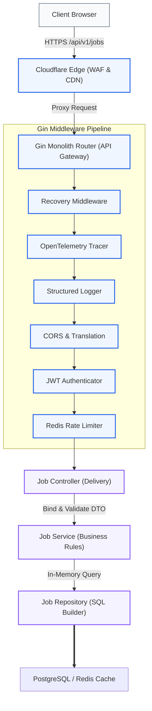
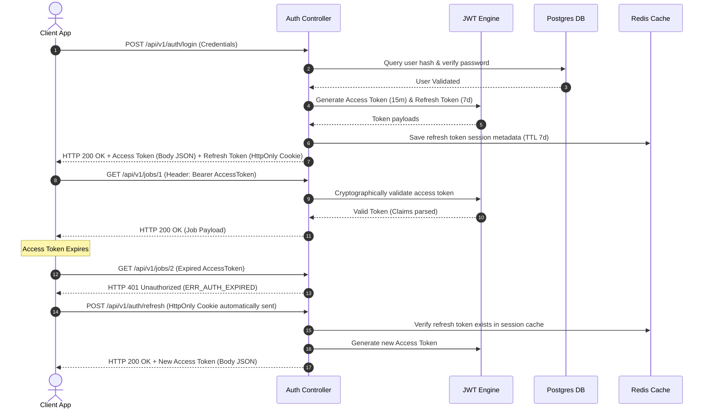
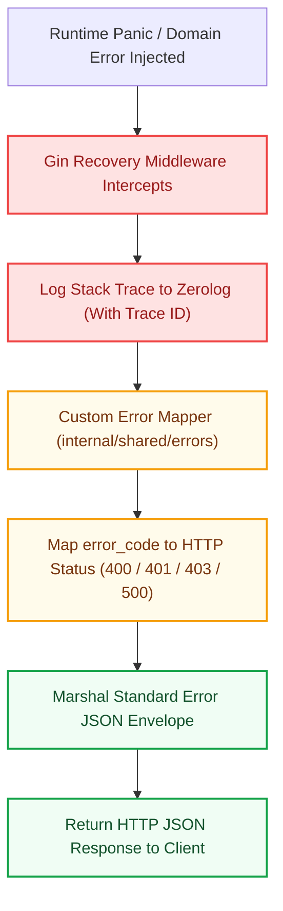

# API Architecture Specification: Kirmya REST Interface
**Document Identifier:** PL-AR-07 | **Status:** Approved / Core Reference | **Version:** 1.0.0  
**Authors:** Antigravity AI & Technical Architecture Group | **Date:** July 24, 2026

---

## Document Control & Meta-Information

### Version History
| Version | Date | Author | Description |
| :--- | :--- | :--- | :--- |
| `0.1.0` | 2026-07-20 | Antigravity AI | Initial REST API route layouts. |
| `0.5.0` | 2026-07-22 | Antigravity AI | Integrated pagination schemas, idempotency keys, and error codes. |
| `1.0.0` | 2026-07-24 | Antigravity AI | Completed full API Architecture Specification for Board approval. |

### Document Distribution
* **Product Strategy Group**: Functional API mappings verification.
* **Engineering Leads**: API implementation standards.
* **DevOps Team**: Route proxies and WAF rule definitions.
* **Security & Compliance**: Audit table logging compliance checks.

---

## 1. Related Documents
- [00-documentation-standards.md](file:///c:/Users/PRASHANTH/Documents/real/my_project/docs/product/00-documentation-standards.md)
- [01-system-architecture.md](file:///c:/Users/PRASHANTH/Documents/real/my_project/docs/architecture/01-system-architecture.md)
- [02-modular-monolith-architecture.md](file:///c:/Users/PRASHANTH/Documents/real/my_project/docs/architecture/02-modular-monolith-architecture.md)
- [03-module-boundaries.md](file:///c:/Users/PRASHANTH/Documents/real/my_project/docs/architecture/03-module-boundaries.md)
- [04-backend-architecture.md](file:///c:/Users/PRASHANTH/Documents/real/my_project/docs/architecture/04-backend-architecture.md)
- [05-frontend-architecture.md](file:///c:/Users/PRASHANTH/Documents/real/my_project/docs/architecture/05-frontend-architecture.md)

---

## 2. Dependencies
- Routes align with modular package layouts defined in [PL-AR-004 Backend Architecture Blueprint](file:///c:/Users/PRASHANTH/Documents/real/my_project/docs/architecture/04-backend-architecture.md).
- Access validation rules conform to the role mappings in [PL-PD-012 Roles & Permissions](file:///c:/Users/PRASHANTH/Documents/real/my_project/docs/product/12-roles-permissions.md).

---

## 3. Purpose
This document establishes the official API architecture for the Kirmya Professional Ecosystem. It specifies the REST standards, URI conventions, JSON payload schemas, error formats, validation rules, and future protocol roadmaps, ensuring unified client-server communication.

---

## 4. Scope
- **In-Scope**: REST API standards, URI routing, JSON envelopes, validation errors format, idempotency mechanisms, deprecation headers, 16 modules REST endpoints, and OpenAPI 3.1 definitions.
- **Out-of-Scope**: Code-level Gin routing registrations and database connection pool queries.

---

## 5. Objectives
- Define a uniform REST API standard with versioned paths (`/api/v1/`).
- Standardize response envelopes and error payloads with descriptive error codes.
- Implement rate limiting, idempotency validation, and asynchronous status polling.
- Document endpoints for all 16 modules.
- Create 4 detailed Mermaid diagrams tracing request lifecycle, authentication, service interaction, and error handling.

---

## 6. Executive Summary
Kirmya's client-server communications are managed via a versioned, secure, and performant **REST API** using **JSON** as the primary payload format. The API architecture is designed to support high perceived speed, type safety, and microservices extraction readiness. 

All endpoints use plural resources, lowercase kebab-case paths, and standard HTTP verbs. Success responses are encapsulated in standard metadata envelopes, and validation and system failures are returned in a uniform JSON error schema with distinct error codes. 

We implement rate limiting, idempotency checks for non-GET write operations, and asynchronous status tracking for long-running processes. This document specifies the endpoints, security rules, deprecation headers, and future gRPC/GraphQL roadmaps for all 16 modules.

---

## 7. Detailed Content: API Architecture Specifications

### 7.1 API standards & URI Conventions
- **Base URI Path**: All API endpoints must reside under a versioned prefix path:
  `/api/v1/[resource]` (e.g., `/api/v1/job-listings`).
- **Resource Naming**: Must use plural nouns and lowercase kebab-case parameters:
  - *Correct*: `GET /api/v1/company-profiles`
  - *Incorrect*: `GET /api/v1/companyProfile`, `GET /api/v1/company_profiles`, `GET /api/v1/company`
- **HTTP Verbs Mapping**:
  - `GET`: Retrieve resources. GET requests must remain idempotent and contain no payload body.
  - `POST`: Create a new resource or execute a functional command (e.g. login, verify).
  - `PUT`: Replace an entire resource.
  - `PATCH`: Apply partial updates to an existing resource.
  - `DELETE`: Remove a resource or transition status to closed/inactive.

### 7.2 API Request Flow Diagram
Traces the execution path of a REST request from the client browser to the database, detailing intermediate middleware and service boundaries.



---

### 7.3 Response Envelope Standards
All success responses must be returned in a standard JSON envelope. This structure simplifies client-side response parsing and guarantees consistent metadata formatting:

```json
{
  "success": true,
  "data": {
    "id": "7fbe8d92-231a-4c28-98f5-19a9a3b83ef2",
    "title": "Senior Go Engineer",
    "status": "active"
  },
  "metadata": {
    "timestamp": "2026-07-24T23:44:00Z",
    "trace_id": "a9e8f7d6-c5b4-a321-0987-6543210fedcba",
    "language": "en"
  }
}
```

#### Pagination Envelope (Cursor-based)
For high-frequency lists, cursor-based pagination is required to prevent offset performance degradation:
```json
{
  "success": true,
  "data": [
    { "id": "123", "title": "Job 1" }
  ],
  "pagination": {
    "limit": 10,
    "has_more": true,
    "starting_after": "123",
    "ending_before": null
  },
  "metadata": {
    "timestamp": "2026-07-24T23:44:00Z",
    "trace_id": "trace-id-uuid"
  }
}
```

---

### 7.4 Authentication Flow Diagram
Illustrates how JWT tokens are issued, sent in HTTP Bearer headers, and silently refreshed using HttpOnly cookie validation:



---

### 7.5 Error Response Mappings
All errors must return a standard error JSON envelope, preventing raw trace leakage and aligning with standard error codes:

```json
{
  "success": false,
  "error": {
    "error_code": "ERR_VALIDATION_FAILED",
    "message": "Input validation failed for job listing payload",
    "details": [
      {
        "field": "title",
        "issue": "Title must exceed 5 characters"
      }
    ]
  },
  "metadata": {
    "timestamp": "2026-07-24T23:44:00Z",
    "trace_id": "trace-uuid"
  }
}
```

#### Error Handling Flow Diagram
Shows the error boundary transition inside the Go monolith, intercepting panics and mapping domain exceptions to JSON error envelopes:



#### HTTP Status Codes Usage Policy

| HTTP Status | Target Usage | Example Error Code |
| :--- | :--- | :--- |
| **200 OK** | Successful GET, PUT, PATCH operations. | None |
| **201 Created**| Successful POST creation. | None |
| **202 Accepted**| Asynchronous long-running process initiated. | None |
| **400 Bad Request**| Client-side validation failure. | `ERR_VALIDATION_FAILED` |
| **401 Unauthorized**| Missing or expired authentication token. | `ERR_AUTH_EXPIRED` |
| **403 Forbidden**| User lacks required role permissions. | `ERR_INSUFFICIENT_PERMISSIONS` |
| **404 Not Found**| Resource ID does not exist in tables. | `ERR_RESOURCE_NOT_FOUND` |
| **409 Conflict**| Database constraint violation (e.g. duplicate email). | `ERR_DUPLICATE_RESOURCE` |
| **429 Too Many Requests**| Rate limiting limit reached. | `ERR_RATE_LIMIT_EXCEEDED` |
| **500 Server Error**| Database unreachable, unhandled panic. | `ERR_INTERNAL_SERVER_ERROR` |

---

### 7.6 State Controls: Rate Limiting & Idempotency
- **Rate Limiting Headers**: Every API response must include standard rate-limiting metadata headers:
  - `X-RateLimit-Limit`: Maximum requests per window (e.g., `100`).
  - `X-RateLimit-Remaining`: Requests remaining in the current window.
  - `X-RateLimit-Reset`: UTC Unix timestamp indicating when the pool resets.
- **Idempotency Keys**: For non-GET write operations (e.g. submitting a payment, hiring a candidate), client requests must pass an `Idempotency-Key` header containing a unique UUID. The server caches this key and the resulting response in Redis for 24 hours. If a duplicate request is received, the server returns the cached response directly, preventing duplicate transactions.

---

### 7.7 Service Interaction Diagram
Shows how REST API routing triggers synchronous in-memory interface calls or asynchronous event broadcasts over NATS JetStream topics:

```mermaid
graph TD
    classDef http fill:#eff6ff,stroke:#2563eb,stroke-width:2px;
    classDef sync fill:#f5f3ff,stroke:#8b5cf6,stroke-width:1px;
    classDef async fill:#fff7ed,stroke:#ea580c,stroke-width:2px;

    Client["Client Browser"] --> |POST /api/v1/jobs| JobController["Jobs Controller"]:::http
    
    subgraph ServiceBoundaries ["Monolith Service Layer"]
        JobController --> |1. Process Listing| JobService["JobService"]:::sync
        JobService --> |2. Verify Recruiter Seat (Go Interface Sync)| CompanyService["CompanyService"]:::sync
        JobService --> |3. DB Commit| JobRepo["JobRepository (PostgreSQL)"]:::sync
    end

    JobService --> |4. Insert Event Outbox| OutboxWorker["Outbox Background Worker"]:::async
    OutboxWorker --> |5. Publish Event JSON| NATS["NATS JetStream topic: kirmya.jobs.listing.created"]:::async
    
    NATS -.-> |6. Consume Async| SearchService["SearchService"]:::async
    NATS -.-> |6. Consume Async| NotificationService["NotificationService"]:::async
```

---

### 7.8 API Endpoints Mappings by Module

#### 1. Authentication
- `POST /api/v1/auth/login` (Standard credentials auth, returns access token + sets refresh cookie)
- `POST /api/v1/auth/logout` (Invalidates active session)
- `POST /api/v1/auth/refresh` (Triggers token refresh validation)
- `POST /api/v1/auth/mfa/verify` (Validates MFA code)

#### 2. Users
- `POST /api/v1/users` (Account creation)
- `GET /api/v1/users/me` (Fetch current identity context)
- `PUT /api/v1/users/me` (Update account details)

#### 3. Profiles
- `GET /api/v1/profiles/me` (Fetch authenticated user profile details)
- `GET /api/v1/profiles/:userId` (Fetch public profile with visibility checks)
- `PUT /api/v1/profiles/me` (Update profile headline, summary, availability, volunteering, publications, licenses)
- `POST /api/v1/profiles/me/skills` (Add skill node)
- `DELETE /api/v1/profiles/me/skills/:id` (Delete skill node)
- `POST /api/v1/profiles/me/certifications` (Add certification)
- `DELETE /api/v1/profiles/me/certifications/:id` (Delete certification)
- `POST /api/v1/profiles/me/projects` (Add portfolio project)
- `DELETE /api/v1/profiles/me/projects/:id` (Delete portfolio project)
- `POST /api/v1/profiles/me/languages` (Add language)
- `DELETE /api/v1/profiles/me/languages/:id` (Delete language)
- `POST /api/v1/profiles/me/achievements` (Add achievement/award)
- `DELETE /api/v1/profiles/me/achievements/:id` (Delete achievement/award)
- `GET /api/v1/profiles/me/preferences` (Fetch visibility preferences)
- `PUT /api/v1/profiles/me/preferences` (Update visibility preferences)

#### 4. Companies
- `POST /api/v1/companies` (Initialize corporate page)
- `GET /api/v1/companies/:slug` (Get company public brand details)
- `POST /api/v1/companies/:id/seats` (Allocate seats to team recruiters)

#### 5. Jobs
- `POST /api/v1/jobs` (Create job listing)
- `GET /api/v1/jobs/:id` (Fetch job details)
- `PUT /api/v1/jobs/:id` (Modify listing parameters)
- `DELETE /api/v1/jobs/:id` (Cancel listing)

#### 6. Applications
- `POST /api/v1/applications` (Apply for a job)
- `GET /api/v1/applications/:id` (Fetch application status details)
- `PATCH /api/v1/applications/:id/stage` (Transition application status)

#### 7. Networking
- `GET /api/v1/networking/recommendations` (Retrieve candidate connection recommendations and mutual connections count)
- `GET /api/v1/networking/connections` (Retrieve list of active professional connections)
- `GET /api/v1/networking/requests` (Retrieve list of pending incoming invitation requests)
- `POST /api/v1/networking/requests` (Send a professional connection invitation to a user)
- `PUT /api/v1/networking/requests/:id` (Accept or reject a pending connection invitation)
- `POST /api/v1/networking/blocks` (Block a user to restrict communication and suggestions)
- `DELETE /api/v1/networking/blocks/:userId` (Unblock a user)

#### 8. Communities
- `GET /api/v1/communities` (Discover communities supporting category, location, and privacy filters)
- `POST /api/v1/communities` (Create a new professional community workspace)
- `POST /api/v1/communities/:id/join` (Submit membership join request to a community)
- `PUT /api/v1/communities/:id/memberships` (Approve or reject candidate pending join requests)
- `PUT /api/v1/communities/:id/roles` (Update/Assign user community roles - owner, admin, moderator, member)
- `POST /api/v1/communities/:id/posts` (Publish a discussion post in the community feed)
- `GET /api/v1/communities/:id/posts` (List posts in the community feed)
- `DELETE /api/v1/communities/:id/posts/:postId` (Moderate and delete a post from the community feed)
- `POST /api/v1/communities/reports` (Flag and report a post for moderation)

#### 9. Messaging
- `GET /api/v1/messaging/ws` (Upgrade HTTP connection to a real-time WebSocket connection session)
- `GET /api/v1/messaging/conversations` (Retrieve user chat conversations list and previews)
- `POST /api/v1/messaging/conversations` (Create or retrieve conversation linking two users)
- `GET /api/v1/messaging/conversations/:id/messages` (Retrieve chat history logs inside conversation)
- `POST /api/v1/messaging/conversations/:id/messages` (Send a message and broadcast it to the active socket session)

#### 10. Freelancing
- `POST /api/v1/freelancing/proposals` (Submit proposal bid)
- `POST /api/v1/freelancing/contracts` (Generate formal contract)
- `POST /api/v1/freelancing/milestones/:id/fund` (Lock funds in escrow)

#### 11. Search
- `GET /api/v1/search/jobs` (Query jobs)
- `GET /api/v1/search/candidates` (Query candidates using pgvector embeddings)

#### 12. AI
- `POST /api/v1/ai/copilot/chat` (Send chat payload for text streaming responses)
- `POST /api/v1/ai/interviews/session` (Initialize voice interview WebRTC connection)

#### 13. Notifications
- `GET /api/v1/notifications` (Fetch active notification alerts)
- `PATCH /api/v1/notifications/read` (Mark notifications as read)

#### 14. Analytics
- `GET /api/v1/analytics/drs/:profile_id` (Fetch historical DRS scores)

#### 15. Admin
- `POST /api/v1/admin/moderation` (Moderate content flags)
- `GET /api/v1/admin/audits` (Fetch system audit logs)

#### 16. Settings
- `GET /api/v1/settings` (Fetch preferences)
- `PUT /api/v1/settings` (Update settings)

#### 17. Resumes
- `GET /api/v1/resumes` (List all resumes for the user)
- `POST /api/v1/resumes` (Create a new resume with default sections)
- `GET /api/v1/resumes/:id` (Fetch resume details, sections content, and ATS score)
- `PUT /api/v1/resumes/:id` (Update resume sections, trigger ATS score update, and save a version snapshot)
- `DELETE /api/v1/resumes/:id` (Delete resume and related versions)
- `POST /api/v1/resumes/:id/duplicate` (Duplicate resume and all sub-sections content)
- `PUT /api/v1/resumes/:id/default` (Mark a resume as default)
- `GET /api/v1/resumes/:id/versions` (Fetch version history checkpoints)

#### 18. Recommendations
- `GET /api/v1/recommendations` (Retrieve candidate personalized job matches and match breakdowns)
- `POST /api/v1/recommendations/:id/feedback` (Log candidate feedback actions like, dislike, or dismiss)
- `GET /api/v1/recommendations/preferences` (Fetch target job titles, locations, and salary expectation parameters)
- `PUT /api/v1/recommendations/preferences` (Update target job titles, locations, and salary parameters to trigger match updates)

---

### 7.9 API Deprecation & Compatibility Policies
- **Deprecation Headers**: When an API endpoint is scheduled for removal, response headers must inform consumers:
  - `Deprecation: true` (indicates the endpoint is deprecated).
  - `Sunset: 2026-12-31T23:59:59Z` (indicates when the endpoint will be turned off).
  - `Link: </api/v2/jobs>; rel="successor-version"` (provides the successor API path).
- **Backward Compatibility**: Breaking changes (e.g. removing fields, renaming paths) require incrementing the API path version (e.g. `/api/v1` to `/api/v2`). Backward-compatible changes (e.g. adding fields) are deployed in minor releases without path updates.

---

### 7.10 Future Protocol Extraction Strategy
As Kirmya grows, the REST API gateway can transition to alternative protocols without refactoring downstream modular logic:
- **GraphQL Migration**: To support frontend views that aggregate data from multiple modules, Kirmya can introduce a GraphQL gateway (e.g., Apollo/BFF pattern) to resolve complex queries in a single round-trip. The GraphQL resolvers query backend services using Go interfaces.
- **gRPC Migration**: Internal, synchronous communication between extracted microservices can migrate to gRPC, replacing in-memory Go interfaces. Protopuf schemas are compiled to generate gRPC client code, maintaining type safety across independent microservice networks.

---

## 16. Functional Requirements Mapping
The API conventions map directly to Kirmya's functional requirements:
- **FR-AUTH-MFA**: Supported by `POST /api/v1/auth/mfa/verify` code checks.
- **FR-FREE-ESCROW**: Managed by `POST /api/v1/freelancing/milestones/:id/fund` payment gateway endpoints.

---

## 17. Non-Functional Requirements Verification
- **NFR-PER-005 (Latency)**: Enforced by compiling Gin routers, routing read operations to PostgreSQL replicas, and caching responses in Redis.
- **NFR-SCA-004 (Concurrency)**: Messaging endpoints utilize lightweight REST allocations, with long-running operations offloaded to NATS background workers.

---

## 18. Business Rules Mapping
- **BR-AUTH-SEATS**: Evaluated in `POST /api/v1/companies/:id/seats` before recruiter sourcing access is granted.
- **BR-FREE-DISPUTES**: Tracked in `/api/v1/admin/moderation` using dispute templates that reference the original contract.

---

## 19. Assumptions
- Next.js clients support standard HTTP Cookie header exchanges.
- Cloudflare gateways terminate TLS 1.3 encryption and forward requests to backend API handlers.

---

## 20. Constraints
- All write requests must communicate payloads using JSON formatting.
- File uploads are restricted to `POST /api/v1/media/upload`, which accepts multipart forms. Other endpoints reference media using UUIDs.

---

## 21. Risks
- **Data Leakage in Errors**: Raw stack traces or SQL syntax errors could be returned to clients. *Mitigation*: Ensure the Gin Recovery middleware intercepts panics and returns a generic JSON error envelope.
- **API Version Proliferation**: Maintaining multiple API versions (v1, v2, v3) increases maintenance costs. *Mitigation*: Set clear sunset timelines (maximum 12 months) for deprecated APIs.

---

## 22. Open Questions
- What translation tool will manage localization strings?
- Will the mobile application use a Capacitor wrapper or a dedicated React Native repository?

---

## 23. Future Improvements
- Move the search synchronization from NATS event subscriptions to change data capture (CDC) pipelines.
- Integrate an API Gateway (e.g. Kong, Envoy) to centralize rate limiting and route proxying.

---

## 24. Acceptance Criteria
The API implementation must meet these standards to be marked complete:

| Rule | Verification Checkpoint | Target |
| :--- | :--- | :--- |
| **JSON Envelopes** | All responses use standard success or error envelopes. | 100% compliance |
| **HTTP Verbs** | Routing paths comply with REST conventions. | 100% compliance |
| **Idempotency** | Idempotency keys are validated for write operations. | Mandatory |
| **Deprecation** | Deprecation headers are included for outdated endpoints. | Pass |

---

## 25. Success Metrics
- Average API request latencies (P95) remain under 200ms.
- 100% of API endpoints are documented using OpenAPI 3.1 specifications.

---

## 26. Glossary
- **OpenAPI 3.1**: A standard specification for defining REST APIs.
- **Idempotency**: A property of operations where making multiple identical requests has the same effect as making a single request.
- **SSO**: Single Sign-On, a session and user authentication service that permits a user to use one set of login credentials to access multiple applications.

---

## 27. References
- [OpenAPI 3.1.0 Specification](https://spec.openapis.org/oas/v3.1.0)
- [RESTful API Design Best Practices](https://learn.microsoft.com/en-us/azure/architecture/best-practices/api-design)
- [RFC 6238 TOTP Standard](https://datatracker.ietf.org/doc/html/rfc6238)

---

## 28. Revision History
| Version | Date | Author | Description |
| :--- | :--- | :--- | :--- |
| `1.0.0` | 2026-07-24 | Antigravity AI | Finished full Kirmya API Architecture specification. |
