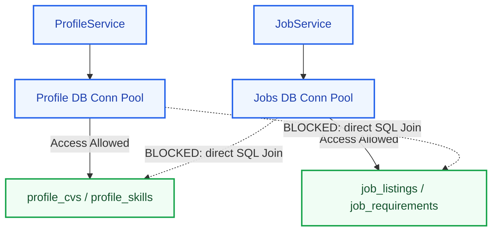
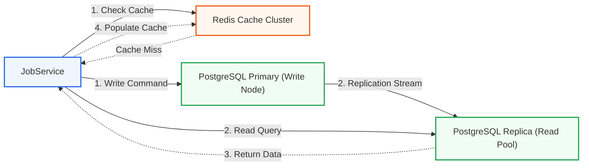
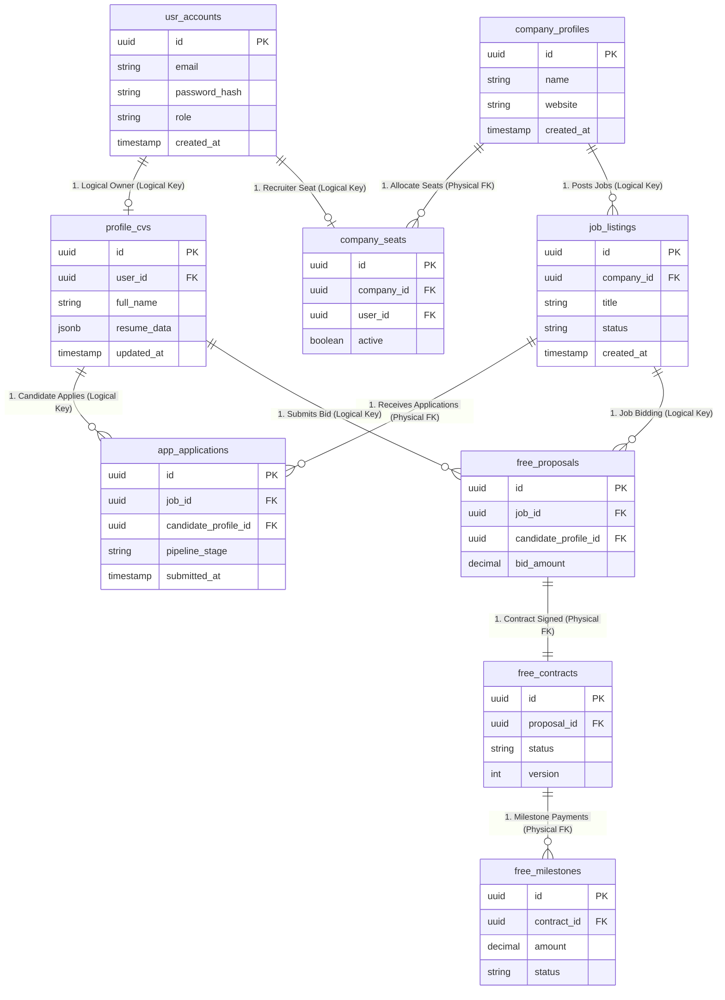

# Database Architecture Blueprint: Kirmya Enterprise Data Tier
**Document Identifier:** PL-AR-08 | **Status:** Approved / Core Reference | **Version:** 1.0.0  
**Authors:** Antigravity AI & Technical Architecture Group | **Date:** July 24, 2026

---

## Document Control & Meta-Information

### Version History
| Version | Date | Author | Description |
| :--- | :--- | :--- | :--- |
| `0.1.0` | 2026-07-20 | Antigravity AI | Initial logical schema prefixes outline. |
| `0.5.0` | 2026-07-22 | Antigravity AI | Integrated UUID v7 strategies and partitioning models. |
| `1.0.0` | 2026-07-24 | Antigravity AI | Completed full Database Architecture Blueprint for Board approval. |

### Document Distribution
* **Product Strategy Group**: Functional data entity verification.
* **Engineering Leads**: Schema standards compliance.
* **DevOps Team**: Replication configurations and connection limits.
* **Security & Compliance**: Field encryption verification.

---

## 1. Related Documents
- [00-documentation-standards.md](file:///c:/Users/PRASHANTH/Documents/real/my_project/docs/product/00-documentation-standards.md)
- [01-system-architecture.md](file:///c:/Users/PRASHANTH/Documents/real/my_project/docs/architecture/01-system-architecture.md)
- [02-modular-monolith-architecture.md](file:///c:/Users/PRASHANTH/Documents/real/my_project/docs/architecture/02-modular-monolith-architecture.md)
- [03-module-boundaries.md](file:///c:/Users/PRASHANTH/Documents/real/my_project/docs/architecture/03-module-boundaries.md)
- [04-backend-architecture.md](file:///c:/Users/PRASHANTH/Documents/real/my_project/docs/architecture/04-backend-architecture.md)

---

## 2. Dependencies
- Logical tables map directly to feature namespaces in [PL-AR-003 Module Boundaries Specification](file:///c:/Users/PRASHANTH/Documents/real/my_project/docs/architecture/03-module-boundaries.md).
- Write concurrency rules conform to [PL-AR-004 Backend Architecture Blueprint](file:///c:/Users/PRASHANTH/Documents/real/my_project/docs/architecture/04-backend-architecture.md).

---

## 3. Purpose
This document defines the database architecture for the Kirmya Professional Ecosystem. It specifies the logical schemas, partitioning rules, caching strategies, and scaling configurations, ensuring data integrity while keeping the database ready for future microservices splits.

---

## 4. Scope
- **In-Scope**: PostgreSQL logical schema designs, table prefixes, primary/foreign key conventions, indexing rules, partitioning schemas, locking patterns, and backup/restore guidelines for the 13 specified domains.
- **Out-of-Scope**: Physical SQL migration scripts and local host configurations.

---

## 5. Objectives
- Establish logical schema isolation using table prefixes to prevent database-level coupling.
- Implement time-sortable UUID v7 primary keys to optimize index efficiency.
- Enforce optimistic concurrency control to manage concurrent updates.
- Design database routing patterns that split read and write queries.
- Create 4 detailed Mermaid diagrams modeling data flow, ER relationships, schema ownership, and access boundaries.

---

## 6. Executive Summary
Kirmya utilizes **PostgreSQL** as its core relational database. To support a **Modular Monolith** architecture that is ready for future microservices extraction, database schemas are separated logically using table name prefixes. 

Direct cross-module SQL joins and database-level foreign keys are prohibited; logical relationships are maintained by storing reference IDs in the application layer. Primary keys are configured as time-sortable UUID v7 hashes, and write conflicts are prevented using optimistic concurrency control. 

Read queries are routed to PostgreSQL replicas, and active caching is managed using Redis. This document details the logical schemas, indexing rules, backup strategies, and future sharding roadmaps for the 13 system domains.

---

## 7. Detailed Content: Database Architecture Specifications

### 7.1 Database Architecture Philosophy
Starting with a single shared database instance reduces operational cost and simplifies transactions. However, to keep the system ready for a future microservices split, we implement logical schema isolation:
- **No Shared Tables**: Modules cannot write to or read from another module's tables.
- **No Database Joins**: Cross-module queries must be executed in the application layer by calling services.
- **No Physical Foreign Keys**: Database-level foreign keys across modules are prohibited; relationships are maintained using logical reference IDs (e.g. `user_id` stored in a jobs table).

### 7.2 Database Access Rules Diagram
This diagram illustrates how connection pools are configured, showing that modules can access only their designated logical tables:

---

### 7.3 Data Flow Architecture (Read vs. Write)
We use a primary-replica topology to scale database capacity. Write requests route to the primary database, while read requests route to replicas or Redis cache pools.

---

### 7.4 High-Level Entity Relationship Diagram (ERD)
This logical ERD shows the core tables and relationships across Kirmya's domains. Relationships across domain boundaries use dotted lines, indicating logical references rather than physical database-level foreign key constraints.

---

### 7.5 Database Access Rules & Configuration
1. **UUID Strategy**: All primary keys must use **UUID v7** (128-bit time-ordered UUIDs). Unlike random UUID v4, UUID v7 is sequentially ordered by creation timestamp, preventing index fragmentation on B-Tree inserts.
2. **Concurrency Control**: Write-heavy transactional tables (e.g. `free_contracts`, `company_seats`) include a `version` column to support optimistic concurrency control:
   `UPDATE free_contracts SET status = 'active', version = version + 1 WHERE id = :id AND version = :readVersion;`
3. **Soft Deletes**: Soft deletes are managed using a `deleted_at` timestamp. This preserves data for analytics and historical records (e.g. in the communities social graph) while excluding deleted rows from standard queries.
4. **Auditing**: Sensitive transactions (e.g., changes to corporate roles or milestone payments) must log audit details to the `admin_audits` table within the same database transaction.

---

### 7.6 Logical Schemas Mappings by Domain

#### 1. Identity Domain (Prefix: `auth_` / `usr_`)
Stores credentials, login session states, and account settings.
- `auth_sessions`: UUID v7 primary key, user reference ID, access token hash, expiration time.
- `auth_mfa_secrets`: UUID v7 primary key, user reference ID, encrypted TOTP secret, backup codes.
- `usr_accounts`: UUID v7 primary key, email, password hash, role, status.
- `usr_roles`: UUID v7 primary key, role code, permission tags array.

#### 2. Profiles Domain (Prefix: `profile_`)
Stores candidate CVs, portfolio links, and skill graphs.
- `profile_cvs`: UUID v7 primary key, user reference ID, full name, profile image, updated timestamp.
- `profile_skills`: UUID v7 primary key, profile reference ID, skill name, verification status.
- `profile_portfolios`: UUID v7 primary key, profile reference ID, project name, asset media reference ID.

#### 3. Companies Domain (Prefix: `company_`)
Stores company profiles and recruiter seats.
- `company_profiles`: UUID v7 primary key, company name, domain, logo reference ID, status.
- `company_seats`: UUID v7 primary key, company reference ID, user reference ID, active status.

#### 4. Jobs Domain (Prefix: `job_`)
Stores capabilities-first job listings and required competencies.
- `job_listings`: UUID v7 primary key, company reference ID, title, required DRS level, status.
- `job_requirements`: UUID v7 primary key, job reference ID, skill name, minimum proficiency.

#### 5. Applications Domain (Prefix: `app_`)
Tracks candidate job application pipelines.
- `app_applications`: UUID v7 primary key, job reference ID, candidate profile reference ID, stage.
- `app_history`: UUID v7 primary key, application reference ID, previous stage, new stage, updated timestamp.

#### 6. Communities Domain (Prefix: `comm_`)
Stores Guild structures and peer-review history.
- `comm_guilds`: UUID v7 primary key, name, category, created timestamp.
- `comm_members`: UUID v7 primary key, guild reference ID, profile reference ID, role.
- `comm_reviews`: UUID v7 primary key, candidate profile reference ID, reviewer profile reference ID, skill node, score.

#### 7. Messaging Domain (Prefix: `msg_`)
Stores rooms and message logs.
- `msg_rooms`: UUID v7 primary key, room type, created timestamp.
- `msg_payloads`: UUID v7 primary key, room reference ID, sender reference ID, message text, sent timestamp.
- `msg_receipts`: UUID v7 primary key, message reference ID, reader reference ID, read timestamp.

#### 8. Freelancing Domain (Prefix: `free_`)
Stores proposals, contracts, milestones, and escrow ledger records.
- `free_proposals`: UUID v7 primary key, job reference ID, freelancer profile reference ID, bid amount, timeline.
- `free_contracts`: UUID v7 primary key, proposal reference ID, status, version (optimistic lock key).
- `free_milestones`: UUID v7 primary key, contract reference ID, amount, status, version.
- `free_escrows`: UUID v7 primary key, milestone reference ID, transaction hash, status, release timestamp.

#### 9. AI Domain (Prefix: `ai_`)
Stores conversation logs and configurations for Kirmya Copilot.
- `ai_sessions`: UUID v7 primary key, user reference ID, session type, created timestamp.
- `ai_interactions`: UUID v7 primary key, session reference ID, speaker (user/assistant), message text, timestamp.

#### 10. Notifications Domain (Prefix: `notify_`)
Stores templates and delivery logs.
- `notify_templates`: UUID v7 primary key, template name, language (en/ar), content body.
- `notify_logs`: UUID v7 primary key, recipient reference ID, channel (email/SMS/push), status, timestamp.

#### 11. Analytics Domain (Prefix: `analyt_`)
Stores system metrics and DRS calculations.
- `analyt_metrics`: UUID v7 primary key, event name, user reference ID, event metadata JSONB.
- `analyt_drs`: UUID v7 primary key, profile reference ID, calculated DRS score, updated timestamp.

#### 12. Administration Domain (Prefix: `admin_`)
Stores moderation tickets and audit logs.
- `admin_tickets`: UUID v7 primary key, ticket type, reporter reference ID, subject reference ID, status.
- `admin_audits`: UUID v7 primary key, executor reference ID, action description, timestamp.

#### 13. Settings Domain (Prefix: `set_`)
Stores user-specific configuration preferences.
- `set_user_preferences`: UUID v7 primary key, user reference ID, preferences JSONB.

---

### 7.7 Normalization vs. Denormalization Strategy
- **Normalization (3NF)**: Relational entity tables (e.g. `usr_accounts`, `free_contracts`, `company_seats`) are normalized to Third Normal Form (3NF) to ensure transactional consistency and prevent update anomalies.
- **Denormalization (JSONB)**: Semi-structured, polymorphic, or read-heavy data (e.g. resume work histories, custom application questionnaires, user preferences) is denormalized into PostgreSQL JSONB fields. This allows fields to evolve dynamically without requiring schema migrations.

---

### 7.8 Future Database Sharding Strategy
As the candidate database scales beyond 10 million rows, the database can transition from a single primary instance to a sharded architecture:
- **Sharding Key Selection**: Table records are partitioned horizontally using a sharding key (e.g. `company_id` for corporate tables, `user_id` for candidate tables).
- **Physical Distribution**: Shards are distributed across separate physical database nodes. An application-level router (e.g. Citus Data extension or Go database connection routers) inspects the sharding key to direct queries to the correct database node, allowing the system to scale horizontally.

---

### 7.9 Future Search Indexing Strategy
To offload high-frequency search queries from the primary transactional database, we replicate data to OpenSearch:
- **WAL-Based Change Data Capture (CDC)**: A change data capture agent (e.g., Debezium) monitors PostgreSQL Write-Ahead Logs (WAL) in real time.
- **Replication**: The agent captures insert/update/delete operations on transactional tables (e.g. `job_listings`, `profile_cvs`) and pushes the changes asynchronously to **OpenSearch** indexes, ensuring search replica consistency without impacting PostgreSQL performance.

---

## 16. Functional Requirements Mapping
- **FR-AUTH-MFA**: Supported by the `auth_mfa_secrets` table.
- **FR-FREE-ESCROW**: Tracks transactions using the `free_escrows` milestone ledger table.

---

## 17. Non-Functional Requirements Verification
- **NFR-AV-002 (DB Uptime SLO >= 99.95%)**: Achieved using a primary-replica topology with automatic failover configured across multiple availability zones.
- **NFR-SCA-003 (Vector Search scale)**: Optimized by creating HNSW cosine distance indexes on `profile_cvs` embedding columns.

---

## 18. Business Rules Mapping
- **BR-AUTH-SEATS**: Verified by checking active records in the `company_seats` table before recruiter sourcing queries are forwarded.
- **BR-FREE-ESCROW**: Enforced by milestone status transitions in `free_milestones` and payment records in the `free_escrows` table.

---

## 19. Assumptions
- PostgreSQL read replicas maintain a replication lag of under 100ms.
- Local NVMe volumes support time-sortable UUID v7 index writes.

---

## 20. Constraints
- Cross-module database joins are prohibited.
- Logical schema tables must use the designated module prefix (e.g. `auth_`, `job_`).

---

## 21. Risks
- **Replication Lag**: A write query on the primary database might not be immediately visible on a read replica. *Mitigation*: Direct critical read queries (e.g. verifying a payment status) to the primary node.
- **Index Overhead**: Too many indexes on write-heavy tables can degrade insert performance. *Mitigation*: Index only primary keys, logical reference keys, and status columns used in query filters.

---

## 22. Open Questions
- What database migration tool (e.g. Golang-Migrate, Liquibase) will manage database schemas?
- What are the storage requirements for archiving historical audit logs?

---

## 23. Future Improvements
- Move the search synchronization from NATS event subscriptions to change data capture (CDC) pipelines.
- Implement database sharding using Citus Data as the dataset grows.

---

## 24. Acceptance Criteria
The database architecture implementation must satisfy these rules:

| Metric | Verification Standard | Target |
| :--- | :--- | :--- |
| **No cross-schema joins** | Verified via code analysis. | 100% compliance |
| **UUID v7 Usage** | All primary keys configure UUID v7 time-ordered hashes. | 100% compliance |
| **No cross-module FKs** | Checked via database schema checks. | 100% compliance |
| **Optimistic Locking** | Transactional tables include a `version` column. | Mandatory |

---

## 25. Success Metrics
- Average database response times remain under 50ms.
- Replica database sync lag remains under 100ms.

---

## 26. Glossary
- **HNSW**: Hierarchical Navigable Small World, an algorithm used to run fast approximate nearest neighbor searches on high-dimensional vectors.
- **3NF**: Third Normal Form, a database schema design pattern that reduces data redundancy and improves transactional consistency.
- **WAL**: Write-Ahead Logging, a standard database technique used to record changes before they are committed to the data files.

---

## 27. References
- [PostgreSQL official documentation](https://www.postgresql.org/docs/)
- [pgvector Extension Guidelines](https://github.com/pgvector/pgvector)
- [Citus Data Sharding Guide](https://www.citusdata.com/)

---

## 28. Revision History
| Version | Date | Author | Description |
| :--- | :--- | :--- | :--- |
| `1.0.0` | 2026-07-24 | Antigravity AI | Finished full Kirmya Database Architecture blueprint. |
