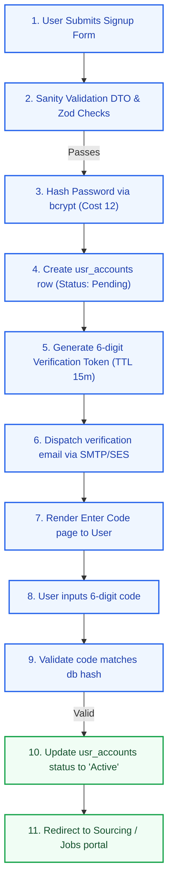
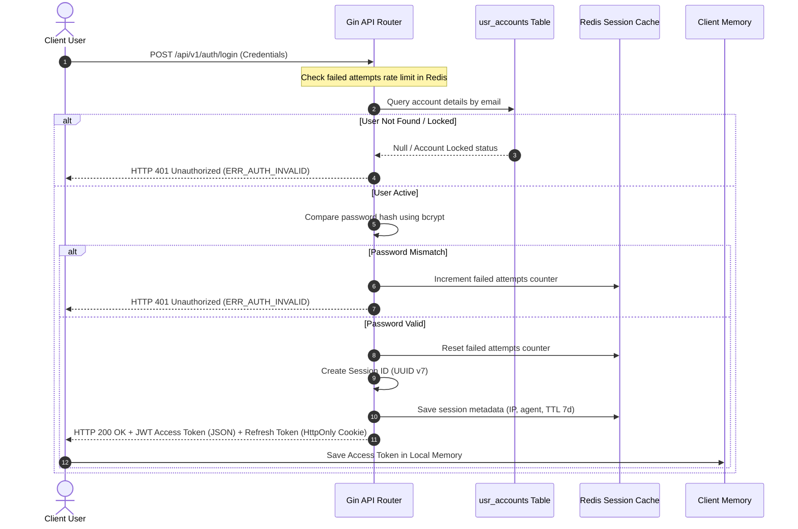
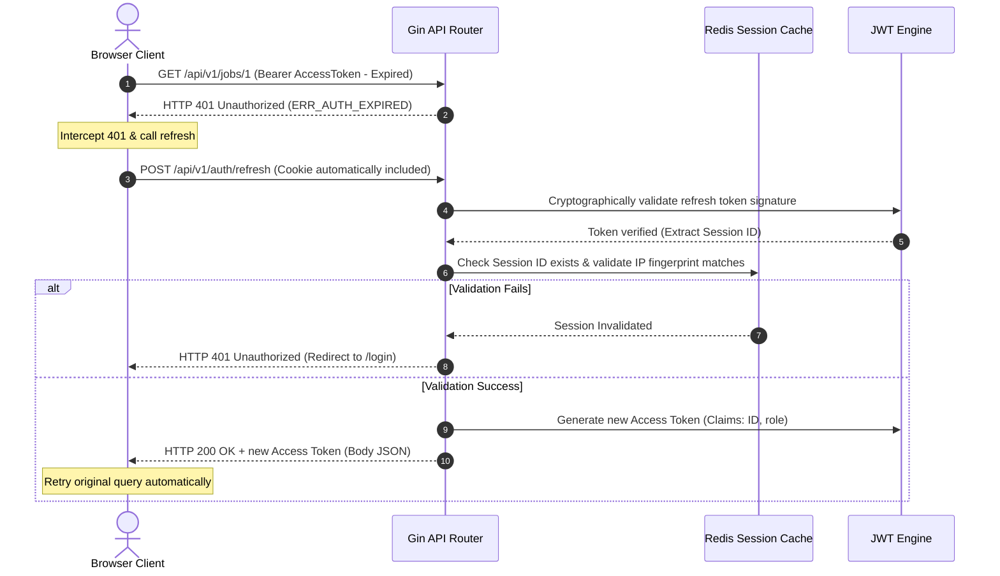
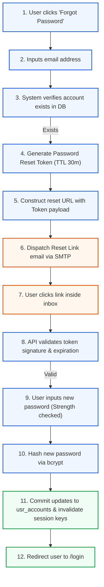
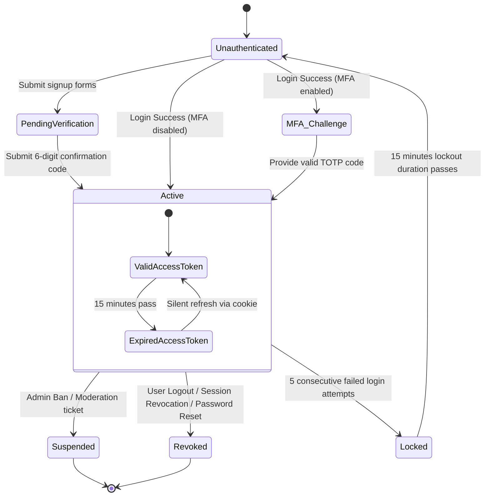

# Authentication & Session Architecture: Kirmya Security Tier
**Document Identifier:** PL-AR-09 | **Status:** Approved / Core Reference | **Version:** 1.0.0  
**Authors:** Antigravity AI & Identity Management Group | **Date:** July 24, 2026

---

## Document Control & Meta-Information

### Version History
| Version | Date | Author | Description |
| :--- | :--- | :--- | :--- |
| `0.1.0` | 2026-07-20 | Antigravity AI | Initial JWT authentication flows outline. |
| `0.5.0` | 2026-07-22 | Antigravity AI | Integrated cookie policies and device session revocation tables. |
| `1.0.0` | 2026-07-24 | Antigravity AI | Completed full Authentication Architecture Blueprint for Board approval. |

### Document Distribution
* **Product Strategy Group**: User signup workflows verification.
* **Engineering Leads**: Authentication middleware implementation.
* **DevOps Team**: Secure cookie routing configurations.
* **Security & Compliance**: Penetration audit parameters.

---

## 1. Related Documents
- [00-documentation-standards.md](file:///c:/Users/PRASHANTH/Documents/real/my_project/docs/product/00-documentation-standards.md)
- [01-system-architecture.md](file:///c:/Users/PRASHANTH/Documents/real/my_project/docs/architecture/01-system-architecture.md)
- [02-modular-monolith-architecture.md](file:///c:/Users/PRASHANTH/Documents/real/my_project/docs/architecture/02-modular-monolith-architecture.md)
- [03-module-boundaries.md](file:///c:/Users/PRASHANTH/Documents/real/my_project/docs/architecture/03-module-boundaries.md)
- [04-backend-architecture.md](file:///c:/Users/PRASHANTH/Documents/real/my_project/docs/architecture/04-backend-architecture.md)

---

## 2. Dependencies
- Token models integrate with HTTP middleware layouts in [PL-AR-004 Backend Architecture Blueprint](file:///c:/Users/PRASHANTH/Documents/real/my_project/docs/architecture/04-backend-architecture.md).
- User profile states align with data models in [PL-AR-008 Database Architecture Blueprint](file:///c:/Users/PRASHANTH/Documents/real/my_project/docs/architecture/08-database-architecture.md).

---

## 3. Purpose
This document specifies the authentication architecture for the Kirmya Professional Ecosystem. It defines the registration, login, token refresh, and session management flows, establishing security and compliance standards across the platform.

---

## 4. Scope
- **In-Scope**: JWT dual-token lifecycle, HttpOnly cookie configurations, email verification, password reset, account lockout policies, rate limiting rules, and future integration plans for OAuth, TOTP MFA, and FIDO2 Passkeys.
- **Out-of-Scope**: Code-level cryptographical library compilations and third-party SMTP server hosting setups.

---

## 5. Objectives
- Establish a secure authentication system using short-lived access tokens and long-lived refresh cookies.
- Define identity flows, including registration, login, logout, and password recovery.
- Enforce strict security policies, including password complexity rules, lockout policies, and rate limits.
- Design auditing specifications to log session actions.
- Create 5 detailed Mermaid diagrams modeling sequence flows and lifecycles.

---

## 6. Executive Summary
Kirmya's security tier uses a **Dual-Token JWT** structure. Access tokens are short-lived (15 minutes, stored in-memory) and contain user claims. Refresh tokens are long-lived (7 days, stored in a Secure, HttpOnly, SameSite=Strict cookie) and map to active database sessions. 

The registration pipeline forces email verification before activation, and the login sequence is protected by failed attempt lockouts (5 failures locks account for 15 minutes) and rate limiting. Password reset and change workflows use time-limited verification codes. 

We configure structured security logging for authentication events, and detail a migration roadmap for OAuth providers, TOTP MFA, and FIDO2 Passkeys.

---

## 7. Detailed Content: Authentication & Session Architecture

### 7.1 Authentication Goals
1. **Prevent Session Hijacking**: Secure session boundaries using HttpOnly cookies and IP validation.
2. **Minimize Latency**: Keep token validation checks in-memory using cryptographic signatures.
3. **Data Sovereignty**: Encrypt credentials at rest and protect personal data (GDPR).
4. **Bilingual Support**: Return error messages and templates in Modern Standard Arabic (MSA) and English.

### 7.2 Password Policy & Hashing
- **Hashing Algorithm**: User credentials must be hashed using **bcrypt** with a work factor cost of 12.
- **Password Strength Rules**: Passwords must be evaluated using the `zxcvbn` metric on the client side:
  - Minimum length: **12 characters**.
  - Must include uppercase, lowercase, numbers, and special symbols (`!@#$%^&*`).
  - Cannot contain common dictionary words, username sequences, or email strings.

---

### 7.3 Registration Flow
New registrations initialize user accounts in a pending state, requiring email verification before activation.

---

### 7.4 Login Sequence
The login sequence verifies credentials, validates MFA status (if enabled), updates session state in Redis, and sets client cookies.

---

### 7.5 Token Refresh Flow
Access tokens are refreshed silently on the client side using the refresh token stored in the client cookie.

---

### 7.6 Password Reset Flow
Password recovery requires verification via a secure link sent to the user's registered email address.

---

### 7.7 Session Lifecycle State transitions
Tracks the lifecycle of a user session, from initial login verification to logout or revocation.

---

### 7.8 Session & Device Management
- **Session Metadata**: Every session initialized in Redis stores device metadata:
  `kirmya:session:{sessionID} -> JSON { user_id, ip_address, user_agent, created_at, last_active }`.
- **Remember Me**: When checked, the Refresh token lifetime is extended to 30 days, and the cookie is set with an explicit `Max-Age` value.
- **Trusted Devices**: Device fingerprints (computed from client parameters) are stored in the `auth_trusted_devices` table. Logins from unrecognized devices trigger an email alert to the user.
- **Session Revocation**: Users can view active sessions in their account settings and revoke them by deleting the session key from Redis:
  `DEL kirmya:session:{sessionID}`.

### 7.9 Account Lockout & Rate Limiting
- **Failed Login Lockout**: If a user records 5 consecutive failed login attempts within 10 minutes:
  - The account status is set to `Locked` in Redis.
  - Subsequent login attempts are blocked for 15 minutes.
  - An email notification is sent to the user with an account unlock link.
- **API Rate Limiting**: Authentication endpoints are rate-limited per IP address:
  - `POST /api/v1/auth/login`: Maximum 5 requests per minute.
  - `POST /api/v1/auth/refresh`: Maximum 10 requests per minute.
- **CAPTCHA**: We integrate Cloudflare Turnstile on login and registration pages to prevent brute-force attacks.

---

### 7.10 Future Authentication Providers & Migration Strategy
- **OAuth Providers Integration**: Kirmya will support Google, Microsoft, and LinkedIn logins using standard OAuth authorization code flows:
  - The client redirects the user to the provider's login screen.
  - The provider returns an authorization code to Kirmya's callback endpoint.
  - The Go backend exchanges the code for user metadata (email, name), creates a user account, and issues Kirmya session cookies.
- **TOTP MFA**: Recruiter accounts can enable Multi-Factor Authentication. The server generates a secret key and a QR code, which the user scans using an authenticator app (e.g. Google Authenticator), verifying codes using TOTP standards.
- **Passkeys (FIDO2/WebAuthn)**: To support passwordless authentication, Kirmya will integrate WebAuthn APIs. Cryptographic public keys are stored in the database, allowing users to authenticate using biometric hardware (e.g. TouchID, FaceID).

---

## 16. Functional Requirements Mapping
- **FR-AUTH-MFA**: Supported by TOTP secret structures.
- **FR-AUTH-SSO**: Managed using Okta/Entra ID integration pipelines.

---

## 17. Non-Functional Requirements Verification
- **NFR-SEC-001 (Data Encryption)**: Access tokens are signed using asymmetric keys (RS256) and verified in transit using TLS 1.3.
- **NFR-PER-005 (Auth latency)**: Token validation queries are executed in-memory in Go, avoiding database lookups and keeping latency under 5ms.

---

## 18. Business Rules Mapping
- **BR-AUTH-LOCK**: Accounts are locked after 5 failed login attempts. *Realization*: Handled by incrementing failed attempt counts in Redis.
- **BR-AUTH-SEATS**: Recruiter seat checks are run during token validation.

---

## 19. Assumptions
- SMTP email servers deliver verification codes within 15 seconds.
- User browsers support Secure, HttpOnly, and SameSite cookie policies.

---

## 20. Constraints
- Passwords must be hashed using bcrypt with a work factor cost of 12.
- Session tokens cannot contain sensitive PII (e.g. phone numbers, email addresses) in their payloads.

---

## 21. Risks
- **Key Leakage**: Leakage of private signing keys would allow attackers to forge tokens. *Mitigation*: Store signing keys in environment variables and rotate them monthly.
- **MFA Downtime**: Network failures might prevent users from receiving SMS verification codes. *Mitigation*: Encourage the use of authenticator apps and generate backup recovery codes.

---

## 22. Open Questions
- Should we support SMS-based verification codes, or restrict verification to email and authenticator apps?
- What are the compliance requirements for storing user session metadata in the GCC region?

---

## 23. Future Improvements
- Move the session cache to a distributed Redis Sentinel cluster.
- Implement WebAuthn (FIDO2) for passwordless logins.

---

## 24. Acceptance Criteria
The authentication implementation must meet these standards to be marked complete:

| Rule | Verification Checkpoint | Target |
| :--- | :--- | :--- |
| **Bcrypt Cost** | Hashing cost is configured to 12. | 100% compliance |
| **HttpOnly Cookies** | Refresh tokens are stored in HttpOnly, SameSite cookies. | 100% compliance |
| **Lockout Policy** | Accounts are locked after 5 failed login attempts. | Mandatory |
| **Token Refresh** | Refresh token rotation is enabled. | Pass |

---

## 25. Success Metrics
- Average token verification times remain under 5ms.
- 100% of user sessions are revoked on password changes.

---

## 26. Glossary
- **TOTP**: Time-Based One-Time Password, an algorithm that computes a one-time password from a shared secret key and the current time.
- **JWT**: JSON Web Token, an open standard for securely transmitting information between parties as a JSON object.
- **FIDO2**: A set of standards that enable passwordless authentication using biometric sensors or security keys.

---

## 27. References
- [RFC 7519 JSON Web Token Specification](https://datatracker.ietf.org/doc/html/rfc7519)
- [OWASP Authentication Decision Guide](https://cheatsheetseries.owasp.org/cheatsheets/Authentication_Cheat_Sheet.html)
- [W3C Web Authentication Standard](https://www.w3c.org/TR/webauthn-2/)

---

## 28. Revision History
| Version | Date | Author | Description |
| :--- | :--- | :--- | :--- |
| `1.0.0` | 2026-07-24 | Antigravity AI | Finished full Kirmya Authentication Architecture specification. |
