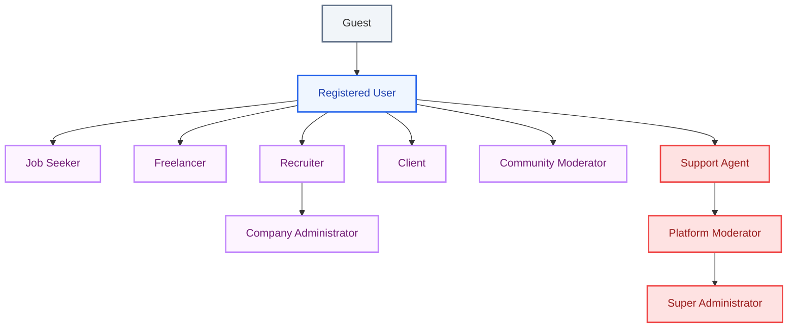
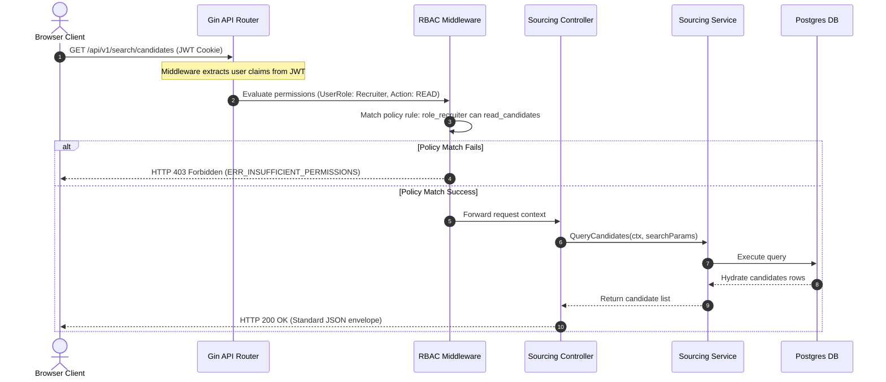
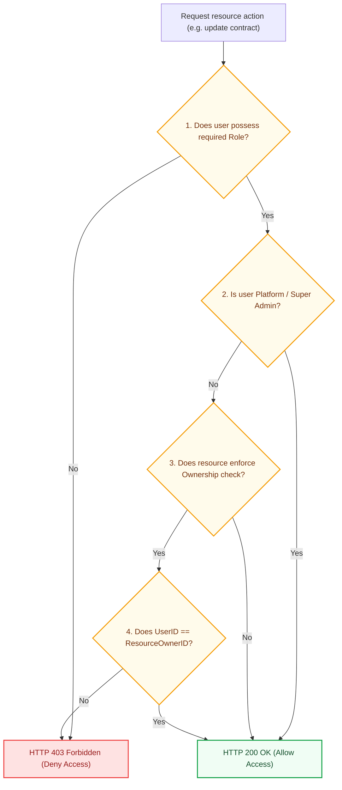
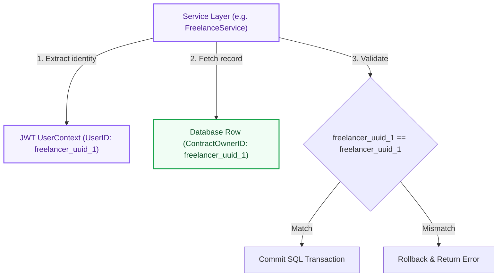

# Authorization & RBAC Architecture: Kirmya Security Tier
**Document Identifier:** PL-AR-10 | **Status:** Approved / Core Reference | **Version:** 1.0.0  
**Authors:** Antigravity AI & Security Architecture Group | **Date:** July 24, 2026

---

## Document Control & Meta-Information

### Version History
| Version | Date | Author | Description |
| :--- | :--- | :--- | :--- |
| `0.1.0` | 2026-07-20 | Antigravity AI | Initial role hierarchy draft. |
| `0.5.0` | 2026-07-22 | Antigravity AI | Integrated permission matrices and resource ownership checks. |
| `1.0.0` | 2026-07-24 | Antigravity AI | Completed full Authorization & RBAC Architecture Blueprint for Board approval. |

### Document Distribution
* **Product Strategy Group**: User privilege matrix verification.
* **Engineering Leads**: RBAC middleware implementation guidelines.
* **DevOps Team**: IAM policies alignment.
* **Security & Compliance**: Access review process validation.

---

## 1. Related Documents
- [00-documentation-standards.md](file:///c:/Users/PRASHANTH/Documents/real/my_project/docs/product/00-documentation-standards.md)
- [01-system-architecture.md](file:///c:/Users/PRASHANTH/Documents/real/my_project/docs/architecture/01-system-architecture.md)
- [02-modular-monolith-architecture.md](file:///c:/Users/PRASHANTH/Documents/real/my_project/docs/architecture/02-modular-monolith-architecture.md)
- [03-module-boundaries.md](file:///c:/Users/PRASHANTH/Documents/real/my_project/docs/architecture/03-module-boundaries.md)
- [09-authentication-architecture.md](file:///c:/Users/PRASHANTH/Documents/real/my_project/docs/architecture/09-authentication-architecture.md)

---

## 2. Dependencies
- Role evaluations integrate with JWT structures in [PL-AR-009 Authentication Architecture Blueprint](file:///c:/Users/PRASHANTH/Documents/real/my_project/docs/architecture/09-authentication-architecture.md).
- Permission schemas align with tables in [PL-AR-008 Database Architecture Blueprint](file:///c:/Users/PRASHANTH/Documents/real/my_project/docs/architecture/08-database-architecture.md).

---

## 3. Purpose
This document establishes the official authorization architecture for the Kirmya Professional Ecosystem. It specifies the Role-Based Access Control (RBAC) model, role hierarchy, permission matrices, resource ownership rules, and future Attribute-Based Access Control (ABAC) compatibility paths.

---

## 4. Scope
- **In-Scope**: Definitions of Kirmya's 11 roles, permission inheritance paths, resource ownership validation logic, role permission matrices, module access matrices, and access review processes.
- **Out-of-Scope**: Code-level Casbin policies compilation and database-level connection parameters.

---

## 5. Objectives
- Establish a secure authorization model based on the Principle of Least Privilege (PoLP).
- Define a clear role hierarchy that supports permission inheritance.
- Implement fine-grained resource ownership checks to protect user data.
- Detail permission matrices for all 11 roles across all 14 modules.
- Create 4 detailed Mermaid diagrams modeling hierarchies, evaluation logic, and ownership boundaries.

---

## 6. Executive Summary
Kirmya's authorization system utilizes a **Role-Based Access Control (RBAC)** architecture designed to meet the security requirements of a multi-sided ecosystem. 

The system defines 11 roles (Guest, Registered User, Job Seeker, Freelancer, Recruiter, Client, Company Administrator, Community Moderator, Platform Moderator, Support Agent, and Super Administrator) and manages permissions using a hierarchical inheritance model. 

Access decisions combine role validation with fine-grained **Resource Ownership Checks** (e.g. checking if a user owns a profile or contract before permitting updates). 

We establish access matrices for all modules, detail delegated administration parameters for Company Admins and Guild Moderators, and map out a compatibility layer for future **Attribute-Based Access Control (ABAC)** integrations.

---

## 7. Detailed Content: Authorization & RBAC Architecture

### 7.1 Authorization Philosophy
- **Principle of Least Privilege (PoLP)**: Users are granted only the minimum permissions required to perform their tasks.
- **Secure by Default**: Access is blocked by default; permissions must be explicitly granted.
- **Stateless Verification**: Authorization decisions are evaluated in-memory using claims stored in JWT tokens, minimizing database lookups.
- **Immutable Audit Trail**: All changes to user roles and privileges are logged to a secure database audit table.

### 7.2 Role Hierarchy & Permission Inheritance
Kirmya implements a hierarchical role inheritance model, allowing senior roles to inherit permissions from junior roles:

Permissions are inherited upward:
- A `Registered User` inherits all public read permissions from a `Guest`.
- A `Job Seeker` inherits all base profile capabilities from a `Registered User`.
- A `Company Administrator` inherits all recruiting capabilities from a `Recruiter`.
- A `Super Administrator` inherits all permissions from senior administrative roles.

---

### 7.3 API Authorization Flow Diagram
This diagram shows how requests are intercepted, validated, and evaluated for role permissions before reaching business logic handlers:

---

### 7.4 Permission Evaluation Logic Flowchart
Access decisions combine role validation with resource ownership checks:

---

### 7.5 Resource Ownership Boundary
This diagram shows how resource ownership is evaluated at the Service layer:

*Architectural Justification*: To prevent Insecure Direct Object Reference (IDOR) vulnerabilities, resource ownership must be validated in the service layer. General role checks (e.g. `User is Freelancer`) are handled by middleware, while resource ownership (e.g. `This Freelancer owns this Contract`) is validated in the business logic layer.

---

### 7.6 Permission Matrices by Role
This matrix defines the capabilities allocated to each role across the platform:

| Role Name | Auth Control | Profiles | Companies | Jobs | Messaging | Communities | Freelancing | Admin Panel |
| :--- | :--- | :--- | :--- | :--- | :--- | :--- | :--- | :--- |
| **Guest** | Read | Read (Public) | Read (Public) | Read (Public) | None | Read (Public) | None | None |
| **Registered User** | Read/Write | Read/Write (Own) | Read | Read | Read/Write (Own) | Read/Write | None | None |
| **Job Seeker** | Read/Write | Read/Write (Own) | Read | Read/Apply | Read/Write (Own) | Read/Write | None | None |
| **Freelancer** | Read/Write | Read/Write (Own) | Read | Read | Read/Write (Own) | Read/Write | Read/Write (Bids) | None |
| **Recruiter** | Read/Write | Read | Read/Write (Own) | Read/Write (Own) | Read/Write (Own) | Read/Write | None | None |
| **Client** | Read/Write | Read | Read/Write (Own) | Read | Read/Write (Own) | Read/Write | Read/Write (Escrow) | None |
| **Company Admin** | Read/Write | Read | Read/Write (Own) | Read/Write (Own) | Read/Write (Own) | Read/Write | None | None |
| **Community Mod** | Read/Write | Read | Read | Read | Read/Write (Own) | Moderate (Guild) | None | None |
| **Platform Mod** | Read/Write | Read | Read | Moderate | Read/Write (Own) | Moderate | Moderate | Moderate |
| **Support Agent** | Read | Read | Read | Read | Read | Read | Read | Read |
| **Super Admin** | Read/Write | Read/Write | Read/Write | Read/Write | Read/Write | Read/Write | Read/Write | Read/Write |

---

### 7.7 Module Access Control Matrices

#### 1. Jobs Module (`jobModule`)

| HTTP Method | API Path | Access Scope | Allowed Roles | Ownership Check Required |
| :--- | :--- | :--- | :--- | :--- |
| **GET** | `/api/v1/jobs` | Public | Guest, Registered User, Job Seeker, Recruiter | No |
| **GET** | `/api/v1/jobs/:id` | Public | Guest, Registered User, Job Seeker, Recruiter | No |
| **POST** | `/api/v1/jobs` | Secured | Recruiter, Company Administrator | No (requires valid Seat) |
| **PUT** | `/api/v1/jobs/:id` | Secured | Recruiter, Company Administrator | Yes (must own listing) |
| **DELETE**| `/api/v1/jobs/:id` | Secured | Recruiter, Company Administrator, Admin | Yes (must own listing) |

#### 2. Freelancing Module (`freelanceModule`)

| HTTP Method | API Path | Access Scope | Allowed Roles | Ownership Check Required |
| :--- | :--- | :--- | :--- | :--- |
| **POST** | `/api/v1/freelancing/proposals` | Secured | Freelancer | No |
| **POST** | `/api/v1/freelancing/contracts` | Secured | Client | No |
| **PATCH**| `/api/v1/freelancing/contracts/:id` | Secured | Client, Freelancer | Yes (must be participant) |
| **POST** | `/api/v1/freelancing/milestones/:id/fund` | Secured | Client | Yes (must be contract owner) |

---

### 7.8 Attribute-Based Access Control (ABAC) Compatibility Roadmap
As Kirmya expands, the RBAC model can be extended to support Attribute-Based Access Control (ABAC) to enforce more complex security rules:
- **Attribute Context**: The authorization service accepts attributes related to the user, resource, and environment (e.g. client IP geolocation, time of day, candidate DRS score, transaction value).
- **Rule Engine**: Casbin policies can be configured to evaluate ABAC attributes:
  `g(r.sub.Role, recruiter) && r.obj.CompanyID == r.sub.CompanyID && r.env.ClientIPCountry == 'AE'`
- **Migration Path**: The JWT token structure is updated to include attribute claims. The middleware checks these attributes against policy rules without refactoring the core role structure.

---

## 16. Functional Requirements Mapping
- **FR-AUTH-SSO**: Enforced by mapping corporate OIDC identity claims directly to `Company Administrator` and `Recruiter` roles.
- **FR-FREE-ESCROW**: Access to payment APIs is restricted to the `Client` role, requiring milestone ownership validation.

---

## 17. Non-Functional Requirements Verification
- **NFR-SEC-002 (GDPR compliance)**: Deletion requests check user ownership before purging rows.
- **NFR-PER-005 (Latency)**: User roles and permission claims are stored in the JWT, allowing authorization checks to be executed in under 5ms.

---

## 18. Business Rules Mapping
- **BR-AUTH-SEATS**: Recruiter access is validated against company seat records before search queries are processed.
- **BR-FREE-DISPUTES**: Milestone payments are locked in escrow, allowing access to be restricted during disputes.

---

## 19. Assumptions
- JWT tokens are signed using secure keys, preventing client-side claims tampering.
- Role permissions do not change frequently, allowing them to be cached in the application layer.

---

## 20. Constraints
- Modules cannot bypass authorization checks when calling other modules.
- Hardcoded permission checks inside the database are prohibited.

---

## 21. Risks
- **IDOR Vulnerabilities**: Developers might fail to implement resource ownership checks in new services. *Mitigation*: Run security scans and code reviews on all new repository methods.
- **Role Explosion**: Creating too many custom roles can make permission management difficult. *Mitigation*: Limit roles to the 11 defined types and manage exceptions using attributes.

---

## 22. Open Questions
- What audit duration is required for logging role and permission changes?
- Should we support custom roles for enterprise corporate clients?

---

## 23. Future Improvements
- Integrate an external policy decision engine (e.g., Open Policy Agent - OPA) to centralize authorization rules.
- Implement automated tools to detect unused permissions.

---

## 24. Acceptance Criteria
The authorization implementation must meet these standards to be marked complete:

| Rule | Verification Checkpoint | Target |
| :--- | :--- | :--- |
| **No IDORs** | Resource ownership checks are enforced on all write APIs. | 100% compliance |
| **RBAC Checks** | All secure endpoints check permissions in middleware. | 100% compliance |
| **Role Limits** | Roles are restricted to the 11 defined types. | Mandatory |
| **Audit Trails** | All role changes are logged to the audit table. | Pass |

---

## 25. Success Metrics
- Authorization evaluations complete in under 5ms.
- Zero unauthorized write access incidents occur in production.

---

## 26. Glossary
- **PoLP**: Principle of Least Privilege, a security concept where users are granted only the minimum permissions required to perform their tasks.
- **IDOR**: Insecure Direct Object Reference, a security vulnerability where an application provides direct access to objects based on user-supplied input.
- **ABAC**: Attribute-Based Access Control, an authorization model that evaluates attributes (user, resource, environment) to make access decisions.

---

## 27. References
- [OWASP Authorization Cheat Sheet](https://cheatsheetseries.owasp.org/cheatsheets/Authorization_Cheat_Sheet.html)
- [Casbin RBAC Documentation](https://casbin.org/docs/rbac)
- [NIST Attribute-Based Access Control Guide](https://csrc.nist.gov/publications/detail/sp/800-162/final)

---

## 28. Revision History
| Version | Date | Author | Description |
| :--- | :--- | :--- | :--- |
| `1.0.0` | 2026-07-24 | Antigravity AI | Finished Kirmya Authorization & RBAC Architecture blueprint. |
