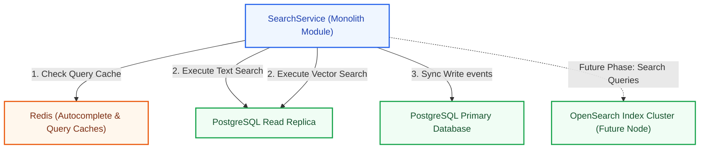
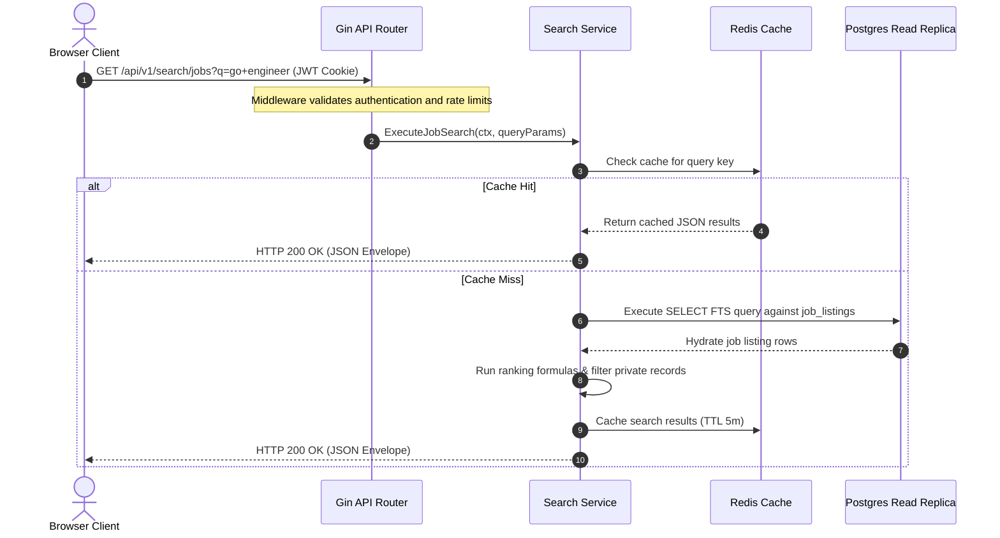
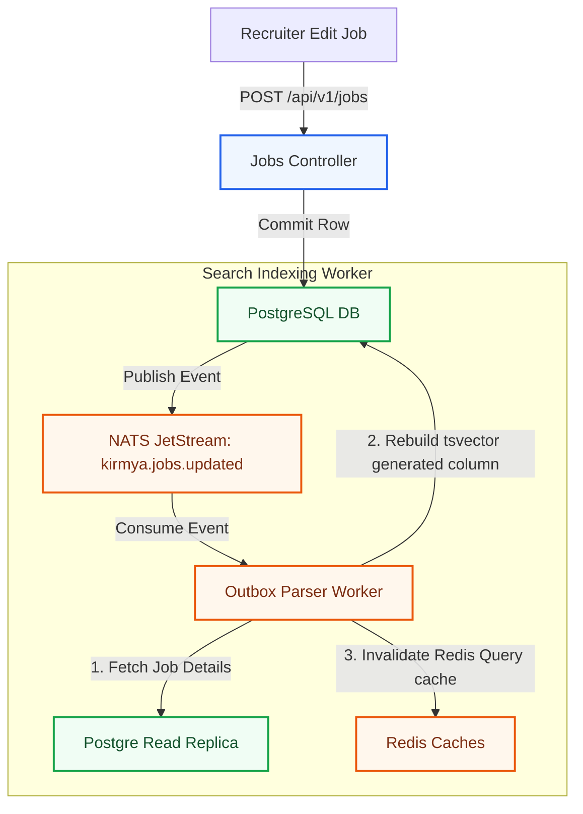

# Search Architecture Specification: Kirmya Query Tier
**Document Identifier:** PL-AR-11 | **Status:** Approved / Core Reference | **Version:** 1.0.0  
**Authors:** Antigravity AI & Search Engineering Group | **Date:** July 24, 2026

---

## Document Control & Meta-Information

### Version History
| Version | Date | Author | Description |
| :--- | :--- | :--- | :--- |
| `0.1.0` | 2026-07-20 | Antigravity AI | Initial Postgres FTS routes outline. |
| `0.5.0` | 2026-07-22 | Antigravity AI | Integrated ranking weights and OpenSearch CDC workflows. |
| `1.0.0` | 2026-07-24 | Antigravity AI | Completed full Search Architecture Specification for Board approval. |

### Document Distribution
* **Product Strategy Group**: Sourcing capabilities mapping.
* **Engineering Leads**: Search API integration rules.
* **DevOps Team**: OpenSearch cluster sizing guidelines.
* **Security & Compliance**: Anonymization filters verification.

---

## 1. Related Documents
- [00-documentation-standards.md](file:///c:/Users/PRASHANTH/Documents/real/my_project/docs/product/00-documentation-standards.md)
- [01-system-architecture.md](file:///c:/Users/PRASHANTH/Documents/real/my_project/docs/architecture/01-system-architecture.md)
- [02-modular-monolith-architecture.md](file:///c:/Users/PRASHANTH/Documents/real/my_project/docs/architecture/02-modular-monolith-architecture.md)
- [03-module-boundaries.md](file:///c:/Users/PRASHANTH/Documents/real/my_project/docs/architecture/03-module-boundaries.md)
- [07-api-architecture.md](file:///c:/Users/PRASHANTH/Documents/real/my_project/docs/architecture/07-api-architecture.md)
- [08-database-architecture.md](file:///c:/Users/PRASHANTH/Documents/real/my_project/docs/architecture/08-database-architecture.md)

---

## 2. Dependencies
- Query models integrate with database indexes in [PL-AR-008 Database Architecture Blueprint](file:///c:/Users/PRASHANTH/Documents/real/my_project/docs/architecture/08-database-architecture.md).
- Search API routes conform to paths in [PL-AR-007 API Architecture Specification](file:///c:/Users/PRASHANTH/Documents/real/my_project/docs/architecture/07-api-architecture.md).

---

## 3. Purpose
This document defines the search architecture for the Kirmya Professional Ecosystem. It specifies the search strategies, schema indexes, ranking algorithms, filtering controls, and the OpenSearch migration roadmap, establishing search standards across the platform.

---

## 4. Scope
- **In-Scope**: PostgreSQL Full Text Search (FTS) schemas, OpenSearch indexing models, 7 search domains specifications, ranking formulas, prefix autocomplete configs, vector search properties, and search APIs.
- **Out-of-Scope**: Code implementations for search controllers and manual search testing procedures.

---

## 5. Objectives
- Define search goals for fast, relevant, and bilingual (English/Arabic) results.
- Outline index schemas and ranking weights for the 7 search domains.
- Establish an autocomplete system using Redis prefix caching.
- Implement vector search support using HNSW pgvector indexing.
- Outline a 3-step migration path from PostgreSQL FTS to OpenSearch.
- Create 4 detailed Mermaid diagrams modeling architecture topologies, request paths, indexing, and CDC migrations.

---

## 6. Executive Summary
Search is a core capability of the Kirmya ecosystem, facilitating candidate sourcing, job matches, company discovery, and social connections. To balance operational simplicity with scalability, search follows a 3-phase roadmap:
- **Phase 1**: PostgreSQL Full Text Search (FTS) using `tsvector` generated columns and GIN indexes, combined with HNSW pgvector similarity indexes.
- **Phase 2**: Hybrid model routing text searches to PostgreSQL read replicas and vector searches to pgvector.
- **Phase 3**: Distributed **OpenSearch** cluster sync using Write-Ahead Log (WAL) Change Data Capture (CDC).

The search system enforces strict data visibility rules (anonymizing private profiles) and uses dynamic scoring weights to rank results.

---

## 7. Detailed Content: Search Architecture Specifications

### 7.1 Search Goals
1. **Low Latency**: Search results must be returned in under 200ms (P95) to ensure a responsive user experience.
2. **Relevance**: Results must rank matches using keyword weights, location proximity, profile completeness, and popularity boosts.
3. **Bilingual Support**: Text queries must support English and Arabic, including word stemming, stopword filtering, and synonym mappings.
4. **Security Filters**: Search results must respect user privacy settings (e.g. hiding private profiles or anonymizing names).

### 7.2 Search Architecture Diagram
This diagram shows the relationship between Kirmya's search services, in-memory caches, and database schemas:

---

### 7.3 Search Request Flow Diagram
Traces a user query through verification layers to cache resolution and fallback datastore executions:

---

### 7.4 Search Domains Specifications
Kirmya supports 7 search domains. The table below lists the fields, indexing types, and ranking weights for each domain:

| Domain | Search Fields | Indexing Strategy | Query Filters | Relevance Weight |
| :--- | :--- | :--- | :--- | :--- |
| **People** | Name, skills, experience, location, industry, availability, job title | Postgres FTS GIN on text fields, HNSW pgvector for embeddings | Location, skills, availability | Skills: 40%, Experience: 30%, Location: 20%, Popularity: 10% |
| **Jobs** | Job title, skills, company name, location, remote options | FIN index on generated `tsvector` columns | Salary range, remote, employment type | Title match: 50%, Skill match: 30%, Date posted: 20% |
| **Companies** | Company name, industry, location, description | FTS GIN index on name and description | Industry, location, size | Name match: 70%, Size: 20%, Location: 10% |
| **Freelancers**| Services, skills, portfolio content, rating, availability | FTS GIN index, pgvector on portfolio embeddings | Rating, availability, rate | Services: 40%, Rating: 30%, Skills: 20%, Availability: 10% |
| **Communities**| Guild name, category, description, topics | FTS GIN index on guild name and topics | Category, minimum members | Name match: 60%, Member count: 30%, Activity: 10% |
| **Skills** | Skill name, category, synonym tags | B-Tree on name, Trigram (`pg_trgm`) for fuzzy matches | Category | Exact match: 80%, Synonym match: 20% |
| **Learning** | Course title, topics, skills covered, author | FTS GIN index on title and topics | Skills covered, duration | Title match: 50%, Topics: 30%, Rating: 20% |

---

### 7.5 Indexing Flow Diagram (Phase 1)
Illustrates how the database updates search indexes asynchronously using NATS event subscribers:

---

### 7.6 Search Ranking Algorithm
Search ranking calculates a composite score for each result:
`Score = (KeywordScore * W1) + (LocationScore * W2) + (ProfileCompleteness * W3) + (PopularityBoost * W4)`
- **KeywordScore**: Computed using PostgreSQL `ts_rank_cd` density scoring.
- **LocationScore**: Proximity score (1.0 for exact matches, decreasing for greater physical distances).
- **ProfileCompleteness**: Profile completeness score (0.0 to 1.0) to prioritize complete profiles.
- **PopularityBoost**: Logarithmic scale boost based on views, recommendations, or member counts.

### 7.7 Autocomplete System
- **Implementation**: Autocomplete queries are cached in Redis. Prefix matching uses Redis **Sorted Sets (ZSET)**.
- **ZSET Logic**: Keywords are stored as elements with weights based on search frequency:
  `ZADD kirmya:autocomplete:jobs:developer 100 "Go Developer" 80 "Frontend Developer"`
- **Execution**: The frontend queries autocomplete terms using `ZREVRANGEBYSCORE` to fetch matching terms in under 10ms.

### 7.8 AI-Enhanced Search (Semantic Sourcing)
- **Vector Embeddings**: Candidate resumes and job descriptions are converted to 768-dimension vectors (using models like Cohere/VertexAI).
- **pgvector Integration**: Vectors are stored in a `vector` column in `profile_cvs` and indexed using Hierarchical Navigable Small World (**HNSW**) cosine distance indexes.
- **Query Execution**: Recruiters can perform natural language queries (e.g. "Looking for a Go developer with experience in microservices in Dubai") to retrieve candidates sorted by cosine distance.

---

### 7.9 OpenSearch Migration Flow Diagram (Phase 3)
As dataset sizes grow, search workloads migrate to OpenSearch using Kafka and Debezium for real-time Change Data Capture (CDC):

#### Migration Phases
1. **Phase 1 (PostgreSQL FTS)**: Shared database instances handle FTS queries using `tsvector` generated columns and GIN indexes, combined with pgvector.
2. **Phase 2 (Hybrid Search)**: Read-heavy search traffic is routed to dedicated PostgreSQL read replicas, with write operations processed on the primary database.
3. **Phase 3 (OpenSearch)**: Search indexing transitions to an OpenSearch cluster. Debezium monitors PostgreSQL WAL logs to replicate changes to OpenSearch in real time.

---

## 16. Functional Requirements Mapping
- **FR-SCH-VECTOR**: Supported by HNSW pgvector similarity indexes on `profile_cvs`.
- **FR-SCH-LOC**: Implemented using geolocation coordinates and location proximity scoring rules.

---

## 17. Non-Functional Requirements Verification
- **NFR-PER-005 (Search Latency)**: Average search response times must remain under 200ms (P95), achieved by routing queries to PostgreSQL read replicas and caching autocomplete terms in Redis.
- **NFR-SCA-003 (Vector Search Scale)**: pgvector indexing scales to support over 10 million candidate profiles.

---

## 18. Business Rules Mapping
- **BR-AUTH-SEATS**: Recruiter seat access is verified before candidate sourcing queries are processed.
- **BR-SCH-VISIBILITY**: Search filters exclude profiles with visibility settings set to private.

---

## 19. Assumptions
- PostgreSQL read replicas maintain a replication lag of under 100ms.
- Autocomplete keys are cached in Redis to minimize database read workloads.

---

## 20. Constraints
- Direct SQL joins across schemas are prohibited in search queries.
- Raw database tables cannot be queried directly; all search operations must route through the `SearchService` interface.

---

## 21. Risks
- **Index Latency**: High write workloads can cause index update delays. *Mitigation*: Run indexing tasks asynchronously in background workers using NATS JetStream.
- **OpenSearch Sync Drift**: Network failures can cause replication delays between PostgreSQL and OpenSearch. *Mitigation*: Run daily reconciliation tasks to verify data consistency across datastores.

---

## 22. Open Questions
- What search stemming rules will be used for Arabic text parsing?
- What are the storage requirements for archiving historical search queries?

---

## 23. Future Improvements
- Move the search synchronization from NATS event subscriptions to change data capture (CDC) pipelines.
- Implement personalized search ranking using clickthrough rate (CTR) feedback loops.

---

## 24. Acceptance Criteria
The search system implementation must meet these standards to be marked complete:

| Rule | Verification Checkpoint | Target |
| :--- | :--- | :--- |
| **Search Latency** | Search requests complete in under 200ms. | 100% compliance |
| **Bilingual Parsing**| Queries support English and Arabic stemming rules. | 100% compliance |
| **Privacy Filters** | Private profiles are excluded from search results. | Mandatory |
| **Migration Readiness**| Search code routes queries through service interfaces. | Pass |

---

## 25. Success Metrics
- Average search query response times remain under 200ms.
- OpenSearch replica sync lag remains under 1 second.

---

## 26. Glossary
- **FTS**: Full Text Search, a technique used to search for documents that match a text query.
- **pgvector**: A PostgreSQL extension that enables vector storage and similarity searches.
- **CDC**: Change Data Capture, a process that monitors database transaction logs to replicate changes to other systems in real time.

---

## 27. References
- [PostgreSQL Full Text Search Documentation](https://www.postgresql.org/docs/current/textsearch.html)
- [OpenSearch Reference Guide](https://opensearch.org/docs/latest/)
- [Debezium PostgreSQL Connector Documentation](https://debezium.io/documentation/reference/stable/connectors/postgresql.html)

---

## 28. Revision History
| Version | Date | Author | Description |
| :--- | :--- | :--- | :--- |
| `1.0.0` | 2026-07-24 | Antigravity AI | Finished Kirmya Search Architecture blueprint. |
