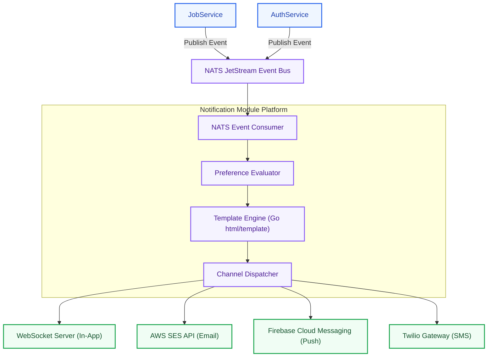
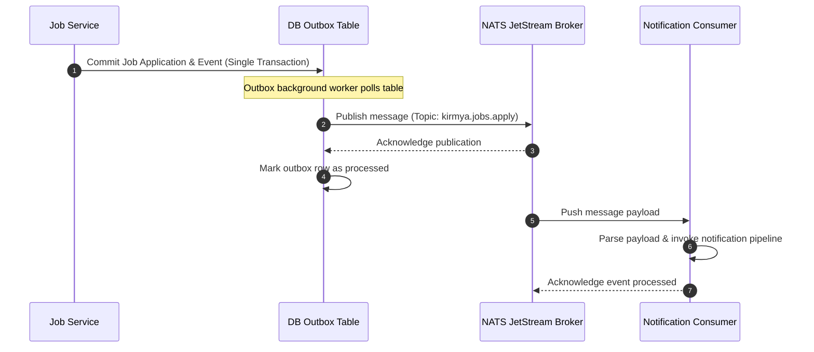
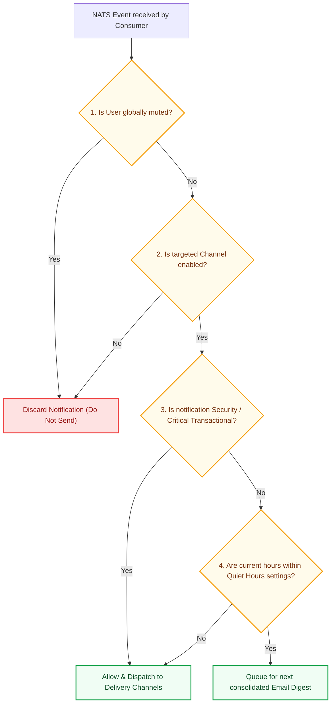
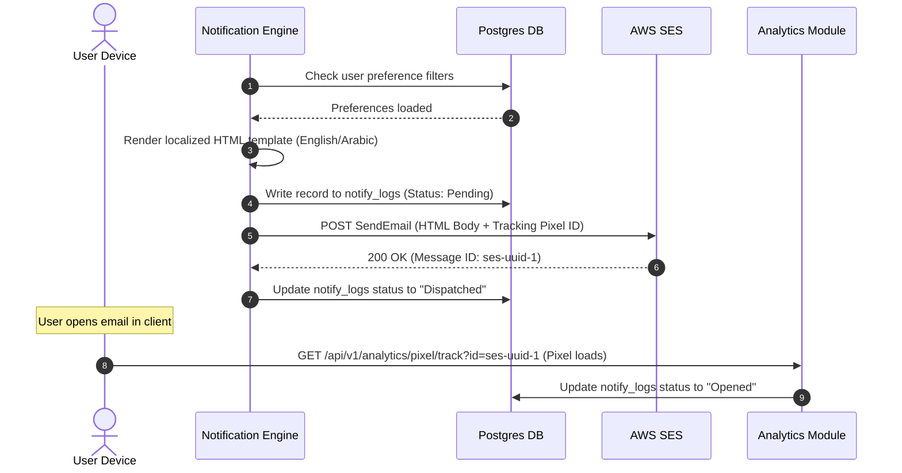

# Notification Platform Architecture: Kirmya Delivery Tier
**Document Identifier:** PL-AR-12 | **Status:** Approved / Core Reference | **Version:** 1.0.0  
**Authors:** Antigravity AI & Notification Platform Group | **Date:** July 24, 2026

---

## Document Control & Meta-Information

### Version History
| Version | Date | Author | Description |
| :--- | :--- | :--- | :--- |
| `0.1.0` | 2026-07-20 | Antigravity AI | Initial NATS notification routes outline. |
| `0.5.0` | 2026-07-22 | Antigravity AI | Integrated template versioning and preference checks. |
| `1.0.0` | 2026-07-24 | Antigravity AI | Completed full Notification Platform Architecture Specification. |

### Document Distribution
* **Product Strategy Group**: User preferences workflows verification.
* **Engineering Leads**: Notification handler implementation.
* **DevOps Team**: NATS JetStream sizing and SMTP config.
* **Security & Compliance**: PII filtering verification.

---

## 1. Related Documents
- [00-documentation-standards.md](file:///c:/Users/PRASHANTH/Documents/real/my_project/docs/product/00-documentation-standards.md)
- [01-system-architecture.md](file:///c:/Users/PRASHANTH/Documents/real/my_project/docs/architecture/01-system-architecture.md)
- [02-modular-monolith-architecture.md](file:///c:/Users/PRASHANTH/Documents/real/my_project/docs/architecture/02-modular-monolith-architecture.md)
- [03-module-boundaries.md](file:///c:/Users/PRASHANTH/Documents/real/my_project/docs/architecture/03-module-boundaries.md)
- [04-backend-architecture.md](file:///c:/Users/PRASHANTH/Documents/real/my_project/docs/architecture/04-backend-architecture.md)
- [07-api-architecture.md](file:///c:/Users/PRASHANTH/Documents/real/my_project/docs/architecture/07-api-architecture.md)

---

## 2. Dependencies
- Event payload consumer structs integrate with definitions in [PL-AR-004 Backend Architecture Blueprint](file:///c:/Users/PRASHANTH/Documents/real/my_project/docs/architecture/04-backend-architecture.md).
- User setting tables conform to layout guidelines in [PL-AR-008 Database Architecture Blueprint](file:///c:/Users/PRASHANTH/Documents/real/my_project/docs/architecture/08-database-architecture.md).

---

## 3. Purpose
This document establishes the official notification architecture for the Kirmya Professional Ecosystem. It specifies the event consumption pipeline, delivery channels, preference controls, template versioning, and microservice extraction paths.

---

## 4. Scope
- **In-Scope**: Notification delivery pipelines (In-App WebSockets, Email, Mobile/Browser Push, SMS), NATS event schemas, user preferences schemas, template systems, reliability retries, DLQ routing, and analytics trackers.
- **Out-of-Scope**: Code-level WebSockets handshake protocols and third-party push server keys.

---

## 5. Objectives
- Establish an event-driven notification platform using NATS JetStream.
- Design delivery channels for In-App WebSockets, Email, Browser Push, Mobile Push, and SMS.
- Implement user preference controls (channel preferences, quiet hours, digests).
- Standardize on-the-fly HTML template generation with variable injection and localization support.
- Outline a reliability model featuring retries, Dead Letter Queues (DLQ), and idempotency keys.
- Create 4 detailed Mermaid diagrams modeling architectures, flows, and evaluations.

---

## 6. Executive Summary
The Kirmya notification tier is a high-volume, event-driven platform designed to process transactional, security, and marketing alerts. 

The system subscribes to NATS JetStream events published by domain modules. The notification engine processes these events, evaluates user preferences (e.g. quiet hours, channel preferences), fetches localized templates, and dispatches messages to the appropriate delivery channel:
- **In-App**: Real-time delivery via WebSockets.
- **Email**: Transactional mail dispatched via AWS SES.
- **Push & SMS**: Dispatched via FCM and Twilio integrations.

The platform includes retry queues to manage transient delivery failures, and is designed to be extracted into an independent microservice as search and communication traffic scales.

---

## 7. Detailed Content: Notification Architecture Specifications

### 7.1 Notification Goals
1. **Low Latency**: Transactional notifications (e.g. MFA codes, password resets) must deliver in under 2 seconds.
2. **Preference Compliance**: The system must respect user channel preferences, quiet hours, and unsubscribe rules.
3. **Bilingual Templates**: Support on-the-fly translation and rendering for English (LTR) and Arabic (RTL) templates.
4. **Reliable Delivery**: Maintain at-least-once delivery guarantees using outbox logs and retry queues.

### 7.2 Notification Architecture Topology
Illustrates how the notification engine integrates with internal systems and external communication providers:



---

### 7.3 Event Flow Diagram
Traces how NATS topics receive events from database outboxes and route them to notification subscribers:



---

### 7.4 Preference Evaluation Flow
Before dispatching a notification, the engine checks user preferences, quiet hours settings, and channel blocks:



---

### 7.5 Delivery Pipeline Sequence Diagram
Traces a notification from generation to dispatch and open-rate tracking:



---

### 7.6 Notification Database Architecture
- `notify_templates`: UUID v7 primary key, template code, version, language (en/ar), channel type, body, updated timestamp.
- `notify_preferences`: UUID v7 primary key, user reference ID, channel type, event type, enabled status, quiet hours start, quiet hours end.
- `notify_logs`: UUID v7 primary key, user reference ID, event type, target channel, delivery status (pending/dispatched/delivered/failed/read), error details.

### 7.7 Template Management & Localization
- **Go HTML/Template**: Email templates are rendered using Go's `html/template` engine. Dynamic data is injected using variables:
  `<h3>{{.MessageTitle}}</h3><p>{{.MessageContent}}</p>`
- **Localization**: Template tables index body content by language:
  - `English`: `notify_templates` row with `language = 'en'`.
  - `Arabic`: `notify_templates` row with `language = 'ar'`. The template wraps the container in a right-to-left layout (`dir="rtl"`).
- **Versioning**: Templates are versioned (e.g. `v1.0`, `v1.1`). Changes to template designs require committing a new row to `notify_templates` with an updated version tag.

---

### 7.8 Reliability, Retries & Dead Letter Queue (DLQ)
- **Exponential Backoff**: If an external provider returns a temporary error (e.g. SMTP connection timeout), the dispatcher schedules a retry with exponential backoff:
  `Delay = BaseDelay * 2^Attempt + Jitter` (attempts capped at 5).
- **Dead Letter Queue (DLQ)**: If a notification fails to deliver after 5 attempts:
  - The notification status is updated to `Failed` in `notify_logs`.
  - The message is pushed to the NATS Dead Letter Queue (`kirmya.notify.dlq`) for manual review.
- **Idempotency**: All notification events include an idempotency key (generated from the source event ID). The consumer checks `notify_logs` for this key before dispatching, preventing duplicate notifications.

---

### 7.9 Future Notification Service Extraction Strategy
As Kirmya's traffic scales, the notification package can transition from a monolith module to an independent microservice:

```
[ MONOLITH LAYOUT ]
/backend/internal/notification  # Go package
- Mapped to local notify_* tables in PostgreSQL

[ MICROSERVICE EXTRACTION LAYOUT ]
1. Refactor "/backend/internal/notification" into a separate repository.
2. Deploy the service inside a dedicated Docker container.
3. Migrate "notify_" tables to a dedicated PostgreSQL database instance.
4. The extracted service subscribes to event topics on the shared NATS JetStream broker.
5. In-app WebSocket connections are routed directly to the new notification microservice.
```

---

## 16. Functional Requirements Mapping
- **FR-AUTH-MFA**: Supported by high-priority SMS and email validation pipelines.
- **FR-LOC-AR**: Managed using localized template rows indexed by language code (`ar`/`en`).

---

## 17. Non-Functional Requirements Verification
- **NFR-AV-001 (Platform Uptime SLO >= 99.9%)**: Achieved using NATS JetStream to queue notifications, preventing data loss during database or network failures.
- **NFR-PER-005 (Transactional Latency)**: Real-time transactional emails deliver in under 2 seconds.

---

## 18. Business Rules Mapping
- **BR-AUTH-LOCK**: Lockout alerts bypass quiet hours settings and are dispatched immediately.
- **BR-SCH-VISIBILITY**: Private profiles are excluded from marketing recommendations.

---

## 19. Assumptions
- External communication providers (AWS SES, FCM, Twilio) maintain uptimes of over 99.9%.
- SMTP emails are delivered to client inboxes within 15 seconds.

---

## 20. Constraints
- All user emails must include a standard unsubscribe link, complying with spam regulations.
- SMS and push notification payloads cannot contain sensitive PII (e.g., passwords, private phone numbers).

---

## 21. Risks
- **IP Blacklisting**: High volumes of marketing emails can result in IP blacklisting, degrading deliverability. *Mitigation*: Separate transactional emails (AWS SES dedicated IPs) from marketing campaigns.
- **WebSocket Connection Exhaustion**: Millions of concurrent WebSocket connections can exhaust server file descriptors. *Mitigation*: Route WebSocket connections through a load balancer configured with high connection limits.

---

## 22. Open Questions
- What are the compliance requirements for storing user communication logs in the UAE?
- Should Kirmya support SMS-based verification codes globally, or restrict SMS to specific regions?

---

## 23. Future Improvements
- Move the search synchronization from NATS event subscriptions to change data capture (CDC) pipelines.
- Integrate an AI-driven notification scheduler to optimize email send times based on user activity.

---

## 24. Acceptance Criteria
The notification platform implementation must meet these standards to be marked complete:

| Rule | Verification Checkpoint | Target |
| :--- | :--- | :--- |
| **Idempotency** | Event processing is protected by idempotency checks. | 100% compliance |
| **Retry Strategy** | Failed requests route to retry queues with backoff. | 100% compliance |
| **Preferences Checks** | Quiet hours and channel settings are evaluated. | Mandatory |
| **Bilingual support** | E-mail templates are localized. | Pass |

---

## 25. Success Metrics
- Average delivery latencies for transactional emails remain under 2 seconds.
- Transient delivery failures are retried and resolved in under 5 minutes.

---

## 26. Glossary
- **NATS JetStream**: A distributed messaging system that provides queueing and event retention guarantees.
- **DLQ**: Dead Letter Queue, a queue used to isolate messages that cannot be processed successfully.
- **SameSite**: A cookie attribute that controls whether cookies are sent with cross-site requests, mitigating CSRF attacks.

---

## 27. References
- [NATS JetStream Documentation](https://docs.nats.io/nats-concepts/jetstream)
- [AWS SES Developer Guide](https://docs.aws.amazon.com/ses/latest/dg/Welcome.html)
- [Firebase Cloud Messaging Guides](https://firebase.google.com/docs/cloud-messaging)

---

## 28. Revision History
| Version | Date | Author | Description |
| :--- | :--- | :--- | :--- |
| `1.0.0` | 2026-07-24 | Antigravity AI | Finished Kirmya Notification Platform blueprint. |
