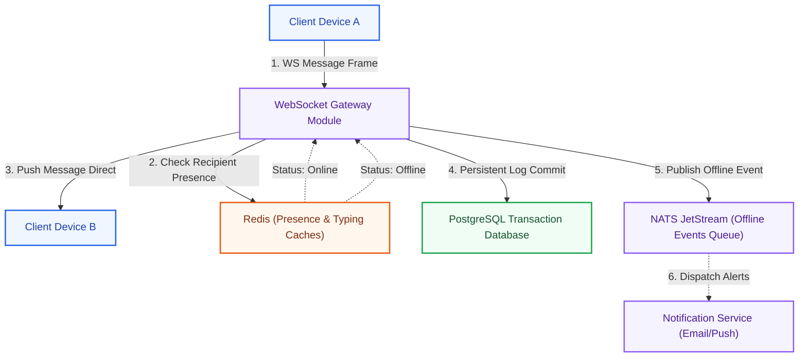
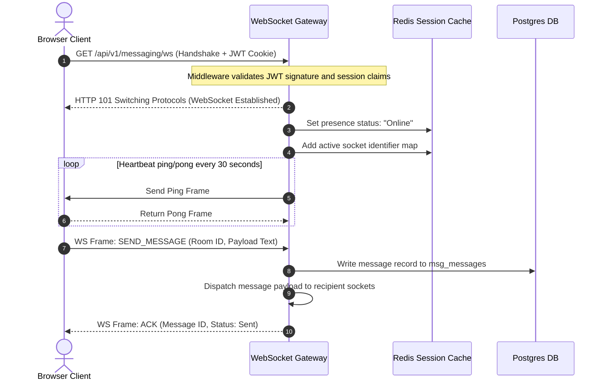
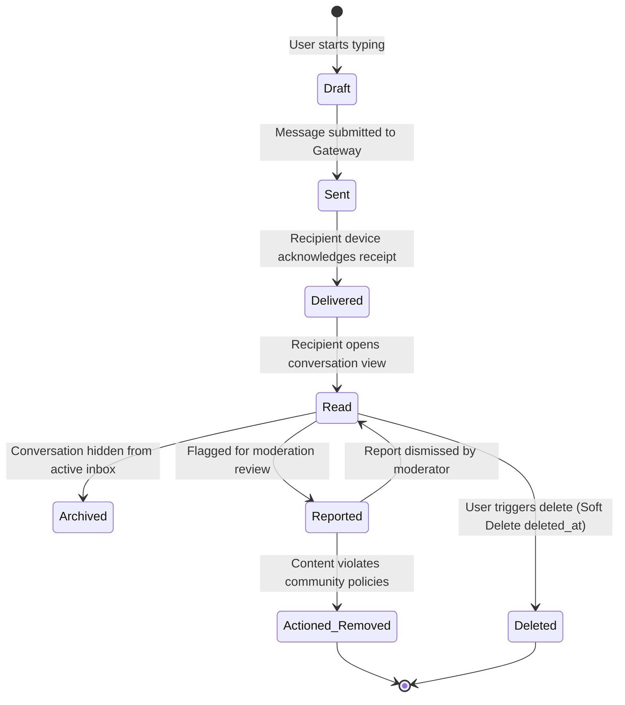
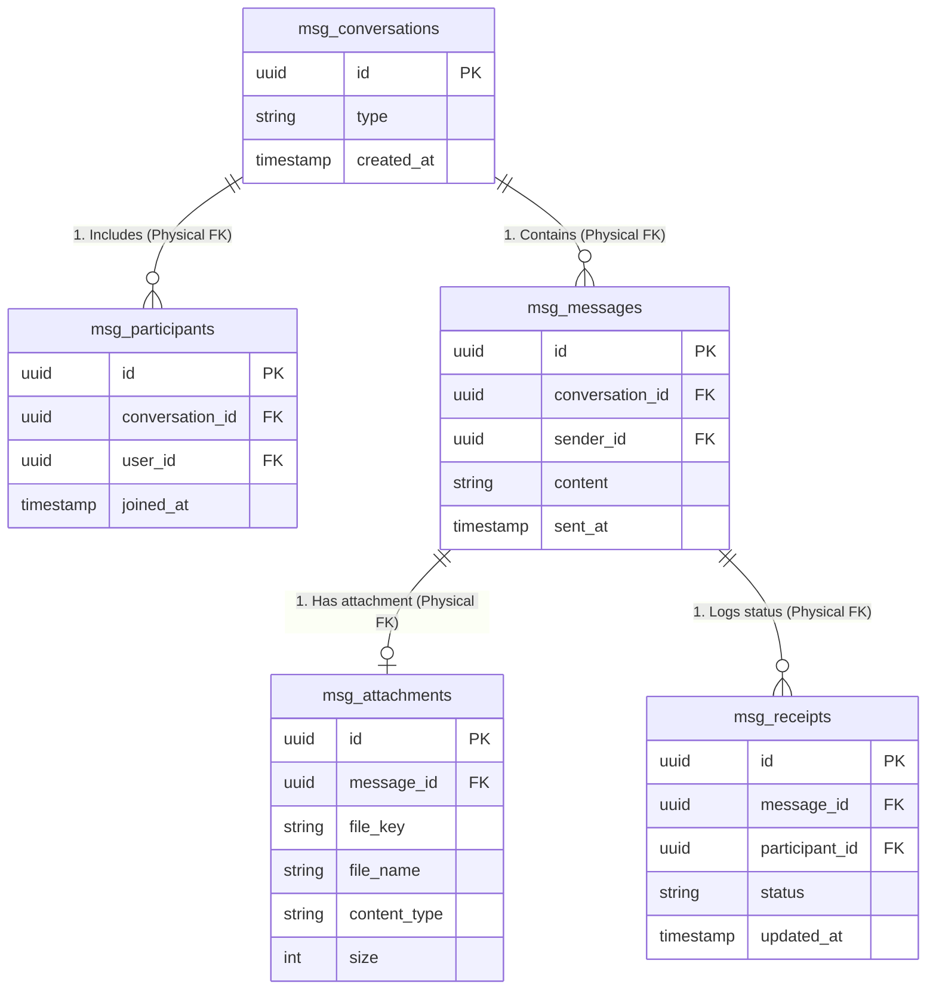
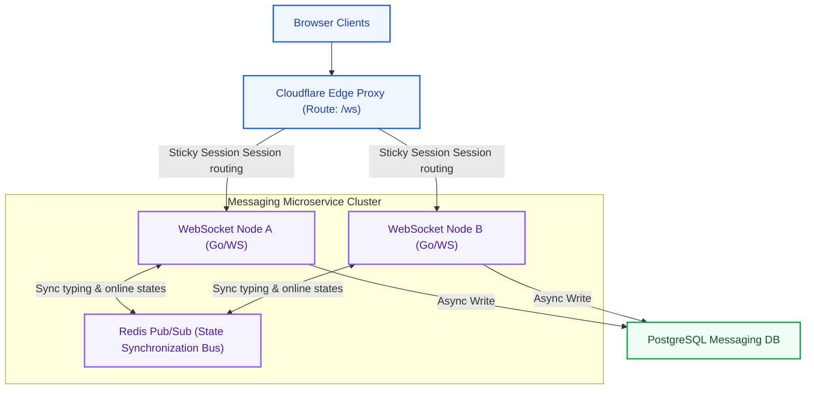

# Messaging Platform Architecture: Kirmya Communication Tier
**Document Identifier:** PL-AR-13 | **Status:** Approved / Core Reference | **Version:** 1.0.0  
**Authors:** Antigravity AI & Real-Time Systems Group | **Date:** July 24, 2026

---

## Document Control & Meta-Information

### Version History
| Version | Date | Author | Description |
| :--- | :--- | :--- | :--- |
| `0.1.0` | 2026-07-20 | Antigravity AI | Initial WebSocket routing drafts. |
| `0.5.0` | 2026-07-22 | Antigravity AI | Integrated ClamAV attachment rules and Redis presence. |
| `1.0.0` | 2026-07-24 | Antigravity AI | Completed full Messaging Platform Architecture Specification. |

### Document Distribution
* **Product Strategy Group**: User interaction capabilities verification.
* **Engineering Leads**: WebSocket handler implementation.
* **DevOps Team**: WebSocket scaling and file scanners setup.
* **Security & Compliance**: Audit trail tracking verification.

---

## 1. Related Documents
- [00-documentation-standards.md](file:///c:/Users/PRASHANTH/Documents/real/my_project/docs/product/00-documentation-standards.md)
- [01-system-architecture.md](file:///c:/Users/PRASHANTH/Documents/real/my_project/docs/architecture/01-system-architecture.md)
- [02-modular-monolith-architecture.md](file:///c:/Users/PRASHANTH/Documents/real/my_project/docs/architecture/02-modular-monolith-architecture.md)
- [03-module-boundaries.md](file:///c:/Users/PRASHANTH/Documents/real/my_project/docs/architecture/03-module-boundaries.md)
- [04-backend-architecture.md](file:///c:/Users/PRASHANTH/Documents/real/my_project/docs/architecture/04-backend-architecture.md)
- [08-database-architecture.md](file:///c:/Users/PRASHANTH/Documents/real/my_project/docs/architecture/08-database-architecture.md)
- [12-notification-architecture.md](file:///c:/Users/PRASHANTH/Documents/real/my_project/docs/architecture/12-notification-architecture.md)

---

## 2. Dependencies
- Real-time event handling integrates with the outbox structures defined in [PL-AR-004 Backend Architecture Blueprint](file:///c:/Users/PRASHANTH/Documents/real/my_project/docs/architecture/04-backend-architecture.md).
- Messaging database schemas conform to the prefix layouts in [PL-AR-008 Database Architecture Blueprint](file:///c:/Users/PRASHANTH/Documents/real/my_project/docs/architecture/08-database-architecture.md).

---

## 3. Purpose
This document defines the messaging architecture for the Kirmya Professional Ecosystem. It specifies the WebSocket gateway, message lifecycle states, database schemas, security controls, attachment handling, and future microservice extraction roadmaps.

---

## 4. Scope
- **In-Scope**: WebSocket connection lifecycle, direct and group messaging, message lifecycle transitions, Redis presence caches, file attachment uploads, ClamAV virus scanning, spam prevention, and messaging database schemas.
- **Out-of-Scope**: Code-level TCP socket pooling and third-party WebRTC voice server configurations.

---

## 5. Objectives
- Design a real-time messaging architecture using WebSockets.
- Define messaging types for direct chat and future group channels.
- Enforce a structured message lifecycle (Created, Sent, Delivered, Read, Archived, Deleted, Reported).
- Implement messaging features (typing indicators, presence, reactions, search).
- Establish secure attachment file uploads and virus scanning pipelines.
- Create 5 detailed Mermaid diagrams modeling architectures, WebSocket flows, lifecycles, schemas, and extraction paths.

---

## 6. Executive Summary
The Kirmya messaging tier provides real-time communication channels between candidates, recruiters, clients, and freelancers. 

The messaging system is built on a **WebSocket Gateway** for real-time delivery, using **PostgreSQL** for persistent storage and **Redis** for in-memory connection and presence state caching. 

Message events are published to NATS JetStream, allowing the notification engine to dispatch offline alerts when recipients are disconnected. 

File uploads route through a virus scanning pipeline (ClamAV) before they are saved to Cloudflare R2 bucket storage. 

This document details the database models, security controls, and the future migration roadmap to extract messaging into an independent microservice.

---

## 7. Detailed Content: Messaging Platform Architecture

### 7.1 Real-Time Technology Strategy
- **WebSocket Protocol**: Selected as the primary protocol for Kirmya's real-time messaging, enabling low-latency (<100ms) bi-directional communication.
- **Connection Heartbeats**: Clients send heartbeat signals (`ping` and `pong` events) every 30 seconds to keep connections active and allow the gateway to detect and clean up stale connections.
- **Redis Presence Cache**: Client connection states (online status, current active room) are cached in Redis, allowing fast online presence checks without querying PostgreSQL.

### 7.2 Messaging Architecture Diagram
Illustrates how the WebSocket gateway routes messages, syncs presence states, and publishes offline events:

---

### 7.3 WebSocket Flow Sequence Diagram
Traces the WebSocket connection handshake, token authorization checks, keepalive signals, and message dispatching:

---

### 7.4 Message Lifecycle State Machine
Tracks the state transitions of a message from creation to delivery, read receipts, and moderation:

---

### 7.5 Database Relationship Diagram
This diagram shows the logical relationships between conversations, participants, messages, receipts, and blocks:

---

### 7.6 Messaging Features Mappings
- **Text & Media Attachments**: Users can send text messages and file attachments (images, PDFs, documents).
- **Read Receipts**: Tracking delivery and read status:
  - `Delivered`: The recipient's active socket acknowledges receiving the message payload.
  - `Read`: The recipient client sends a read confirmation payload when they open the conversation view.
- **Typing Indicators**: When a user is typing, the client publishes a `TYPING_START` event to the WebSocket gateway. The gateway caches this state in Redis (TTL 3 seconds) and broadcasts a typing notification to other room participants.
- **Online Presence**: User connection statuses are updated in Redis:
  - `Online`: Active socket connection.
  - `Offline`: Socket connection closed.
- **Message Reactions**: Users can react to messages using emojis, stored as JSONB metadata on message records.

### 7.7 Security, Spam & Attachment Handling
- **Authentication**: WebSocket handshakes require JWT authentication, validating user identity before connections are accepted.
- **Spam Prevention**: Rate limits restrict message submissions:
  - Maximum 60 messages per minute.
  - Initial direct messages between unconnected users require a pending invitation validation check.
- **File Upload & Virus Scanning**:
  1. The client requests a presigned upload URL via `POST /api/v1/media/upload`.
  2. The file is uploaded directly to a temporary Cloudflare R2 bucket.
  3. A background worker scans the temporary file for viruses using **ClamAV**.
  4. If clean, the file is moved to the permanent storage bucket, and the media record status is updated to `Verified`. If infected, the file is deleted, and the upload is rejected.

---

### 7.8 Future Messaging Service Extraction
As communication traffic grows, the messaging module can transition to a dedicated microservice:

---

## 16. Functional Requirements Mapping
- **FR-MSG-DIRECT**: Realized via One-to-One messaging flows, routing messages to recipient WebSocket connections.
- **FR-MSG-ATTACH**: Supported by ClamAV scanning pipelines and Cloudflare R2 media storage.

---

## 17. Non-Functional Requirements Verification
- **NFR-SEC-004 (Attachment scanning)**: All uploaded attachments are scanned by ClamAV before they are saved to permanent R2 storage.
- **NFR-PER-005 (WebSocket latency)**: Message routing latencies are kept under 100ms (P95), verified by automated load testing of WebSocket connections.

---

## 18. Business Rules Mapping
- **BR-AUTH-SEATS**: Recruiter messaging permissions are verified before direct candidate chats are initialized.
- **BR-MSG-BLOCKED**: The WebSocket gateway checks active blocks before routing messages, returning error status codes for blocked interactions.

---

## 19. Assumptions
- User browsers support standard WebSocket protocols.
- Redis instances maintain low latency (<1ms) memory writes for session and presence states.

---

## 20. Constraints
- Direct SQL joins across schemas are prohibited in messaging queries.
- WebSocket handshakes must authenticate using JWT cookies or authorization headers.

---

## 21. Risks
- **Socket Exhaustion**: High volumes of concurrent WebSocket connections can exhaust server file descriptors. *Mitigation*: Configure the gateway load balancer to support high connection limits, and deploy multiple gateway instances.
- **ClamAV Latency**: Virus scanning latency can delay attachment delivery. *Mitigation*: Run scans asynchronously in background workers, allowing text messages to deliver immediately while attachments display a loading state.

---

## 22. Open Questions
- What data retention policies are required for messaging logs in the UAE?
- Should we support end-to-end encryption (E2EE) for direct messaging, or rely on transport-level TLS 1.3 encryption?

---

## 23. Future Improvements
- Integrate an external policy decision engine to evaluate content moderation rules.
- Deploy a distributed WebRTC mesh network to support voice and video calls.

---

## 24. Acceptance Criteria
The messaging system implementation must meet these standards to be marked complete:

| Rule | Verification Checkpoint | Target |
| :--- | :--- | :--- |
| **Bcrypt Cost** | WebSocket handshakes authenticate using JWT. | 100% compliance |
| **Virus Scan** | All attachments are scanned by ClamAV before delivery. | 100% compliance |
| **Spam Limits** | Rate limits restrict message submissions. | Mandatory |
| **Decoupling** | Messaging data is separated via table prefixes. | Pass |

---

## 25. Success Metrics
- Average message routing latencies (WebSocket client to client) remain under 100ms.
- 100% of uploaded attachments are scanned for viruses before they are saved to permanent storage.

---

## 26. Glossary
- **WebSocket**: A protocol providing full-duplex communication channels over a single TCP connection.
- **ClamAV**: An open-source antivirus engine used to detect trojans, viruses, malware, and other malicious threats.
- **R2**: Cloudflare's S3-compatible object storage service, featuring zero egress fees.

---

## 27. References
- [RFC 6455 The WebSocket Protocol Specification](https://datatracker.ietf.org/doc/html/rfc6455)
- [ClamAV Developer Guide](https://www.clamav.net/documents/)
- [Redis Pub/Sub Documentation](https://redis.io/docs/manual/pubsub/)

---

## 28. Revision History
| Version | Date | Author | Description |
| :--- | :--- | :--- | :--- |
| `1.0.0` | 2026-07-24 | Antigravity AI | Finished Kirmya Messaging Platform Architecture blueprint. |
