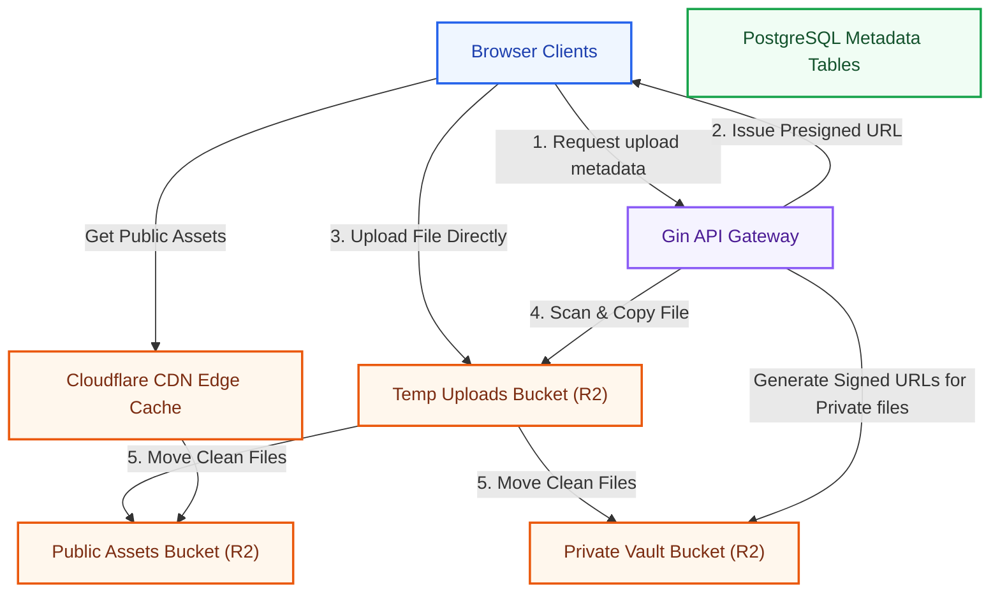
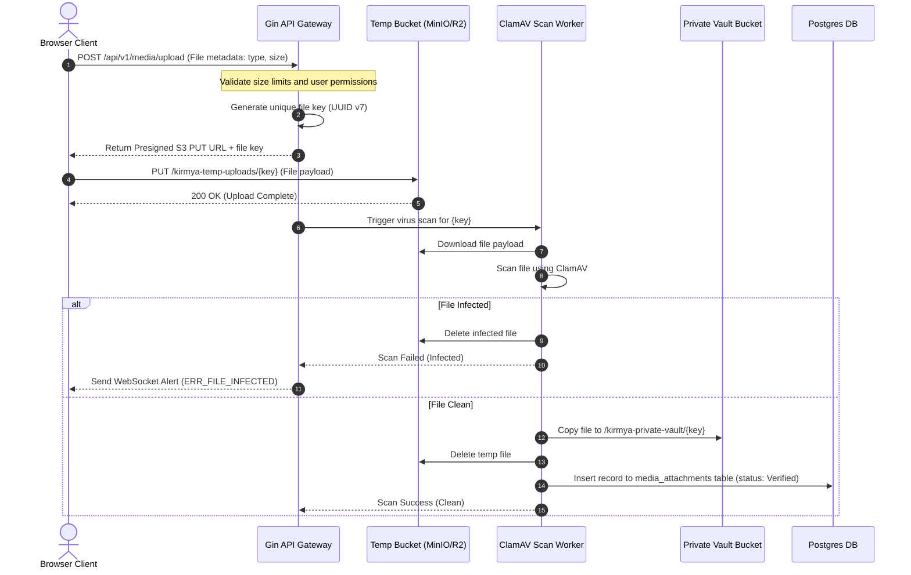
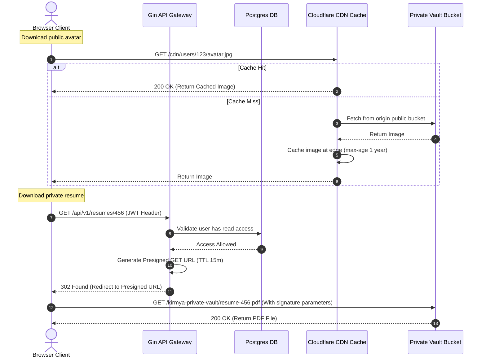
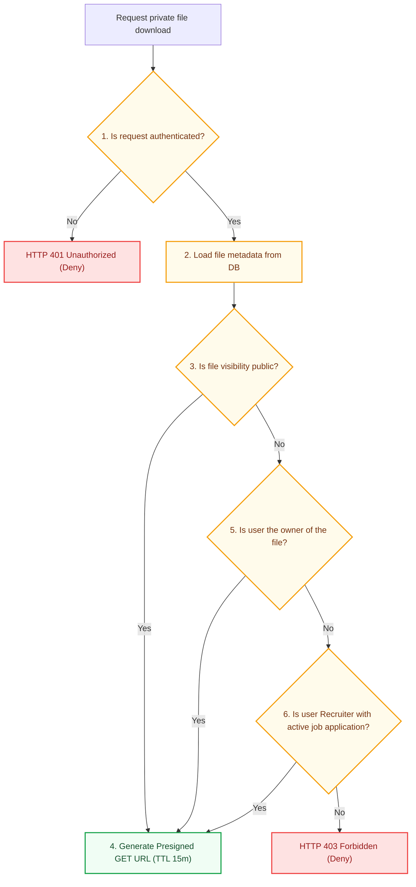
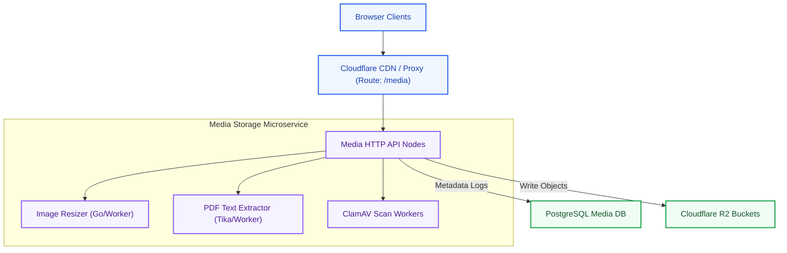

# File Storage Platform Architecture: Kirmya Storage Tier
**Document Identifier:** PL-AR-14 | **Status:** Approved / Core Reference | **Version:** 1.0.0  
**Authors:** Antigravity AI & Cloud Storage Group | **Date:** July 24, 2026

---

## Document Control & Meta-Information

### Version History
| Version | Date | Author | Description |
| :--- | :--- | :--- | :--- |
| `0.1.0` | 2026-07-20 | Antigravity AI | Initial MinIO bucket maps outline. |
| `0.5.0` | 2026-07-22 | Antigravity AI | Integrated presigned URL flows and R2 lifecycle rules. |
| `1.0.0` | 2026-07-24 | Antigravity AI | Completed full File Storage Platform Architecture Blueprint incorporating all specific sections. |

### Document Distribution
* **Product Strategy Group**: Storage workflows validation.
* **Engineering Leads**: Storage API client implementation.
* **DevOps Team**: Cloudflare R2 and CDN cache settings.
* **Security & Compliance**: Encryption keys audit.

---

## 1. Related Documents
- [00-documentation-standards.md](file:///c:/Users/PRASHANTH/Documents/real/my_project/docs/product/00-documentation-standards.md)
- [01-system-architecture.md](file:///c:/Users/PRASHANTH/Documents/real/my_project/docs/architecture/01-system-architecture.md)
- [02-modular-monolith-architecture.md](file:///c:/Users/PRASHANTH/Documents/real/my_project/docs/architecture/02-modular-monolith-architecture.md)
- [03-module-boundaries.md](file:///c:/Users/PRASHANTH/Documents/real/my_project/docs/architecture/03-module-boundaries.md)
- [04-backend-architecture.md](file:///c:/Users/PRASHANTH/Documents/real/my_project/docs/architecture/04-backend-architecture.md)
- [08-database-architecture.md](file:///c:/Users/PRASHANTH/Documents/real/my_project/docs/architecture/08-database-architecture.md)

---

## 2. Dependencies
- File upload APIs conform to routes defined in [PL-AR-007 API Architecture Specification](file:///c:/Users/PRASHANTH/Documents/real/my_project/docs/architecture/07-api-architecture.md).
- Access validation logic integrates with rules in [PL-AR-010 Authorization & RBAC Blueprint](file:///c:/Users/PRASHANTH/Documents/real/my_project/docs/architecture/10-authorization-rbac.md).

---

## 3. Purpose
This document defines the file storage architecture for the Kirmya Professional Ecosystem. It specifies the object storage providers, bucket configurations, file key strategies, secure upload pipelines, and caching rules, ensuring data security and performance.

---

## 4. Scope
- **In-Scope**: Development MinIO setup, production Cloudflare R2 configurations, bucket segregation rules, folder key naming schemas, presigned URL upload workflows, ClamAV virus scanning, image processing rules, document versioning, and CDN caching policies.
- **Out-of-Scope**: Cloudflare DNS configurations and local network file system mountings.

---

## 5. Objectives
- Establish an S3-compatible file storage architecture.
- Define storage requirements for user, professional, company, and communication content.
- Design bucket layouts for public, private, and temporary files.
- Implement secure file upload workflows using presigned URLs and virus scanning.
- Optimize asset delivery using Cloudflare CDN edge caching.
- Create 5 detailed Mermaid diagrams modeling architectures, uploads, downloads, permissions, and extraction paths.

---

## 6. Executive Summary
Kirmya requires a secure, cost-effective, and scalable file storage platform to manage user assets (resumes, portfolios, avatars, company logos, and message attachments). 

To support local development and global cloud deployments, the storage system uses an **S3-Compatible Interface**:
- **Development**: Local **MinIO** instance.
- **Production**: **Cloudflare R2** (offering zero egress fees), with **Amazon S3** as a fallback.

Files are segregated into three buckets: public assets, private vaults, and a temporary bucket for virus scanning. 

Clients upload files directly using **Presigned URLs**, reducing backend resource utilization, and public assets are cached globally using Cloudflare CDN edge servers.

---

## 7. Detailed Content: File Storage Platform Architecture

### 7.1 Storage Goals
1. **Scalability**: Support millions of uploads without performance degradation.
2. **Security**: Encrypt files in transit (TLS 1.3) and at rest (AES-256), and respect user privacy settings.
3. **Cost Efficiency**: Minimize egress fees using Cloudflare R2's zero-egress cost model.
4. **Performance**: Load public assets in under 100ms globally using Cloudflare CDN edge caching.
5. **Reliability**: Target 99.99% storage availability using multi-region redundancy.

### 7.2 Storage Architecture Overview Diagram
This diagram illustrates the flow between client devices, the API gateway, metadata tables, and the object storage buckets:



---

### 7.3 Storage Types

#### User Content
- **Profile Pictures**: Small, web-optimized images (avatars). Max size 2MB. Stored in public buckets, cached on CDN.
- **Cover Images**: Banners for user profiles. Max size 5MB. Stored in public buckets, cached on CDN.
- **Documents**: General user uploads (non-profile files). Stored in private buckets.

#### Professional Content
- **Resumes**: Candidate CVs (PDF, DOCX formats). Max size 10MB. Stored in private vaults, requiring permission checks.
- **Certificates**: Academic and professional certifications (PDF, JPG). Max size 5MB. Stored in private vaults.
- **Portfolios**: Design assets, code archives, or case studies (ZIP, PDF, images). Max size 50MB. Stored in private vaults.

#### Company Content
- **Company Logos**: Corporate logos. Max size 2MB. Stored in public buckets, cached on CDN.
- **Company Banners**: Banners for company pages. Max size 5MB. Stored in public buckets, cached on CDN.
- **Company Media**: Promotional videos and corporate documents. Max size 100MB. Stored in public (images) or private (documents) buckets.

#### Communication Content
- **Message Attachments**: Files, images, and resumes sent via direct messaging. Max size 25MB. Stored in private vaults, restricted to conversation participants.

#### Community Content
- **Community Images**: Images shared in community feeds. Max size 10MB. Stored in public buckets.
- **Community Documents**: Files shared in community guilds. Max size 25MB. Stored in private vaults.

---

### 7.4 Object Storage Design (Buckets & Keys)
To enforce access control, files are organized into three dedicated buckets:

#### 1. Bucket Strategy
- `kirmya-public-assets`: Open read permissions. Access is routed through Cloudflare CDN caching.
- `kirmya-private-vault`: Read permissions restricted. Files require time-limited presigned GET URLs generated by the API gateway.
- `kirmya-temp-uploads`: Temporary bucket used for virus scanning. Files are deleted automatically after 24 hours.

#### 2. Key Naming Schema Standard
```
[ PUBLIC BUCKET KEYS ]
- Profile Avatars:     /users/{userID}/avatar-{timestamp}.jpg
- Company Logos:       /companies/{companyID}/logo-{timestamp}.png
- Company Banners:     /companies/{companyID}/banner.png
- Community Assets:    /communities/{communityID}/cover.jpg

[ PRIVATE BUCKET KEYS ]
- Resumes:             /users/{userID}/resumes/{resumeID}.pdf
- Portfolios:          /users/{userID}/portfolios/{portfolioID}-{name}.zip
- Chat Attachments:    /conversations/{conversationID}/attachments/{fileID}.pdf
- Escrow Contracts:    /freelancing/contracts/{contractID}.pdf
```

#### 3. Storage Lifecycle Rules
- **Temporary Uploads**: Lifecycle policy automatically deletes all files older than 24 hours.
- **Private Vault**: Older versions of resumes or portfolio items are archived to cold storage after 90 days, reducing storage costs.

---

### 7.5 Upload Architecture & Flow Diagram
Traces the sequence of requesting a presigned URL, direct-to-cloud upload, virus scanning, and metadata commits:



#### File Validation Rules
1. **Size Limits**: Enforced at the API gateway during the presigned URL request:
   - Profile Avatars: **2 MB**
   - Resumes & Certificates: **10 MB**
   - Message Attachments: **25 MB**
   - Portfolios & Job Attachments: **50 MB**
2. **File Type Validation**: Enforced using magic number checks (inspecting the first 512 bytes of the file stream) in the scanning worker, preventing extension spoofing. Allowed types:
   - Images: `image/jpeg`, `image/png`, `image/webp`.
   - Documents: `application/pdf`, `application/vnd.openxmlformats-officedocument.wordprocessingml.document` (DOCX).
   - Archives: `application/zip`.
3. **Malware Scanning**: All files uploaded to the temporary bucket are scanned by ClamAV. Infected files are deleted immediately and alert events are published to NATS.
4. **Metadata Extraction**: Clean files have their metadata extracted (file size, MD5 hash checksum, content-type, and image dimensions) before they are moved to permanent storage.

---

### 7.6 Download Architecture & Flow Diagram
Specifies the retrieval pathways for public and private assets:



---

### 7.7 Security Architecture
- **Encryption in Transit**: All connections terminate at Cloudflare using TLS 1.3, and communications between internal servers use TLS 1.3.
- **Encryption at Rest**: Files are encrypted in Cloudflare R2 using AES-256 with platform-managed keys (SSE-S3) or customer-managed keys (SSE-KMS) for corporate data compliance.
- **Access Control Policies**: Buckets are configured with strict S3 bucket policies:
  - `kirmya-public-assets`: Open read permissions for CDN edge servers, write access restricted.
  - `kirmya-private-vault`: Read and write permissions restricted. Objects are accessible only using time-limited presigned URLs.
- **Abuse Prevention**: Upload endpoints are rate-limited (e.g. maximum 10 upload requests per user per minute).

---

### 7.8 Permission Validation Flow
Shows the steps taken to validate user access before a private document download is authorized:



---

### 7.9 Database Integration & Schema
File metadata is stored in PostgreSQL to track ownership, verification status, and object paths.

#### Why Binary Files Should Not Be Stored Directly in PostgreSQL (bytea)
1. **Page Size Inflation**: PostgreSQL pages are 8KB. Large binary files trigger **TOAST** (The Oversized-Attribute Storage Technique) compression and chunking, causing overhead.
2. **Buffer Cache Pollution**: Large binary files read into memory displace transactional database indexes and query results from the buffer cache, degrading query performance.
3. **Backup Bloat**: Storing binaries in the database increases database dump sizes, making backups and point-in-time recovery slow.

#### Logical Metadata Schema (`media_attachments`)
- `id`: UUID v7 primary key.
- `owner_id`: UUID v7 logical reference ID (User or Company).
- `storage_path`: String (S3 key URI, e.g. `/users/123/resumes/abc.pdf`).
- `file_type`: String (MIME content-type, e.g. `application/pdf`).
- `size`: BigInt (File size in bytes).
- `hash`: String (MD5 checksum hash).
- `visibility`: String (enum: `public`, `private`).
- `status`: String (enum: `pending_scan`, `verified`, `infected`).
- `created_at`: Timestamp.

---

### 7.10 Image & Document Processing

#### Image Processing
- **Format Conversion**: Uploaded PNG and JPEG images are converted to **WebP** or **AVIF** formats to reduce file sizes.
- **Resizing & Compression**: The image service generates multiple resolutions for profile pictures (e.g. 150x150 for avatars, 800x600 for thumbnails) and compresses them to target sizes, saving bandwidth.
- **Bilingual Delivery**: Cloudflare CDN routes queries to local caches, delivering assets with minimal latency.

#### Document Processing
- **PDF Text Extraction**: Resumes uploaded in PDF or DOCX formats are processed using text extraction utilities (e.g. Apache Tika wrapper).
- **AI Preparation**: Extracted text is normalized, stripped of formatting, and tokenized, making it ready for parsing and similarity scoring by the AI career assistant.
- **Version Management**: Resumes store up to 5 historical versions. Older versions are archived to cold storage to manage costs.

---

### 7.11 Backup and Disaster Recovery
- **Replication**: Cloudflare R2 is configured with active replication to a secondary region (e.g. duplicating data between UAE and EU storage clusters).
- **Backup Strategy**: Monthly snapshot backups of the `kirmya-private-vault` bucket are exported to an independent S3 bucket using `rclone` utility scripts.
- **Data Retention**: Deleted files are soft-deleted first. The metadata status is set to `Deleted` and the file is moved to an archive path, before it is permanently deleted by a lifecycle policy after 30 days.

---

### 7.12 Future Service Extraction
As storage requirements and processing workloads scale, the file storage package can transition to an independent media microservice:



---

## 16. Functional Requirements Mapping
- **FR-MSG-ATTACH**: Messaging attachments are uploaded to `kirmya-private-vault` and access is restricted to conversation participants.
- **FR-COMP-BRAND**: Banners and logos are saved to `kirmya-public-assets` and cached globally on Cloudflare edge servers.

---

## 17. Non-Functional Requirements Verification
- **NFR-SEC-004 (Attachment Scanning)**: All uploads are scanned by ClamAV in the temporary bucket before they are moved to permanent storage.
- **NFR-PER-005 (Download speed)**: Public assets load in under 100ms globally, verified by CDN edge caching performance checks.

---

## 18. Business Rules Mapping
- **BR-FREE-ESCROW**: Signed contracts are saved in the private vault, and access is restricted to the client, freelancer, and platform moderators.
- **BR-COMP-SEATS**: Recruiter access is verified before company banners or job descriptions can be uploaded.

---

## 19. Assumptions
- Cloudflare R2 maintains 99.9% availability for object reads and writes.
- Antivirus definition databases (ClamAV) update daily to detect new threats.

---

## 20. Constraints
- Files cannot be uploaded directly to the permanent buckets; all uploads must route through `kirmya-temp-uploads` for virus scanning.
- Public buckets are write-restricted, allowing modifications only from internal service accounts.

---

## 21. Risks
- **Scan Failures**: High upload volumes can overload the virus scanning worker, causing delivery delays. *Mitigation*: Deploy multiple scan worker instances configured to scale based on queue depth.
- **Cache Poisoning**: Attackers might attempt to upload malicious files configured to bypass cache keys. *Mitigation*: Strip metadata from public images and force unique, random filenames for cached assets.

---

## 22. Open Questions
- What data sovereignty and storage residency rules apply to user files in the GCC region?
- What are the storage requirements for archiving historical candidate resumes?

---

## 23. Future Improvements
- Implement automated image optimization (resizing and converting images to WebP) during the upload pipeline.
- Transition from ClamAV to an advanced cloud-native threat protection API as upload volumes grow.

---

## 24. Acceptance Criteria
The storage platform implementation must meet these standards to be marked complete:

| Rule | Verification Checkpoint | Target |
| :--- | :--- | :--- |
| **No Direct Uploads**| All uploads route through the temporary scanning bucket. | 100% compliance |
| **Presigned URLs** | Clients upload files directly using presigned URLs. | 100% compliance |
| **Bilingual Assets** | Document upload APIs support Arabic file encoding. | Mandatory |
| **Egress Fees** | Production storage utilizes Cloudflare R2. | Pass |

---

## 25. Success Metrics
- Average public asset load times remain under 100ms.
- 100% of uploaded files are scanned for viruses before they are moved to permanent storage.

---

## 26. Glossary
- **MinIO**: An open-source, high-performance, S3-compatible object storage server.
- **R2**: Cloudflare's S3-compatible object storage service, featuring zero egress fees.
- **Presigned URL**: A URL generated by the storage API that grants time-limited write or read access to a specific object.

---

## 27. References
- [Cloudflare R2 Developer Guide](https://developers.cloudflare.com/r2/)
- [MinIO Server Documentation](https://min.io/docs/minio/linux/index.html)
- [ClamAV Antivirus Documentation](https://www.clamav.net/documents/)

---

## 28. Revision History
| Version | Date | Author | Description |
| :--- | :--- | :--- | :--- |
| `1.0.0` | 2026-07-24 | Antigravity AI | Finished Kirmya File Storage Platform blueprint. |
