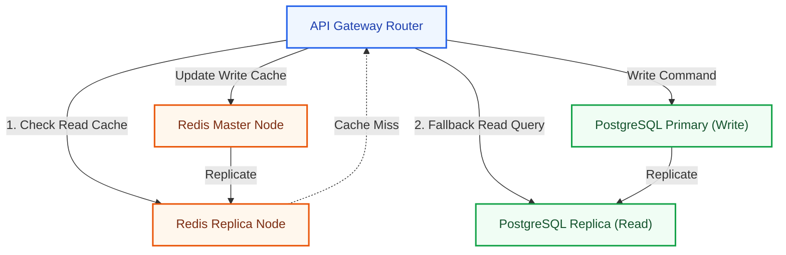
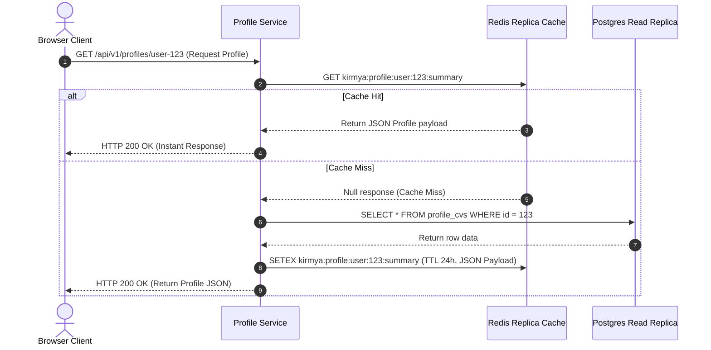
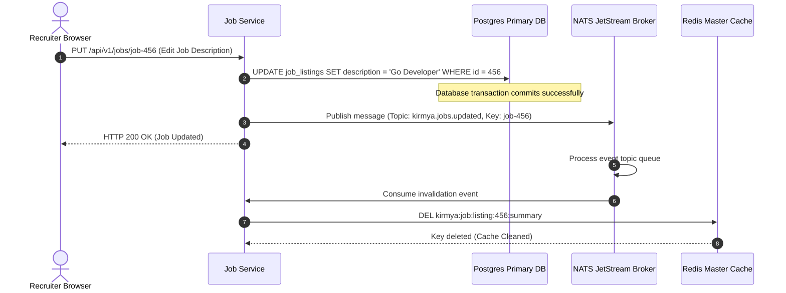
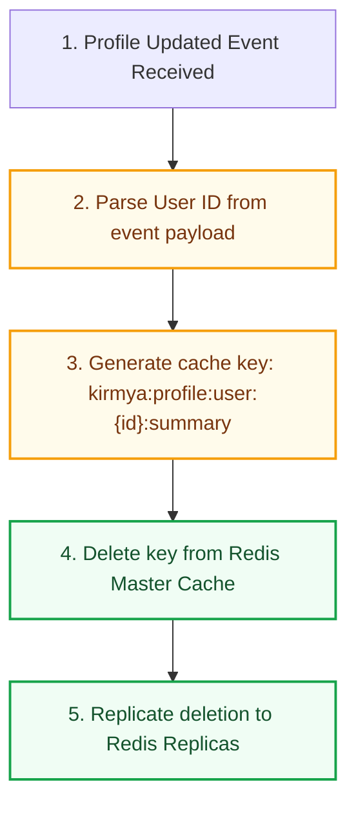

# Caching Architecture Specification: Kirmya Performance Tier
**Document Identifier:** PL-AR-15 | **Status:** Approved / Core Reference | **Version:** 1.0.0  
**Authors:** Antigravity AI & Performance Engineering Group | **Date:** July 24, 2026

---

## Document Control & Meta-Information

### Version History
| Version | Date | Author | Description |
| :--- | :--- | :--- | :--- |
| `0.1.0` | 2026-07-20 | Antigravity AI | Initial Redis key namespace drafts. |
| `0.5.0` | 2026-07-22 | Antigravity AI | Integrated stampede locks and Sentinel failover topologies. |
| `1.0.0` | 2026-07-24 | Antigravity AI | Completed full Caching Architecture Specification for Board approval. |

### Document Distribution
* **Product Strategy Group**: Sourcing response latencies verification.
* **Engineering Leads**: Cache client implementation guidelines.
* **DevOps Team**: Redis Sentinel clusters configurations.
* **Security & Compliance**: Encryption of cached PII tokens.

---

## 1. Related Documents
- [00-documentation-standards.md](file:///c:/Users/PRASHANTH/Documents/real/my_project/docs/product/00-documentation-standards.md)
- [01-system-architecture.md](file:///c:/Users/PRASHANTH/Documents/real/my_project/docs/architecture/01-system-architecture.md)
- [02-modular-monolith-architecture.md](file:///c:/Users/PRASHANTH/Documents/real/my_project/docs/architecture/02-modular-monolith-architecture.md)
- [04-backend-architecture.md](file:///c:/Users/PRASHANTH/Documents/real/my_project/docs/architecture/04-backend-architecture.md)
- [07-api-architecture.md](file:///c:/Users/PRASHANTH/Documents/real/my_project/docs/architecture/07-api-architecture.md)
- [08-database-architecture.md](file:///c:/Users/PRASHANTH/Documents/real/my_project/docs/architecture/08-database-architecture.md)

---

## 2. Dependencies
- Cache operations integrate with transactional contexts defined in [PL-AR-004 Backend Architecture Blueprint](file:///c:/Users/PRASHANTH/Documents/real/my_project/docs/architecture/04-backend-architecture.md).
- Database entities mapping aligns with schemas in [PL-AR-008 Database Architecture Blueprint](file:///c:/Users/PRASHANTH/Documents/real/my_project/docs/architecture/08-database-architecture.md).

---

## 3. Purpose
This document defines the caching architecture for the Kirmya Professional Ecosystem. It specifies the caching patterns, key structures, consistency rules, high-availability setups, and stampede mitigations, ensuring system performance and database protection.

---

## 4. Scope
- **In-Scope**: Redis cache layouts, Cache-Aside/Write-Through/Write-Behind/Refresh-Ahead pattern applications, cacheable namespaces, key naming conventions, NATS event invalidations, Sentinel failover topologies, and stampede locks.
- **Out-of-Scope**: Code-level Redis connection pool configuration parameters.

---

## 5. Objectives
- Establish a caching strategy using Redis to achieve sub-5ms read latencies.
- Define caching strategies for profiles, companies, jobs, communities, notifications, and settings.
- Standardize on key naming conventions.
- Implement event-driven cache invalidation workflows using NATS JetStream.
- Mitigate cache stampedes using single-flight query deduplication.
- Create 4 detailed Mermaid diagrams modeling topologies, sequences, invalidations, and failover architectures.

---

## 6. Executive Summary
Kirmya requires a high-performance caching tier to support sub-10ms response times for read-heavy operations, handle high concurrent loads, and protect the primary PostgreSQL database from resource exhaustion. 

The platform utilizes **Redis** as its primary caching technology:
- **Development**: Local Redis container.
- **Production**: Managed Redis service configured in a High-Availability (HA) replica topology.

Caching strategies are tailored by data type: Cache-Aside is used for profiles and jobs, Write-Through for user preferences, Write-Behind for non-critical writes (e.g. analytics events), and Refresh-Ahead for trending datasets. 

Cache consistency is maintained using event-driven invalidation via NATS JetStream, and cache stampedes are prevented using single-flight query deduplication.

---

## 7. Detailed Content: Caching Architecture Specifications

### 7.1 Caching Goals
1. **Reduce Database Load**: Offload over 80% of read queries from PostgreSQL to Redis.
2. **Improve Response Times**: Achieve sub-5ms read latencies for cached data.
3. **Support Scalability**: Enable the platform to scale to support over 10 million active users.
4. **Improve User Experience**: Render profiles, job listings, and dashboards instantly.

### 7.2 Cache Architecture Overview Diagram
This diagram shows the relationship between client API routers, Redis cache pools, and PostgreSQL primary/replica databases:

---

### 7.3 Caching Strategies
We apply four caching patterns depending on data characteristics:

#### Cache-Aside (Lazy Loading)
- *Process*: The application queries Redis first. On a cache miss, it reads from the database and populates Redis.
- *Usage*: User profiles, company profiles, and job listings.

#### Write-Through
- *Process*: Updates write to the database and Redis simultaneously in a single transaction, ensuring cache consistency.
- *Usage*: User settings and preferences.

#### Write-Behind (Write-Back)
- *Process*: Writes are buffered in Redis lists and committed to PostgreSQL in batches by background workers, optimizing write performance.
- *Usage*: Non-critical transactional data (e.g. page views or analytics events).

#### Refresh-Ahead
- *Process*: Background tasks reload cached items before they expire, minimizing cache misses for popular keys.
- *Usage*: Trending jobs, popular search terms, and active guilds.

---

### 7.4 Cacheable Data Mappings

| Datastore Segment | Caching Pattern | Key Namespace | TTL Configuration | Eviction Priority |
| :--- | :--- | :--- | :--- | :--- |
| **Profile Summary** | Cache-Aside | `kirmya:profile:user:{userID}:summary` | 24 Hours | Medium |
| **Company Details** | Cache-Aside | `kirmya:company:profile:{companyID}:details` | 24 Hours | Low |
| **Job Details** | Cache-Aside | `kirmya:job:listing:{jobID}:summary` | 1 Hour | High |
| **Trending Guilds** | Refresh-Ahead | `kirmya:community:trending:guilds` | 12 Hours | Low |
| **Unread Alerts** | Cache-Aside | `kirmya:notification:unread:user:{userID}` | 5 Minutes | High |
| **User Settings** | Write-Through | `kirmya:settings:user:{userID}:preferences` | 7 Days | Low |

---

### 7.5 Cache Key Design
- **Naming Conventions**: Keys must follow a structured namespace convention to prevent collisions across modules:
  `kirmya:{module}:{resource}:{identifier}:{attribute}` (using colon separators and lowercase kebab-case keys).
- **Expiration Rules**: All cached data must be set with an explicit Time-To-Live (TTL) expiration fallback to prevent stale reads.
- **Versioning**: When cached payload schemas change, the version tag inside keys is incremented (e.g., `kirmya:v1:profile:user...` to `kirmya:v2:profile:user...`) to invalidate legacy cache formats.
- **Key Namespace Examples**:
  - Profile: `kirmya:profile:user:7fbe8d92-231a-4c28-98f5-19a9a3b83ef2:summary`
  - Job: `kirmya:job:listing:123:summary`
  - Settings: `kirmya:settings:user:456:preferences`

---

### 7.6 Cache Expiration Strategy
- **TTL Management**: Keys configure specific lifetimes based on change frequency and data size.
- **Short-Lived Cache**: Dynamic metrics (e.g. unread message counts, search term autocomplete suggestion arrays) are cached with short lifetimes: **5 to 15 minutes**.
- **Long-Lived Cache**: Semi-static resources (e.g. company profiles, user settings, localized templates) are cached with longer lifetimes: **1 to 7 days**.
- **Manual Invalidation**: Admin dashboards can execute targeted invalidations (e.g. deleting `kirmya:job:listing:*`) to force cache refreshes during system maintenance.

---

### 7.7 Cache Invalidation Strategy
- **Event-Based Invalidation**: When a module writes to PostgreSQL (e.g., updating a profile), it publishes an event to NATS JetStream. The search/caching consumer handles this event and deletes the corresponding Redis key.
- **Update Flow**:
  1. User updates profile data.
  2. The application commits the changes to PostgreSQL.
  3. The application publishes a `kirmya.profile.updated` event to NATS.
  4. The caching consumer receives the event and deletes the cached key.
  5. Subsequent read requests miss the cache and load the updated data from the database.

---

### 7.8 Request Flow Sequence Diagram
Traces how requests route to Redis caches and fallback to PostgreSQL replicas:

---

### 7.9 Cache Invalidation Sequence Diagram
Illustrates how database writes trigger invalidation events via NATS to evict stale cache entries:

---

### 7.10 Event Driven Cache Update Flow
Illustrates the event-driven cache update flow:

---

### 7.11 Redis Data Structures Usage Policy

- **Strings**:
  - *Usage*: Profile summaries, job details, and other JSON payloads.
  - *Why*: Direct key-value storage with TTL support.
- **Hashes**:
  - *Usage*: Active user session fields (e.g. `user_id`, `role`, `ip_address`).
  - *Why*: Allows querying and updating individual fields without deserializing the entire object.
- **Lists**:
  - *Usage*: Background task queues and Write-Behind logs.
  - *Why*: Supports fast LPUSH/RPOP operations for task workers.
- **Sets**:
  - *Usage*: Tracking unique active connections.
  - *Why*: Ensures uniqueness and supports set operations (e.g. SADD/SREM).
- **Sorted Sets (ZSET)**:
  - *Usage*: Autocomplete term weights and leaderboard scores.
  - *Why*: Elements are sorted by score, allowing fast range queries.
- **Streams**:
  - *Usage*: High-volume log collation and audit event tracking.
  - *Why*: Provides persistent message streaming with consumer group support.

---

### 7.12 Distributed Systems Considerations
- **Race Conditions**: Parallel updates can cause write-ordering issues. *Mitigation*: Use Redis distributed locks (**Redlock**) to ensure only one worker updates a resource at a time.
- **Cache Stampede**: High-frequency key expiration can cause concurrent database requests that exhaust connection pools. *Mitigation*: Integrate Go's `singleflight` package to execute only one database query on a cache miss.
- **Hot Keys**: A single key queried by millions of users can overload a Redis node. *Mitigation*: Enable replica read scaling to distribute read traffic.
- **Consistency**: High transactional integrity requires cache updates to commit within the same database transaction.
- **Failover**: Sentinel nodes monitor Master availability and promote replicas automatically on node failures.

---

### 7.13 Performance & Security Strategy
- **Response Latency Target**: Cache reads (P95) must complete in under 5ms, protecting database capacity.
- **Database Load Reduction**: Offload over 80% of read traffic from PostgreSQL replicas to Redis.
- **Sensitive Data Isolation**: Raw passwords, session tokens, and sensitive PII are prohibited in Redis payloads.
- **Access Control**: Redis instances are isolated within a private VPC, requiring password validation (AUTH) and TLS-secured connections.

### 7.14 Background Jobs Integration
- **NATS Connection**: Invalidation events are published to NATS JetStream when database transactions commit.
- **Workers**: Background workers subscribe to NATS topics, parsing payloads and deleting corresponding Redis keys.
- **Scheduled Tasks**: Cron jobs run weekly to audit cache hit rates and evict orphaned keys.

---

### 7.15 Future Scaling
- **Current Phase**: Redis Sentinel topology manages high availability for a shared monolith instance.
- **Future Phase**: Caching infrastructure transitions to a distributed **Redis Cluster** configured with hash slot partitioning to distribute workloads horizontally.
- **Multi-Region Caching**: Local caching clusters are deployed in each region (e.g. UAE and EU), using local write-through caching to minimize network latency.

---

## 16. Functional Requirements Mapping
- **FR-AUTH-SSO**: Session states are cached in Redis under the `kirmya:auth:session` namespace.
- **FR-LOC-AR**: Localized templates are cached in Redis to minimize file system read workloads.

---

## 17. Non-Functional Requirements Verification
- **NFR-PER-005 (Response Latency)**: Caching read-heavy operations in Redis keeps read latencies under 5ms, protecting database capacity.
- **NFR-AV-001 (Platform Uptime SLO >= 99.9%)**: Managed by deploying Redis Sentinel clusters in multiple availability zones.

---

## 18. Business Rules Mapping
- **BR-AUTH-SEATS**: Recruiter seat configurations are cached in Redis under the `companyModule` namespace to validate search queries without database calls.
- **BR-SCH-VISIBILITY**: Private profile settings are cached to ensure privacy filters are applied instantly.

---

## 19. Assumptions
- Redis Sentinel consensus checks complete in under 5 seconds during master node failures.
- Caching nodes have sufficient memory to prevent premature evictions of high-priority keys.

---

## 20. Constraints
- Caching modules cannot bypass the namespace prefix policy, preventing key collisions.
- Raw passwords and sensitive PII are prohibited in cache payloads.

---

## 21. Risks
- **Cache Drift**: Stale cache data can be returned to clients if invalidation events are lost. *Mitigation*: Configure all cached keys with an explicit Time-To-Live (TTL) expiration fallback.
- **Memory Starvation**: High traffic volumes can exhaust Redis container memory. *Mitigation*: Configure alerts to trigger when memory utilization exceeds 80%.

---

## 22. Open Questions
- What eviction policies should be applied to session keys to prevent users from being logged out prematurely?
- What are the bandwidth requirements for syncing data between Redis nodes across regions?

---

## 23. Future Improvements
- Migrate from Redis Sentinel to a distributed Redis Cluster sharded topology as data volumes scale.
- Implement cache warms scripts to pre-populate caches before peak traffic hours.

---

## 24. Acceptance Criteria
The caching platform implementation must satisfy these standards to be marked complete:

| Rule | Verification Checkpoint | Target |
| :--- | :--- | :--- |
| **LRU Policies** | Redis eviction is configured to use allkeys-lru. | 100% compliance |
| **Namespace Prefixes**| Keys comply with namespace guidelines. | 100% compliance |
| **Query Deduplication**| Single-flight deduplication is integrated. | Mandatory |
| **Failover Checks** | Sentinels monitor nodes and manage failovers. | Pass |

---

## 25. Success Metrics
- Cache hit rates (P95) remain above 80%.
- Average read latencies for cached data remain under 5ms.

---

## 26. Glossary
- **Sentinel**: A system designed to monitor Redis instances and manage automatic failovers.
- **LRU**: Least Recently Used, a cache eviction algorithm that discards the least recently accessed keys first.
- **Single-Flight**: A deduplication technique that groups concurrent duplicate queries to execute only one database query.

---

## 27. References
- [Redis Official Documentation](https://redis.io/docs/)
- [Redis Sentinel Architecture Guidelines](https://redis.io/docs/management/sentinel/)
- [Single-Flight Package Documentation](https://pkg.go.dev/golang.org/x/sync/singleflight)

---

## 28. Revision History
| Version | Date | Author | Description |
| :--- | :--- | :--- | :--- |
| `1.0.0` | 2026-07-24 | Antigravity AI | Finished Kirmya Caching Platform blueprint. |
