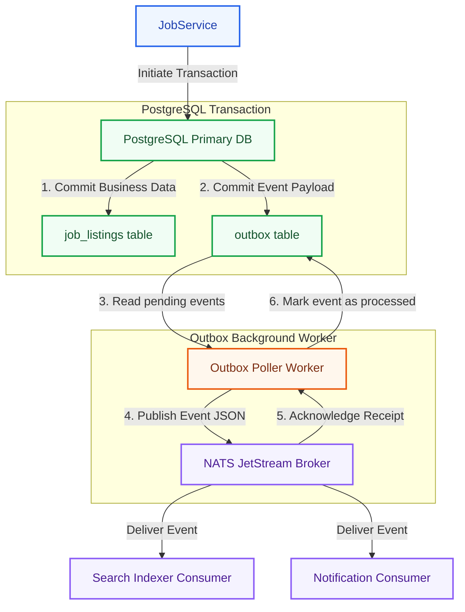
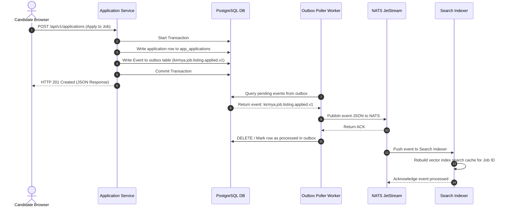
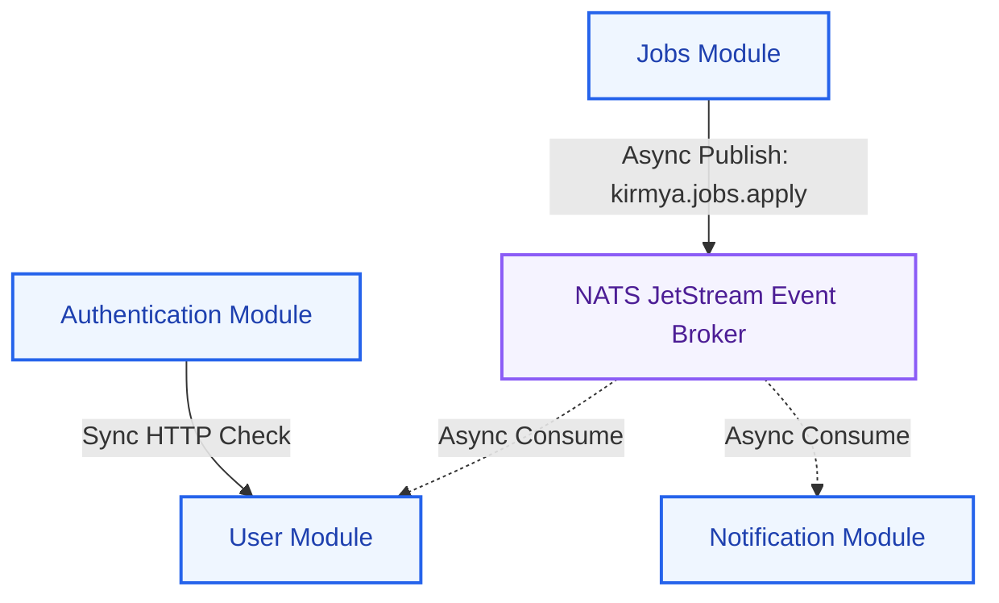
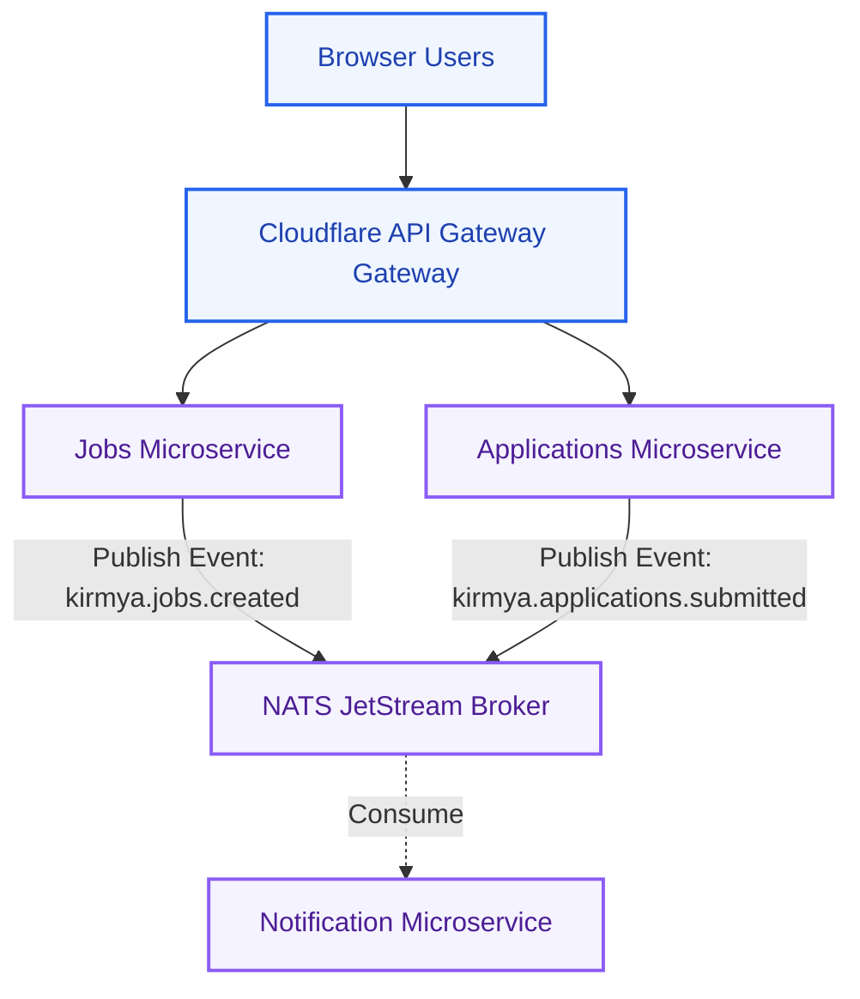

# Event-Driven Architecture Specification: Kirmya Messaging Tier
**Document Identifier:** PL-AR-16 | **Status:** Approved / Core Reference | **Version:** 1.0.0  
**Authors:** Antigravity AI & Event-Driven Systems Group | **Date:** July 24, 2026

---

## Document Control & Meta-Information

### Version History
| Version | Date | Author | Description |
| :--- | :--- | :--- | :--- |
| `0.1.0` | 2026-07-20 | Antigravity AI | Initial NATS JetStream topic mappings. |
| `0.5.0` | 2026-07-22 | Antigravity AI | Integrated outbox patterns and retry flowcharts. |
| `1.0.0` | 2026-07-24 | Antigravity AI | Completed full Event-Driven Architecture Specification. |

### Document Distribution
* **Product Strategy Group**: Sourcing event flows verification.
* **Engineering Leads**: Event handler implementation guidelines.
* **DevOps Team**: NATS JetStream and Kafka brokers sizing.
* **Security & Compliance**: Audit table logging compliance.

---

## 1. Related Documents
- [00-documentation-standards.md](file:///c:/Users/PRASHANTH/Documents/real/my_project/docs/product/00-documentation-standards.md)
- [01-system-architecture.md](file:///c:/Users/PRASHANTH/Documents/real/my_project/docs/architecture/01-system-architecture.md)
- [02-modular-monolith-architecture.md](file:///c:/Users/PRASHANTH/Documents/real/my_project/docs/architecture/02-modular-monolith-architecture.md)
- [03-module-boundaries.md](file:///c:/Users/PRASHANTH/Documents/real/my_project/docs/architecture/03-module-boundaries.md)
- [04-backend-architecture.md](file:///c:/Users/PRASHANTH/Documents/real/my_project/docs/architecture/04-backend-architecture.md)

---

## 2. Dependencies
- Event payload consumer structs integrate with definitions in [PL-AR-004 Backend Architecture Blueprint](file:///c:/Users/PRASHANTH/Documents/real/my_project/docs/architecture/04-backend-architecture.md).
- Outbox database configurations align with schema rules in [PL-AR-008 Database Architecture Blueprint](file:///c:/Users/PRASHANTH/Documents/real/my_project/docs/architecture/08-database-architecture.md).

---

## 3. Purpose
This document defines the event-driven architecture for the Kirmya Professional Ecosystem. It specifies the message broker topologies, event naming conventions, JSON schema structures, reliable delivery mechanisms, and transactional outbox patterns, ensuring decoupled communications.

---

## 4. Scope
- **In-Scope**: NATS JetStream configurations, event schema definitions, 7 event categories, transaction outbox schemas, backoff retry queues, DLQ routing, and future Kafka roadmap guidelines.
- **Out-of-Scope**: Code-level client connection pooling and third-party SMTP server parameters.

---

## 5. Objectives
- Establish an event-driven architecture to enable loose coupling between monolith modules.
- Outline NATS JetStream as the primary message broker, with Kafka as a future roadmap target.
- Standardize event naming conventions and metadata schemas.
- Implement the Transactional Outbox Pattern to guarantee message delivery.
- Create 4 detailed Mermaid diagrams modeling topologies, sequences, boundaries, and microservices extractions.

---

## 6. Executive Summary
Kirmya uses an **Event-Driven Architecture (EDA)** to support loose coupling, asynchronous background processing, and microservices readiness. 

The platform utilizes **NATS JetStream** as its primary message broker for high-performance and reliable message queuing:
- **Modular Monolith**: Modules communicate asynchronously by publishing events to NATS topics.
- **Transactional Consistency**: To prevent dual-write failures (e.g. database commits succeeding but event publishing failing), we implement the **Transactional Outbox Pattern**. All events are committed to a local `outbox` table in the same transaction as business data.
- **Future Scale**: The architecture allows a future migration to **Apache Kafka** for large-scale data and clickstream ingestion.

---

## 7. Event-Driven Architecture Specifications

### 7.1 Event Architecture Principles
1. **Loose Coupling**: Modules publish events without knowing which modules consume them, maintaining isolation.
2. **Asynchronous Communication**: Long-running operations (e.g., sending emails or generating AI matches) are offloaded to background workers.
3. **Reliability**: At-least-once delivery guarantees are managed using outbox tables and retry queues.
4. **Scalability**: Workers can scale horizontally to distribute processing workloads.
5. **Event Ownership**: A module owns its event definitions; other modules must conform to these schemas.
6. **Versioning**: Event schema changes require version numbers (e.g. `v1`, `v2`) to ensure backward compatibility.

### 7.2 Event Bus Architecture
This diagram illustrates the relationship between database transactions, outbox tables, NATS JetStream channels, and consumer applications:



---

### 7.3 Event Categories
Domain events are categorized by business context. Examples:

#### User Events (Prefix: `auth_` / `usr_`)
- `UserCreated`: Published when a user signs up.
- `UserVerified`: Published when a user completes email verification.
- `UserUpdated`: Published when account details change.

#### Profile Events (Prefix: `profile_`)
- `ProfileCompleted`: Published when a candidate profile reaches 100% completion.
- `SkillAdded`: Published when a candidate adds a skill node.

#### Job Events (Prefix: `job_`)
- `JobCreated`: Published when a recruiter posts a new job listing.
- `JobApplied`: Published when a candidate applies to a job.
- `JobClosed`: Published when a job listing expires or is closed.

#### Messaging Events (Prefix: `msg_`)
- `MessageSent`: Published when a user sends a message.
- `MessageRead`: Published when a recipient reads a message.

#### Community Events (Prefix: `comm_`)
- `CommunityCreated`: Published when a new Guild is created.
- `MemberJoined`: Published when a user joins a Guild.

#### Freelance Events (Prefix: `free_`)
- `ProjectCreated`: Published when a client posts a freelance project.
- `ProposalSubmitted`: Published when a freelancer submits a proposal.

#### AI Events (Prefix: `ai_`)
- `ResumeAnalyzed`: Published when the AI parses a resume.
- `MatchGenerated`: Published when candidate similarity scores are updated.

---

### 7.4 Event Naming Standards
- **Naming Convention**: `kirmya.{module}.{resource}.{event}.v{version}` (all lowercase, dot-delimited).
- **Examples**:
  - `kirmya.auth.user.created.v1`
  - `kirmya.job.listing.applied.v1`
  - `kirmya.freelance.proposal.submitted.v1`

### 7.5 Event Schema Design
All events must conform to a standardized JSON schema:

```json
{
  "event_id": "7fbe8d92-231a-4c28-98f5-19a9a3b83ef2",
  "timestamp": "2026-07-24T23:55:00Z",
  "source_module": "jobModule",
  "event_version": "1.0",
  "correlation_id": "a9e8f7d6-c5b4-a321-0987-6543210fedcba",
  "payload": {
    "job_id": "123",
    "company_id": "456",
    "title": "Go Developer",
    "status": "active"
  }
}
```

---

### 7.6 Event Flow Sequence Diagram (Job Application)
Traces a job application event from database commit to consumer updates:



---

### 7.7 Reliability & Idempotency Rules
- **Exponential Backoff**: If an event handler returns an error, NATS JetStream retries delivery with exponential backoff:
  `Delay = BaseDelay * 2^Attempt` (attempts capped at 5).
- **Dead Letter Queue (DLQ)**: If an event fails to process after 5 attempts, it is moved to the Dead Letter Queue (`kirmya.notify.dlq`) for manual review.
- **Idempotency**: All events include a unique `event_id` UUID. Consumers cache processed event IDs in Redis (TTL 24 hours), preventing duplicate event execution.

---

### 7.8 Module Communication Boundaries Diagram
This diagram shows the distinction between synchronous HTTP/REST communication paths and asynchronous NATS event-driven topic bindings:



---

### 7.9 Future Microservices Event Routing
As Kirmya's traffic scales, the monolith modules can transition to independent microservices communicating over a shared NATS JetStream broker:



---

## 16. Functional Requirements Mapping
- **FR-AUTH-MFA**: MFA validation failures publish security alerts to `kirmya.auth.security.lockout.v1` for instant email dispatch.
- **FR-FREE-ESCROW**: Payment transactions publish events to `kirmya.freelance.escrow.funded.v1`, triggering email updates.

---

## 17. Non-Functional Requirements Verification
- **NFR-AV-001 (Platform Uptime SLO >= 99.9%)**: Achieved using NATS JetStream to queue events, preventing data loss during database or network outages.
- **NFR-PER-005 (Response Latency)**: REST endpoints remain responsive by offloading long-running operations to background event workers.

---

## 18. Business Rules Mapping
- **BR-AUTH-LOCK**: Accounts are locked after 5 failed login attempts. *Realization*: Handled by publishing lockout events to notify security.
- **BR-FREE-DISPUTES**: Contract disputes trigger moderation events published to the admin module.

---

## 19. Assumptions
- NATS JetStream message retention policies are configured to preserve events during consumer offline windows.
- Database connection pools support concurrent outbox worker reads.

---

## 20. Constraints
- Direct SQL joins across schemas are prohibited in event handlers.
- Event schemas must remain backward compatible; breaking changes require version increments.

---

## 21. Risks
- **Dual-Write Failures**: The application database commit succeeds, but event publishing to the message broker fails. *Mitigation*: Enforce the Transactional Outbox Pattern to guarantee message delivery.
- **Outbox Worker Bottlenecks**: High transaction rates can saturate the outbox poller. *Mitigation*: Batch outbox reads and deploy multiple poller instances.

---

## 22. Open Questions
- What data retention policies apply to NATS JetStream message queues in the UAE?
- Should we encrypt event payloads, or rely on transport-level encryption?

---

## 23. Future Improvements
- Migrate from Redis Sentinel to a distributed Redis Cluster sharded topology as data volumes scale.
- Integrate an external policy decision engine to evaluate content moderation rules.

---

## 24. Acceptance Criteria
The event-driven system implementation must meet these standards to be marked complete:

| Rule | Verification Checkpoint | Target |
| :--- | :--- | :--- |
| **Outbox Usage** | All module events are written to the outbox table. | 100% compliance |
| **At-least-once** | Outbox workers guarantee message delivery. | 100% compliance |
| **Idempotency** | Event consumers verify keys in Redis. | Mandatory |
| **Decoupling** | Modules communicate asynchronously using events. | Pass |

---

## 25. Success Metrics
- Outbox poller latency (time from commit to publish) remains under 100ms.
- 100% of event delivery failures are recovered and processed.

---

## 26. Glossary
- **NATS JetStream**: A distributed messaging system that provides queueing and event retention guarantees.
- **DLQ**: Dead Letter Queue, a queue used to isolate messages that cannot be processed successfully.
- **Outbox Pattern**: A design pattern where events are written to a database table in the same transaction as business data, ensuring delivery.

---

## 27. References
- [NATS JetStream Documentation](https://docs.nats.io/nats-concepts/jetstream)
- [Enterprise Integration Patterns: Transactional Outbox](https://microservices.io/patterns/data/transactional-outbox.html)
- [Apache Kafka Documentation](https://kafka.apache.org/)

---

## 28. Revision History
| Version | Date | Author | Description |
| :--- | :--- | :--- | :--- |
| `1.0.0` | 2026-07-24 | Antigravity AI | Finished Kirmya Event-Driven Architecture blueprint. |
