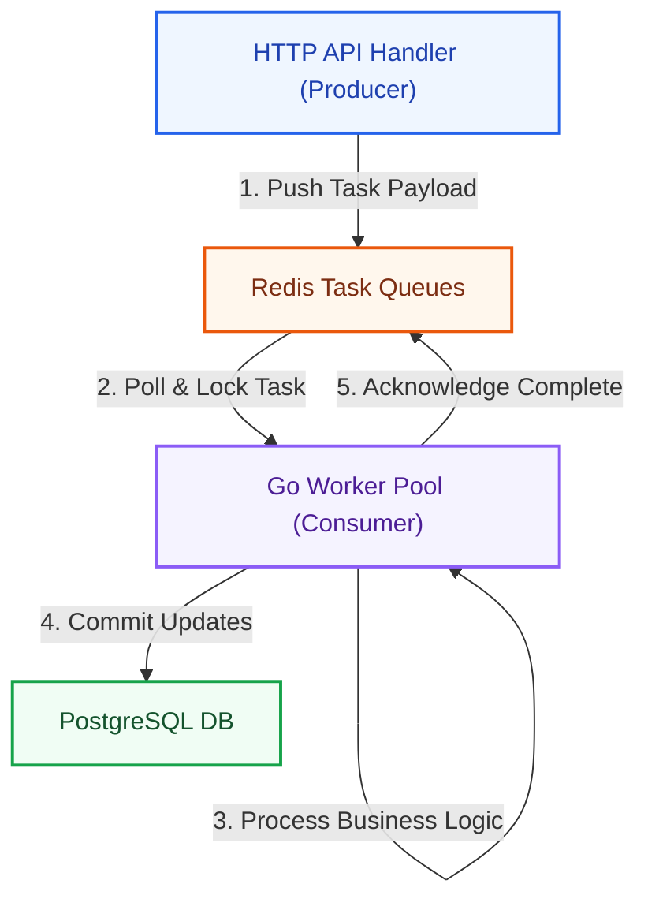
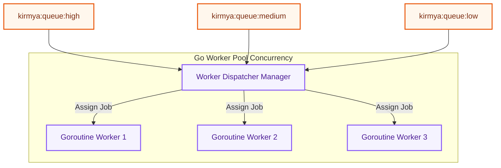
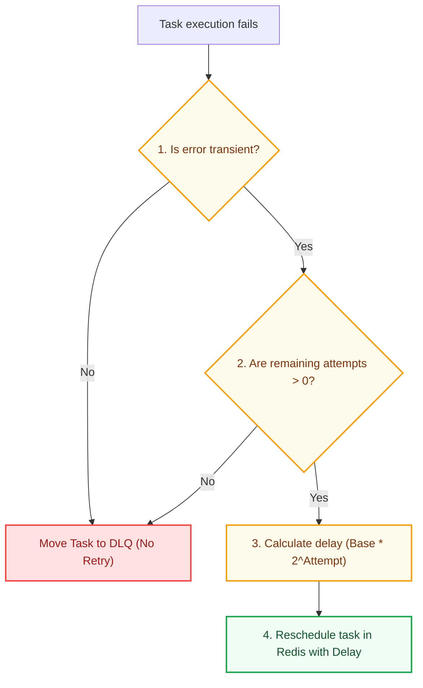

# Background Jobs & Task Processing Architecture: Kirmya Worker Tier
**Document Identifier:** PL-AR-17 | **Status:** Approved / Core Reference | **Version:** 1.0.0  
**Authors:** Antigravity AI & Distributed Infrastructure Group | **Date:** July 24, 2026

---

## Document Control & Meta-Information

### Version History
| Version | Date | Author | Description |
| :--- | :--- | :--- | :--- |
| `0.1.0` | 2026-07-20 | Antigravity AI | Initial task worker package drafts. |
| `0.5.0` | 2026-07-22 | Antigravity AI | Integrated Asynq/Redis queue topologies. |
| `1.0.0` | 2026-07-24 | Antigravity AI | Completed full Background Jobs Architecture Specification. |

### Document Distribution
* **Product Strategy Group**: Async processing workflows verification.
* **Engineering Leads**: Go worker pools implementation guidelines.
* **DevOps Team**: Redis queue clusters configuration.
* **Security & Compliance**: Job data sanitization verification.

---

## 1. Related Documents
- [00-documentation-standards.md](file:///c:/Users/PRASHANTH/Documents/real/my_project/docs/product/00-documentation-standards.md)
- [01-system-architecture.md](file:///c:/Users/PRASHANTH/Documents/real/my_project/docs/architecture/01-system-architecture.md)
- [02-modular-monolith-architecture.md](file:///c:/Users/PRASHANTH/Documents/real/my_project/docs/architecture/02-modular-monolith-architecture.md)
- [04-backend-architecture.md](file:///c:/Users/PRASHANTH/Documents/real/my_project/docs/architecture/04-backend-architecture.md)
- [08-database-architecture.md](file:///c:/Users/PRASHANTH/Documents/real/my_project/docs/architecture/08-database-architecture.md)
- [16-event-driven-architecture.md](file:///c:/Users/PRASHANTH/Documents/real/my_project/docs/architecture/16-event-driven-architecture.md)

---

## 2. Dependencies
- Job queues integrate with database transaction layouts in [PL-AR-008 Database Architecture Blueprint](file:///c:/Users/PRASHANTH/Documents/real/my_project/docs/architecture/08-database-architecture.md).
- Asynchronous events align with broker specifications in [PL-AR-016 Event-Driven Architecture Specification](file:///c:/Users/PRASHANTH/Documents/real/my_project/docs/architecture/16-event-driven-architecture.md).

---

## 3. Purpose
This document defines the background processing architecture for the Kirmya Professional Ecosystem. It specifies the worker pools, queue design, error handling, scheduling systems, and microservice extraction roadmaps, ensuring reliable async execution.

---

## 4. Scope
- **In-Scope**: Go worker pool allocations, Redis queue priority schemas, task retry backoffs, DLQ routing, daily/weekly schedulers, and worker monitoring metrics.
- **Out-of-Scope**: Code-level third-party scheduler library configuration details.

---

## 5. Objectives
- Establish a background processing architecture using Go worker pools and Redis queues.
- Define queue designs for high, medium, and low-priority tasks.
- Specify worker lifecycles, concurrency limits, and error handling.
- Design scheduled cron systems for daily, weekly, and maintenance tasks.
- Create 3 detailed Mermaid diagrams modeling processing flows, worker pools, and retry paths.

---

## 6. Executive Summary
Kirmya offloads CPU-bound, latency-intensive, and scheduled operations from HTTP handlers using a **Background Task Processing** tier. 

The architecture is built on **Redis queues** and **Go worker pools** (goroutines), leveraging a task processing framework (e.g. Asynq):
- **Producers**: API handlers write task payloads to Redis.
- **Queues**: Tasks are segregated into high, medium, and low priority queues.
- **Workers**: Go worker pools pull tasks concurrently from Redis, process them, and update PostgreSQL database tables.

The platform enforces exponential backoff retries, routes failed tasks to a Dead Letter Queue (DLQ), and utilizes cron-like schedulers to manage system cleanup operations.

---

## 7. Detailed Content: Background Task Processing Architecture

### 7.1 Background Processing Goals
1. **Optimize Response Times**: Offload tasks from HTTP requests, keeping API latencies under 200ms.
2. **Guarantee Execution**: Ensure tasks are executed successfully using retry queues.
3. **Concurreny Control**: Limit resource usage by configuring concurrency caps on worker pools.
4. **Resiliency**: Route permanently failed tasks to a Dead Letter Queue for manual review.

### 7.2 Job Processing Flow Diagram
Illustrates the lifecycle of a task, from creation by a producer to queue write, worker execution, and completion:

---

### 7.3 Job Categories
Tasks are categorized by business context and execution priority:

#### User Jobs
- *Welcome Emails*: Dispatched asynchronously on new signups. Priority: Medium.
- *Verification*: Dispatched on email verification link requests. Priority: High.

#### Search Jobs
- *Index Updates*: Rebuild candidate and job search vectors in PostgreSQL. Priority: Medium.

#### AI Jobs
- *Resume Analysis*: Parse uploaded PDF/DOCX resumes to extract skills. Priority: Low (CPU-intensive).
- *Matching*: Update candidate similarity recommendation scores. Priority: Low.

#### Media Jobs
- *Image Resizing*: Compress and resize uploaded avatars and logos to WebP format. Priority: Medium.

#### Analytics Jobs
- *Report Generation*: Compile corporate weekly sourcing analytics reports. Priority: Low.

#### Notification Jobs
- *Email Delivery*: Dispatch notifications via SMTP/AWS SES. Priority: High.

---

### 7.4 Queue Design
To prevent low-priority tasks from blocking critical operations, tasks are segregated by priority:

#### 1. Priority Queues Configuration
- `kirmya:queue:high` (Weight: 60%): Critical operations (MFA, password resets, security notifications).
- `kirmya:queue:medium` (Weight: 30%): Standard operations (profile edits, application updates, direct messages).
- `kirmya:queue:low` (Weight: 10%): Bulk operations (marketing emails, weekly analytics reports).

#### 2. Queue Properties
- **Retry Policy**: Exponential backoff with jitter:
  `Delay = BaseDelay * 2^Attempt` (attempts capped at 5).
- **Dead Letter Queue (DLQ)**: Tasks that fail after 5 attempts are moved to the DLQ (`kirmya:queue:dlq`) for manual review.

---

### 7.5 Worker Architecture Diagram
Illustrates the concurrency model, showing how goroutines pull and process tasks from priority queues:

#### Concurrency & Lifecycle
- **Concurrency Management**: Worker pools use Go channels and `sync.WaitGroup` to limit concurrent execution. The maximum number of concurrent goroutines is configured in environment variables.
- **Graceful Shutdown**: When a shutdown signal (`SIGTERM`) is received:
  - The dispatcher stops polling the queues.
  - Active workers are allowed to finish processing their current tasks (with a timeout of 30 seconds).
  - Unfinished tasks are returned to the queues to prevent data loss.

---

### 7.6 Retry Flow Chart
Details the error handling and retry logic applied to failed tasks:

---

### 7.7 Scheduling System (Cron Schedulers)
Scheduled tasks are managed using a cron scheduler, dispatching tasks at specific intervals:
- **Daily Tasks** (Run at 02:00 UTC):
  - Purge expired files from the temporary uploads bucket.
  - Reset daily recruiter seat quotas.
  - Clean up expired Redis cache keys.
- **Weekly Tasks** (Run on Sundays at 01:00 UTC):
  - Generate weekly candidate sourcing analytics reports.
  - Archive completed contract transaction logs.
- **Maintenance Tasks** (Run monthly):
  - Run database vacuuming on large transactional tables.
  - Re-index database search indexes.

### 7.8 Reliability & Idempotency
- **Deduplication**: Tasks include a unique ID (UUID v7). Before executing, workers check Redis hashes (`kirmya:job:processed:{id}`). If the key exists, the task is skipped, preventing duplicate executions.
- **Outbox Pattern**: Changes to business data and task creation are executed in a single transaction, ensuring consistency.

---

### 7.9 Future Scaling
As task volumes grow, task processing can transition from internal monolith modules to an independent microservice:
- **Monolith**: Workers run as goroutines within the core API server process, sharing CPU and memory.
- **Microservice**: Workers are extracted and deployed to dedicated task processing containers, scaling horizontally using Kubernetes HPA based on Redis queue depth.

---

## 16. Functional Requirements Mapping
- **FR-AUTH-MFA**: Validation failures trigger priority notifications via the high-priority queue.
- **FR-FREE-ESCROW**: Payment transactions trigger NATS outbox events to process escrow changes asynchronously.

---

## 17. Non-Functional Requirements Verification
- **NFR-PER-005 (Response Latency)**: Offloading PDF parsing and image resizing to background workers keeps HTTP API response times under 200ms.
- **NFR-AV-001 (Platform Uptime SLO >= 99.9%)**: Managed by deploying Redis queue replicas across multiple availability zones.

---

## 18. Business Rules Mapping
- **BR-AUTH-LOCK**: Lockout notifications bypass quiet hours and are sent immediately via the high-priority queue.
- **BR-FREE-DISPUTES**: Contract disputes trigger moderation tickets processed via low-priority background workers.

---

## 19. Assumptions
- Redis queue latency (time to poll a task) remains under 10ms.
- Workers can access PostgreSQL replicas to perform read-heavy tasks.

---

## 20. Constraints
- Direct SQL joins across schemas are prohibited in background jobs.
- Sensitive PII (e.g. passwords, billing details) is prohibited in task payloads.

---

## 21. Risks
- **Queue Backlogs**: CPU-intensive tasks (e.g. PDF parsing) can exhaust worker availability, delaying high-priority notifications. *Mitigation*: Configure dedicated worker pools for high-priority queues.
- **Redis Crash**: If the Redis queue node crashes, task records can be lost. *Mitigation*: Configure Redis with AOF (Append-Only File) persistence enabled.

---

## 22. Open Questions
- What are the compliance requirements for archiving historical audit log files?
- Should we encrypt task payloads, or rely on transport-level encryption?

---

## 23. Future Improvements
- Migrate from Redis Sentinel to a distributed Redis Cluster sharded topology as data volumes scale.
- Implement auto-scaling workers that scale dynamically based on queue depth.

---

## 24. Acceptance Criteria
The background jobs implementation must satisfy these standards to be marked complete:

| Rule | Verification Checkpoint | Target |
| :--- | :--- | :--- |
| **Worker Isolation** | Worker pools run concurrently without blocking. | 100% compliance |
| **Outbox Usage** | Transactions commit tasks to the outbox table. | 100% compliance |
| **Idempotency** | Workers verify task IDs in Redis. | Mandatory |
| **Graceful Shutdown** | Workers finish active tasks before stopping. | Pass |

---

## 25. Success Metrics
- High-priority task delivery latencies remain under 2 seconds.
- 100% of failed tasks are logged and routed to the DLQ.

---

## 26. Glossary
- **Goroutine**: A lightweight thread managed by the Go runtime.
- **DLQ**: Dead Letter Queue, a queue used to isolate messages that cannot be processed successfully.
- **Outbox Pattern**: A design pattern where events are written to a database table in the same transaction as business data, ensuring delivery.

---

## 27. References
- [Asynq Task Queue Documentation](https://github.com/hibiken/asynq)
- [Go Concurrency Design Patterns](https://go.dev/doc/effective_go#concurrency)
- [Enterprise Integration Patterns: Dead Letter Channel](https://www.enterpriseintegrationpatterns.com/patterns/messaging/DeadLetterChannel.html)

---

## 28. Revision History
| Version | Date | Author | Description |
| :--- | :--- | :--- | :--- |
| `1.0.0` | 2026-07-24 | Antigravity AI | Finished Kirmya Background Task Platform blueprint. |
