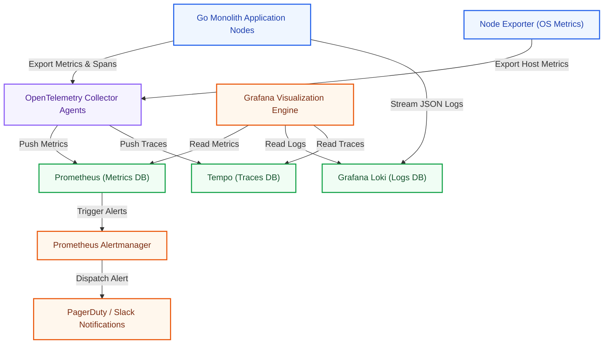
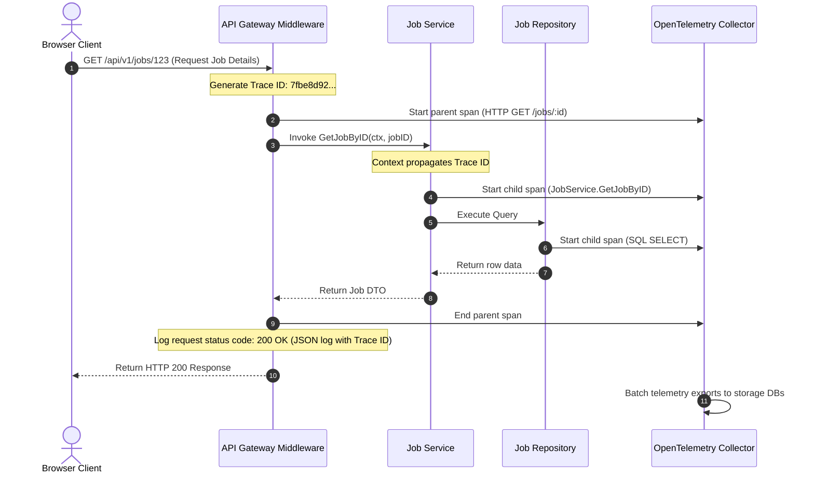

# Observability & Monitoring Architecture Specification: Kirmya telemetry Tier
**Document Identifier:** PL-AR-19 | **Status:** Approved / Core Reference | **Version:** 1.0.0  
**Authors:** Antigravity AI & Site Reliability Engineering Group | **Date:** July 24, 2026

---

## Document Control & Meta-Information

### Version History
| Version | Date | Author | Description |
| :--- | :--- | :--- | :--- |
| `0.1.0` | 2026-07-20 | Antigravity AI | Initial Prometheus scraping target plans. |
| `0.5.0` | 2026-07-22 | Antigravity AI | Integrated OpenTelemetry spans and Grafana layouts. |
| `1.0.0` | 2026-07-24 | Antigravity AI | Completed full Observability Architecture Specification. |

### Document Distribution
* **Product Strategy Group**: System uptime verification.
* **Engineering Leads**: OpenTelemetry tracer instrumentation guidelines.
* **DevOps Team**: Prometheus alerts and Grafana dashboards configs.
* **Security & Compliance**: Audit logs and sensitive data scrubbing rules.

---

## 1. Related Documents
- [00-documentation-standards.md](file:///c:/Users/PRASHANTH/Documents/real/my_project/docs/product/00-documentation-standards.md)
- [01-system-architecture.md](file:///c:/Users/PRASHANTH/Documents/real/my_project/docs/architecture/01-system-architecture.md)
- [02-modular-monolith-architecture.md](file:///c:/Users/PRASHANTH/Documents/real/my_project/docs/architecture/02-modular-monolith-architecture.md)
- [04-backend-architecture.md](file:///c:/Users/PRASHANTH/Documents/real/my_project/docs/architecture/04-backend-architecture.md)
- [07-api-architecture.md](file:///c:/Users/PRASHANTH/Documents/real/my_project/docs/architecture/07-api-architecture.md)

---

## 2. Dependencies
- Telemetry middleware integrates with connection decorators in [PL-AR-004 Backend Architecture Blueprint](file:///c:/Users/PRASHANTH/Documents/real/my_project/docs/architecture/04-backend-architecture.md).
- Logging contexts map trace headers specified in [PL-AR-007 API Architecture Specification](file:///c:/Users/PRASHANTH/Documents/real/my_project/docs/architecture/07-api-architecture.md).

---

## 3. Purpose
This document defines the observability and monitoring architecture for the Kirmya Professional Ecosystem. It specifies the logging standards, metrics scraping, distributed tracing setups, alerting thresholds, and Grafana dashboard parameters, ensuring system reliability.

---

## 4. Scope
- **In-Scope**: OpenTelemetry tracer bindings, Prometheus scrape configurations, Grafana dashboard specifications, structured JSON log structures, PII scrubbing rules, Alertmanager route tables, and security threat logs.
- **Out-of-Scope**: Physical disk allocation sizes and third-party alert aggregation system internals.

---

## 5. Objectives
- Establish an observability architecture using OpenTelemetry, Prometheus, and Grafana.
- Define the metrics, logs, and traces collection standards.
- Specify application, database, and infrastructure monitoring rules.
- Set alerting thresholds and escalation pathways.
- Create 2 detailed Mermaid diagrams modeling topologies and collection flows.

---

## 6. Executive Summary
Kirmya requires an **Observability & Monitoring Tier** to maintain high platform availability, ensure sub-200ms API response times (P95), and minimize the Mean Time to Resolution (MTTR) of production incidents. 

The architecture is built on the **OpenTelemetry** standard:
- **Metrics**: Collected via Prometheus scraping endpoints exposed by the Go monolith, tracking request rates, error counts, latencies, and container metrics.
- **Traces**: Generated using OpenTelemetry SDKs, propagating trace contexts across modules and database calls.
- **Logs**: Structured JSON logs are aggregated into Grafana Loki, ensuring correlation with active traces.

Critical system failures (e.g. database offline, API error spikes) trigger alerts sent to Slack and PagerDuty, with automated escalation pathways.

---

## 7. Detailed Content: Observability & Monitoring Architecture

### 7.1 Observability Goals
1. **Reduce Incident Resolution Time**: Achieve an MTTR under 15 minutes for critical incidents.
2. **Monitor Performance SLOs**: Track API response times to verify compliance with a sub-200ms P95 latency target.
3. **Trace System Errors**: Maintain trace correlation to isolate failed database queries or modules instantly.
4. **Detect Security Threats**: Alert on brute-force logins and API abuse in real time.

### 7.2 Observability Topology Diagram
Illustrates the connection between the application middleware, collectors, storage backends, and Grafana dashboards:



---

### 7.3 Three Pillars of Observability
Observability is structured across three core data types:

#### 1. Structured Logging
- *Standard*: JSON logs written to standard output (`stdout`), formatted using a structured library (e.g. Zerolog).
- *Payload Envelope*:
  ```json
  {
    "timestamp": "2026-07-24T23:58:00.000Z",
    "level": "error",
    "trace_id": "7fbe8d92231a4c2898f519a9a3b83ef2",
    "span_id": "8b5cf68b5cf6",
    "module": "jobModule",
    "message": "failed to commit job listing to PostgreSQL",
    "error": "database connection timeout",
    "context": {
      "job_id": "123",
      "user_id": "456"
    }
  }
  ```
- *PII Scrubbing*: Middleware scrubs passwords, session tokens, and credit card numbers from log payloads before writing.

#### 2. Prometheus Metrics
- *Scrape Target*: The Go monolith exposes a `/metrics` endpoint scraped by Prometheus every 15 seconds.
- *Core Metric Types*:
  - Counter: `kirmya_api_requests_total` (labels: `method`, `route`, `status_code`).
  - Histogram: `kirmya_api_request_duration_seconds` (latency buckets).
  - Gauge: `kirmya_database_connections_active` (active connections).

#### 3. Distributed Tracing
- *OpenTelemetry Tracing*: Generates spans for incoming HTTP requests, publishing trace IDs across module call boundaries and database operations.
- *Trace Header*: Standardized on the W3C Trace Context spec (propagating `traceparent` headers).

---

### 7.4 Data Collection Flow Diagram
Details the request lifecycle, highlighting how logging context, metrics, and trace spans are captured at each step:



---

### 7.5 Application & Infrastructure Monitoring Targets

#### 1. Application Metrics
- **Request Rate**: Total queries per second (QPS) across endpoints.
- **Error Rate**: Ratio of HTTP 5xx errors to total requests (alerts if > 1%).
- **Latency Histograms**: P50, P90, and P99 API response latencies (alerts if P95 exceeds 500ms).
- **Database Metrics**: Active database connections, transaction durations, and query errors.

#### 2. Infrastructure Metrics
- **CPU & Memory**: Percentage utilization on application containers.
- **Disk IOPS**: Read/write operations and disk space capacity.
- **Network Throughput**: Network ingress/egress bytes and packet drop rates.
- **Container Health**: Restart counters on Docker containers.

---

### 7.6 Alerting Thresholds & Escalation
Alerts are classified by severity to prevent alert fatigue:

| Alert Name | Target Metric | Warning Threshold | Critical Threshold |
| :--- | :--- | :--- | :--- |
| **API Error Spike** | HTTP 5xx error percentage | > 2% over 5 minutes | > 5% over 5 minutes |
| **High Latency** | P95 request duration | > 500ms over 5 minutes | > 2000ms over 5 minutes |
| **Database Saturation**| Active connection percentage | > 75% capacity | > 90% capacity |
| **CPU Saturation** | Container CPU utilization | > 80% over 10 minutes | > 95% over 5 minutes |
| **Redis Saturation** | Memory utilization | > 80% capacity | > 90% capacity |

- **Escalation Policy**: 
  - *Warning Alerts*: Sent to the `#alerts-warning` Slack channel for review during business hours.
  - *Critical Alerts*: Dispatched immediately to PagerDuty, triggering on-call engineer notifications. If a critical alert is unacknowledged after 15 minutes, it escalates to the Engineering Lead.

---

### 7.7 Grafana Dashboard Layouts
Observability dashboards are split by audience and purpose:
1. **Application Dashboard**: Goroutines count, memory heap allocations, garbage collection latency, active task workers.
2. **Database Dashboard**: Connection pools status, active read-only replicas, transaction locks, slow query logs (queries taking > 200ms).
3. **API Dashboard**: Request throughput (QPS), error rates (4xx vs 5xx), P99 latency charts by route.
4. **Infrastructure Dashboard**: Container CPU/RAM usage, host disk IOPS, network ingress/egress, Kubernetes node availability.
5. **Business Dashboard**: Active recruiters, job listings posted, application rates, payment events, active WebRTC voice sessions.

### 7.8 Security Audits & Threat Monitoring
- **Authentication Spikes**: Trigger alerts if a single account fails login 5 times in 5 minutes, or if system-wide authentication failures spike by 50%.
- **Rate-Limit Blocks**: Track the number of IPs blocked by Redis token bucket rate limiters, flagging potential DDoS attacks.
- **Abuse Detection**: Log and alert on anomalous data extraction rates (e.g. a user downloading > 50 resumes in 1 minute).

---

## 16. Functional Requirements Mapping
- **FR-AUTH-MFA**: Validation failures trigger audit log records containing IP addresses and user agents.
- **FR-FREE-ESCROW**: Financial operations log audit trails including Transaction and Correlation IDs.

---

## 17. Non-Functional Requirements Verification
- **NFR-AV-001 (Uptime SLO >= 99.9%)**: Monitored using Prometheus synthetic endpoint ping tests.
- **NFR-PER-005 (Response Latency)**: Latency histograms track compliance with the sub-200ms P95 target.

---

## 18. Business Rules Mapping
- **BR-AUTH-LOCK**: Lockout events are logged to the security audit index for compliance tracking.
- **BR-FREE-DISPUTES**: Escrow dispute logs record mediator actions to ensure transparency.

---

## 19. Assumptions
- OpenTelemetry collectors have sufficient bandwidth to export telemetry data without impacting application network performance.
- Prometheus memory allocations support 30 days of high-cardinality metrics retention.

---

## 20. Constraints
- Sensitive user data (e.g. passwords, contact details) is prohibited in telemetry logs and trace tags.
- Scrape intervals cannot be set below 10 seconds to prevent performance overhead on the application.

---

## 21. Risks
- **Observability Overhead**: High-frequency metric scraping and trace generation can introduce request latency. *Mitigation*: Enable span sampling (e.g., recording 10% of successful queries and 100% of errors).
- **Log Disk Saturation**: High traffic volumes can exhaust Loki storage space. *Mitigation*: Enforce a 14-day retention limit on development logs and a 30-day limit on production logs.

---

## 22. Open Questions
- What are the compliance retention periods for security audit logs in the UAE?
- Should trace logs be stored in a dedicated region to comply with data residency laws?

---

## 23. Future Improvements
- Integrate AI anomaly detection (e.g. Prometheus Prometheus-ARIMA) to predict resource exhaustion.
- Implement eBPF-based network profiling to monitor container communication overhead.

---

## 24. Acceptance Criteria
The observability tier implementation must meet these standards to be marked complete:

| Rule | Verification Checkpoint | Target |
| :--- | :--- | :--- |
| **JSON Logging** | Logs use the structured JSON template. | 100% compliance |
| **Trace Propagation**| HTTP and NATS requests propagate Trace IDs. | 100% compliance |
| **Alert Routing** | Critical alerts route to PagerDuty. | Mandatory |
| **Sensitive Scrubbing**| PII is redacted from logs before export. | Pass |

---

## 25. Success Metrics
- Telemetry ingestion latencies remain under 5 seconds.
- Alerting false-positive rates remain under 5%.

---

## 26. Glossary
- **Loki**: A horizontally-scalable log aggregation system designed by Grafana.
- **Tempo**: An open-source, high-scale distributed tracing database.
- **SLO**: Service Level Objective, a target metric that a service must satisfy (e.g. 99.9% uptime).

---

## 27. References
- [OpenTelemetry Specification Documentation](https://opentelemetry.io/docs/)
- [Prometheus Query Language Reference](https://prometheus.io/docs/prometheus/latest/querying/basics/)
- [Grafana Dashboard Best Practices](https://grafana.com/docs/grafana/latest/dashboards/)

---

## 28. Revision History
| Version | Date | Author | Description |
| :--- | :--- | :--- | :--- |
| `1.0.0` | 2026-07-24 | Antigravity AI | Finished Kirmya Observability Platform blueprint. |
