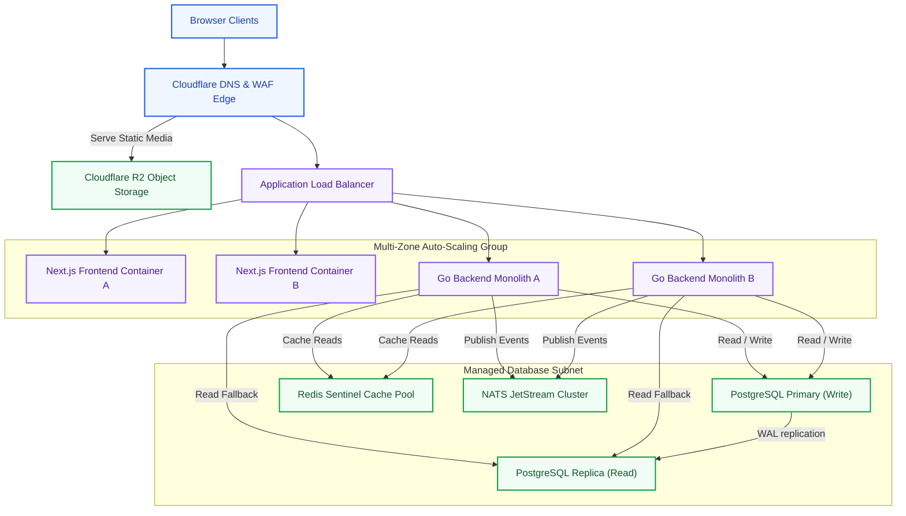
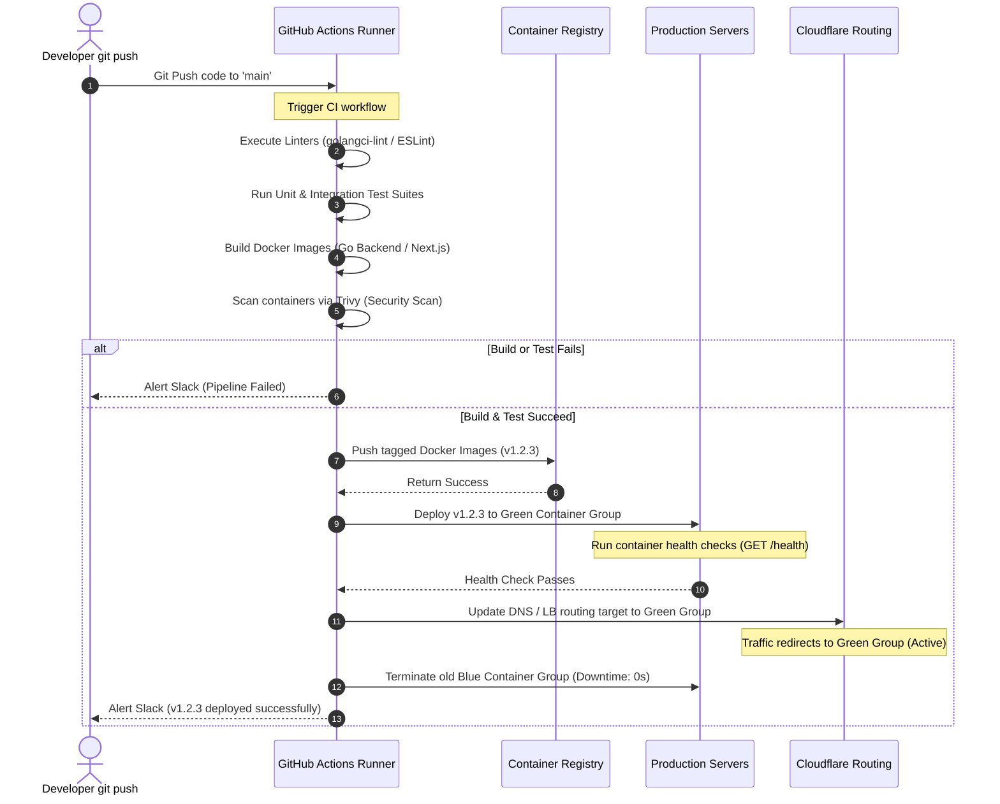
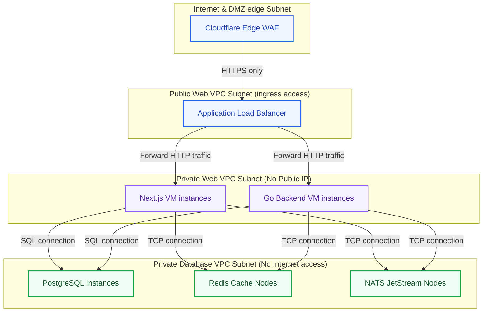

# Production Deployment & Infrastructure Architecture: Kirmya DevOps Tier
**Document Identifier:** PL-AR-20 | **Status:** Approved / Core Reference | **Version:** 1.0.0  
**Authors:** Antigravity AI & Site Reliability Engineering Group | **Date:** July 24, 2026

---

## Document Control & Meta-Information

### Version History
| Version | Date | Author | Description |
| :--- | :--- | :--- | :--- |
| `0.1.0` | 2026-07-20 | Antigravity AI | Initial Docker Compose dev template drafts. |
| `0.5.0` | 2026-07-22 | Antigravity AI | Integrated blue-green scripts and VPC layouts. |
| `1.0.0` | 2026-07-24 | Antigravity AI | Completed full Production Deployment Architecture Specification. |

### Document Distribution
* **Product Strategy Group**: Infrastructure operational cost approvals.
* **Engineering Leads**: Container compilation guidelines.
* **DevOps Team**: GitHub Actions runner setups and VPC configurations.
* **Security & Compliance**: Cloudflare WAF policies and IAM access controls.

---

## 1. Related Documents
- [00-documentation-standards.md](file:///c:/Users/PRASHANTH/Documents/real/my_project/docs/product/00-documentation-standards.md)
- [01-system-architecture.md](file:///c:/Users/PRASHANTH/Documents/real/my_project/docs/architecture/01-system-architecture.md)
- [02-modular-monolith-architecture.md](file:///c:/Users/PRASHANTH/Documents/real/my_project/docs/architecture/02-modular-monolith-architecture.md)
- [04-backend-architecture.md](file:///c:/Users/PRASHANTH/Documents/real/my_project/docs/architecture/04-backend-architecture.md)
- [08-database-architecture.md](file:///c:/Users/PRASHANTH/Documents/real/my_project/docs/architecture/08-database-architecture.md)

---

## 2. Dependencies
- CI/CD container testing integrates with test commands specified in [04-backend-architecture.md](file:///c:/Users/PRASHANTH/Documents/real/my_project/docs/architecture/04-backend-architecture.md).
- PostgreSQL database backup replication targets schemas defined in [08-database-architecture.md](file:///c:/Users/PRASHANTH/Documents/real/my_project/docs/architecture/08-database-architecture.md).

---

## 3. Purpose
This document defines the production deployment and infrastructure architecture for the Kirmya Professional Ecosystem. It specifies the environment strategy, container builds, CI/CD pipeline automations, cloud resources configuration, scaling rules, backup policies, and Kubernetes migration plans, ensuring platform reliability.

---

## 4. Scope
- **In-Scope**: Docker container specifications, GitHub Actions workflow pipelines, Cloudflare CDN/WAF configurations, VPC subnet configurations, blue-green deployments, WAL-G database backups, and EKS/GKE migration roadmaps.
- **Out-of-Scope**: Code-level Kubernetes configuration manifests.

---

## 5. Objectives
- Establish a production deployment architecture using containerized workloads and cloud services.
- Define a tiered environment strategy from local development to production.
- Specify a zero-downtime blue-green CI/CD deployment pipeline.
- Implement network security controls, including private VPCs and Secrets management.
- Create 3 detailed Mermaid diagrams modeling production systems, CI/CD pipelines, and network subnets.

---

## 6. Executive Summary
Kirmya utilizes a **Containerized Infrastructure & DevOps Tier** to ensure high availability, support automated zero-downtime rollouts, and enable regional scaling:
- **Environments**: Enforces a strict pipeline: Development (Local Compose) -> Testing (CI Runners) -> Staging (Single-node VM Docker Compose) -> Production (Multi-zone auto-scaled VM pools).
- **CI/CD Pipeline**: GitHub Actions automates test runs, security vulnerability scans (Trivy), Docker builds, and zero-downtime blue-green rollouts.
- **Cloud Infrastructure**: Cloudflare handles WAF rules, SSL termination, and CDN caching, routing traffic to auto-scaled application servers backed by managed databases and Cloudflare R2 storage.
- **Security**: Database, Redis cache, and NATS nodes are isolated within private VPC subnets, loading credentials at runtime from a secure secrets manager.

---

## 7. Detailed Content: Production Deployment Architecture

### 7.1 Deployment Goals
1. **High Availability**: Target 99.9% uptime utilizing multi-zone replica servers.
2. **Zero-Downtime Rollouts**: Deploy updates using blue-green container routing switches.
3. **Automated Validation**: Restrict deployments to code that passes automated testing and security vulnerability scans.
4. **Disaster Recovery**: Implement Point-in-Time Recovery (PITR) to guarantee database resilience.

### 7.2 Production Architecture Topology Diagram
Illustrates the relationship between Cloudflare edge proxies, load balancers, auto-scaled application nodes, database clusters, and R2 storage:

---

### 7.3 Environment Strategy
- **Development**: Local developers use `docker-compose.yml` to spin up Next.js frontend, Go backend, PostgreSQL, Redis, NATS, and MinIO instances.
- **Testing**: Automated runners (GitHub Actions) spin up temporary test databases to execute unit and integration test suites.
- **Staging**: A single virtual machine (VPS) running Docker Compose replicas. Staging replicates production database structures and serves as a testing ground for QA release validation.
- **Production**: Distributed, multi-zone virtual machine groups (AWS EC2 / GCP Compute Engine) managed by application load balancers, deploying managed databases and storage.

---

### 7.4 Container Architecture
Workloads are compiled into Docker images using multi-stage builds:
- **Frontend Container**:
  - *Build stage*: Node.js container compiling Next.js assets.
  - *Execution stage*: Alpine-based Node.js runner exposing port 3000.
- **Backend Container**:
  - *Build stage*: Go-Alpine container compiling static monolith binaries.
  - *Execution stage*: Minimal scratch or Alpine container exposing port 8080.
- **Task Workers**: The Go backend container is run with a custom command flag (`./kirmya-backend --mode=worker`) to process background jobs asynchronously.

---

### 7.5 CI/CD Deployment Pipeline Sequence
Illustrates the CI/CD pipeline, detailing automated linting, test suites, container scans, registry pushes, and blue-green updates:

---

### 7.6 Network Security Architecture
Details the virtual private cloud (VPC) subnet boundaries separating public interfaces from private databases:

---

### 7.7 Security Controls
- **Secrets Management**: Storing API keys and database credentials in code repositories is prohibited. Configuration parameters are loaded at runtime from a secure secrets manager (e.g. AWS Secrets Manager, GCP Secret Manager, or HashiCorp Vault).
- **VPC Subnet Isolation**: Only the Application Load Balancer is exposed to the public subnet. Application and database nodes are isolated in private subnets, blocking direct access from the internet.
- **WAF Rule Engine**: Cloudflare WAF filters traffic to block SQL injection, Cross-Site Scripting (XSS), and DDoS attacks before they reach application servers.

---

### 7.8 Scaling Strategy
- **Horizontal Pod Autoscaling**: Application virtual machine groups scale horizontally based on average CPU and memory utilization (autoscaling triggers when CPU utilization exceeds 70% for 3 minutes).
- **Database Scaling**: Read traffic is distributed to PostgreSQL read replicas, offloading queries from the primary node.
- **CDN Caching**: Static assets and public images are cached at Cloudflare edge nodes, reducing origin server load.

### 7.9 Backup & Disaster Recovery
- **PostgreSQL Backups**: Database backups are managed using WAL-G or PGBackMan, executing daily full snapshots combined with continuous Write-Ahead Log (WAL) archiving to Cloudflare R2, enabling Point-in-Time Recovery (PITR).
- **R2 Storage Backups**: Cloudflare R2 buckets configure cross-region replication to prevent data loss.
- **Recovery Drill**: The DevOps team runs monthly automated restores to a testing node to verify backup validity.

### 7.10 Future Kubernetes Migration
As platform scaling demands increase, Kirmya can transition from Docker Compose VM deployments to a managed Kubernetes cluster (Amazon EKS or GCP GKE):
- **Helm Charts**: Package application manifests (Next.js, Go backend, and NATS JetStream) into Helm charts to simplify deployment management.
- **Cluster Ingress**: Deploy NGINX or Traefik Ingress Controllers to manage routing and SSL termination.
- **Kubernetes Autoscaling**: Utilize Horizontal Pod Autoscalers (HPA) to scale application replicas dynamically based on resource usage.

---

## 16. Functional Requirements Mapping
- **FR-AUTH-MFA**: Validation endpoints require HTTPS traffic routed through Cloudflare WAF to prevent brute-force attacks.
- **FR-FREE-ESCROW**: Financial operations process within isolated database subnets to ensure security.

---

## 17. Non-Functional Requirements Verification
- **NFR-AV-001 (Uptime SLO >= 99.9%)**: Achieved by distributing virtual machine instances across multiple availability zones.
- **NFR-PER-005 (Response Latency)**: Kept under 200ms using Cloudflare CDN caching and local NVMe caching pools.

---

## 18. Business Rules Mapping
- **BR-AUTH-SEATS**: Recruiter quotas are checked within secure VPC boundaries.
- **BR-SCH-VISIBILITY**: Visibility rules are evaluated locally before databases return candidate information.

---

## 19. Assumptions
- Cloudflare edge nodes maintain high availability across Europe and the Middle East.
- Managed database replicas synchronize write commits in under 1 second.

---

## 20. Constraints
- Production subnets cannot use public IP addresses for database nodes.
- Container builds must pass security vulnerability scans before they can be deployed to production.

---

## 21. Risks
- **Deployment Rollback Failures**: Database schema migrations can break backward compatibility during rollback events. *Mitigation*: Enforce a "expand and contract" database migration policy, keeping schemas backward-compatible.
- **Secrets Leaks**: Secrets can be logged in plain text during container startup errors. *Mitigation*: Configure logging rules to sanitize startup outputs.

---

## 22. Open Questions
- What are the compliance requirements for archiving historical audit log files in staging environments?
- What translation tools will be used to manage localization strings?

---

## 23. Future Improvements
- Implement auto-scaling database nodes to adjust resource allocation dynamically based on load.
- Integrate eBPF network monitoring tools to track container communication overhead.

---

## 24. Acceptance Criteria
The production deployment implementation must meet these standards to be marked complete:

| Rule | Verification Checkpoint | Target |
| :--- | :--- | :--- |
| **Secrets Loading** | Credentials are loaded at runtime from a secrets manager. | 100% compliance |
| **Zero-Downtime** | Blue-green rollouts execute without downtime. | 100% compliance |
| **VPC Segregation** | Databases are isolated in private subnets. | Mandatory |
| **Vulnerability scan**| Trivy scans containers with zero critical errors. | Pass |

---

## 25. Success Metrics
- Production deployments complete in under 5 minutes.
- Rolling back a deployment takes less than 1 minute.

---

## 26. Glossary
- **Blue-Green Deployment**: A release strategy that uses two identical environments (Blue and Green) to deploy updates without downtime.
- **VPC**: Virtual Private Cloud, an isolated private network within a cloud provider.
- **WAL-G**: An archive tool for PostgreSQL database backups.

---

## 27. References
- [Docker Multi-Stage Build Guidelines](https://docs.docker.com/build/building/multi-stage/)
- [GitHub Actions Workflows Documentation](https://docs.github.com/en/actions)
- [Cloudflare WAF Rules Engine Guide](https://developers.cloudflare.com/waf/)

---

## 28. Revision History
| Version | Date | Author | Description |
| :--- | :--- | :--- | :--- |
| `1.0.0` | 2026-07-24 | Antigravity AI | Finished Kirmya Production Deployment blueprint. |
