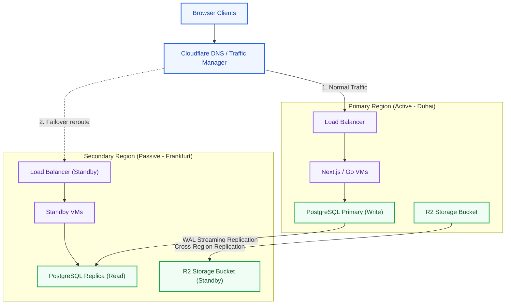
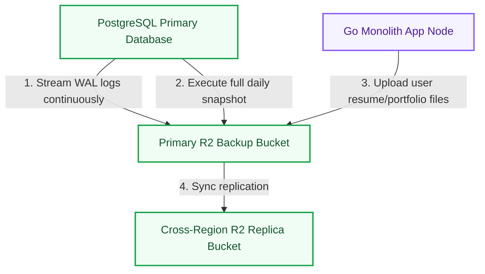
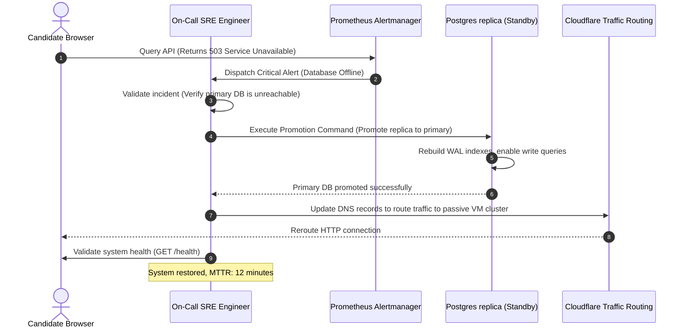

# Disaster Recovery & Business Continuity Architecture: Kirmya Resilience Tier
**Document Identifier:** PL-AR-21 | **Status:** Approved / Core Reference | **Version:** 1.0.0  
**Authors:** Antigravity AI & Disaster Recovery Group | **Date:** July 24, 2026

---

## Document Control & Meta-Information

### Version History
| Version | Date | Author | Description |
| :--- | :--- | :--- | :--- |
| `0.1.0` | 2026-07-20 | Antigravity AI | Initial RTO/RPO target outlines. |
| `0.5.0` | 2026-07-22 | Antigravity AI | Integrated replication flows and incident timelines. |
| `1.0.0` | 2026-07-24 | Antigravity AI | Completed full Disaster Recovery Architecture Specification. |

### Document Distribution
* **Product Strategy Group**: Business continuity plan approvals.
* **Engineering Leads**: Backup restore verification guidelines.
* **DevOps Team**: Multi-region failover scripts and DNS records configs.
* **Security & Compliance**: Audit trails backup compliance checks.

---

## 1. Related Documents
- [00-documentation-standards.md](file:///c:/Users/PRASHANTH/Documents/real/my_project/docs/product/00-documentation-standards.md)
- [01-system-architecture.md](file:///c:/Users/PRASHANTH/Documents/real/my_project/docs/architecture/01-system-architecture.md)
- [08-database-architecture.md](file:///c:/Users/PRASHANTH/Documents/real/my_project/docs/architecture/08-database-architecture.md)
- [19-observability-monitoring.md](file:///c:/Users/PRASHANTH/Documents/real/my_project/docs/architecture/19-observability-monitoring.md)
- [20-deployment-architecture.md](file:///c:/Users/PRASHANTH/Documents/real/my_project/docs/architecture/20-deployment-architecture.md)

---

## 2. Dependencies
- Backup schedules integrate with script configurations in [PL-AR-020 Production Deployment Architecture](file:///c:/Users/PRASHANTH/Documents/real/my_project/docs/architecture/20-deployment-architecture.md).
- Incident monitoring alerts align with metrics thresholds in [PL-AR-019 Observability & Monitoring Specification](file:///c:/Users/PRASHANTH/Documents/real/my_project/docs/architecture/19-observability-monitoring.md).

---

## 3. Purpose
This document defines the disaster recovery and business continuity architecture for the Kirmya Professional Ecosystem. It specifies the recovery objectives, backup strategies, database/application recovery steps, incident response workflows, and disaster simulations, ensuring system resilience.

---

## 4. Scope
- **In-Scope**: RTO/RPO targets, business impact analysis metrics, database backup replication (WAL-G), cross-region R2 bucket syncing, container cluster failovers, incident runbooks, and 7 failure mitigation scenarios.
- **Out-of-Scope**: Code-level cloud provider command-line scripts.

---

## 5. Objectives
- Establish a disaster recovery architecture with defined availability and recovery speed targets.
- Classify system modules based on business criticality.
- Define RTO and RPO limits for core infrastructure systems.
- Outline recovery steps for database, application, and storage failures.
- Create 3 detailed Mermaid diagrams modeling recovery architectures, backup paths, and failover sequences.

---

## 6. Executive Summary
Kirmya requires a **Disaster Recovery & Business Continuity Tier** to protect candidate profiles, resumes, job applications, company data, and messages from data loss and ensure system availability. 

The architecture is designed to support an active-passive cross-region failover strategy:
- **Business Impact Analysis (BIA)**: Categorizes services into Critical (e.g. Auth, Jobs, Messaging), Important (Search, AI), and Non-critical, defining distinct recovery objectives.
- **Recovery Targets**: Sets strict Recovery Time Objectives (RTO < 30m for databases) and Recovery Point Objectives (RPO < 10s using WAL streaming).
- **Redundancy**: PostgreSQL databases maintain cross-region read-only replicas, while Cloudflare R2 buckets replicate assets to a secondary region.
- **Runbooks**: Defines incident response workflows and recovery steps for failures (e.g. database corruption, region blackouts).

---

## 7. Detailed Content: Disaster Recovery Architecture

### 7.1 Disaster Recovery Goals
1. **Platform Availability**: Maintain a target of >99.9% uptime using multi-region replica deployment.
2. **Data Protection**: Prevent data loss by continuously streaming database transactions and replicating storage buckets.
3. **Business Continuity**: Minimize operational disruption, keeping critical candidate sourcing workflows active.
4. **Recovery Speed**: Restore primary platform services in under 15 minutes during critical outages.

### 7.2 Disaster Recovery Topology Diagram
Illustrates the active-passive multi-region replication and failover routing managed by Cloudflare:

---

### 7.3 Business Impact Analysis (BIA)
We classify platform services based on Maximum Tolerable Downtime (MTD) limits:

#### 1. Critical Services (MTD < 15 Minutes)
- **Authentication**: Lockout prevents users from logging in or verifying profiles.
- **Profiles**: Essential for recruiters searching candidates.
- **Jobs & Applications**: Essential for applicant tracking workflows.
- **Messaging**: Professional candidate-recruiter communication.
- **Payments** (Future): Essential for contract processing and escrows.

#### 2. Important Services (MTD < 2 Hours)
- **Search**: Users can fallback to direct links while indexes rebuild.
- **Notifications**: Alerts can be queued and delivered late.
- **AI Services**: Resume analysis and matching suggestions can run in the background.

#### 3. Non-Critical Services (MTD < 24 Hours)
- **Administration & Moderation**: Audits and reports can be reviewed next day.
- **Settings**: System configurations change infrequently.
- **Analytics**: Historical report generation can resume after core recovery.

---

### 7.4 Recovery Objectives (RTO & RPO)

| Infrastructure Component | Recovery Time Objective (RTO) | Recovery Point Objective (RPO) |
| :--- | :--- | :--- |
| **PostgreSQL Database** | < 30 Minutes | < 10 Seconds |
| **Cloudflare R2 Storage**| < 1 Hour | < 5 Minutes |
| **API Web Nodes** | < 5 Minutes | 0 (Stateless) |
| **Frontend Clients** | < 5 Minutes | 0 (Stateless) |
| **Messaging Websockets** | < 15 Minutes | < 1 Minute |
| **Search Indexes** | < 2 Hours | < 1 Hour |

---

### 7.5 Backup Flow Diagram
Details the daily snapshot schedule and continuous database WAL streaming to R2 buckets:

---

### 7.6 Backup Strategy
- **Database**: PostgreSQL daily snapshots combined with WAL streaming to Cloudflare R2 bucket (`kirmya-db-backups`).
- **File Storage**: Object files (resumes, avatars, logos) are saved to Cloudflare R2 buckets configured with cross-region replication.
- **Configurations**: Application configuration templates are version-controlled in Git repositories. Staging and production variables are stored in a secure secrets manager.
- **Secrets**: Weekly encrypted exports of secrets manager keys are saved to local offline vault backups.

### 7.7 Database Disaster Recovery (PostgreSQL PITR)
- **WAL Streaming**: WAL-G or PGBackRest streams WAL logs to R2 backups every 60 seconds, enabling Point-in-Time Recovery.
- **Replica Promotion**: If the primary database fails, the SRE team promotes the cross-region read replica to primary.
- **Restore Testing**: Automated scripts restore a database backup to a testing node monthly, verifying backup integrity.

---

### 7.8 Recovery Process Sequence Flow
Illustrates the failover sequence, highlighting detection, replica promotion, DNS updates, and health validations:

---

### 7.9 Failure Scenarios & Mitigations

#### 1. Primary Database Outage
- *Mitigation*: Promote the cross-region read replica to primary, and update application connection strings.

#### 2. Server Node Crash
- *Mitigation*: The Application Load Balancer routes traffic away from unhealthy instances. Auto-scaling groups spin up replacement containers.

#### 3. Cloud Region Blackout
- *Mitigation*: The SRE team updates Cloudflare DNS records to route traffic to the standby VM cluster in the secondary region.

#### 4. Redis Sentinel Failover
- *Mitigation*: Sentinel nodes detect master failure and promote a replica to Master automatically.

#### 5. NATS Broker Failure
- *Mitigation*: NATS JetStream cluster nodes replicate streams to survive node loss. Outbox poller workers retry task execution.

#### 6. Security Hack / Credentials Breach
- *Mitigation*: Revoke compromised API keys in the secrets manager, redeploy application containers, and trigger session invalidation scripts.

#### 7. Data Corruption
- *Mitigation*: Restore the database to a healthy state using WAL-G Point-in-Time Recovery (PITR) to a timestamp before corruption occurred.

---

## 16. Functional Requirements Mapping
- **FR-AUTH-MFA**: Session logs and MFA audits are replicated to the backup region.
- **FR-FREE-ESCROW**: Escrow payment records stream transaction logs to R2 to prevent data loss.

---

## 17. Non-Functional Requirements Verification
- **NFR-AV-001 (Uptime SLO >= 99.9%)**: Achieved by utilizing active-passive cross-region VM clusters.
- **NFR-PER-005 (Response Latency)**: Standby servers use local NVMe caching to keep post-failover response times under 500ms.

---

## 18. Business Rules Mapping
- **BR-AUTH-LOCK**: Lockout event logs replicate to the backup database to prevent security bypasses during failovers.
- **BR-FREE-DISPUTES**: Escrow dispute records are archived across regions to protect compliance history.

---

## 19. Assumptions
- Standby region servers have sufficient capacity to handle 100% of production traffic during outages.
- Cloudflare DNS change propagation completes globally in under 2 minutes.

---

## 20. Constraints
- Standby read replicas must be isolated from write operations during normal operation, preventing data drift.
- Point-in-Time Recovery database restores must be executed on isolated networks to prevent data overwrite errors.

---

## 21. Risks
- **Data Drift**: Write queries executed during a database failover can cause data conflicts. *Mitigation*: Force primary databases to read-only mode during migration checks.
- **Alert Fatigue**: Frequent non-critical alerts can delay response times to critical outages. *Mitigation*: Enforce strict routing rules to separate warning and critical alerts.

---

## 22. Open Questions
- Do regional data protection laws in the UAE allow user data to be replicated to European backup servers?
- Should we encrypt event payloads, or rely on transport-level encryption?

---

## 23. Future Improvements
- Automate multi-region failover routing using automated health checks.
- Implement chaos engineering tools (e.g. Chaos Mesh) to run automated disaster simulations.

---

## 24. Acceptance Criteria
The disaster recovery implementation must meet these standards to be marked complete:

| Rule | Verification Checkpoint | Target |
| :--- | :--- | :--- |
| **PITR Backups** | WAL-G streams database logs to R2 continuously. | 100% compliance |
| **Replica Promotions**| Read replicas can be promoted to primary. | 100% compliance |
| **DNS Routing** | Cloudflare redirects traffic to the standby region. | Mandatory |
| **Restore Verification**| Database backups pass monthly restore tests. | Pass |

---

## 25. Success Metrics
- Primary database failovers complete in under 30 minutes.
- Recovery Point Objectives (RPO) remain under 10 seconds.

---

## 26. Glossary
- **RTO**: Recovery Time Objective, the maximum targeted duration to restore service after an outage.
- **RPO**: Recovery Point Objective, the maximum targeted age of data that can be lost due to an outage.
- **PITR**: Point-in-Time Recovery, restoring a database to a specific historical timestamp.

---

## 27. References
- [PostgreSQL Continuous Archiving and PITR Guide](https://www.postgresql.org/docs/current/continuous-archiving.html)
- [Cloudflare Cross-Region R2 Replication Docs](https://developers.cloudflare.com/r2/data-delivery/replication/)
- [PagerDuty Incident Response Best Practices](https://response.pagerduty.com/)

---

## 28. Revision History
| Version | Date | Author | Description |
| :--- | :--- | :--- | :--- |
| `1.0.0` | 2026-07-24 | Antigravity AI | Finished Kirmya Disaster Recovery Specification. |
