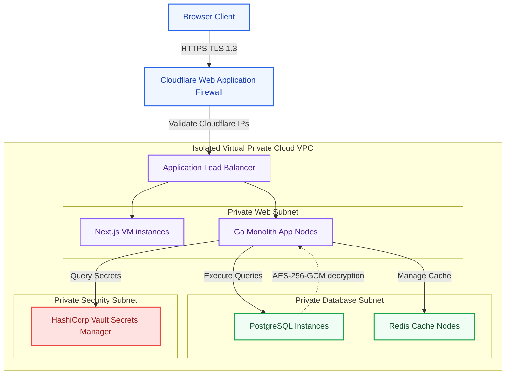
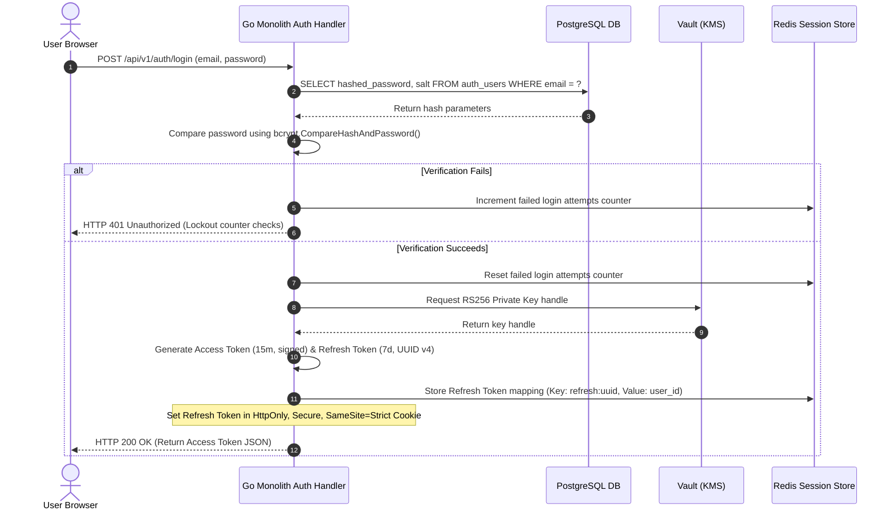
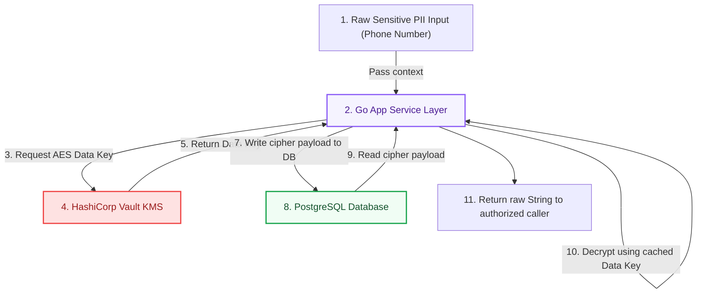

# Enterprise Security Architecture: Kirmya Security Tier
**Document Identifier:** PL-AR-22 | **Status:** Approved / Core Reference | **Version:** 1.0.0  
**Authors:** Antigravity AI & Cybersecurity Architecture Group | **Date:** July 24, 2026

---

## Document Control & Meta-Information

### Version History
| Version | Date | Author | Description |
| :--- | :--- | :--- | :--- |
| `0.1.0` | 2026-07-20 | Antigravity AI | Initial OWASP mitigation outlines. |
| `0.5.0` | 2026-07-22 | Antigravity AI | Integrated cryptography rules and compliance audits. |
| `1.0.0` | 2026-07-24 | Antigravity AI | Completed full Enterprise Security Architecture Specification. |

### Document Distribution
* **Product Strategy Group**: Compliance and privacy policy checks.
* **Engineering Leads**: Secure coding standards and dependency rules.
* **DevOps Team**: VPC networks and secrets vault parameters.
* **Security & Compliance**: External pentesting and audit trails.

---

## 1. Related Documents
- [00-documentation-standards.md](file:///c:/Users/PRASHANTH/Documents/real/my_project/docs/product/00-documentation-standards.md)
- [01-system-architecture.md](file:///c:/Users/PRASHANTH/Documents/real/my_project/docs/architecture/01-system-architecture.md)
- [09-authentication-architecture.md](file:///c:/Users/PRASHANTH/Documents/real/my_project/docs/architecture/09-authentication-architecture.md)
- [10-authorization-rbac.md](file:///c:/Users/PRASHANTH/Documents/real/my_project/docs/architecture/10-authorization-rbac.md)
- [20-deployment-architecture.md](file:///c:/Users/PRASHANTH/Documents/real/my_project/docs/architecture/20-deployment-architecture.md)

---

## 2. Dependencies
- Cryptographic keys integration aligns with configurations defined in [PL-AR-020 Production Deployment Architecture](file:///c:/Users/PRASHANTH/Documents/real/my_project/docs/architecture/20-deployment-architecture.md).
- Authentication validations map flows specified in [PL-AR-009 Authentication Architecture Specification](file:///c:/Users/PRASHANTH/Documents/real/my_project/docs/architecture/09-authentication-architecture.md).
- Permission evaluations implement rules mapped in [PL-AR-010 Authorization & RBAC blueprint](file:///c:/Users/PRASHANTH/Documents/real/my_project/docs/architecture/10-authorization-rbac.md).

---

## 3. Purpose
This document defines the security architecture for the Kirmya Professional Ecosystem. It specifies the application security mitigations, authentication and authorization standards, cryptographic protocols, privacy controls, compliance parameters, and security monitoring workflows, ensuring data protection.

---

## 4. Scope
- **In-Scope**: OWASP Top 10 mitigations, bcrypt hashing standards, RS256 JWT key configurations, HttpOnly secure cookies, VPC subnet borders, AES-256 database field-level encryption, ClamAV malware scanning, and UAE Federal Decree-Law No. 45/GDPR compliance grids.
- **Out-of-Scope**: Physical hardware security parameters of third-party cloud data centers.

---

## 5. Objectives
- Establish an enterprise security architecture following Zero Trust and Defense-in-Depth principles.
- Define code-level mitigations against OWASP Top 10 vulnerabilities.
- Standardize authentication credentials, JWT lifecycles, and session revocations.
- Enforce network isolation, secrets vault loads, and container image scans.
- Create 3 detailed Mermaid diagrams modeling security topologies, authentication flows, and cryptographic pipelines.

---

## 6. Executive Summary
Kirmya implements an **Enterprise Security Tier** based on Zero Trust, Secure-by-Default design, and Privacy-by-Design principles to protect user identities, resumes, employment history, company data, and private conversations. 

The architecture enforces security controls across multiple layers:
- **Application Security**: Implements defenses against OWASP Top 10 vulnerabilities, including parameterized SQL queries and input sanitization.
- **Identity & Access**: Enforces bcrypt hashing for passwords, RS256-signed JWTs, secure cookies, and Service-layer RBAC ownership checks.
- **Data Protection**: Secures data in transit using TLS 1.3 and protects sensitive data at rest using AES-256-GCM field-level encryption in PostgreSQL.
- **Compliance**: Integrates user consent, data export, and deletion workflows to align with the UAE Personal Data Protection Law and GDPR.

---

## 7. Detailed Content: Enterprise Security Architecture

### 7.1 Security Principles
1. **Zero Trust**: Never trust, always verify. Every request must validate authentication, session state, and permissions.
2. **Least Privilege**: Users and services are granted only the minimum permissions required to perform their tasks.
3. **Defense in Depth**: Security controls are applied at multiple layers (Edge, Network, Compute, Code, Database) to prevent single points of failure.
4. **Secure by Default**: Default configurations are secure (e.g. cookies are HttpOnly/Secure, APIs are closed by default).
5. **Privacy by Design**: Data minimization, consent, and user visibility controls are integrated into the architecture.

### 7.2 Security Architecture Topology Diagram
Illustrates the network segregation, Edge WAF, isolated VPC subnets, and database cryptographic boundaries:

---

### 7.3 Application Security (OWASP Top 10 Mitigations)
- **SQL Injection**: Parameterized SQL queries are enforced (using Go's `database/sql` placeholders) across all queries, preventing SQL injection.
- **XSS (Cross-Site Scripting)**: Input parameters are validated and sanitized (using a sanitization library like `bluemonday`). Next.js/React templates escape HTML output by default.
- **CSRF (Cross-Site Request Forgery)**: Cookie sessions configure `SameSite=Strict`, `Secure`, and `HttpOnly` flags. Stateful write APIs require custom header validation.
- **SSRF (Server-Side Request Forgery)**: HTTP client requests to external resources require domain whitelist validation, preventing internal network scans.
- **Broken Authentication**: Implements brute-force lockouts, session rotation, and JWT validation.
- **Broken Authorization**: Evaluates permissions and resource ownership (`UserID == ResourceOwnerID`) in the Service layer, preventing IDOR (Insecure Direct Object Reference) vulnerabilities.
- **Sensitive Data Exposure**: Protects PII (e.g. phone numbers, national IDs) using database field-level encryption, and secures all traffic in transit using TLS 1.3.

---

### 7.4 Authentication Security Flow Diagram
Illustrates credentials checks, JWT token generation, rotation, and HttpOnly secure cookie storage:

---

### 7.5 Data Protection Pipeline Flow
Details the cryptographic pipeline for encrypting PII at-rest and decrypting it during query retrievals:

---

### 7.6 API Defense & Headers
- **Rate Limiting**: Enforces rate limiting at the API gateway layer using Redis token bucket rate limiters, blocking brute-force attacks and DDoS attempts.
- **Request Headers**: API responses must configure security headers:
  - `Content-Security-Policy: default-src 'self'`
  - `X-Frame-Options: DENY`
  - `X-Content-Type-Options: nosniff`
  - `Strict-Transport-Security: max-age=63072000; includeSubDomains; preload`
  - `Referrer-Policy: strict-origin-when-cross-origin`

### 7.7 File Security & Malware Scanning
- **Type Validation**: Uploaded files validate mime-type boundaries using magic number headers, preventing file renaming bypasses.
- **Virus Scanning**: Files are uploaded to a temporary bucket first and are moved to permanent storage only after a clean background ClamAV scan.
- **Private Access**: Resumes and private attachments are protected using 15-minute presigned Cloudflare R2 URLs, preventing unauthorized access.

### 7.8 Privacy Architecture & Regulations
- **UAE Personal Data Protection Law**: Aligns with Federal Decree-Law No. 45 of 2021, restricting cross-border data replication without proper safeguards and requiring explicit user opt-in consent.
- **GDPR Readiness**: Implements data portability (allowing users to export data in JSON format) and the right to erasure (account deletion cleanses PII from relational databases).
- **Consent Logs**: User consents (cookies, marketing, AI profiling) are recorded in audits.

---

## 16. Functional Requirements Mapping
- **FR-AUTH-MFA**: Validation endpoints require HTTPS traffic routed through Cloudflare WAF.
- **FR-FREE-ESCROW**: Financial operations log audit trails including Transaction and Correlation IDs.

---

## 17. Non-Functional Requirements Verification
- **NFR-SEC-001 (Cryptography)**: All passwords use bcrypt with a work factor cost of 12.
- **NFR-SEC-004 (Data Privacy)**: PII scrubbing removes sensitive candidate data before calling external APIs.

---

## 18. Business Rules Mapping
- **BR-AUTH-LOCK**: Accounts are locked after 5 failed login attempts.
- **BR-SCH-VISIBILITY**: Private profiles are excluded from recommendations.

---

## 19. Assumptions
- Cloudflare WAF rules update automatically to defend against zero-day exploits.
- Vault KMS nodes maintain high availability across Europe and the Middle East.

---

## 20. Constraints
- Application servers cannot access database instances without authenticating via SSL client certificates.
- Raw passwords and sensitive PII are prohibited in log payloads.

---

## 21. Risks
- **Data Key Compromise**: Compromise of the master key can expose encrypted database fields. *Mitigation*: Enforce weekly key rotation policies in HashiCorp Vault.
- **Vulnerability Scanning Gaps**: Outdated dependency libraries can introduce critical vulnerabilities. *Mitigation*: Configure weekly Trivy vulnerability scans in the CI/CD pipeline.

---

## 22. Open Questions
- What are the compliance retention periods for security audit logs in the UAE?
- Should trace logs be stored in a dedicated region to comply with data residency laws?

---

## 23. Future Improvements
- Integrate anomaly detection tools to flag suspicious API activity.
- Deploy localized LLMs (e.g. Llama-3) on GPU instances to reduce external API dependencies.

---

## 24. Acceptance Criteria
The security platform implementation must meet these standards to be marked complete:

| Rule | Verification Checkpoint | Target |
| :--- | :--- | :--- |
| **Bcrypt Cost** | Passwords hashed using bcrypt (cost 12). | 100% compliance |
| **VPC Boundaries** | Databases are isolated in private subnets. | 100% compliance |
| **PII Encryption** | PII fields are encrypted at rest using AES-256. | Mandatory |
| **WAF Active** | Cloudflare WAF filters HTTP requests. | Pass |

---

## 25. Success Metrics
- 100% of container builds pass security vulnerability scans.
- Average security audit logs propagation times remain under 5 seconds.

---

## 26. Glossary
- **AES-256-GCM**: Advanced Encryption Standard with Galois/Counter Mode, a symmetric key cryptographic algorithm.
- **WAF**: Web Application Firewall, a security control that monitors and filters HTTP traffic.
- **KMS**: Key Management Service, a secure service used to manage cryptographic keys.

---

## 27. References
- [OWASP Top 10 Vulnerabilities Mitigation Guide](https://owasp.org/www-project-top-10/)
- [HashiCorp Vault Documentation](https://www.vaultproject.io/docs)
- [UAE Federal Decree-Law No. 45 of 2021 on Personal Data Protection](https://u.ae/en/about-the-uae/strategies-initiatives-and-laws/laws/personal-data-protection-law)

---

## 28. Revision History
| Version | Date | Author | Description |
| :--- | :--- | :--- | :--- |
| `1.0.0` | 2026-07-24 | Antigravity AI | Finished Kirmya Security Architecture Specification. |
