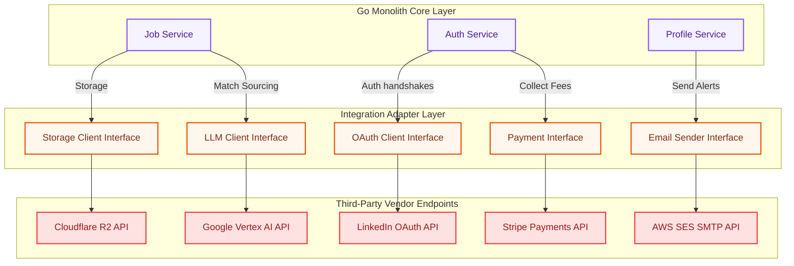
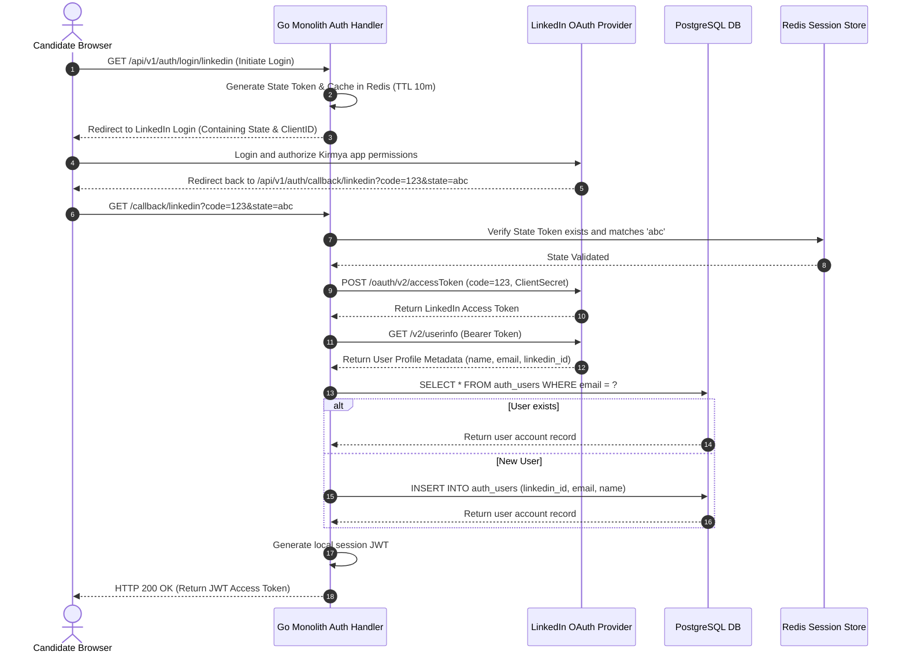

# Third-Party Integration Architecture Specification: Kirmya Adapter Tier
**Document Identifier:** PL-AR-23 | **Status:** Approved / Core Reference | **Version:** 1.0.0  
**Authors:** Antigravity AI & Solution Integration Group | **Date:** July 24, 2026

---

## Document Control & Meta-Information

### Version History
| Version | Date | Author | Description |
| :--- | :--- | :--- | :--- |
| `0.1.0` | 2026-07-20 | Antigravity AI | Initial email and storage adapter drafts. |
| `0.5.0` | 2026-07-22 | Antigravity AI | Integrated Stripe pipelines and circuit breakers. |
| `1.0.0` | 2026-07-24 | Antigravity AI | Completed full Third-Party Integration Architecture Specification. |

### Document Distribution
* **Product Strategy Group**: Vendor integration cost verifications.
* **Engineering Leads**: Integration interface implementation guidelines.
* **DevOps Team**: API keys rotation schedules.
* **Security & Compliance**: Third-party data sharing security checks.

---

## 1. Related Documents
- [00-documentation-standards.md](file:///c:/Users/PRASHANTH/Documents/real/my_project/docs/product/00-documentation-standards.md)
- [01-system-architecture.md](file:///c:/Users/PRASHANTH/Documents/real/my_project/docs/architecture/01-system-architecture.md)
- [02-modular-monolith-architecture.md](file:///c:/Users/PRASHANTH/Documents/real/my_project/docs/architecture/02-modular-monolith-architecture.md)
- [04-backend-architecture.md](file:///c:/Users/PRASHANTH/Documents/real/my_project/docs/architecture/04-backend-architecture.md)
- [07-api-architecture.md](file:///c:/Users/PRASHANTH/Documents/real/my_project/docs/architecture/07-api-architecture.md)

---

## 2. Dependencies
- Adapter Go interface implementations import DTO configurations from [PL-AR-004 Backend Architecture Blueprint](file:///c:/Users/PRASHANTH/Documents/real/my_project/docs/architecture/04-backend-architecture.md).
- Webhook endpoints verify headers as specified in [PL-AR-007 API Architecture Specification](file:///c:/Users/PRASHANTH/Documents/real/my_project/docs/architecture/07-api-architecture.md).

---

## 3. Purpose
This document defines the third-party integration architecture for the Kirmya Professional Ecosystem. It specifies the Adapter Design Patterns, authentication handshakes, payment checkouts, data pipelines, error retries, and usage monitoring rules, ensuring decoupled operations.

---

## 4. Scope
- **In-Scope**: Go adapter interface structures, Google/Microsoft/LinkedIn OAuth flows, AWS SES/SendGrid transactional email configs, Cloudflare R2/Amazon S3 object clients, Vertex AI LLM connectors, Stripe checkout integrations, Amplitude analytics events, and circuit breaker patterns.
- **Out-of-Scope**: Code-level Stripe checkout HTML templates.

---

## 5. Objectives
- Establish an integration architecture utilizing the Adapter Design Pattern to decouple external vendors.
- Define data integration flows for OAuth, email, storage, AI, payments, and analytics.
- Standardize on circuit breaker thresholds and exponential backoff retry parameters.
- Implement security controls for API key vaults and data sharing boundaries.
- Create 2 detailed Mermaid diagrams modeling integration blocks and transaction flows.

---

## 6. Executive Summary
Kirmya integrates with external services for authentication, email delivery, file storage, AI reasoning, payments, and product analytics. 

To prevent vendor lock-in and shield the application core from external api breaks, the platform enforces an **Adapter-Based Integration Architecture**:
- **Interface Abstraction**: The core Go monolith service layer defines local interfaces (e.g. `EmailSender`, `FileStorage`, `LLMClient`).
- **Replaceable Adapters**: Concrete provider adapter packages implement these interfaces. Changing a provider requires swapping the adapter configuration in the dependency injection lifecycle, without altering business logic.
- **Resiliency & Fault Tolerance**: Integrates circuit breakers and backoff retries to prevent cascading failures.

---

## 7. Detailed Content: Third-Party Integration Architecture

### 7.1 Integration Strategy & Principles
1. **Loose Coupling**: All integrations must be isolated using local interfaces. Core services never import third-party SDK packages directly.
2. **Provider Abstraction**: APIs are wrapped in local interfaces, ensuring the application core remains vendor-agnostic.
3. **Replaceable Services**: Swapping providers (e.g. migrating from SendGrid to AWS SES) is handled by changing configuration flags in `main.go`.
4. **Security First**: API tokens and secrets are stored in a secure secrets manager and loaded at runtime.
5. **Circuit Breakers**: Outgoing API calls are wrapped in circuit breakers to isolate failures.
6. **Usage Cost Control**: Track and monitor API consumption metrics to prevent cost spikes.

### 7.2 Integration Architecture Diagram
Illustrates how Go monolith services query local interface adapters to route traffic to third-party endpoints:



---

### 7.3 External Service Communication Flow (OAuth Login)
Details the sequence of executing a user OAuth login, exchanging provider keys, and establishing a local user session:



---

### 7.4 Transactional Email & Messaging
- **Email Delivery**: Integrates with AWS SES or SendGrid. 
- **Template System**: HTML email templates are managed locally in the repository, supporting dynamic variable parsing (e.g. `{{.Username}}`, `{{.ActivationLink}}`).
- **Delivery Tracking**: Provider webhooks (configured for bounces, spam, and delivery confirmations) trigger local database logs to track delivery success.

### 7.5 Object Storage Abstractions
- **Primary Client**: Cloudflare R2 manages public and private assets.
- **Alternate Client**: Amazon S3 is configured as a fallback.
- **Go Interface Definition**:
  ```go
  type FileStorage interface {
      UploadFile(ctx context.Context, bucketName string, key string, file io.Reader) (string, error)
      GetPresignedURL(ctx context.Context, bucketName string, key string, expiry time.Duration) (string, error)
      DeleteFile(ctx context.Context, bucketName string, key string) error
  }
  ```

### 7.6 Vertex AI Model Wrapper
- **Primary Model**: Google Vertex AI (Gemini 1.5 Pro/Flash).
- **Go Interface Definition**:
  ```go
  type LLMClient interface {
      GenerateText(ctx context.Context, prompt string, temperature float32) (string, error)
      GenerateEmbeddings(ctx context.Context, text string) ([]float32, error)
  }
  ```
- **Fallback routing**: If Vertex AI fails, the AI service routes requests to a backup OpenAI client implementation of the same interface.

### 7.7 Future Payments Integration
- **Stripe Gateway**: Planned subscription invoicing system for recruiter seats.
- **Webhooks**: Verification signatures are validated in webhooks before updating database records:
  ```go
  func StripeWebhookHandler(c *gin.Context) {
      payload := c.Request.Body
      sigHeader := c.GetHeader("Stripe-Signature")
      event, err := webhook.ConstructEvent(payload, sigHeader, webhookSecret)
      if err != nil {
          c.JSON(400, gin.H{"error": "invalid signature"})
          return
      }
      // Process Stripe event
  }
  ```

### 7.8 Product Analytics Integrations
- **Event Tracking**: Amplitude analytics tags track user funnel behavior (e.g., job search searches, profile completions).
- **Google Analytics**: Captures page views and conversion metrics.

---

### 7.9 Integration Layer Architecture

- **Go Interfaces**: Core logic interacts with interface definitions, preventing vendor coupling.
- **Error Handling**: Adapters convert vendor-specific errors (e.g. `stripe.Error`) to standardized internal errors (e.g. `ErrPaymentFailed`), keeping the domain layer clean.
- **Retry Strategy**: Outgoing requests are wrapped in exponential backoff retries with jitter and circuit breakers to prevent cascading failures during API outages.

---

## 16. Functional Requirements Mapping
- **FR-AUTH-SSO**: Single Sign-On authenticates users via Google, Microsoft, and LinkedIn OAuth adapters.
- **FR-FREE-ESCROW**: Escrow updates sync via Stripe webhook adapters.

---

## 17. Non-Functional Requirements Verification
- **NFR-AV-001 (Uptime SLO >= 99.9%)**: Handled by configuring fallback integrations and circuit breakers.
- **NFR-PER-005 (Response Latency)**: Latency-sensitive operations (e.g. email delivery) are executed asynchronously in background jobs.

---

## 18. Business Rules Mapping
- **BR-AUTH-LOCK**: Lockout notifications bypass billing rate limits, ensuring security alerts are sent.
- **BR-FREE-DISPUTES**: Financial records from Stripe events are logged to the security audit index.

---

## 19. Assumptions
- Cloudflare R2 maintains 99.9% availability.
- External API response times remain under 2 seconds.

---

## 20. Constraints
- API keys and tokens must be loaded from the secrets manager at runtime.
- Vendor credentials cannot be stored in version-controlled repositories.

---

## 21. Risks
- **Third-Party API Outages**: Vendor outages can break core application features. *Mitigation*: Configure local mock environments and circuit breakers to prevent system-wide failures.
- **Credential Rotation Outages**: Outdated API keys can disrupt integrations during key rotations. *Mitigation*: Enforce automated secret rotations in HashiCorp Vault.

---

## 22. Open Questions
- Do regional data residency regulations restrict the transmission of candidate profiles to international AI servers?
- Should we encrypt webhook payload logs?

---

## 23. Future Improvements
- Automate multi-region failover routing using automated health checks.
- Implement auto-scaling database nodes to adjust resource allocation dynamically based on load.

---

## 24. Acceptance Criteria
The third-party integration implementation must meet these standards to be marked complete:

| Rule | Verification Checkpoint | Target |
| :--- | :--- | :--- |
| **Secrets Loading** | Credentials are loaded at runtime from a secrets manager. | 100% compliance |
| **Adapter Pattern** | Integrations utilize abstract interfaces. | 100% compliance |
| **Circuit Breakers**| APIs configure circuit breakers. | Mandatory |
| **Webhooks Security**| Webhooks verify signatures. | Pass |

---

## 25. Success Metrics
- Integration failure rates remain under 0.1%.
- Average response times for adapter calls remain under 500ms.

---

## 26. Glossary
- **Adapter Pattern**: A design pattern that enables classes with incompatible interfaces to work together.
- **Circuit Breaker**: A design pattern used to detect failures and prevent cascading errors.
- **OAuth**: An open standard protocol for token-based authentication and authorization.

---

## 27. References
- [Enterprise Integration Patterns: Adapter Pattern](https://www.enterpriseintegrationpatterns.com/patterns/messaging/ChannelAdapter.html)
- [Stripe Webhooks Signature Verification Docs](https://stripe.com/docs/webhooks/signatures)
- [NATS JetStream Documentation](https://docs.nats.io/nats-concepts/jetstream)

---

## 28. Revision History
| Version | Date | Author | Description |
| :--- | :--- | :--- | :--- |
| `1.0.0` | 2026-07-24 | Antigravity AI | Finished Kirmya Third-Party Integration blueprint. |
