# Architecture Decision Records Specification: Kirmya Governance Tier
**Document Identifier:** PL-AR-24 | **Status:** Approved / Core Reference | **Version:** 1.0.0  
**Authors:** Antigravity AI & Architecture Governance Board | **Date:** July 24, 2026

---

## Document Control & Meta-Information

### Version History
| Version | Date | Author | Description |
| :--- | :--- | :--- | :--- |
| `0.1.0` | 2026-07-20 | Antigravity AI | Initial ADR draft template layouts. |
| `0.5.0` | 2026-07-22 | Antigravity AI | Integrated governance rules and AI collaboration bounds. |
| `1.0.0` | 2026-07-24 | Antigravity AI | Completed full ADR System Specification. |

### Document Distribution
* **Product Strategy Group**: Project alignment and technical transparency.
* **Engineering Leads**: Architecture governance and decision pipelines.
* **DevOps Team**: Infrastructure provisioning tracking.
* **Security & Compliance**: Audit trails compliance reviews.

---

## 1. Related Documents
- [00-documentation-standards.md](file:///c:/Users/PRASHANTH/Documents/real/my_project/docs/product/00-documentation-standards.md)
- [01-system-architecture.md](file:///c:/Users/PRASHANTH/Documents/real/my_project/docs/architecture/01-system-architecture.md)
- [02-modular-monolith-architecture.md](file:///c:/Users/PRASHANTH/Documents/real/my_project/docs/architecture/02-modular-monolith-architecture.md)
- [03-module-boundaries.md](file:///c:/Users/PRASHANTH/Documents/real/my_project/docs/architecture/03-module-boundaries.md)
- [04-backend-architecture.md](file:///c:/Users/PRASHANTH/Documents/real/my_project/docs/architecture/04-backend-architecture.md)

---

## 2. Dependencies
- Code implementations must align with decisions recorded in active ADR indexes located in `/docs/decisions/`.
- System module boundaries reference specifications in [PL-AR-003 Module Boundaries Definition Catalog](file:///c:/Users/PRASHANTH/Documents/real/my_project/docs/architecture/03-module-boundaries.md).

---

## 3. Purpose
This document defines the Architecture Decision Record (ADR) system for the Kirmya Professional Ecosystem. It specifies the templates, naming standards, governance boards, lifecycle states, and AI agent collaboration rules, ensuring technical transparency.

---

## 4. Scope
- **In-Scope**: ADR lifecycle definitions, reusable Markdown templates, naming conventions, 10 core decision summaries, governance workflows, and AI agent (Antigravity, Claude, Codex) integration policies.
- **Out-of-Scope**: Code-level linting tool configurations.

---

## 5. Objectives
- Establish an ADR system to document technical decisions, preserving historical context.
- Define a structured lifecycle pipeline from draft to deprecation.
- Standardize on a reusable ADR Markdown template.
- Summarize the 10 core architectural decisions made for the Kirmya platform.
- Create 1 detailed Mermaid diagram modeling the decision lifecycle.

---

## 6. Executive Summary
Kirmya implements an **Architecture Decision Record (ADR)** system to document technical decisions, preserve historical context, align development teams, and prevent architectural drift. 

Technical decisions transit through a structured lifecycle: Draft -> Review -> Approved -> Implemented -> Deprecated. 

All ADRs are stored under `/docs/decisions/` using a standardized naming convention (e.g., `ADR-001-backend-framework.md`) and a reusable Markdown template. 

This document summarizes the 10 core system decisions (including Gin, PostgreSQL, NATS, Redis, and Cloudflare R2), defines governance rules, and outlines strict guidelines for AI coding agents (Antigravity, Claude, Codex) collaborating on the codebase.

---

## 7. Detailed Content: ADR Governance Specification

### 7.1 ADR Lifecycle
Technical decisions transit through five lifecycle states:
1. **Draft**: The record is being authored by a tech lead or architect.
2. **Review**: The draft is open for peer feedback and technical discussion.
3. **Approved**: The Architecture Governance Board has accepted the proposal.
4. **Implemented**: The technical changes have been merged and deployed.
5. **Deprecated**: The decision has been superseded by a newer ADR, updating references.

### 7.2 Decision Lifecycle Flow Chart
Illustrates the transition states of an ADR from initial creation to peer review, approval, implementation, and eventual deprecation:

```mermaid
stateDiagram-v2
    direction LR
    classDef draft fill:#eff6ff,stroke:#2563eb,stroke-width:2px;
    classDef review fill:#f5f3ff,stroke:#8b5cf6,stroke-width:2px;
    classDef approved fill:#f0fdf4,stroke:#16a34a,stroke-width:2px;
    classDef implemented fill:#fff7ed,stroke:#ea580c,stroke-width:2px;
    classDef deprecated fill:#fee2e2,stroke:#ef4444,stroke-width:2px;

    [*] --> Draft:::draft
    Draft --> Review:::review : Peer Feedback Requested
    Review --> Draft : Revisions Required
    Review --> Approved:::approved : Governance Board Approval
    Approved --> Implemented:::implemented : Code Deployed
    Implemented --> Deprecated:::deprecated : Superseded by New ADR
    Deprecated --> [*]
```



---

### 7.3 Reusable ADR Markdown Template
New ADRs must copy and populate this Markdown template:

```markdown
# ADR-[ID]: [Descriptive Decision Title]

- **ID**: ADR-XXX  
- **Date**: YYYY-MM-DD  
- **Status**: [Draft | Review | Approved | Implemented | Deprecated]  
- **Author**: [Name / Email]  
- **Reviewers**: [Names / Group]  
- **Future Review Date**: YYYY-MM-DD  

## Context
[Describe the current technical state, system constraints, or customer requirements driving this decision.]

## Problem
[Explain the specific technical challenge, bottleneck, or design limitation that needs to be resolved.]

## Options Considered
1. **Option A**: [Description, Pros, Cons, Est. Cost]
2. **Option B**: [Description, Pros, Cons, Est. Cost]

## Decision
[State the chosen option clearly and specify the scope of the decision.]

## Rationale
[Explain why the chosen option was selected over alternatives, referencing performance, complexity, or cost tradeoffs.]

## Consequences
- **Positive**: [Expected benefits, e.g. reduced latency, simpler deployment]
- **Negative**: [Expected trade-offs, e.g. operational overhead, learning curve]

## Alternatives Rejected
[Explain why other considered options were rejected.]

## Implementation Notes
[Provide high-level architecture details, package structures, or migration paths to guide developers.]

## Related Documents
- [Link to specifications, charts, or PRs]
```

---

### 7.4 ADR Naming Standards
- **Folder Location**: Decisions are saved in the Mono-Repository under `/docs/decisions/`.
- **Filename Format**: `ADR-[ID]-[lowercase-kebab-case-title].md` (three-digit padding for ID).
- **Examples**:
  - `/docs/decisions/ADR-001-backend-framework.md`
  - `/docs/decisions/ADR-002-database-selection.md`

---

### 7.5 Core Decisions Mapped (ADR-001 to ADR-010)

#### ADR-001: Backend Framework Selection
- *Decision*: Golang with the **Gin** HTTP web framework.
- *Rationale*: Gin provides high throughput, sub-millisecond routing, minimal memory usage, and a large developer ecosystem, matching Golang's performance characteristics.

#### ADR-002: Database Selection
- *Decision*: **PostgreSQL** relational database.
- *Rationale*: PostgreSQL supports ACID transactions, advanced relational integrity, JSONB document fields, and pgvector extensions for similarity searches.

#### ADR-003: Modular Monolith Layout
- *Decision*: Start with a **Modular Monolith** structure.
- *Rationale*: Minimizes deployment complexity and network latency in early phases, while maintaining strict boundary separation to support future microservice extraction.

#### ADR-004: Event Broker Adoption
- *Decision*: **NATS JetStream** messaging broker.
- *Rationale*: Exposes high-performance publish-subscribe mechanics, at-least-once message retention, and lightweight container footprints.

#### ADR-005: In-Memory Cache Selection
- *Decision*: **Redis Sentinel** clustering.
- *Rationale*: Restricts PostgreSQL workloads by caching sessions and rate limiter buckets in-memory, supporting automatic master-replica failovers.

#### ADR-006: Frontend Styling System
- *Decision*: Next.js App Router with **Material UI (MUI) v6**.
- *Rationale*: MUI v6 provides a theme engine to support bidirectional (LTR/RTL) Arabic/English layout switches out-of-the-box.

#### ADR-007: API Session Authentication
- *Decision*: Stateless **RS256 JWT** access tokens and stateful HttpOnly refresh tokens.
- *Rationale*: Access tokens are verified locally in-memory, while refresh tokens are stored in secure cookies, optimizing performance and session controls.

#### ADR-008: Cloud Object Storage
- *Decision*: **Cloudflare R2** primary S3-compatible backend, with AWS S3 fallback.
- *Rationale*: Cloudflare R2 charges zero egress fees, reducing operational costs for resume and profile uploads.

#### ADR-009: Artificial Intelligence Strategy
- *Decision*: Google Vertex AI / Gemini API for advanced LLM reasoning, combined with local PostgreSQL pgvector searches.
- *Rationale*: Minimizes API cost by performing similarity matching locally, using Gemini only for complex reasoning and feedback generation.

#### ADR-010: System Search Engine
- *Decision*: PostgreSQL Full-Text Search (FTS) in early phases, migrating to OpenSearch as search volumes scale.
- *Rationale*: Lowers initial deployment complexity by utilizing PostgreSQL indexes, while defining a clear migration path for future search volume scaling.

---

### 7.6 Governance Rules & Approvals
- **ADR Creation**: Tech Leads, Principal Architects, and SREs can author ADR drafts.
- **Peer Review**: Open to all engineering team members for a minimum of 5 business days, collecting feedback on PRs.
- **Approval Board**: Consists of the VP of Engineering, Chief Architect, and Lead Security Architect. Reaching a consensus is required to mark an ADR as Approved.

### 7.7 AI Agent Collaboration Standards
To prevent architectural drift during AI pair programming, agents (Antigravity, Claude, Codex) must adhere to these rules:
1. **Mandatory Read**: AI agents must read relevant ADR files before proposing refactoring plans or writing code.
2. **Commit References**: Code generation commits must reference the corresponding ADR ID (e.g. `feat(auth): add JWT rotation - ADR-007`).
3. **No Silent Deprecations**: AI agents are prohibited from deprecating or modifying ADR files without explicit user approval.
4. **Draft Preparation**: AI agents can assist tech leads by drafting new ADRs based on user specifications.

---

## 16. Functional Requirements Mapping
- **FR-GOV-ADR**: Technical decisions must be documented and approved using the ADR process before code commits.
- **FR-LOC-AR**: Bidirectional layout standards must align with MUI v6 configurations defined in ADR-006.

---

## 17. Non-Functional Requirements Verification
- **NFR-AV-001 (Uptime SLO >= 99.9%)**: System availability parameters must conform to clustering decisions documented in active ADRs.
- **NFR-PER-005 (Response Latency)**: Caching rules must align with the Redis Sentinel patterns specified in ADR-005.

---

## 18. Business Rules Mapping
- **BR-AUTH-SEATS**: Recruiter seat quotas must be validated using boundaries specified in ADR-007.
- **BR-FREE-DISPUTES**: Financial audit logs must align with Stripe webhook patterns specified in the deployment decisions.

---

## 19. Assumptions
- Development teams are trained on writing, reviewing, and approving ADR records.
- Storing decisions in the code repository ensures developers can access them easily.

---

## 20. Constraints
- Code changes that deviate from active ADRs cannot be merged without an approved successor ADR.
- ADR files must be written in Markdown, following the standard template layout.

---

## 21. Risks
- **Architectural Drift**: Developers bypassing the ADR process can introduce architectural inconsistencies. *Mitigation*: Integrate CI/CD check steps to block PRs that introduce major architectural changes without associated ADR changes.
- **Outdated Records**: Legacies ADRs can become stale as the system evolves. *Mitigation*: Assign owner reviews to all active ADRs annually.

---

## 22. Open Questions
- Should we translate ADR records to Arabic, or maintain them in English?
- What tools will be used to generate automated ADR indices?

---

## 23. Future Improvements
- Integrate automated Slack notifications to alert development teams when new ADRs are submitted for review.
- Set up a static site generator to host a readable internal documentation portal.

---

## 24. Acceptance Criteria
The ADR system implementation must meet these standards to be marked complete:

| Rule | Verification Checkpoint | Target |
| :--- | :--- | :--- |
| **Template Compliance** | ADRs utilize the standardized Markdown template. | 100% compliance |
| **Registry Path** | ADR files are saved in `/docs/decisions/`. | 100% compliance |
| **Governance Active** | Board consensus is verified before marking Approved. | Mandatory |
| **Agent Alignment** | AI agents reference ADR IDs in commits. | Pass |

---

## 25. Success Metrics
- 100% of major architectural decisions are documented in ADRs.
- Average peer review cycles complete in under 5 business days.

---

## 26. Glossary
- **ADR**: Architecture Decision Record, a document that captures a technical decision and its context.
- **CAB**: Change Advisory Board, a governance group that reviews and approves major system changes.
- **RS256**: RSA Signature with SHA-256, an asymmetric cryptographic algorithm used to sign tokens.

---

## 27. References
- [Documenting Architecture Decisions (Michael Nygard)](https://thinkrelevance.com/blog/2011/11/15/documenting-architecture-decisions)
- [Markdown Official Specification Guide](https://daringfireball.net/projects/markdown/)
- [GitHub Flow Collaborative Governance Docs](https://docs.github.com/en/get-started/quickstart/github-flow)

---

## 28. Revision History
| Version | Date | Author | Description |
| :--- | :--- | :--- | :--- |
| `1.0.0` | 2026-07-24 | Antigravity AI | Finished Kirmya ADR Governance Specification. |
