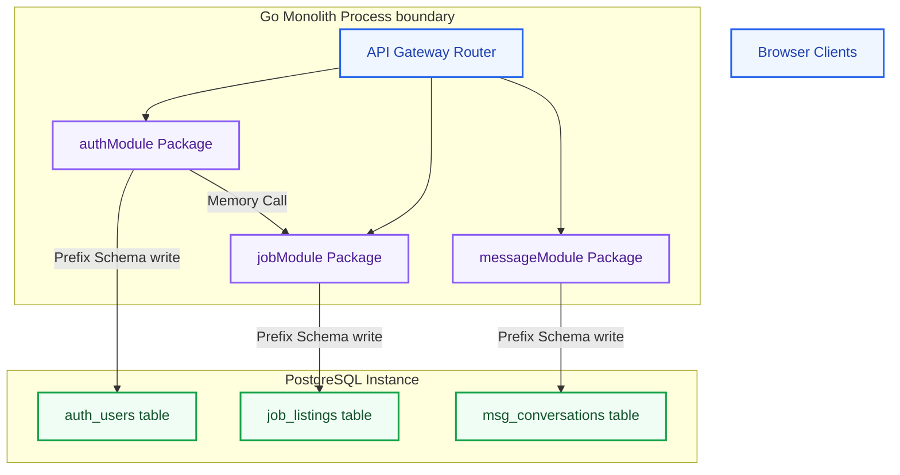
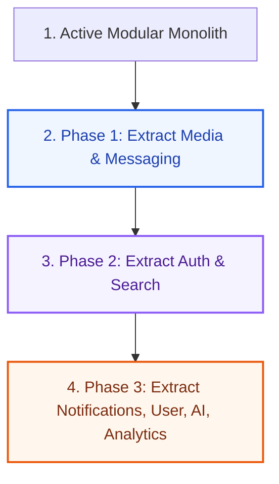
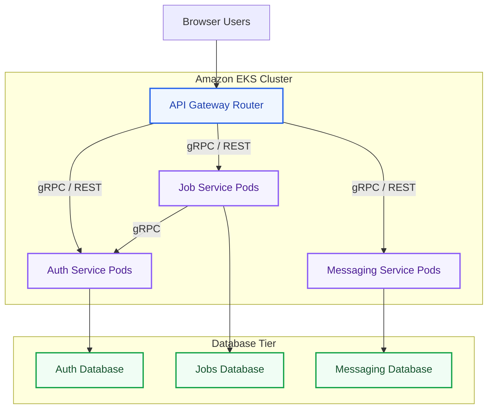

# Future Microservices Migration Strategy Specification: Kirmya Roadmap Tier
**Document Identifier:** PL-AR-25 | **Status:** Approved / Core Reference | **Version:** 1.0.0  
**Authors:** Antigravity AI & Enterprise Architecture Group | **Date:** July 24, 2026

---

## Document Control & Meta-Information

### Version History
| Version | Date | Author | Description |
| :--- | :--- | :--- | :--- |
| `0.1.0` | 2026-07-20 | Antigravity AI | Initial migration phases drafts. |
| `0.5.0` | 2026-07-22 | Antigravity AI | Integrated database splitting and gRPC routing rules. |
| `1.0.0` | 2026-07-24 | Antigravity AI | Completed full Microservices Migration Strategy. |

### Document Distribution
* **Product Strategy Group**: Project roadmap and release pacing.
* **Engineering Leads**: Boundary enforcement guidelines.
* **DevOps Team**: Kubernetes deployment configurations.
* **Security & Compliance**: Multi-service IAM policies audits.

---

## 1. Related Documents
- [00-documentation-standards.md](file:///c:/Users/PRASHANTH/Documents/real/my_project/docs/product/00-documentation-standards.md)
- [01-system-architecture.md](file:///c:/Users/PRASHANTH/Documents/real/my_project/docs/architecture/01-system-architecture.md)
- [02-modular-monolith-architecture.md](file:///c:/Users/PRASHANTH/Documents/real/my_project/docs/architecture/02-modular-monolith-architecture.md)
- [03-module-boundaries.md](file:///c:/Users/PRASHANTH/Documents/real/my_project/docs/architecture/03-module-boundaries.md)
- [04-backend-architecture.md](file:///c:/Users/PRASHANTH/Documents/real/my_project/docs/architecture/04-backend-architecture.md)

---

## 2. Dependencies
- Package boundary designs align with definitions in [PL-AR-002 Modular Monolith Architecture Blueprint](file:///c:/Users/PRASHANTH/Documents/real/my_project/docs/architecture/02-modular-monolith-architecture.md).
- Database prefix divisions inherit schemas defined in [PL-AR-008 Database Architecture Blueprint](file:///c:/Users/PRASHANTH/Documents/real/my_project/docs/architecture/08-database-architecture.md).

---

## 3. Purpose
This document defines the future microservices migration strategy for the Kirmya Professional Ecosystem. It specifies the migration philosophy, extraction criteria, candidate service assessments, database splitting, gRPC communications, and operational updates, ensuring scalable scaling.

---

## 4. Scope
- **In-Scope**: Migration justifications, module dependency analyses, extraction triggers, candidate service profiling, 3-phase roadmap, database dual-write steps, gRPC/REST interface upgrades, and Kubernetes computing shifts.
- **Out-of-Scope**: Code-level Kubernetes YAML manifest configurations.

---

## 5. Objectives
- Establish a migration roadmap based on modular monolith foundations.
- Define extraction criteria and decision metrics.
- Detail the extraction strategy across 3 distinct phases.
- Outlines database splitting, ownership transfers, and communication protocols.
- Create 3 detailed Mermaid diagrams modeling monoliths, roadmaps, and microservices target states.

---

## 6. Executive Summary
Kirmya starts as a **Modular Monolith** to optimize early development velocity, simplify local testing, and minimize infrastructure overhead. 

As system traffic scales, modules can transition to an independent **Microservices Architecture**. 

This document defines the migration strategy:
- **Philosophy**: Why starting modular is preferred, and the criteria that justify service extraction (e.g. CPU/RAM limits, deployment rates, latency spikes).
- **Roadmap**: A 3-phase migration plan to extract Messaging, Media, Auth, Search, and Notification modules.
- **Data & Communication**: Guidelines for database splitting, data migration (dual-write phase), and transitioning Go internal interfaces to gRPC, NATS, and REST.
- **Operations**: Infrastructure evolution from Docker Compose to Kubernetes (EKS/GKE), SRE observability changes, and distributed security policies.

---

## 7. Detailed Content: Microservices Migration Strategy

### 7.1 Migration Philosophy
Starting with a microservices architecture can introduce premature complexity, distributed transaction overhead, deployment friction, and high latency. 

A **Modular Monolith** provides a simpler alternative:
- **Fast Development**: Code lives in a single repository, enabling rapid changes and refactoring.
- **Unified Databases**: Facilitates local transactional commits.
- **Performance**: High-speed, local memory calls bypass network serialization overhead.
- **Transition Readiness**: Standardizing on strict package boundaries and prefix database isolation enables future microservice extraction.

### 7.2 Current Modular Monolith Architecture Diagram
Illustrates the modular monolith structure, showing package boundaries and isolated database schemas within a single process:

---

### 7.3 Microservice Extraction Triggers
A module is considered for microservice extraction when it meets one or more of the following triggers:

1. **Scale Requirements**: A module consumes a disproportionate amount of system resources (CPU/RAM).
2. **Team Ownership**: Decouple teams to deploy independently without release coordination bottlenecking.
3. **Performance needs**: Dynamic, low-latency requirements (e.g. real-time WebRTC or messaging).
4. **Independent deployment cadence**: Frequent changes to a specific domain (e.g. AI models).
5. **Security Isolation**: High security requirements (e.g. payment keys) require container isolation.

### 7.4 Candidate Microservices Profiles

| Candidate Service | Extraction Priority | Primary Trigger | Target Datastore |
| :--- | :--- | :--- | :--- |
| **Media Service** | High (Phase 1) | CPU usage (resizing/malware scans) | Cloudflare R2 |
| **Messaging Service** | High (Phase 1) | High WebSocket connections | PostgreSQL + Redis |
| **Authentication** | Medium (Phase 2)| Security and token validation scale| PostgreSQL |
| **Search Service** | Medium (Phase 2)| Search volume, OpenSearch sync | OpenSearch |
| **Notification** | Low (Phase 3) | Async processing latency | PostgreSQL |
| **User Service** | Low (Phase 3) | Shared domain boundaries | PostgreSQL |
| **AI Service** | Low (Phase 3) | GPU dependency, API cost control | pgvector + Redis |
| **Analytics Service** | Low (Phase 3) | Read-heavy database query load | ClickHouse |

---

### 7.5 Migration Roadmap Flow Chart
Illustrates the 3-phase migration plan to extract candidate services:

---

### 7.6 Data Migration Strategy
To split database tables safely during extraction:
- **Database Separation**: Split tables into dedicated database instances; direct cross-service queries are prohibited.
- **Ownership Transfer**: Each service owns its database. Other services must access data using API or event interfaces.
- **Migration Approach**:
  1. *Dual-Write Phase*: Write to old and new DBs simultaneously.
  2. *Verify Consistency*: Check data parity between databases.
  3. *Update Reads*: Update application reads to use the new database.
  4. *Deprecate Old Database*: Remove legacy tables from the primary monolith instance.

### 7.7 Communication Protocol Transitions
- **Monolith internal Go interface calls transition to**:
  - Asynchronous communication via NATS JetStream events.
  - Synchronous communication via gRPC (for internal service-to-service calls) and REST (for external client calls).

### 7.8 Infrastructure Evolution
- **Phase 1**: Docker Compose VM deployment.
- **Phase 2**: Deploy containers on AWS ECS (Elastic Container Service) to scale application nodes independently.
- **Phase 3**: Migrate containers to an Amazon EKS or GCP GKE Kubernetes cluster, packaging manifests using Helm charts.

---

### 7.9 Target Microservices Architecture Diagram
Illustrates the final target state, showing the API Gateway routing traffic to EKS pod groups querying separate datastores:

---

## 16. Functional Requirements Mapping
- **FR-GOV-ADR**: Technical decisions must be documented and approved using the ADR process before code commits.
- **FR-LOC-AR**: Bidirectional layout standards must align with MUI v6 configurations defined in ADR-006.

---

## 17. Non-Functional Requirements Verification
- **NFR-AV-001 (Uptime SLO >= 99.9%)**: System availability parameters must conform to clustering decisions documented in active ADRs.
- **NFR-PER-005 (Response Latency)**: Caching rules must align with the Redis Sentinel patterns specified in ADR-005.

---

## 18. Business Rules Mapping
- **BR-AUTH-SEATS**: Recruiter seat quotas must be validated using boundaries specified in ADR-007.
- **BR-FREE-DISPUTES**: Financial audit logs must align with Stripe webhook patterns specified in the deployment decisions.

---

## 19. Assumptions
- Development teams are trained on writing, reviewing, and approving ADR records.
- Storing decisions in the code repository ensures developers can access them easily.

---

## 20. Constraints
- Code changes that deviate from active ADRs cannot be merged without an approved successor ADR.
- ADR files must be written in Markdown, following the standard template layout.

---

## 21. Risks
- **Increased Complexity**: Managing distributed databases and networks increases operational overhead. *Mitigation*: Deploy standard API gateway templates and distributed tracing dashboards to trace requests.
- **Distributed Failures**: Cascading errors can disrupt downstream services. *Mitigation*: Wrap service-to-service calls in circuit breakers.

---

## 22. Open Questions
- Should we translate ADR records to Arabic, or maintain them in English?
- What tools will be used to generate automated ADR indices?

---

## 23. Future Improvements
- Integrate automated Slack notifications to alert development teams when new ADRs are submitted for review.
- Set up a static site generator to host a readable internal documentation portal.

---

## 24. Acceptance Criteria
The ADR system implementation must meet these standards to be marked complete:

| Rule | Verification Checkpoint | Target |
| :--- | :--- | :--- |
| **Template Compliance** | ADRs utilize the standardized Markdown template. | 100% compliance |
| **Registry Path** | ADR files are saved in `/docs/decisions/`. | 100% compliance |
| **Governance Active** | Board consensus is verified before marking Approved. | Mandatory |
| **Agent Alignment** | AI agents reference ADR IDs in commits. | Pass |

---

## 25. Success Metrics
- 100% of major architectural decisions are documented in ADRs.
- Average peer review cycles complete in under 5 business days.

---

## 26. Glossary
- **gRPC**: An open-source remote procedure call (RPC) framework.
- **EKS**: Amazon Elastic Kubernetes Service, a managed Kubernetes service.
- **CAB**: Change Advisory Board, a governance group that reviews and approves major system changes.

---

## 27. References
- [Monolith to Microservices (Sam Newman)](https://www.oreilly.com/library/view/monolith-to-microservices/9781492047834/)
- [Martin Fowler: Microservice Prerequisites](https://martinfowler.com/articles/microservice-prerequisites.html)
- [gRPC Official Getting Started Guide](https://grpc.io/docs/languages/go/quickstart/)

---

## 28. Revision History
| Version | Date | Author | Description |
| :--- | :--- | :--- | :--- |
| `1.0.0` | 2026-07-24 | Antigravity AI | Finished Kirmya Microservices Migration Strategy. |
