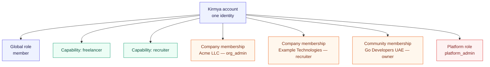
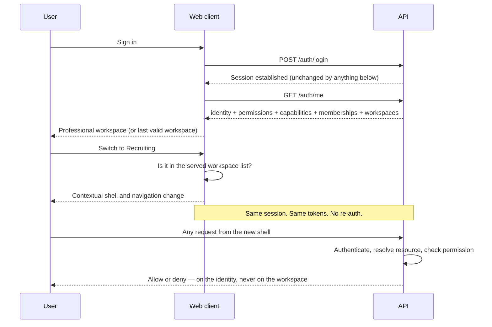
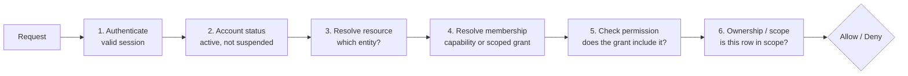

# 26. Single Identity, Multiple Workspaces

| Field | Value |
| :--- | :--- |
| **Status** | Accepted — documentation only, not yet implemented |
| **Date** | 2026-09-10 |
| **Decision record** | [ADR 0002](../decisions/0002-single-identity-multi-workspace-access.md) |
| **Supersedes** | The single-role model in [12-roles-permissions.md](../product/12-roles-permissions.md) §2–3 |
| **Audience** | Backend, frontend, database, security and QA engineers |

> **This document is a specification, not a description.** Nothing in it is
> implemented yet. Where it describes current behaviour it says so explicitly
> and cites the file. Everything else is the target.

---

## 1. The principle

Kirmya separates three questions that are routinely conflated:

| Question | Answered by | Authority |
| :--- | :--- | :--- |
| Who is this user? | **Authentication** | The session and its token |
| What is this user allowed to do? | **Authorization** | Server-side permission checks, per request |
| Which experience is the user currently using? | **Workspace context** | A UX preference |

**These must remain separate, and the third must never influence the second.**

Selecting the Recruiting workspace does not make anyone a recruiter. It changes
which navigation and shell the browser renders. Every request the resulting
screens make is authorized on its own merits, against the authenticated
identity, exactly as it would have been from any other workspace.

The load-bearing sentence:

> **Active workspace is UX context, not security authority.**

This is not a new idea in this codebase — it is already how the company module
works. `ViewerContext` in `backend/internal/company/models/management.go` says
so in its own comment: *"tells the frontend which controls to render. The
backend still re-checks every permission on the write itself; this exists so the
UI does not have to guess."* This document generalises that pattern; it does not
invent it.

---

## 2. One identity, many capabilities

One Kirmya account is one authenticated identity. That identity may hold any
combination of capabilities and memberships at the same time. They are not
mutually exclusive, and there is no ordering or inheritance between them.

Valid states include all of these:

| User | Holds |
| :--- | :--- |
| A | Professional only |
| B | Professional + Freelancer |
| C | Professional + Recruiter for Acme LLC |
| D | Professional + Recruiter for Acme LLC + Recruiter for Example Technologies LLC |
| E | Professional + Freelancer + Company Admin (Acme) + Community Admin (Go Developers UAE) |
| F | Professional + Platform Administrator |

Nothing about D requires two accounts, two logins or two profiles. Nothing about
E implies a hierarchy in which "Company Admin" outranks "Freelancer" — they are
different axes.

### 2.1 What this replaces

The current model is a single mutable global role. `users.role_id` is a
`character varying` holding exactly one value, the JWT carries it as a `Role`
claim (`backend/internal/shared/middleware/auth.go`), and `RequireRole` gates
routes on it (`backend/internal/shared/middleware/rbac.go`).

That model cannot express "recruiter for Acme but not for Example
Technologies", because it has nowhere to put the *for which company* part. Any
document or check of the shape `user.roleId === 'recruiter'` is therefore
describing a model Kirmya is moving away from.

### 2.2 The three kinds of authority



**Global role** — one value, deliberately small: `member`, `platform_admin`,
`super_admin`. It answers "what is this account on the platform", nothing more.

**Capability** — an account-wide ability that is activated, not granted by
membership: `freelancer`, `recruiter`. Backed by a profile row the user creates
during onboarding.

**Scoped membership** — authority over one named entity: this company, this
community. Always carries the entity id. Holding a role on entity A says nothing
about entity B.

---

## 3. Workspace types and instances

A **workspace type** is a kind of experience. A **workspace instance** is that
experience bound to one entity.

`company` is a type. *Company workspace → Acme LLC* and *Company workspace →
Example Technologies LLC* are two instances of it. The switcher lists instances;
the router addresses instances; permission checks resolve against the instance's
entity id.

| Workspace type | Entity-scoped | Available when | Route namespace |
| :--- | :--- | :--- | :--- |
| `professional` | No | Always, for every account | `/feed`, `/network`, `/jobs`, `/communities`, `/messages` |
| `freelancer` | No | Freelancer capability activated | `/freelance/*` |
| `recruiting` | No | Recruiter capability activated | `/recruiting/*` |
| `company` | **Yes** | Company membership with a managing role | `/company/:companyId/*` |
| `community_admin` | **Yes** | Community membership with a managing role | `/communities/:communityId/admin` |
| `page_admin` | **Yes** | Page membership with a managing role | `/pages/:pageId/admin` |
| `platform_admin` | No | Global role in the admin set | `/admin/*` |

### 3.1 Navigation per workspace

**Professional** (default) — Feed · Network · Jobs · Communities · Messages

**Freelancer** — Freelancer Home · Find Projects · Proposals · Contracts ·
Earnings · Messages

**Recruiting** — Recruiting Home · Jobs · Candidates · Applications · Talent
Search · Messages

**Company** — Company Home · Jobs · Candidates · Employees / Team · Company Page
· Analytics · Settings

**Community admin** — Overview · Members · Posts · Moderation · Events ·
Analytics · Settings

**Page admin** — Overview · Content · Followers · Analytics · Settings

**Platform admin** — isolated; see §9.

### 3.2 Page admin is specified, not buildable yet

**Pages do not exist in this repository.** There is no `pages` table, no
`backend/internal/pages` module, no `/api/v1/pages` route in the golden route
table, and no `/pages` route in the web client. Verified 2026-09-10.

The `page_admin` workspace is specified here for completeness of the model, and
it must not be built until the Pages domain exists. Anything that ships a Page
Admin entry in the switcher before then would be offering a workspace with
nothing behind it. The frontend currently carries a `canManagePage` helper and a
page admin navigation context that are, correspondingly, unreachable.

---

## 4. ActiveWorkspace

```ts
type WorkspaceType =
  | 'professional'
  | 'freelancer'
  | 'recruiting'
  | 'company'
  | 'community_admin'
  | 'page_admin'
  | 'platform_admin';

type ActiveWorkspace = {
  type: WorkspaceType;
  /** Required for entity-scoped types, absent for the rest. */
  entityId?: string;
};
```

This is a conceptual shape for documentation. It is not a mandated type
signature.

### 4.1 Where the state lives

| Concern | Owner | Notes |
| :--- | :--- | :--- |
| **Eligibility** — may this user enter this workspace? | **Server** | Authoritative. Recomputed per request. Never trusted from the client. |
| **Selection** — which workspace is open right now? | **Client** | A preference. Held in the app shell, reflected in the URL. |
| **Last used** | Server-side user preference, optional | Convenience only. Re-validated on load. |
| **Fallback** | Professional | Always available to every account. |

The rules:

1. The client may *ask* for any workspace. The server decides whether the data
   behind it is served.
2. A workspace that is no longer authorized falls back to Professional, silently
   and without error, on the next load.
3. Refresh restores the workspace if it is still authorized, and Professional if
   it is not.
4. Nothing about workspace selection changes the session, the tokens, or the
   identity.

---

## 5. Login and workspace switching



Switching workspaces must **not**:

- log the user out
- issue a second account or identity
- create another profile
- require another email address or password
- replace or reissue authentication tokens merely because the UI context changed

The one thing a switch legitimately changes on the server is the *optional*
last-used-workspace preference.

---

## 6. Capability activation is onboarding, not selection

Choosing a workspace never grants the capability behind it.

A Professional user selecting **"Start freelancing"** enters freelancer
onboarding. Only when that completes and validates does a `freelancer_profiles`
row exist, and only then does the Freelancer workspace appear in the switcher.
The same holds for **"Recruit talent"**, which begins recruiter onboarding or an
organization membership flow.

The switcher may advertise capabilities the user does not have, as an explicit
onboarding call to action. It must not present them as enterable workspaces.
Privileged workspaces — company, community, page, platform admin — must not be
advertised at all: they are granted by someone else, not self-served.

---

## 7. Authorization model

Every privileged request runs the same layered check, in this order:



Worked examples:

| Attempt | Why it is refused |
| :--- | :--- |
| Recruiter opens candidates for Company A | Needs a recruiting grant **on Company A**. `activeWorkspace = 'recruiting'` contributes nothing. |
| Freelancer edits another freelancer's proposal | Fails at step 6: the proposal is not theirs. |
| Community admin of X moderates community Y | Fails at step 4: no membership on Y. |
| Company admin of Acme edits Example Technologies | Fails at step 4: the grant is scoped to Acme. |
| Company owner reaches `/admin` | Fails at step 4: entity roles are not platform roles. |

The last row is already true in code and deliberately so —
`Actor.IsPlatformAdmin()` in `management_service.go` carries the comment: *"it
is deliberately separate from every company-scoped role: being the owner of a
company grants nothing at the platform level."*

### 7.1 The reference implementation already exists

The company module is the template. It has:

- `Actor` — the authenticated caller, carrying `UserID` and `PlatformRole`,
  with `IsPlatformAdmin()` kept separate from every scoped role
- `grantFor(ctx, actor, companyID)` — resolves the caller's scoped grant
- `effectivePermissions(grant)` — derives permissions from roles plus extras
- `domain.Role` / `domain.Permission` — typed vocabularies, not strings
- `ViewerContext` — what the UI may render, explicitly not the security boundary

**Other modules should adopt this shape rather than a new abstraction.**

---

## 8. RBAC and scoped membership

A pragmatic hybrid. Not one global role; not a permission engine.

**Global roles** — `member`, `platform_admin`, `super_admin`.

**Capabilities** — `freelancer`, `recruiter`. Account-wide, activated by
onboarding, backed by a profile row.

**Scoped roles**

| Scope | Roles |
| :--- | :--- |
| Company | `company_owner`, `org_admin`, `recruiter_admin`, `hiring_manager`, member |
| Community | `owner`, `admin`, `moderator` |
| Page | `owner`, `admin`, `editor` *(not yet modelled — §3.2)* |

The company vocabulary above is the one already defined in
`backend/internal/company/domain/rbac.go`, not a proposal.

**Permissions decide authorization.** Roles are a convenient way to grant sets
of permissions; checks should test permissions, as the company module already
does with `PermCompanyEdit`, `PermSettingsEdit` and the rest.

Kirmya remains a modular monolith. This introduces no services, no new runtime,
and no cross-module permission engine.

---

## 9. Platform administration stays isolated

Platform administration is not a peer of the other workspaces and must not be
modelled as one:

- It is never granted by any entity-scoped role.
- It is never self-served through onboarding.
- It is never advertised in the switcher to accounts that lack it.
- Its routes are gated server-side, not merely hidden.

The admin role set is `{admin, super_admin, platform_admin}` — the set
`AdminRoles()` returns and `RequireAdmin()` enforces. Any client-side check must
mirror that exact set; a check for `role === 'admin'` alone silently excludes two
roles the server admits.

---

## 10. Multi-Workspace Security Invariants

> These are the invariants. A change that violates one is a security regression
> regardless of how convenient it is. Each is testable, and §19 of the ADR maps
> them to the tests that should exist.

1. **Workspace selection never grants authorization.** No permission decision
   may read the active workspace.
2. **All privileged APIs enforce backend permission checks**, independently of
   which UI made the call.
3. **Entity-scoped access validates entity membership**, against the entity id
   in the request — never against a workspace the client claims to be in.
4. **Client-supplied role and workspace data is untrusted.** It selects a view;
   it never widens access.
5. **JWT claims are not the sole source of rapidly changing scoped
   permissions.** Scoped grants change while a token is live. Either resolve
   them per request from the database, or ship an invalidation strategy. Today
   the JWT carries only the global `Role`, and access tokens are not revocable
   within their lifetime — see residual **R02**.
6. **Platform admin remains isolated** from every ordinary and entity-scoped
   role.
7. **Disabled or suspended memberships lose protected access immediately**, not
   at next login.
8. **Removing a membership removes the workspace.** Losing the Acme grant
   removes the Acme workspace and denies its routes on the next request.
9. **Hidden navigation is not an authorization control.** Every workspace route
   must refuse an unauthorized caller on the server.
10. **Deep links are secured.** Opening `/company/acme/settings` directly runs
    the identical check as reaching it through the switcher.

---

## 11. UX rules

- Professional is the default experience for every account.
- Switching takes no more than two interactions.
- Switching preserves session state that is not workspace-specific.
- The current workspace is always visually identifiable.
- Users see only workspaces they can actually enter.
- Unavailable *capabilities* may appear as onboarding calls to action.
  Unavailable *privileged* workspaces must not appear at all.
- Refresh preserves the current workspace when it is still authorized.
- An invalid, revoked or deleted workspace falls back to Professional
  gracefully — not to an error page.
- Browser Back and Forward behave predictably; the workspace follows the URL.
- Deep links open the right context *after* permission verification.

### 11.1 The switcher

It belongs beside the account controls, not in the primary navigation. Only
entitled workspaces are listed, grouped by kind:

```
Professional  ✓
Freelancing
Recruiting
──────────────────────
Acme LLC
Go Developers UAE
──────────────────────
Kirmya Administration
```

The primary professional navigation stays five items — Feed, Network, Jobs,
Communities, Messages. Workspace links do not accumulate there; changing
workspace changes the contextual navigation instead.

### 11.2 Mobile and tablet

The switcher is reachable at every breakpoint. It is not a desktop-only control,
and the mobile presentation must not enumerate every capability at once — it
opens from the account control, the same as on desktop. The existing bottom
navigation continues to carry the five primary destinations of the *active*
workspace.

---

## 12. Terminology

**Workspace** is the term. Use it consistently.

| Use | Not |
| :--- | :--- |
| workspace | mode, portal, account type, profile type, role mode, dashboard mode |

A *dashboard* may exist **inside** a workspace. A dashboard is not a workspace.
"Recruiting workspace" is right; "recruiter dashboard" names a screen within it,
and only when that screen genuinely exists.

---

## 13. Relationship to shipped navigation

The navigation system shipped in `1708e7a` already implements several
preconditions of this architecture, and this document does not contradict it:

- `/feed` is the signed-in home; `/dashboard` redirects there and is not a
  universal landing page.
- Primary navigation is five destinations.
- Entity management is entity-scoped by URL, not by query parameter.
- Platform administration is gated on the route, not only on the link.
- Permission helpers are centralised in `frontend/src/shared/permissions/`.

What is missing is the workspace layer itself: a switcher, a served list of
entitled workspaces, and contextual shells keyed to workspace rather than to
URL prefix alone.

---

## 14. Database implications

**No migrations are written in this task.** This section records what the
schema already supports and what would need to change, so that the migration
work is a decision already taken rather than one improvised later.

### 14.1 What already exists and can stay

Verified against the CI database on 2026-09-10.

| Table | Columns relevant here | Verdict |
| :--- | :--- | :--- |
| `company_members` | `company_id, user_id, role, status, association_type, approved_by, approved_at, started_at, ended_at` | **Keep.** Already scoped, already has status and approval, already unique on `(company_id, user_id)`. |
| `company_member_roles` | `company_id, member_id, user_id, role, extra_permissions, granted_by` | **Keep.** Already supports several roles and per-member extra permissions. |
| `community_members` | `community_id, user_id, role_name, status` | **Keep.** Unique on `uniq_community_membership`; indexed for lookup. |
| `admin_user_roles` | `user_id, role_id, assigned_by, assigned_at` | **Keep.** Platform roles are already many-to-many. |
| `freelancer_profiles` | `user_id` unique, `capability_status` | **Kept and extended.** Row existence was the capability, which is why freelancing could not be withdrawn without suspending the account. Since migration `0101` the capability is `capability_status = 'active'`; `user_id` stays unique, so one account has at most one freelancer identity. |
| `recruiter_profiles`, `recruiters`, `recruiter_organization_profiles` | | **Keep**, but see 14.3 — the capability signal needs to be settled. |
| `user_preferences` | `user_id, profile_visibility` | **Extend** — see 14.4. |

The important finding: **the persistence layer already models multi-valued,
entity-scoped authority.** The gap is not storage. It is that nothing reads
these tables when answering "who is this user and what can they do", and nothing
exposes them to the client.

### 14.2 `users.role_id` narrows; it is not dropped

`users.role_id` becomes the **global role only** — `member`, `platform_admin`,
`super_admin`. Values such as `recruiter` or `freelancer` move to capabilities.

It is not dropped in this migration. Dropping it is a separate decision taken
when nothing reads it, and it is read today by the JWT claim, `RequireRole`, and
the permission list in `auth_service.go`.

### 14.3 What needs deciding, not inventing

**The capability signal.** *Settled, for both.* Each capability now has exactly
one column that means "this account may act", and one function that reads it:

| Capability | Signal | Read by |
| :--- | :--- | :--- |
| Freelancer | `freelancer_profiles.capability_status = 'active'` | `FreelanceService.FreelancerCapability` |
| Recruiter | `recruiter_profiles.capability_status = 'active'` | `RecruiterService.RecruiterCapability` |

Freelancer was recorded here as unambiguous because a row existed or it did not.
That was unambiguous and wrong: it made the capability unrevocable, since the
only way to withdraw it was to delete the profile — and with it the portfolio,
proposals and contracts — or to suspend the whole Kirmya account. Existence
answers *has this person ever freelanced*, which is not the question route
protection asks.

**Membership status vocabulary.** `company_members.status` and
`community_members.status` are independent strings today. Invariant 7 requires
that a suspended membership loses access immediately, which requires knowing
which values mean "active". Enumerate them per domain, and check the value —
not merely the row's existence.

### 14.4 Optional: last-used workspace

Persisting the last workspace is a convenience, not a requirement, and is
re-validated on every load. If it is persisted, extend `user_preferences` —
which already exists with one column — rather than adding a table:

| Column | Type | Notes |
| :--- | :--- | :--- |
| `last_workspace_type` | text, nullable | Null means Professional |
| `last_workspace_entity_id` | uuid, nullable | Null for non-scoped types |

Deletion behaviour: when the referenced company, community or page is deleted,
or the membership is removed, this preference becomes stale. It must **not** use
a foreign key with cascade semantics that make deleting a company depend on user
preference rows. Treat a stale value as "no preference" and fall back to
Professional — which the client does anyway, because it re-validates.

### 14.5 What is deliberately not created

**No generic `workspaces` table.** The reasoning is in the ADR: each domain
already models membership with the columns it actually needs, and collapsing
them into one table would either lose those columns or reduce them to JSON,
while putting every domain's authorization behind one shared table. Assemble
the workspace list at the API edge from domain-owned memberships.

**No `pages` tables in this task.** Pages do not exist (§3.2). Creating
membership tables for an entity that has no module, no routes and no API would
be inventing functionality.

---

## 15. API contract

### 15.1 Extend `/auth/me` rather than adding an endpoint

`GET /api/v1/auth/me` already exists, is already the authenticated bootstrap
call the web client makes after login, and already returns identity plus a
permission list. It is the right home. Adding a second endpoint such as
`/me/context` would mean two bootstrap calls and two sources of truth about the
same session.

**Current response** (`dto.UserMeDTO`, verified 2026-09-10):

```jsonc
{
  "user": { "...": "...", "roleId": "member" },
  "permissions": ["profile:read", "profile:write", "messaging:access",
                  "jobs:browse", "network:connect"],
  "notificationsCount": 0
}
```

Today those permissions are a hardcoded base list, plus `admin:access` and
`users:manage` when `users.role_id` is in the admin set. **No capability and no
membership information is served at all** — which is precisely why a workspace
switcher cannot be built against the current contract.

**Target response** — additive; every existing field keeps its meaning:

```jsonc
{
  "user": { "...": "...", "roleId": "member" },
  "permissions": ["profile:read", "..."],
  "notificationsCount": 0,

  "capabilities": ["freelancer", "recruiter"],

  "workspaces": [
    { "type": "professional", "label": "Professional", "available": true },
    { "type": "freelancer",   "label": "Freelancing",  "available": true },
    { "type": "recruiting",   "label": "Recruiting",   "available": true },
    { "type": "company",         "entityId": "…", "label": "Acme LLC",
      "roles": ["org_admin"] },
    { "type": "community_admin", "entityId": "…", "label": "Go Developers UAE",
      "roles": ["owner"] },
    { "type": "platform_admin",  "label": "Kirmya Administration" }
  ]
}
```

### 15.2 Rules for this contract

1. **Only entitled workspaces appear.** The list is not a menu of everything
   that exists with an `available` flag on each — a listed company the caller
   cannot enter leaks that the company exists. `available` is retained only for
   the non-scoped capability types, where it distinguishes "activated" from
   "offer onboarding".
2. **The list is derived, never stored.** It is assembled per request from the
   global role, capability rows and scoped memberships.
3. **It is advisory.** Serving a workspace in this list does not authorize any
   request the resulting screens make. Each of those is checked on its own.
4. **Entity-scoped entries always carry `entityId`.** A company entry without
   one is malformed and must be rejected rather than defaulted.
5. **Labels come from the entity**, so they are subject to the same visibility
   rules as the entity's name elsewhere.

### 15.3 Workspace preference

If last-used workspace is persisted, it is written through an existing
preferences endpoint, not a new one, and writing it is not a privileged
operation — it grants nothing. Reading it back is subject to re-validation
against the served workspace list.

---

## 16. Migration phases

| Phase | Deliverable | Classification |
| :--- | :--- | :--- |
| 1 | This specification and [ADR 0002](../decisions/0002-single-identity-multi-workspace-access.md) | Documentation |
| 2 | Capability and membership resolution server-side | Backend |
| 3 | `/auth/me` returns capabilities, memberships, workspaces | Backend, API |
| 4 | Frontend workspace state provider | Frontend |
| 5 | Workspace switcher | Frontend |
| 6 | Contextual navigation keyed to workspace | Frontend |
| 7 | Recruiter migration off the global role | Backend, Migration |
| 8 | Freelancer migration | Backend, Migration |
| 9 | Company, community, page admin workspaces | Backend, Frontend |
| 10 | Platform admin hardening | Security |
| 11 | End-to-end and security regression tests | Testing |

Existing functionality continues working throughout. There is no flag day.

---

## 17. Terminology audit

Swept the whole of `docs/` on 2026-09-10. Counts are files, not occurrences.

| Term | Files | Disposition |
| :--- | ---: | :--- |
| `/dashboard` | 24 | **Mixed.** A dashboard *inside* a workspace is legitimate; `/dashboard` as the signed-in home is not. Corrected in the information architecture and navigation documents. The rest are experience documents where the word names a screen — left, to be corrected when each is next revised. |
| "recruiter dashboard" | 8 | Names a screen inside the Recruiting workspace. Acceptable where a real screen is meant; not acceptable as a synonym for the workspace. |
| "admin dashboard" | 9 | Same. Platform administration is a workspace; its landing screen may be a dashboard. |
| "freelancer dashboard" | 1 | Same. |
| "portal" | 18 | **Discouraged.** Prefer *workspace*. Most instances are "employer portal", which means the Company workspace. Not mass-edited here — a rename across 18 files is churn without a reader benefit, and each should change when its document is next revised. |
| "account type" | 2 | **Discouraged.** There is one account type. What varies is capabilities. |
| `roleId` | 1 | Accurate: it is a real field. It must be described as the *global* role, not the user's only role. |
| "single role" | 0 | — |

### 17.1 The rule for future edits

When revising any document that uses these terms:

- *Workspace* is the experience. *Dashboard* is a screen that may sit inside one.
- Never write "the user's role" as if there were one. Write global role,
  capability, or scoped role, and say which entity a scoped role applies to.
- Never describe a workspace as granting anything.

### 17.2 Deliberately not changed

Historical records are left intact: batch delivery evidence, the issue register,
release acceptance records and ADR 0001 describe what was true when written.
Where such a document states a single-role model, that is an accurate record of
the model at that time, not an error to correct.
