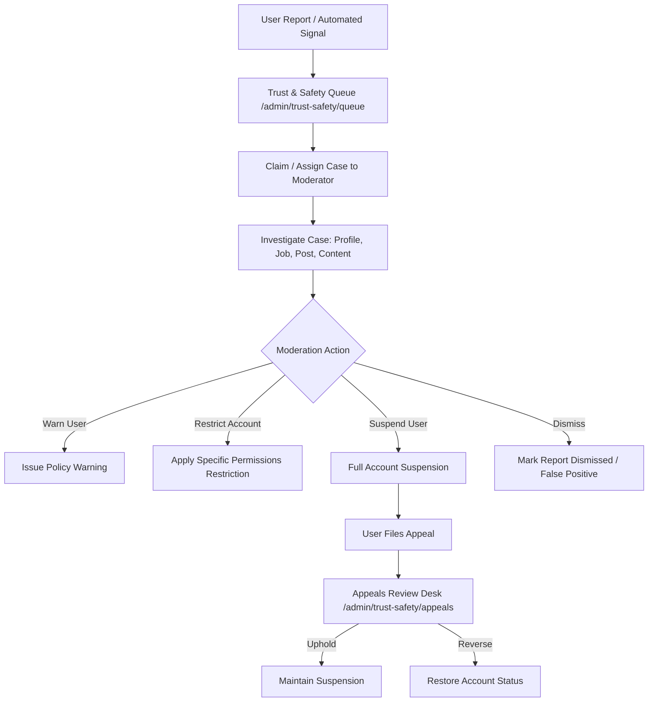

# Kirmya Complete Admin, Moderation, Trust & Safety Design Specification

**Specification Version**: 1.0.0  
**Phase**: Prompt 29/50  
**Framework**: React 18, Next.js 16 (App Router), MUI v6, Emotion, TypeScript  
**Backend Layer**: Golang Gin, PostgreSQL (pgx), Clean Architecture, RBAC Middleware  

---

## 1. Executive Summary & Design Vision

The Kirmya Admin, Moderation, Trust & Safety Experience provides a **secure, role-aware, auditable, operationally useful, accessible, and Apple-inspired operations workspace** for platform administrators, trust & safety officers, moderators, and support engineers.

### Key Tenets
1. **Server-Side Authoritative RBAC**: Every endpoint enforces strict role and permission checks (`super_admin`, `admin`, `moderator`, `support_agent`) via `RequireRole` middleware.
2. **Zero Fake Metrics / Simulated Dashboards**: Real dashboard statistics (`/api/v1/admin/stats`, `/api/v1/admin/users`, `/api/v1/admin/trust-safety/*`) with server-side pagination and filters.
3. **Apple-Inspired Operational Precision**: Clean, structured layout with `tokens.radius.lg`, subtle outline borders, high contrast data tables, and minimal visual clutter.
4. **Traceable & Auditable Moderation**: Every user suspension, content removal, verification decision, and role change is logged to an immutable audit trail (`/api/v1/admin/audit`).
5. **Trust & Safety Lifecycle**: Full end-to-end support for user reports, moderation queues, case investigation drawers, action execution (warn, restrict, suspend, restore), and user appeals desk.

---

## 2. Canonical Route Architecture

| Route | Purpose | Access Guard | Primary Components |
|---|---|---|---|
| `/admin` | Executive Operations & Platform Dashboard | `RequireRole("admin", "super_admin")` | `AdminDashboard`, `BackgroundJobManager`, `IncidentManager` |
| `/admin/users` | User Directory, Suspensions & Verification | `RequireRole("admin", "super_admin")` | `UserManagement`, `ImpersonationDialog` |
| `/admin/roles` | RBAC Matrix & Permission Assignment | `RequireRole("super_admin")` | `RoleManagement` |
| `/admin/jobs` | Job Moderation & Fraud Mitigation | `RequireRole("admin", "super_admin", "moderator")` | `JobModeration` |
| `/admin/trust-safety` | Trust & Safety Operations Hub | `RequireRole("admin", "super_admin", "moderator")` | `AdminTrustSafetyDashboard` |
| `/admin/trust-safety/queue` | Moderation Queue & Case Review | `RequireRole("admin", "super_admin", "moderator")` | `ModerationQueueTable`, `CaseInvestigationDrawer` |
| `/admin/trust-safety/appeals` | User Dispute & Appeals Review Desk | `RequireRole("admin", "super_admin", "moderator")` | `AppealsManagementDesk` |
| `/admin/audit-logs` | Immutable Compliance & Security Audit Log | `RequireRole("super_admin", "admin")` | `AuditLog` |

---

## 3. Moderation & Trust-Safety Lifecycle State Machine

---

## 4. Security & Audit Logging Architecture

1. **RBAC Isolation**: Standard user JWTs receive immediate 403 Forbidden on any `/api/v1/admin/*` route.
2. **Audit Logging**: All destructive actions (status changes, suspensions, role mutations) write immutable records to the PostgreSQL audit log with admin email, role code, target ID, reason, and client IP.
3. **Data Minimization**: Passwords, hashed credentials, and sensitive private communications are never exposed on admin consoles.
