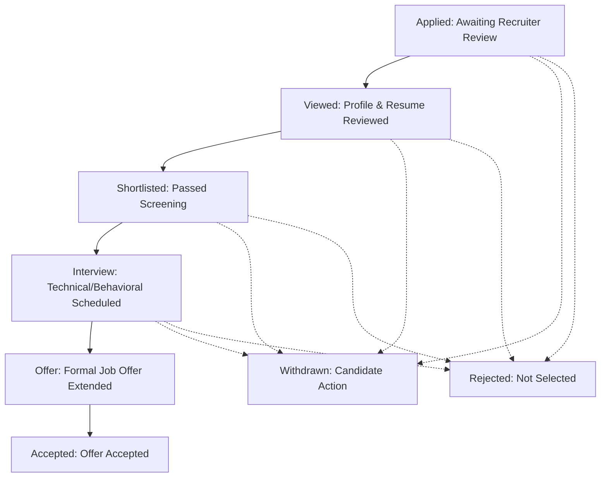

# Kirmya Complete Job Applications & Candidate Pipeline Experience Design Specification

**Specification Version**: 1.0.0  
**Phase**: Prompt 23/50  
**Framework**: React 18, Next.js 16 (App Router), MUI v6, Emotion, TypeScript  
**Backend Layer**: Golang Gin, PostgreSQL (pgx), Clean Architecture  

---

## 1. Executive Summary & Design Vision

Kirmya Job Applications & Candidate Pipeline delivers a **transparent, reliable, fast, calm, and Apple-inspired application tracking experience** for candidates and recruiters.

### Key Tenets
1. **Zero Mock/Fake Submissions or Statuses**: Pure direct integration with PostgreSQL backend (`/api/v1/applications/*`, `/api/v1/recruiter/*`).
2. **Apple-Inspired Restraint**: Elevated card surfaces with `tokens.radius.lg`, subtle outline borders, clear typography hierarchy, and zero intrusive dashboard clutter.
3. **Structured Application Lifecycle**: Normalized status stages (`Applied`, `Viewed`, `Shortlisted`, `Interview`, `Offer`, `Accepted`, `Rejected`, `Withdrawn`) with authoritative status explanations.
4. **Contextual Document & Interview Tracking**: Submitted resume & cover letter versions, scheduled interview times with direct join links, and assigned recruiter contacts.
5. **Safe Candidate Actions**: Transparent withdrawal flows with explicit modal confirmation and instant timeline updates.

---

## 2. Canonical Route Architecture

| Route | Purpose | Access Guard | Primary Components |
|---|---|---|---|
| `/dashboard/applications` | Candidate Applications Hub & Status Tracker | `AuthRequired` | `ApplicationsPage`, `ApplicationDashboard`, `ApplicationCard` |
| `/dashboard/applications/[id]` | Candidate Application Details (Timeline, Stepper, Docs) | `AuthRequired` | `ApplicationDetailPage`, `ApplicationDetails`, `ApplicationTimeline` |
| `/applications` | Canonical alias/redirect to `/dashboard/applications` | `AuthRequired` | `ApplicationsPage`, `ApplicationDashboard` |
| `/applications/[applicationId]` | Canonical alias/redirect to `/dashboard/applications/[id]` | `AuthRequired` | `ApplicationDetailPage`, `ApplicationDetails` |
| `/recruiter/applications` | Recruiter Candidate Pipeline & ATS Overview | `AuthRequired` (Recruiter) | `ApplicationsMainPage`, `PipelineBoard` |
| `/recruiter/applications/detail/[applicationId]` | Recruiter Candidate Evaluation & Interview Stage Action | `AuthRequired` (Recruiter) | `ApplicationDetailPage`, `ApplicationDetails` |

---

## 3. Supported Application Lifecycle Stages

---

## 4. Security & Access Control

1. **Candidate Isolation**: Backend SQL queries enforce `WHERE candidate_id = $1` across all candidate application endpoints.
2. **Recruiter Authorization**: Recruiters can only access applications for jobs within their verified organization (`WHERE org_id = $1`).
3. **Protected Documents**: Submitted resumes and cover letters are referenced by secure UUID identifiers with access restricted to candidate and authorized hiring team.
