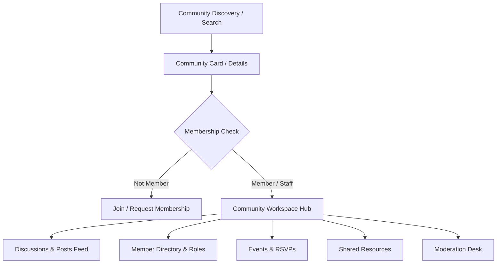

# Kirmya Complete Communities & Professional Groups Experience Design Specification

**Specification Version**: 1.0.0  
**Phase**: Prompt 22/50  
**Framework**: React 18, Next.js 16 (App Router), MUI v6, Emotion, TypeScript  
**Backend Layer**: Golang Gin, PostgreSQL (pgx), Clean Architecture  

---

## 1. Executive Summary & Design Vision

Kirmya Communities provides **focused, professional, trustworthy, and Apple-inspired technical circles and knowledge hubs**.

### Key Tenets
1. **Zero Mock/Fake Communities or Posts**: Pure direct integration with PostgreSQL backend (`/api/v1/communities/*`).
2. **Apple-Inspired Restraint**: Elevated card surfaces with `tokens.radius.lg`, subtle outline borders, clear typography hierarchy, and zero intrusive clutter.
3. **Structured Discussion & Knowledge Sharing**: Discussion feeds with title/content composer, pinned/announcement badges, comment threads, event calendars, and shared technical resources.
4. **Authoritative Access Control & Moderation**: Owner, Admin, Moderator, and Member roles with join request approvals, report reviews, and moderation action logs.
5. **Seamless Ecosystem Integration**: Links to user profiles (`/profile/[username]`), direct messaging (`/messages`), connection requests (`/network`), and notifications.

---

## 2. Canonical Route Architecture

| Route | Purpose | Access Guard | Primary Components |
|---|---|---|---|
| `/communities` | Discovery hub with debounced live search & category chips | `AuthRequired` | `CommunitiesDiscoveryPage`, `CommunityCard`, `CommunityCreateModal` |
| `/communities/create` | Launch a new professional group | `AuthRequired` | `CreateCommunityPage`, `CommunityCreateModal` |
| `/communities/[id]` | Main community workspace (Discussions feed & widgets) | `AuthRequired` | `CommunityHubPage`, `CommunityHeader`, `CommunityFeed`, `CommunityEventsCard`, `CommunityResourcesCard` |
| `/communities/[id]/members` | Community member directory & pending join approvals | `AuthRequired` | `CommunityMembersPage`, `CommunityHeader`, `CommunityMemberDirectory` |
| `/communities/[id]/events` | Community events calendar & RSVPs | `AuthRequired` | `CommunityEventsPage`, `CommunityHeader`, `CommunityEventsCard` |
| `/communities/[id]/about` | Community identity, details, and guidelines/rules | `AuthRequired` | `CommunityAboutPage`, `CommunityHeader` |
| `/communities/[id]/moderation` | Moderation desk (flagged reports & action logs) | `AuthRequired` (Staff only) | `CommunityModerationPage`, `CommunityHeader`, `CommunityModerationDesk` |
| `/communities/[id]/settings` | Community governance & privacy settings | `AuthRequired` (Admin only) | `CommunitySettingsPage`, `CommunityHeader`, `CommunitySettingsTab` |

---

## 3. Supported Community Model & Data Flow

---

## 4. Moderation & Governance System

1. **Role Hierarchy**:
   - `owner`: Full control over community metadata, deletion, member roles, and settings.
   - `admin`: Member invitation, join request approvals, post management, and event creation.
   - `moderator`: Content review, post pinning/locking, and member warning/muting.
   - `member`: Discussion participation, comments, event RSVPs, and resource access.
2. **Reporting**:
   - Posts can be flagged with a reason $\to$ `POST /communities/reports`.
   - Moderation actions log recorded in `GET /communities/:id/moderation/actions`.
