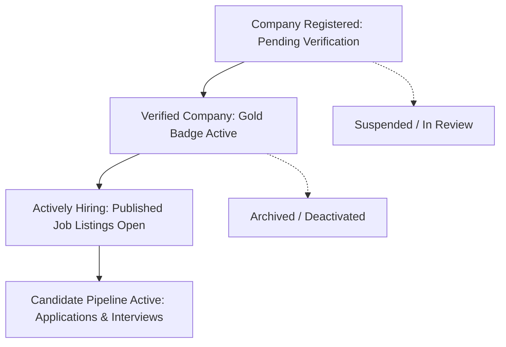

# Kirmya Complete Company & Employer Experience Design Specification

**Specification Version**: 1.0.0  
**Phase**: Prompt 26/50  
**Framework**: React 18, Next.js 16 (App Router), MUI v6, Emotion, TypeScript  
**Backend Layer**: Golang Gin, PostgreSQL (pgx), Clean Architecture  

---

## 1. Executive Summary & Design Vision

Kirmya Company & Employer Experience delivers a **trustworthy, organization-aware, recruiter-friendly, candidate-friendly, and Apple-inspired workspace** for enterprise branding, recruitment operations, job postings, and team member delegation.

### Key Tenets
1. **Zero Mock Companies / Fabricated Stats**: Direct PostgreSQL pgx integration via `/api/v1/companies/*` and `/api/v1/recruiter/*`.
2. **Apple-Inspired Restraint**: Elevated card surfaces with `tokens.radius.lg`, subtle outline borders, clean typography hierarchy, and zero clutter.
3. **Canonical Company & Employer Entity Model**: Strict separation and unification between `Company` (public entity / branding), `Organization` (enterprise tenant), `Recruiter` (delegated team member), and `User` (authenticated identity).
4. **Role-Based Permission Security**: Granular permissions (`company:view`, `company:edit`, `job:create`, `job:view`, `team:view`, `recruiter:view`, `analytics:view`) enforced by server-authoritative middleware.
5. **Seamless Pipeline Integration**: Direct connection with Prompt 23 (Applications Pipeline), Prompt 24 (Interviews & Scheduling), and Prompt 25 (Document Management).

---

## 2. Canonical Route Architecture

| Route | Purpose | Access Guard | Primary Components |
|---|---|---|---|
| `/companies` | Public Companies Directory & Discovery | Public / Auth | `CompaniesDirectoryPage`, `CompanyFilters`, `CompanyGrid` |
| `/companies/[handle]` | Canonical Company Detail Profile | Public / Auth | `CompanyDetailPage` |
| `/company/[slug]` | Full Public Company Brand & Openings | Public / Auth | `CompanyHomePage`, `CompanyProfile`, `CompanyJobs` |
| `/employer/dashboard` | Employer Recruitment Dashboard | `AuthRequired` (Recruiter/Employer) | `EmployerDashboardPage`, `CompanyDashboardShell` |
| `/employer/jobs` | Employer Job Management | `AuthRequired` (Recruiter/Employer) | `EmployerJobsPage`, `CompanyJobs` |
| `/employer/team` | Team Member & Recruiter Management | `AuthRequired` (Admin/Owner) | `EmployerTeamPage` |
| `/employer/settings` | Organization & Branding Settings | `AuthRequired` (Admin/Owner) | `EmployerSettingsPage` |

---

## 3. Supported Company & Recruitment Lifecycle States

---

## 4. Security & Permissions Architecture

1. **Tenant Isolation**: Backend SQL queries strictly filter by authenticated `WHERE company_id = $1` or `WHERE organization_id = $1`.
2. **Permission Matrices**: Roles (`owner`, `admin`, `recruiter`, `hiring_manager`, `member`) are enforced via backend JWT claims and middleware.
3. **Public vs Private Data Boundary**: Internal metrics, candidate notes, applicant scorecards, and recruiter identities are never exposed on public `/companies/*` endpoints.
