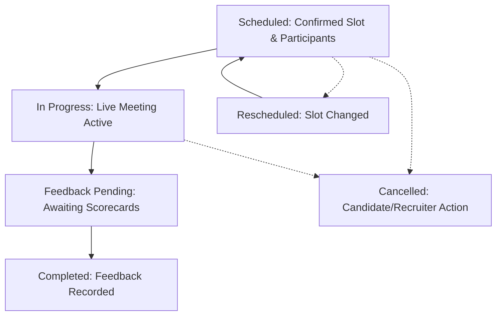

# Kirmya Complete Interview & Scheduling Experience Design Specification

**Specification Version**: 1.0.0  
**Phase**: Prompt 24/50  
**Framework**: React 18, Next.js 16 (App Router), MUI v6, Emotion, TypeScript  
**Backend Layer**: Golang Gin, PostgreSQL (pgx), Clean Architecture  

---

## 1. Executive Summary & Design Vision

Kirmya Interview & Scheduling delivers a **timezone-safe, reliable, candidate-friendly, recruiter-friendly, and Apple-inspired technical evaluation workspace**.

### Key Tenets
1. **Zero Fake Interviews / Simulated Availability**: Direct PostgreSQL pgx integration via `/api/v1/interviews/*` and `/api/v1/recruiter/interviews/*`.
2. **Apple-Inspired Restraint**: Clean card surfaces with `tokens.radius.lg`, subtle outline borders, clear typography hierarchy, and zero intrusive clutter.
3. **Multi-Round Technical Evaluation**: Support for multi-stage technical screens, system design interviews, behavioral evaluations, and structured feedback scorecards.
4. **Timezone Awareness & Clarity**: Explicit localized date/time formatting with UTC/GST context.
5. **Real-Time Reminders & Direct Meeting Links**: Live alerts for interviews starting soon and direct Google Meet/Zoom video call launching.

---

## 2. Canonical Route Architecture

| Route | Purpose | Access Guard | Primary Components |
|---|---|---|---|
| `/dashboard/interviews` | Candidate Upcoming & Past Interviews Tracker | `AuthRequired` | `CandidateInterviewsPage`, `InterviewDashboard` |
| `/interviews` | Full Technical Interview & Scheduling Workspace | `AuthRequired` | `InterviewsPage`, `CalendarView`, `AvailabilityManager`, `RemindersPanel`, `ScheduleModal` |
| `/recruiter/interviews` | Recruiter Interview Management & Evaluation Desk | `AuthRequired` (Recruiter) | `RecruiterInterviewsPage` |

---

## 3. Supported Interview Lifecycle States

---

## 4. Security & Privacy

1. **Authorization**: SQL queries enforce `WHERE candidate_id = $1` or `WHERE organizer_id = $1`.
2. **Scorecard Privacy**: Interview feedback scorecards (`POST /interviews/rounds/:roundId/feedback`) are restricted to authorized interviewers and hiring managers.
3. **Protected Meeting URLs**: Direct links are guarded and only rendered for confirmed participants.
