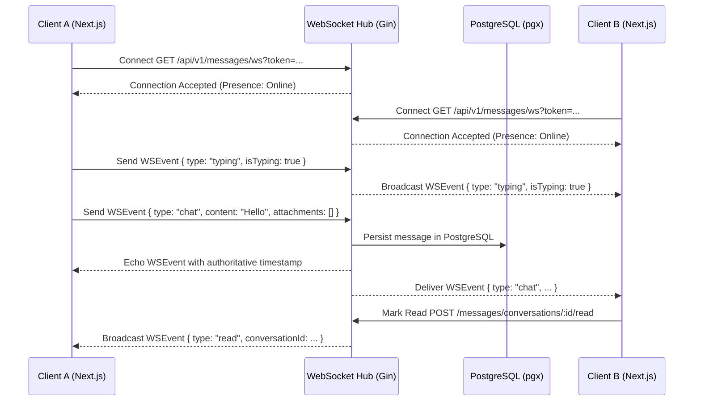

# Kirmya Messaging, Conversations & Real-Time Chat Experience Design Specification

**Specification Version**: 1.0.0  
**Phase**: Prompt 20/50  
**Framework**: React 18, Next.js 16 (App Router), MUI v6, Emotion, TypeScript  
**Backend Layer**: Golang Gin, Gorilla WebSocket, PostgreSQL (pgx), Clean Architecture  

---

## 1. Executive Summary & Design Vision

Kirmya's messaging subsystem provides a **fast, reliable, calm, and professional communication hub** for connecting talent, colleagues, recruiters, and companies. Built around Apple-inspired visual restraint, the chat interface emphasizes typography, clean surfaces, subtle glassmorphic elevation, real-time presence indicators, and frictionless keyboard controls.

### Key Tenets
1. **Real Real-Time Transport**: Native WebSocket connection (`/api/v1/messages/ws`) with auto-reconnection backoff and zero simulated fake timers.
2. **Zero Mock/Fake Messages**: Direct connection to PostgreSQL message history and pgx database queries.
3. **Responsive Two-Pane Architecture**: Seamless transition between desktop two-pane layout and full-screen mobile conversation navigation.
4. **Ergonomic Message Composer**: Multiline expandable input with `Enter` to send, `Shift+Enter` for newline, typing debouncing, and attachment previews.
5. **Trust & Safety Controls**: Integrated abuse reporting, message moderation, and conversation archiving/muting.

---

## 2. Canonical Route Architecture

| Route | Canonical Purpose | Access Guard | Primary Components |
|---|---|---|---|
| `/messages` | Main Messaging Console & Two-Pane Inbox | `AuthRequired` | `ConversationList`, `ChatHeader`, `MessageBubble`, `MessageComposer`, `MessageReportDialog` |
| `/messages/[conversationId]` | Direct Deep Link to Single Conversation | `AuthRequired` | `SingleConversationPage` (URL synchronizer) |
| `/messages/requests` | Outreach from Non-Connections (Invitations) | `AuthRequired` | `MessageRequestsPage`, Accept/Decline action flows |
| `/messages/search` | Full-Text Message History Search | `AuthRequired` | `MessageSearchPage`, debounced search bar |
| `/messaging` | Backward-compatibility redirect to `/messages` | `AuthRequired` | Next.js Server Redirect |

---

## 3. Real-Time WebSocket Architecture

---

## 4. Message Bubble & Visual Hierarchy

- **Outgoing Messages**: `primary.main` surface with `primary.contrastText`, right aligned, read status checkmarks (`DoneIcon` / `DoneAllIcon`).
- **Incoming Messages**: `background.paper` with `1px solid divider` border, left aligned, subtle hover trigger for copy/report options.
- **Attachments**: Clean chip pills with file size metadata and safe download/view handling.
- **Scroll Behavior**: Preserves scroll offset when loading older history; automatically scrolls to bottom on new message arrival if near bottom.

---

## 5. Security, IDOR & Privacy

1. **Strict Tenant Scoping**: All database queries enforce `WHERE (user_id_1 = $1 OR user_id_2 = $1) AND conversation_id = $2`, preventing unauthorized cross-account message reading.
2. **Confidential Reporting**: `POST /api/v1/messages/report` securely logs suspicious outreach directly to the Trust & Safety moderation desk.
3. **MIME & Storage Integrity**: Attachments are validated server-side to prevent malicious executable uploads.
