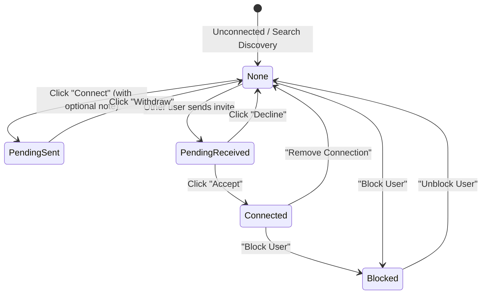

# Kirmya Networking, People Discovery & Connections Experience Design Specification

**Specification Version**: 1.0.0  
**Phase**: Prompt 19/50  
**Framework**: React 18, Next.js 16 (App Router), MUI v6, Emotion, TypeScript  
**Backend Layer**: Golang Gin, PostgreSQL (pgx), Clean Architecture  

---

## 1. Executive Summary & Design Vision

Kirmya's professional networking subsystem is engineered around **intentional, relationship-first connectivity** rather than generic engagement feeds. The visual and interaction language is calm, modern, and Apple-inspired, using restraint, clear typographic hierarchy, subtle depth with glassmorphism, and explicit user state management.

### Key Tenets
1. **Meaningful Connections Over Volume**: Clear mutual-connection context, contextual recommendation reasons, and optional invitation notes.
2. **Zero Mock/Fake Profiles**: Direct integration with real PostgreSQL network graph endpoints and pgx database queries.
3. **Canonical Relationship Action Component**: Single source of truth (`ConnectionActionButton`) handling all graph transitions: `none` $\to$ `pending_sent` $\to$ `pending_received` $\to$ `connected` $\to$ `blocked`.
4. **Accessible Privacy & Trust**: Integrated Block User modal, Report Abuse modal, and private note/tag organization.

---

## 2. Canonical Route Architecture

| Route | Canonical Purpose | Access Guard | Primary Components |
|---|---|---|---|
| `/network` | Main Network Overview & Growth Hub | `AuthRequired` | `NetworkStats`, `NetworkingGoalsCard`, `ReferralDiscoveryCard`, `RecommendationCard`, `ConnectionCard` |
| `/people` | Global People Discovery & Search | `AuthRequired` | `PeopleSearchBar`, `PeopleFilters`, `PeopleResultCard`, `RecommendationCard` |
| `/network/connections` | 1st-Degree Connections Management | `AuthRequired` | `ConnectionCard`, `ConnectionNoteModal`, `BlockUserModal`, `ReportUserModal` |
| `/network/requests` | Connection Invitations Studio | `AuthRequired` | `Tabs` (Received / Sent), `Badge`, Accept/Decline/Withdraw action flows |
| `/network/suggestions` | AI-Driven Recommendations Explorer | `AuthRequired` | `RecommendationCard`, dismissal handler, mutual reasons |
| `/network/search` | Direct Query Search | `AuthRequired` | `PeopleSearchBar`, `PeopleFilters`, `PeopleResultCard` |
| `/networking` | Backward-compatibility redirect to `/network` | `AuthRequired` | Next.js Server Redirect |
| `/people/search` | Backward-compatibility redirect to `/people` | `AuthRequired` | Next.js Server Redirect |

---

## 3. Relationship State Machine & `ConnectionActionButton`

The `ConnectionActionButton` encapsulates the entire professional connection lifecycle:

### Action Controls by State:
- **`none`**: Primary `Button` ("Connect") $\to$ opens `ConnectionRequestDialog` with 300-char note input and one-click quick send.
- **`pending_sent`**: Disabled outlined button ("Pending") with adjacent `IconButton` ("Withdraw invitation").
- **`pending_received`**: Side-by-side action buttons: Contained "Accept" + Outlined "Decline".
- **`connected`**: Direct "Message" button + "More Options" menu (Private Notes & Tags, Remove Connection, Block User, Report User).
- **`blocked`**: Red outlined "Unblock" button.

---

## 4. Design Tokens & Visual Hierarchy

All networking components adhere strictly to Kirmya's centralized design token system:

- **Surfaces**: `background.paper` with `1px solid` border (`borderColor: 'divider'`), dark/light elevation blending.
- **Corner Radii**: `tokens.radius.lg` (20px/24px) for cards and modals; `tokens.radius.sm` (8px) for buttons, badges, and chips.
- **Typography**: Apple-inspired clean sizing (`h4` with `letterSpacing: -0.02em`, `subtitle1` with `fontWeight: 800`, `caption` with `fontWeight: 600`).
- **Feedback & States**: Optimistic mutation updates with rollback defense, accessible `aria-label` tags, skeleton placeholders during loading, and contextual empty states with actionable recovery prompts.

---

## 5. Security & Safety Integration

1. **Abuse Reporting**: Direct submission to Trust & Safety moderation desk (`POST /api/v1/network/report/:userId`) with categorized reason and details.
2. **Privacy Blocking**: Server-side pair exclusion (`POST /api/v1/networking/blocks` and `DELETE /api/v1/networking/blocks/:userId`) preventing profile views, search indexing, and messaging.
3. **Private Organization**: Connection notes and tags stored securely with owner isolation (`/api/v1/network/notes` and `/api/v1/network/labels`).
