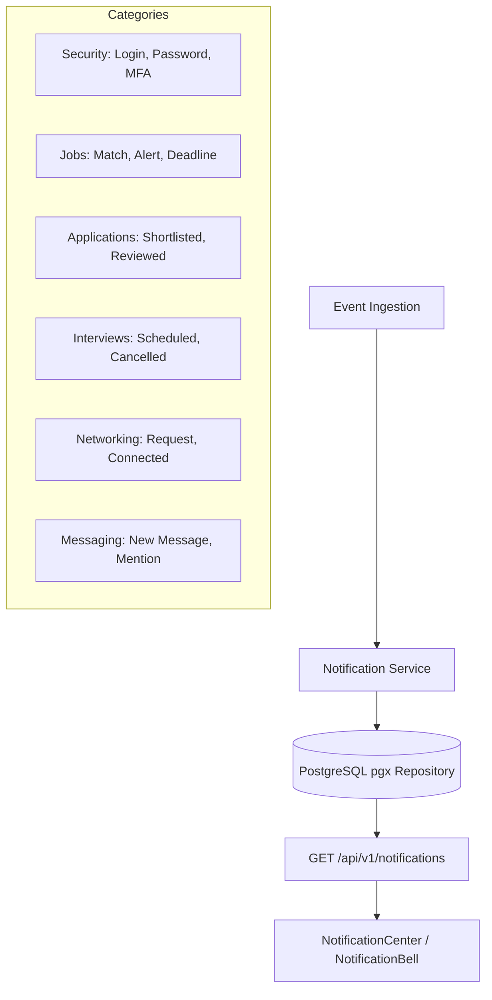

# Kirmya Notifications, Activity Center & Notification Preferences Design Specification

**Specification Version**: 1.0.0  
**Phase**: Prompt 21/50  
**Framework**: React 18, Next.js 16 (App Router), MUI v6, Emotion, TypeScript  
**Backend Layer**: Golang Gin, PostgreSQL (pgx), Clean Architecture  

---

## 1. Executive Summary & Design Vision

Kirmya's notification and activity subsystem delivers **calm, contextual, reliable, and actionable alerts** across all product dimensions (Security, Jobs, Applications, Interviews, Networking, Messaging, and Communities).

### Key Tenets
1. **Zero Mock/Fake Notifications**: Real data from PostgreSQL database via `GET /api/v1/notifications` with authoritative timestamps and actor references.
2. **Instant Global Badge Synchronization**: Immediate synchronization between the notification center, individual mark-as-read actions, mark-all-read actions, and the `AppHeader` notification counter via `AuthContext`.
3. **Restrained Apple-Inspired Presentation**: Centered reading width (`maxWidth="md"`), clean list items with subtle hover states and accent dots for unread items rather than large heavy cards.
4. **Contextual Deep Linking**: Direct navigation to canonical target entities (`/jobs/[id]`, `/messages`, `/network/requests`, `/dashboard/applications`, `/settings/security`).
5. **Comprehensive Channel Preferences**: Granular control across In-App, Email, Push, and SMS channels with quiet hours / Do Not Disturb scheduling.

---

## 2. Canonical Route Architecture

| Route | Purpose | Access Guard | Primary Components |
|---|---|---|---|
| `/notifications` | Canonical Central Notification Center Hub | `AuthRequired` | `NotificationCenter`, `NotificationList`, `NotificationItem` |
| `/notifications/unread` | Unread-only filtered view | `AuthRequired` | `NotificationCenter(initialUnreadOnly=true)` |
| `/notifications/jobs` | Job alerts & matches | `AuthRequired` | `NotificationCenter(initialCategory="jobs")` |
| `/notifications/applications` | Application status updates | `AuthRequired` | `NotificationCenter(initialCategory="applications")` |
| `/notifications/network` | Connection requests & invitations | `AuthRequired` | `NotificationCenter(initialCategory="networking")` |
| `/notifications/messages` | Direct chat & message alerts | `AuthRequired` | `NotificationCenter(initialCategory="messaging")` |
| `/notifications/interviews` | Interview invitations & reminders | `AuthRequired` | `NotificationCenter(initialCategory="interviews")` |
| `/notifications/career` | Career insights & milestones | `AuthRequired` | `NotificationCenter(initialCategory="career")` |
| `/notifications/all` | Canonical alias for `/notifications` | `AuthRequired` | `NotificationCenter` |
| `/settings/notifications` | Delivery channel matrix & quiet hours | `AuthRequired` | `NotificationPreferences` |

---

## 3. Supported Notification Categories & Models

---

## 4. Unread State & Badge Synchronization

1. **State Machine**:
   - Initial Load $\to$ `notificationApi.getUnreadCount()` $\to$ `setNotificationsCount(count)`.
   - Single Read $\to$ Optimistic UI update + `setNotificationsCount(prev => max(0, prev - 1))` + `POST /notifications/:id/read`.
   - Mark All Read $\to$ Optimistic UI update + `setNotificationsCount(0)` + `POST /notifications/read-all`.
   - Delete / Archive $\to$ Immediate removal from list + persistence.
2. **Reconnection & Deduplication**:
   - Notifications keyed by immutable UUID `id`.
   - Automatic cache deduplication ensures no duplicate rows on reconnect.

---

## 5. Security & Privacy

1. **Tenant Isolation**: Backend SQL queries enforce `WHERE user_id = $1` across all endpoints.
2. **Mandatory Security Alerts**: Security alerts (`category="Security"`) cannot be disabled in preferences.
3. **Safe Rendering**: All content is sanitized text; zero injection of untrusted markup.
