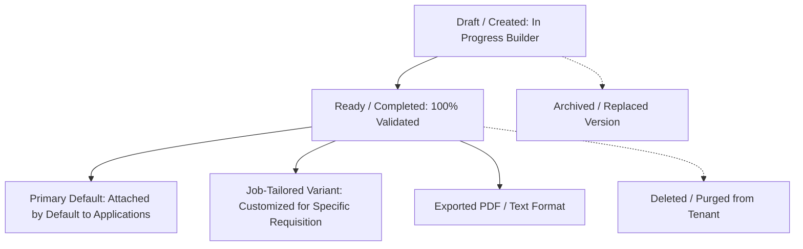

# Kirmya Complete Resume, CV & Document Management Experience Design Specification

**Specification Version**: 1.0.0  
**Phase**: Prompt 25/50  
**Framework**: React 18, Next.js 16 (App Router), MUI v6, Emotion, TypeScript  
**Backend Layer**: Golang Gin, PostgreSQL (pgx), Clean Architecture  

---

## 1. Executive Summary & Design Vision

Kirmya Document & Resume Management delivers an **ATS-optimized, simple, professional, privacy-conscious, version-controlled, and Apple-inspired workspace** for candidate resumes, CVs, and application attachments.

### Key Tenets
1. **Zero Mock Files / Fabricated Metadata**: Direct PostgreSQL pgx integration via `/api/v1/resumes/*` and `/api/v1/documents/*`.
2. **Apple-Inspired Precision**: Elevated surfaces with `tokens.radius.lg`, subtle outline borders, clean typography hierarchy, and zero clutter.
3. **Enterprise ATS Optimization**: Built-in ATS score calculation, keyword extraction, and section formatting.
4. **Multi-Template & Device Preview**: Live responsive simulation across Desktop, Tablet, and Mobile viewports with Zoom and PDF export.
5. **Primary Default & Version Snapshots**: Explicit default resume assignment with version history and job-tailoring engine.

---

## 2. Canonical Route Architecture

| Route | Purpose | Access Guard | Primary Components |
|---|---|---|---|
| `/dashboard/resumes` | Candidate Resume Library & Document Hub | `AuthRequired` | `ResumesPage`, `ResumeDashboard`, `ResumeCard` |
| `/dashboard/resumes/[id]` | Resume Details & ATS Scorecard | `AuthRequired` | `ResumeDetailPage`, `ATSScoreCard`, `ResumePreview` |
| `/dashboard/resumes/[id]/edit` | Multi-Section Resume Builder & Editor | `AuthRequired` | `ResumeEditPage`, `ResumeEditor`, `ResumeVersionManager` |
| `/dashboard/resumes/[id]/preview` | Multi-Device Live Preview & Print/Export | `AuthRequired` | `ResumePreviewPage`, `ResumePreviewToolbar` |
| `/dashboard/resumes/create` | New Resume Template Selection & Setup | `AuthRequired` | `CreateResumePage`, `ResumeBuilder` |
| `/dashboard/resumes/import` | PDF / Word Resume Document Parser | `AuthRequired` | `ResumeImportPage`, `ResumeImport` |
| `/dashboard/resumes/templates` | ATS Template Gallery | `AuthRequired` | `ResumeTemplatesPage`, `TemplateSelector` |
| `/resume` | Canonical Resume Redirect / Dashboard | `AuthRequired` | `ResumeMainPage` |

---

## 3. Supported Resume Lifecycle & Storage States

---

## 4. Security & Privacy

1. **Authorization & IDOR Defense**: Backend SQL queries strictly filter by authenticated `WHERE user_id = $1`.
2. **Signed Document Access**: PDF downloads are generated and streamed via authenticated bearer token endpoints.
3. **Application Snapshot Integrity**: Submitted applications retain an immutable historical copy of the candidate resume at time of application.
