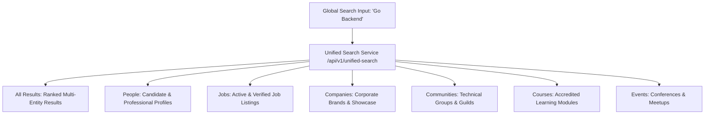

# Kirmya Complete Search & Discovery Experience Design Specification

**Specification Version**: 1.0.0  
**Phase**: Prompt 27/50  
**Framework**: React 18, Next.js 16 (App Router), MUI v6, Emotion, TypeScript  
**Backend Layer**: Golang Gin, PostgreSQL `tsvector` + Full-Text Search / OpenSearch Adapter  

---

## 1. Executive Summary & Design Vision

The Kirmya Search & Discovery Experience provides a **fast, accurate, multi-entity, predictable, and Apple-inspired search interface** across all supported platform entities: People, Jobs, Companies, Communities, Courses, and Events.

### Key Tenets
1. **Zero Mock Results / Fabricated Suggestions**: Direct connection to `/api/v1/unified-search` and `/api/v1/unified-search/suggestions` via `authApiClient` with Bearer token authentication.
2. **Apple-Inspired Restraint**: Elevated input bar with `tokens.radius.sm`, card surfaces with `tokens.radius.lg`, subtle outline borders, clean typography hierarchy, and zero clutter.
3. **Multi-Entity Discovery**: Unified search endpoint mapping queries to people profiles, verified jobs, companies, communities, courses, and events.
4. **URL-Driven State & Deep Linking**: Query parameters `?q=...&category=...` synchronize seamlessly with browser navigation, tab changes, and deep links.
5. **Privacy & Visibility Enforcement**: Private profiles, unpublished jobs, and blocked users are filtered at the database/service layer.

---

## 2. Canonical Route Architecture

| Route | Purpose | Access Guard | Primary Components |
|---|---|---|---|
| `/search` | Global Unified Search & Multi-Entity Discovery | `AuthRequired` | `SearchPageContent`, `GlobalSearchBar`, `SearchResultCard`, `SearchFiltersSidebar`, `RecentSearchesManager`, `SearchEmptyState` |
| `/people/search` | Dedicated People Discovery & Networking Search | `AuthRequired` | `PeopleSearchPage` |
| `/jobs` | Dedicated Job Search & Filter Desk | Public / Auth | `JobsPage`, `JobFilters` |
| `/companies` | Companies Directory & Verification Search | Public / Auth | `CompaniesDirectoryPage`, `CompanyFilters` |
| `/communities` | Technical Groups & Communities Discovery | Public / Auth | `CommunitiesPage` |

---

## 3. Supported Search Categories & Multi-Entity Model

---

## 4. Search Ranking & Indexing Architecture

1. **PostgreSQL Full-Text Search**: Uses `to_tsvector('english', ...)` and `to_tsquery(...)` with GIN indexes on title, headline, description, skills, and tags.
2. **OpenSearch v2 Adapter**: Fallback/high-scale adapter synchronizing entity indices via `/api/v1/unified-search/reindex`.
3. **Ranking Signals**: Text match score ($ts\_rank$), profile completeness, recency timestamp, and verified status.
