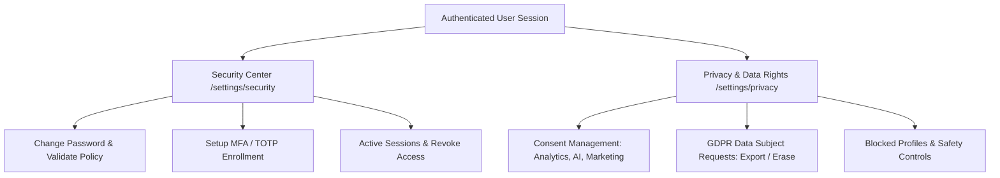

# Kirmya Complete Settings, Privacy, Security & Account Management Design Specification

**Specification Version**: 1.0.0  
**Phase**: Prompt 28/50  
**Framework**: React 18, Next.js 16 (App Router), MUI v6, Emotion, TypeScript  
**Backend Layer**: Golang Gin, PostgreSQL (pgx), Clean Architecture  

---

## 1. Executive Summary & Design Vision

Kirmya Settings, Privacy, Security & Account Management provides a **calm, structured, privacy-conscious, secure, and Apple-inspired workspace** for users to manage personal profiles, credentials, multi-factor authentication, active sessions, trusted devices, GDPR data subject rights, notification preferences, billing, and organization settings.

### Key Tenets
1. **Zero Fake Security Data / Simulated Sessions**: Direct integration with PostgreSQL pgx endpoints (`/api/v1/security/*`, `/api/v1/privacy/*`, `/api/v1/notifications/*`, `/api/v1/settings/*`).
2. **Apple-Inspired Restraint**: Clean card surfaces with `tokens.radius.lg`, subtle outline borders, clean typography hierarchy, and zero clutter.
3. **Canonical Settings Navigation**: Single unified entry point at `/settings` with dedicated sub-sections for Security, Privacy, Notifications, Data, Safety, Billing, and Employer settings.
4. **Strict Privacy & GDPR Enforcement**: Real consent toggles, data export requests (GDPR Art. 20), account deletion modals with mandatory password confirmation, and blocked user management.
5. **Session & Credential Security**: Safe active session lists with individual revoke and revoke-all actions, password complexity validation, and MFA enrollment.

---

## 2. Canonical Route Architecture

| Route | Purpose | Access Guard | Primary Components |
|---|---|---|---|
| `/settings` | Centralized Settings Hub & Navigation | `AuthRequired` | `SettingsHubPage` |
| `/settings/security` | Security, Passwords, MFA & Active Sessions | `AuthRequired` | `SettingsSecurityPage`, `SecurityCenter` |
| `/settings/privacy` | Privacy Toggles, Data Consents & DSAR Hub | `AuthRequired` | `SettingsPrivacyPage`, `UserPrivacySettings` |
| `/settings/notifications` | Notification Channels & Quiet Hours | `AuthRequired` | `NotificationSettingsPage`, `NotificationPreferences` |
| `/settings/data` | Data Export Archive & Retention Info | `AuthRequired` | `DataExportView` |
| `/settings/safety/blocked` | Blocked Users & Trust Safety Appeals | `AuthRequired` | `BlockedUsersView` |
| `/settings/billing` | Billing, Plans & Invoices | `AuthRequired` | `BillingPage` |
| `/employer/settings` | Company & Organization Administration | `AuthRequired` (Admin/Owner) | `EmployerSettingsPage` |

---

## 3. Supported Security & Privacy Lifecycle States

---

## 4. Security & Isolation Architecture

1. **User Scoping**: Every mutation (`/security/sessions/:id`, `/privacy/settings`, `/settings/data-export`) strictly checks authenticated JWT claims.
2. **Secret Masking**: Access tokens, refresh tokens, and password hashes are never returned or rendered on frontend surfaces.
3. **Destructive Protection**: Account deletion requires re-entering current account password and intentional confirmation.
