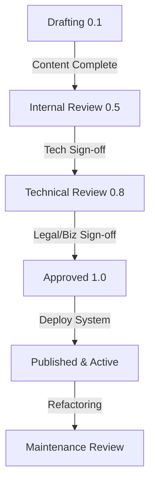

# Documentation Quality & Governance Standard: Kirmya Project
**Document Identifier:** PL-QS-000 | **Status:** Approved / Core Reference | **Version:** 1.0.0  
**Authors:** Antigravity AI & Documentation Lead | **Date:** July 19, 2026

---

## Document Control & Meta-Information

### Version History
| Version | Date | Author | Description |
| :--- | :--- | :--- | :--- |
| `0.1.0` | 2026-07-19 | Antigravity AI | Initial draft mapping governance workflows and standards. |
| `1.0.0` | 2026-07-19 | Antigravity AI | Completed full Documentation Standards, outlining sitemaps, formats, naming keys, and template designs. |

---

## 1. Documentation Purpose

Documentation is the foundation of Kirmya's system design. Writing documentation before development ensures that:
* **Technical Debt is Prevented**: Architectural constraints, database schemas, and integration contracts are scrutinized *prior* to codebase creation, preventing structural rework.
* **Maintainability is Maximized**: Future engineers can trace implementations directly back to initial design justifications.
* **Team Alignment is Guaranteed**: Product managers, frontend/backend developers, and AI researchers operate with the same specifications, eliminating design discrepancies.
* **The Single Source of Truth (SSOT)**: The documentation suite acts as the definitive record of system behaviors. 

All codebase commits, API structures, styling choices, database queries, and deployment tasks **must comply with and follow approved documentation**. No undocumented feature may be implemented.

---

## 2. Documentation Principles

All Kirmya documentation must conform to the following core principles:

* **Documentation First Development**: Write and approve detailed design documents before writing any application code.
* **Single Source of Truth**: There is only one active, authoritative version of a document. No parallel design documentation is allowed.
* **Consistency**: All files use the same naming, directory layouts, and writing tone.
* **Traceability**: Requirements must map directly to architectural structures, API specifications, and test cases.
* **Maintainability**: Documents must be modular and structured to facilitate easy updates.
* **Scalability**: Layout configurations must support multi-tenant scale considerations.
* **Simplicity**: Avoid jargon, excessive verbiage, or unnecessary nesting.
* **Security by Design**: Every technical design must explicitly specify encryption, IAM boundaries, and privacy safeguards.
* **Accessibility by Design**: UI components must detail keyboard control configurations and screen-reader requirements.
* **Performance by Design**: NFR latency bounds must be mapped and verified for all query paths.
* **AI-Ready Documentation**: Document structures must be optimized for parsing by AI coding assistants.
* **Microservices-Ready Modular Monolith Architecture**: Designs must preserve clean boundary lines between the 15 core modules, allowing future split-offs into microservices.
* **Version Controlled Documentation**: Save all documentation in the Git repository alongside the codebase.
* **Review Before Approval**: No document enters an approved status without technical and compliance review signatures.

---

## 3. Standard Document Structure

Every official documentation file must contain the following 29 sections in this exact order:

1. **Document Title**: H1 header describing the document topic.
2. **Document ID**: Unique serial index (e.g. `PL-PD-001`).
3. **Version**: Current semantic version indicator.
4. **Status**: Draft, Under Review, or Approved.
5. **Owner**: Individual/group responsible for maintaining the document.
6. **Reviewers**: Mandatory technical and legal reviewers.
7. **Approval Status**: Date and sign-off indicators.
8. **Last Updated**: UTC timestamp of the last edit.
9. **Related Documents**: Clickable Markdown links to associated files.
10. **Dependencies**: Upstream files, schemas, or API packages.
11. **Purpose**: The problem statement being addressed.
12. **Scope**: What is in-scope vs out-of-scope.
13. **Objectives**: Quantifiable goals of the described system.
14. **Executive Summary**: 1-2 paragraph overview.
15. **Detailed Content**: The primary technical design/specification bodies.
16. **Functional Requirements**: Explicitly enumerated capability targets.
17. **Non-Functional Requirements**: Measurable latency, scale, and security thresholds.
18. **Business Rules**: Constraints mapping authority and permissions.
19. **Assumptions**: Presumed environmental or third-party behaviors.
20. **Constraints**: Technology stack, local regional compliance limitations.
21. **Risks**: Operational, performance, or delivery hazards.
22. **Open Questions**: Unresolved design ambiguities.
23. **Future Improvements**: Enhancements deferred to downstream phases.
24. **Acceptance Criteria**: Concrete tables detailing Definition of Done parameters.
25. **Success Metrics**: KPIs measuring post-deployment efficiency.
26. **Glossary**: Specialized terminology mappings.
27. **References**: Third-party API documentation or regulatory links.
28. **Revision History**: Log table recording version, date, author, and description of changes.

---

## 4. Markdown Standards

Documentation must use clean, standardized GitHub Flavored Markdown (GFM) formatting.

### 4.1 Heading Hierarchy
Enforce strict descending levels. Do not skip header sizes:
```markdown
# H1: Document Title
## H2: Major Component/Section
### H3: Sub-component detail
#### H4: Specific file or function mapping
```

### 4.2 Tables
Ensure columns align cleanly and use correct headers:
```markdown
| Role | Authority | Access Level |
| :--- | :---: | ---: |
| Admin | Read / Write | Global |
| Recruiter | Sourcing Only | Restricted |
```

### 4.3 Lists
* **Bullet Lists**: Use asterisks for primary lists, hyphens for sub-bullets.
* **Numbered Lists**: Use numeric identifiers for sequential steps.

### 4.4 Code Blocks
Specify the programming language tag to enable correct syntax highlighting:
```go
func AuthenticateUser(email string) bool {
    return true
}
```

### 4.5 Directory Trees
Represent directory pathways using clean ASCII text trees:
```
/docs
└── product
    ├── 00-documentation-standards.md
    └── 01-product-charter.md
```

### 4.6 Mermaid Diagrams
Render flowcharts, sequence models, and ERDs using Mermaid code blocks:


### 4.7 Alerts & Callouts
Utilize blockquote alerts to emphasize key considerations:
```markdown
> [!NOTE]
> Standard informational context or design reminders.

> [!WARNING]
> High-risk configurations or breaking change alerts.

> [!TIP]
> Best practices or optimization tips.
```

### 4.8 Links & References
* **Internal/Relative Links**: Map workspace files using the `file://` protocol with forward slashes (e.g. `[Product Charter](file:///c:/Users/PRASHANTH/Documents/real/my_project/docs/product/01-product-charter.md)`).
* **Cross References**: Link specific code structures to line ranges where applicable (e.g. `[JWT Auth Rules](file:///path/to/file#L120-L135)`).

---

## 5. Naming Standards

To ensure consistency, Kirmya enforces these naming conventions across documentation, repositories, database schemas, and codebase files:

| Element | Naming Convention | Example |
| :--- | :--- | :--- |
| **Documentation Files** | Prefix index + lowercase-hyphenated | `08-features-documentation.md` |
| **Folders** | Lowercase-hyphenated | `/docs/product`, `/docs/database` |
| **Modules** | camelCase | `authModule`, `profileModule` |
| **Services** | lowercase-hyphenated | `auth-service`, `sourcing-service` |
| **Features** | camelCase | `blindCandidateMatch`, `mockInterviewCoach` |
| **Components** | PascalCase | `SkillGraph.tsx`, `JobCard.tsx` |
| **API Names** | camelCase / lowercase-hyphenated | `/api/v1/auth/session-refresh` |
| **Database Tables** | snake_case, plural | `verified_skills`, `recruiter_seats` |
| **Database Columns** | snake_case | `candidate_drs_level`, `created_at` |
| **Indexes** | Prefix + Table + Column (snake_case) | `idx_users_email` |
| **Enums** | PascalCase (Values UPPERCASE) | `UserRole (JOB_SEEKER, RECRUITER)` |
| **Constants** | UPPERCASE_SNAKE_CASE | `MAX_ACTIVE_JOB_POSTS` |
| **Configuration Files** | kebab-case or dot-split | `docker-compose.yml`, `db.config.json` |
| **Environment Variables** | UPPERCASE_SNAKE_CASE | `KIRMYA_DATABASE_URL` |
| **Docker Resources** | lowercase-hyphenated | `kirmya-backend-image` |
| **Git Branches** | Category/short-hyphen-description | `feature/auth-mfa-logic`, `bugfix/drs-graph-leak` |
| **Commits** | Conventional Commits standard | `feat(auth): add email MFA authentication` |
| **Releases / Tags** | Semantic Versioning prefixed with `v` | `v1.2.0` |
| **Variables** | camelCase | `userProfileId` |
| **Functions** | PascalCase (Golang public) / camelCase | `AuthenticateSession()` / `getUserData()` |
| **Interfaces** | PascalCase prefixed with `I` (TypeScript) | `IUserProfile` |
| **Packages** | lowercase | `package auth`, `package db` |
| **Repositories** | lowercase-hyphenated | `kirmya-monolith-api` |

---

## 6. Folder Structure Standards

The project documentation tree is structured to maintain isolation between modules and layers:

```
/docs
├── product           # PM specifications, roadmap, business rules, charter
├── architecture      # Monolith layout blueprints, module boundary definitions
├── database          # Relational tables, Neo4j graphs, pgvector mappings
├── api               # OpenAPI 3.0 Swagger specifications, webhooks, JSON schemas
├── frontend          # Next.js workspace layouts, MUI v6 style guides
├── backend           # Golang/Gin package directories, NATS topics, Redis keys
├── security          # SSO SAML configurations, TLS cert rules, encryption keys
├── ai                # LLM model configs, audio WebRTC pipes, bias mitigation
├── search            # Redis CDNs autocomplete structures, vector mappings
├── devops            # Dockerfiles, CI/CD Github workflows, Terraform configs
├── testing           # Test matrices, unit mocks, DoD verify checklists
├── roadmap           # Release roadmaps, horizon scaling logs
├── diagrams          # Pinned Mermaid, sequence, and system architecture graphs
├── decisions         # Pinned Architecture Decision Records (ADRs)
├── templates         # Reusable master templates for various document types
└── references        # Third-party developer API references, compliance legal frameworks
```

---

## 7. Cross-Reference Standards

Every document must declare its position in the documentation network under Section 9 (**Related Documents**):
* **Parent Documents**: Link the parent index file.
* **Child Documents**: Link sub-component details.
* **Related Documents**: Associate peers (e.g. database schema linking to the API design).
* **Dependencies**: Upstream files that must remain unchanged.
* **Future Documents**: Deferred files mapped in the roadmap.
* **Superseded Documents**: Archived versions replaced by this document.

---

## 8. Versioning Standards

Documentation follows Semantic Versioning for Documents:
* **`0.1` to `0.4` (Drafts)**: Initial content generation, open questions unresolved.
* **`0.5` to `0.8` (Internal Review)**: Mapped contents complete, undergoing technical reviews.
* **`0.9` (Final Review)**: Approved by engineering, awaiting business and legal sign-offs.
* **`1.0` (Approved)**: Signed off by stakeholders. Ready for implementation.
* **`1.1` to `1.9` (Minor Updates)**: Addition of minor sub-features or clarification edits without structural changes.
* **`2.0+` (Major Revisions)**: Complete overhaul of architecture or business boundaries, superseding previous versions.

---

## 9. Review Workflow

No documentation file becomes active without completing the review workflow:



### 9.1 Entry & Exit Criteria
* **Draft -> Internal Review**:
  - *Entry*: PM outlines initial draft requirements.
  - *Exit*: Document contains no empty sections; initial structural content is complete.
* **Internal -> Technical Review**:
  - *Entry*: Lead Dev reviews logic against technology stack constraints.
  - *Exit*: Database schemas, latencies, and API signatures are technically verified.
* **Technical -> Business Review**:
  - *Entry*: Legal counsel reviews compliance checks (AEDT, GDPR).
  - *Exit*: Document aligns with Kirmya business vision and regulatory policies.
* **Business Review -> Approval**:
  - *Entry*: Document is versioned `0.9` with sign-off checkpoints ready.
  - *Exit*: All stakeholders sign off, document is published to `docs/` main branch at version `1.0.0`.

---

## 10. Documentation Quality Checklist

Before moving a document to version `1.0.0`, the owner must verify the following checklist:
* [ ] **Completeness**: Are all 29 standard sections populated?
* [ ] **Accuracy**: Do API endpoints and database fields match active codebase schemas?
* [ ] **Consistency**: Does the file follow standard naming conventions?
* [ ] **Grammar**: Is the writing professional, clear, and free of typos?
* [ ] **Cross-references**: Are all relative file links functional?
* [ ] **Security Review**: Does the design explicitly state authentication and encryption details?
* [ ] **Accessibility**: Are screen-reader and contrast requirements mapped for UI screens?
* [ ] **Performance**: Are target response times (NFRs) specified?
* [ ] **Future Extensibility**: Are future enhancements clearly delineated from the MVP?

---

## 11. Traceability Standards

Engineering deliverables must map back to business targets using the Traceability Chain:

```
  [Business Goal] -> [PRD Requirement] -> [Architecture] -> [DB Schema] -> [API spec] -> [Implementation] -> [Testing] -> [CI/CD]
```

Every database index, API route, and code class must reference the specific Requirement ID (e.g. `FR-AUTH-001`) it fulfills.

---

## 12. Architecture Decision Records (ADRs)

For all major architectural changes or technology decisions, teams must create an Architecture Decision Record (ADR) under `/docs/decisions/`. Every ADR must use this structure:

* **Decision ID**: Unique identifier (e.g. `ADR-001`).
* **Date**: Date of decision.
* **Context**: Current situation and problem description.
* **Options Considered**: List of alternative technologies or patterns evaluated.
* **Selected Option**: The chosen solution.
* **Justification**: Performance, cost, or maintainability arguments for the choice.
* **Consequences**: Downstream impacts on other modules.
* **Future Revisions**: Review timeline.

---

## 13. Documentation Templates

The following blueprints represent the mandatory layouts for Kirmya documentation files:

### 13.1 Template: Product Document
```markdown
# [Product Document Title]
**Document Identifier:** PL-PD-[XXX] | **Status:** Draft | **Version:** 0.1.0

## 1. Document Control
## 2. Purpose & Target Persona
## 3. Product Scope (In-Scope / Out-of-Scope)
## 4. Functional Requirements (User Stories)
## 5. Non-Functional Requirements
## 6. Success Metrics & Acceptance Criteria
```

### 13.2 Template: Architecture Document
```markdown
# [System Architecture Blueprint]
**Document Identifier:** PL-AR-[XXX] | **Status:** Draft | **Version:** 0.1.0

## 1. Document Control
## 2. Monolith Module Boundaries
## 3. Class Designs & Package Layouts
## 4. NATS Event Topics & Payload Schemas
## 5. Security & Encryption Details
```

### 13.3 Template: Database Document
```markdown
# [Database Schema Design]
**Document Identifier:** PL-DB-[XXX] | **Status:** Draft | **Version:** 0.1.0

## 1. Document Control
## 2. Entity Relationship Diagram (ERD)
## 3. Relational Table Schemas (PostgreSQL)
## 4. Graph Schema Nodes & Relationships (Neo4j)
## 5. Vector Index Mappings (pgvector/Pinecone)
```

### 13.4 Template: API Document
```markdown
# [API Specifications]
**Document Identifier:** PL-API-[XXX] | **Status:** Draft | **Version:** 0.1.0

## 1. Document Control
## 2. API Route Index (REST/GraphQL)
## 3. Request Payloads & JSON Schemas
## 4. Response Codes & Error Handling
## 5. Authentication (JWT / SSO) Handshakes
```

### 13.5 Template: Frontend Document
```markdown
# [Frontend Layout Specifications]
**Document Identifier:** PL-FE-[XXX] | **Status:** Draft | **Version:** 0.1.0

## 1. Document Control
## 2. Next.js Routing Map
## 3. MUI v6 Theme Tokens & Layout Grids
## 4. Screen Mockups & Accessibility Controls
## 5. Local State Management (Zustand/Context)
```

### 13.6 Template: Backend Document
```markdown
# [Backend Logic Specifications]
**Document Identifier:** PL-BE-[XXX] | **Status:** Draft | **Version:** 0.1.0

## 1. Document Control
## 2. Golang Package Trees
## 3. Gin Router Registrations
## 4. Service Interfaces & Implementations
## 5. Redis Cache Key Configurations
```

### 13.7 Template: Security Document
```markdown
# [Security & IAM Design]
**Document Identifier:** PL-SEC-[XXX] | **Status:** Draft | **Version:** 0.1.0

## 1. Document Control
## 2. RBAC Policy Schemas
## 3. SSO SAML/OIDC Integrations
## 4. Data Encryption-at-Rest & In-Transit Rules
## 5. Threat Models & Vulnerability Scanners
```

### 13.8 Template: AI Document
```markdown
# [AI Model Technical Specifications]
**Document Identifier:** PL-AI-[XXX] | **Status:** Draft | **Version:** 0.1.0

## 1. Document Control
## 2. Model Selections & Training Datasets
## 3. Whisper STT Audio Streaming Pipelines
## 4. Algorithmic Fair Match Bias Audits
## 5. Precision & Latency Performance Metrics
```

### 13.9 Template: DevOps Document
```markdown
# [Infrastructure & Deployment Design]
**Document Identifier:** PL-DEV-[XXX] | **Status:** Draft | **Version:** 0.1.0

## 1. Document Control
## 2. Docker Containers & Compose Mappings
## 3. Terraform Cloud Infrastructure Templates
## 4. CI/CD GitHub Action Workflows
## 5. Backups & Disaster Recovery Failover Rules
```

### 13.10 Template: Testing Document
```markdown
# [Test Matrix & DoD Verification]
**Document Identifier:** PL-TST-[XXX] | **Status:** Draft | **Version:** 0.1.0

## 1. Document Control
## 2. Unit Testing Strategy & Mock Trees
## 3. Integration Testing Targets
## 4. End-to-End Test Scenarios
## 5. Definition of Done (DoD) Verify Checklists
```

### 13.11 Template: Roadmap Document
```markdown
# [Release Roadmap]
**Document Identifier:** PL-RM-[XXX] | **Status:** Draft | **Version:** 0.1.0

## 1. Document Control
## 2. Phase Milestones (MVP, Beta, Release)
## 3. Development Timeline & Gantt Charts
## 4. Resource Allocation & Complexity Estimates
## 5. Risk Log & Mitigation Actions
```

---

## 14. Diagrams Standards

Architecture, database, and sequence diagrams must be integrated into documents using standard formatting rules:

* **Mermaid Flowcharts**: Used to detail application logic flows and data pathways. Include explicit sub-graphs to segregate client, server, and database layers.
* **Sequence Diagrams**: Mandatory for explaining multi-step handshakes (e.g. JWT Refresh workflows, SAML SSO authentications).
* **ER Diagrams**: Used in `/docs/database/` to define relational tables, key indices, and column constraints.
* **State Diagrams**: Used to detail transition rules for complex state properties (e.g. Escrow Transaction states: `AWAITING_DEPOSIT -> DEPOSITED -> DISPUTED -> RELEASED`).
* **Formatting Guidance**: 
  - Ensure all node labels contain quotation marks to prevent compiler breaks.
  - Limit diagrams to 15 nodes per view to preserve readability. Large diagrams must be broken into smaller sub-graphs.

---

## 15. Writing Standards

All Kirmya documentation must adhere to these style guidelines:
* **Clarity & Precision**: Write in a formal, professional, third-person tone.
* **No Unsubstantiated Assertions**: Do not use vague qualifiers like *"fast query response"* or *"low memory consumption"*. State the exact target threshold (e.g. *"Sourcing query response <= 500ms"*).
* **No Code in Product Docs**: Product requirements documents (PRDs) must specify *what* the system does; implementation details (code snippets, database schema queries) must reside in `/docs/backend/` or `/docs/database/` files.
* **Keep Descriptions Concise**: Avoid unnecessary repetition, prioritizing bullet points, tables, and graphs over long blocks of text.

---

## 16. AI Collaboration Rules

AI coding assistants (such as Antigravity) must follow these operational guidelines when modifying the repository:
* **Never Contradict Approved Documentation**: AI agents must verify that any code generated aligns with the files under `docs/`.
* **Proactive Document Inspection**: Before proposing any refactoring or change, the AI agent must read related documents.
* **Update Downstream Dependencies**: If the AI agent updates a database table configuration, it must update the corresponding database design document.
* **Flag Conflicts Proactively**: If a proposed implementation request conflicts with approved documentation, the AI agent must flag the conflict to the user immediately, instead of making silent changes.
* **Do Not Implement Undocumented Features**: If a requested feature has no counterpart in the documentation files, the AI agent must refuse execution until a design document or ADR is approved.

---

## 17. Kirmya Project Standards

All development, documentation, and tooling must conform to these official project configurations:

* **Project Name**: Kirmya
* **Architecture**: Modular Monolith (Microservices Ready)
* **Backend**: Golang
* **Framework**: Gin
* **Frontend**: Next.js
* **Language**: TypeScript
* **UI Library**: MUI v6 only
* **Styling**: MUI System only (No Tailwind CSS)
* **Database**: PostgreSQL
* **Caching**: Redis
* **Event Bus**: NATS
* **Search**: PostgreSQL Full Text Search (initially), OpenSearch (later)
* **Storage**: Cloudflare R2 or Amazon S3
* **Deployment**: Docker
* **CDN**: Cloudflare
* **Authentication**: JWT + Refresh Tokens
* **Authorization**: Role-Based Access Control (RBAC)
* **Monitoring**: OpenTelemetry
* **Logging**: Structured Logging
* **Observability**: Prometheus + Grafana
* **Testing**: Unit, Integration, End-to-End
* **Target Region**: UAE first, then Middle East, then Global
* **Primary Languages**: English and Arabic (Bilingual RTL layout grid)
* **Core Modules**:
  - Authentication
  - Professional Profiles
  - Companies
  - Jobs
  - Freelancing
  - Networking
  - Messaging
  - Communities
  - AI Career Assistant (Kirmya Copilot)
  - Learning
  - Notifications
  - Search
  - Analytics
  - Admin Dashboard
  - Settings

---

**Every future document, architectural decision, implementation task, and code change for Kirmya must comply with this documentation standard unless an approved Architecture Decision Record explicitly states otherwise.**
