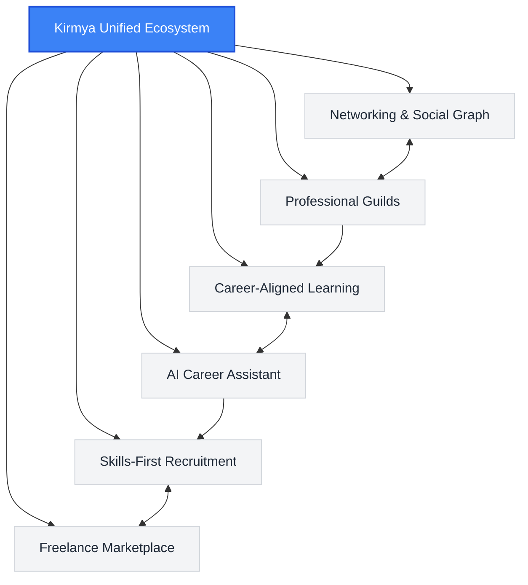

# Product Charter: Kirmya Professional Ecosystem
**Document Identifier:** PL-PD-001 | **Status:** Draft / Pending Approval | **Version:** 1.0.0  
**Authors:** Antigravity AI & Product Strategy Group | **Date:** July 19, 2026

---

## Document Control & Meta-Information

### Version History
| Version | Date | Author | Description |
| :--- | :--- | :--- | :--- |
| `0.1.0` | 2026-07-19 | Antigravity AI | Initial outline and scope definition. |
| `1.0.0` | 2026-07-19 | Antigravity AI | Completed full Product Charter incorporating all requested pillars, target audiences, risks, success metrics, and glossary. |

### Document Distribution
* **Product Management Team**: Core Strategy Alignment
* **Engineering & Architecture Group**: Technical Feasibility & System Constraints
* **Design & UX Guild**: Interface Standards & User Flow Alignment
* **Legal & Compliance Office**: GDPR, CCPA, and Employment Regulation Verification
* **Executive Leadership Board**: Strategic & Financial Approvals

---

## 1. Executive Summary

### 1.1 Document Purpose
This Product Charter serves as the definitive reference for the strategic direction, boundaries, objectives, and foundational principles of **Kirmya**. It aligns cross-functional stakeholders (Product, Engineering, Design, and Legal) on the scope of Kirmya as an integrated, multi-faceted professional ecosystem rather than a narrow job portal. All subsequent Product Requirement Documents (PRDs), system design schemas, and design templates must conform to the tenets established herein.

### 1.2 Product Definition: Kirmya
**Kirmya** is a unified professional ecosystem designed to replace the fragmented stack of tools currently used by modern professionals. Rather than treating networking, recruitment, upskilling, and project contracting as isolated transactions, Kirmya synthesizes these components into a single lifecycle. By anchoring the platform in **high-signal professional networking**, **collaborative communities**, **skills-first recruitment**, **career-aligned learning**, and **AI-driven career assistance**, Kirmya guides professionals from their first entry-level role through upskilling, mentorship, senior leadership, and freelance specialization.



---

## 2. Glossary of Terms

To ensure consistent terminology across all product, design, and engineering discussions, the following definitions are established:

* **Kirmya Copilot / AI Assistant**: The native, context-aware AI agent embedded throughout Kirmya that provides real-time guidance on resume construction, interview preparation, skill-gap analysis, and networking outreach.
* **Professional Guilds (Communities)**: Curated, interest-based, or industry-specific sub-communities within Kirmya that enforce peer-review standards, share knowledge repositories, and conduct localized mentorship circles.
* **Skills-First Recruitment**: A hiring methodology that prioritizes verifiable capabilities, technical projects, and peer-reviewed assessments over historical pedigree (such as specific university degrees or former corporate employers).
* **High-Signal Feed**: A proprietary feed algorithmic layout optimized for educational and professional value, which filters out engagement-bait, corporate platitudes, and non-professional noise.
* **Skill Graph**: A dynamic, machine-readable ontology mapping a user's skills, verified competencies, project involvements, and peer endorsements to industry requirements and career pathways.
* **Decentralized Reputation Score (DRS)**: A secure, multi-dimensional score aggregated from peer reviews within Guilds, project delivery history in the Freelance Marketplace, and verified learning assessments.

---

## 3. Mission & Long-Term Vision

### 3.1 Mission Statement
> *"To democratize career growth and talent acquisition by replacing noise with signal, pedigree with proven capability, and transaction-driven platforms with a supportive, lifelong professional ecosystem."*

Kirmya exists to give every professional, regardless of their background or starting point, access to the tools, knowledge, communities, and opportunities needed to direct their career journey. Simultaneously, Kirmya enables organizations to find and collaborate with verified talent efficiently, without the friction and biases inherent in legacy resume-screening systems.

### 3.2 Long-Term Vision (10-Year Evolution)
Kirmya is not a static application but a progressively unlocking platform. The long-term trajectory is divided into four strategic horizons:

```
+---------------------------------------------------------------------------------------+
|  HORIZON 1: Foundation (Years 1-2)                                                     |
|  - Launch Professional Social Graph & Networking Feed.                                |
|  - Establish Professional Guilds (Communities).                                       |
|  - Embed Kirmya Copilot (Resume Review, Skill Analysis).                               |
+------------------------------------+--------------------------------------------------+
                                     |
                                     v
+------------------------------------+--------------------------------------------------+
|  HORIZON 2: Integration & Learning (Years 3-4)                                        |
|  - Integrate APIs of major online learning platforms (Coursera, Udemy, edX).           |
|  - Launch personalized learning paths tied to active market demand.                   |
|  - Introduce micro-credentials verified on Kirmya's Skill Graph.                       |
+------------------------------------+--------------------------------------------------+
                                     |
                                     v
+------------------------------------+--------------------------------------------------+
|  HORIZON 3: Recruitment & Matching (Years 5-6)                                        |
|  - Introduce Skills-First Recruitment suite for enterprises and startups.             |
|  - Deploy the AI Candidate Match Engine to replace traditional ATS systems.           |
|  - Standardize technical/operational peer-reviewed assessments.                       |
+------------------------------------+--------------------------------------------------+
                                     |
                                     v
+------------------------------------+--------------------------------------------------+
|  HORIZON 4: The Open Talent Economy (Years 7-10)                                      |
|  - Activate the Freelance & Contract Marketplace.                                     |
|  - Implement smart-contract escrow payments and decentralized dispute resolution.      |
|  - Scale Kirmya into the default global operating system for flexible knowledge work. |
+---------------------------------------------------------------------------------------+
```

---

## 4. Product Philosophy & Guiding Principles

Our product decisions are guided by a set of core beliefs. When features conflict or priorities are debated, these principles dictate the resolution:

1. **Proven Competency Over Pedigree**: We design systems that highlight *what a user can build or do* rather than where they went to school or who they previously worked for. Technical and operational portfolios always take precedence over static lists of titles.
2. **High-Signal by Design**: We reject standard social media mechanics that optimize for mindless scrolling, outrage, or generic corporate self-promotion. We measure success by the *educational or professional value* of time spent on the platform.
3. **User Agency and Data Sovereignty**: Users retain absolute ownership of their professional graph, portfolios, and data. They determine what information is public, what is shared with recruiters, and how their data trains internal models. Exporting one’s profile and credentials must always be simple and complete.
4. **AI as an Equalizer, Not a Replacement**: AI tools on Kirmya are built to augment human agency. The Kirmya Copilot coaches the user, exposes skill gaps, and prepares them for evaluations, but it does not make automated, black-box decisions that exclude candidates without human review.
5. **Friction is a Feature for Quality**: While legacy platforms try to make connecting and applying as frictionless as possible (resulting in massive spam for hiring managers and recruiters), Kirmya deliberately introduces structured friction (e.g., peer-reviews, assessments, personalized cover prompts) to ensure all interactions are highly intentional and high-value.

---

## 5. Target Audience & Market Positioning

### 5.1 Target Audience Segments

Kirmya serves a multi-sided market, categorized into primary user profiles:

#### 1. Talent & Professionals
* **Emerging Talent (Students & Career Switchers)**: Individuals looking to break into new fields who lack a traditional background. They require mentorship, structured learning paths, and ways to prove their skills.
* **Active Career Builders**: Mid-to-senior level professionals seeking growth, peer interaction in specialized domains, and high-quality job opportunities without the spam of mainstream social channels.
* **Freelancers & Contract Specialists**: Independent professionals who need verified profiles to secure contracts, manage client relations, and receive secure, low-fee payments.

#### 2. Businesses & Employers
* **Startup Founders & Small Businesses**: Leaders looking to hire top talent directly with minimal budget, requiring accurate, pre-vetted matches rather than piles of unverified applications.
* **Enterprise Talent Acquisition Teams**: Recruiters looking for highly specialized skills who are frustrated by the low conversion rates of traditional search keywords.
* **Project Managers & Contract Directors**: Clients seeking freelance support who want verified performance history and structured milestone payments.

#### 3. Enablers & Mentors
* **Mentors & Industry Experts**: Experienced leaders who want to run Guilds, provide peer reviews, and guide junior members.
* **Educators & Content Providers**: Universities, bootcamps, and online course creators who want to integrate their curricula directly with active job pathways.

### 5.2 Market Positioning Matrix

The current landscape is highly fragmented. Kirmya occupies a unique position by synthesizing networking, learning, and recruitment into a high-signal ecosystem:

| Attribute / Dimension | **Legacy Social (LinkedIn)** | **Freelance Portals (Upwork/Fiverr)** | **Recruiting Suites (Workday/ATS)** | **Kirmya Ecosystem** |
| :--- | :--- | :--- | :--- | :--- |
| **Primary Focus** | Ad-driven networking | Transactional gig matching | Compliance & resume tracking | Lifelong career growth & verified matching |
| **Signal-to-Noise Ratio** | Low (heavy spam/ads) | Medium (flooded with bids) | Low (massive raw applicants) | **High** (curated, peer-reviewed) |
| **Skill Verification** | Unverified (endorsements) | Review-based (historically biased) | Non-existent (manual test links) | **High** (algorithmic & peer-vetted) |
| **AI Integration** | Add-on post generators | Auto-bidding helpers | Filtering algorithms | **Native Copilot & Match Coach** |
| **Platform Fees** | High subscription fees | High commission fees (10-20%) | High enterprise software license | **Low, value-driven transaction fees** |

---

## 6. Value Proposition & Problems Solved

### 6.1 The Core Value Propositions

#### For Talent: The Unified Growth System
* *No more shouting into the void.* Kirmya provides a clear, data-driven map of your skills, shows you the exact learning courses required to fill gaps, connects you to professional guilds for support, and presents verified profiles directly to hiring managers who value your practical skills.

#### For Employers: Zero-Waste Recruiting
* *Stop reading resumes and start reviewing capabilities.* Kirmya matches you with candidates whose skills are verified by peer assessments, project portfolios, and community reviews. Cut time-to-hire by 60% by skipping top-of-funnel screening filters.

#### For Freelancers and Clients: Trust by Design
* *Eliminate client acquisition friction and fee gouging.* Kirmya’s future marketplace provides low-fee escrow contracts backed by a decentralized reputation score that proves client reliability and freelancer capability.

### 6.2 Problems Solved

```
+----------------------------------+----------------------------------+
| LEGACY PROBLEM                   | KIRMYA SOLUTION                  |
+----------------------------------+----------------------------------+
| The Resume Inflation Problem     | Portfolios are verified via code |
| Candidates exaggerate skills on  | commits, peer reviews, and native |
| static PDFs.                     | system assessments.              |
+----------------------------------+----------------------------------+
| Disconnected Upskilling          | Learning paths are directly      |
| Professionals take courses that   | mapped to real-time skill gaps   |
| do not lead to job offers.       | identified by recruiters.        |
+----------------------------------+----------------------------------+
| Network Noise & Spam             | An algorithm that prioritizes    |
| Social feeds are dominated by    | code, designs, and case studies  |
| influencers and engagement bait. | over superficial commentary.      |
+----------------------------------+----------------------------------+
| High Recruitment Costs           | In-context, skills-matched pools |
| HR spends weeks filtering spam.  | mean recruiters only interact    |
|                                  | with pre-vetted talent.          |
+----------------------------------+----------------------------------+
| Marketplace Commission Exploits  | A low-fee contract platform built|
| Platforms take up to 20% of      | on top of a persistent, multi-   |
| freelancer earnings.             | purpose professional network.    |
+----------------------------------+----------------------------------+
```

---

## 7. The Six Pillars of the Kirmya Ecosystem

Kirmya is structured around six core, inter-operating pillars. The integration of these pillars creates a flywheel effect: as users learn, their profiles improve; as they engage in communities, their reputation grows; this reputation unlocks recruiting and freelance opportunities.

```
       +-------------------------------------------------------+
       |                  1. NETWORKING                         |
       |  Professional Social Graph & High-Signal Content Feed |
       +---------------------------+---------------------------+
                                   |
                                   v
       +-------------------------------------------------------+
       |                  2. COMMUNITIES                       |
       |  Professional Guilds, Peer Reviews & Mentorship       |
       +---------------------------+---------------------------+
                                   |
                                   v
       +-------------------------------------------------------+
       |                  3. LEARNING                          |
       |  Personalized Pathways, Course APIs & Micro-Credits   |
       +---------------------------+---------------------------+
                                   |
                                   v
       +-------------------------------------------------------+
       |                  4. AI ASSISTANT                      |
       |  Resume Optimization, Mock Interviews & Skill Auditing |
       +---------------------------+---------------------------+
                                   |
                                   v
       +-------------------------------------------------------+
       |                  5. RECRUITMENT                       |
       |  Skills-First Matching & Candidate Discovery Suite    |
       +---------------------------+---------------------------+
                                   |
                                   v
       +-------------------------------------------------------+
       |                  6. MARKETPLACE                       |
       |  Milestone-Escrow Contracts & Freelance Transactions  |
       +-------------------------------------------------------+
```

### 7.1 Pillar 1: Networking (Professional Social Graph)
* **Core Capabilities**:
  * An optimized, multi-dimensional user profile reflecting verified skills, project history, active community contributions, and learning history.
  * A content feed driven by value-scoring algorithms. Users vote on posts based on utility (e.g., "Educational", "Insightful", "Inspirational"), filtering out low-quality social posts.
  * An integrated connection graph representing mentors, peers, collaborators, and clients.
* **Tech stack integration markers**: Real-time activity updates, graph database architecture (Neo4j or similar for connection tracking), and content classification APIs.

### 7.2 Pillar 2: Communities (Professional Guilds)
* **Core Capabilities**:
  * Specialized workspaces called "Guilds" structured by technical/business disciplines (e.g., *Rust Core Developers*, *Systems Engineers*, *UI/UX Researchers*).
  * Guild-moderated repositories of shared documents, templates, codebases, and case studies.
  * A peer-review module allowing community members to audit portfolios, providing feedback that updates the user's Decentralized Reputation Score (DRS).
  * Virtual mentorship circles with structured check-ins and progress milestones.

### 7.3 Pillar 3: Learning (Upskilling & Integration)
* **Core Capabilities**:
  * Unified course index pulling from Coursera, Udemy, Pluralsight, and edX via standardized API integrations.
  * Dynamic learning path generator: when a user identifies a target job role, the system analyzes their current profile, identifies gaps, and compiles a customized learning curriculum.
  * Integration of interactive coding environments, sandbox tools, and practical exercises.
  * Issuance of verifiable micro-credentials stored directly on the Kirmya Skill Graph.

### 7.4 Pillar 4: AI-Powered Career Assistance (Kirmya Copilot)
* **Core Capabilities**:
  * **Resume Optimizer**: Suggests modifications based on real job descriptions, focusing on formatting projects to emphasize specific skills.
  * **Interview Coach**: Interactive, role-specific text/voice mock interviews with real-time feedback on domain accuracy and communication style.
  * **Skill Auditor**: Continually scans the user’s codebase, portfolios, and inputs to suggest areas for skill updates.
  * **Career Strategist**: Suggests long-term career shifts based on global employment trends and internal market demand metrics.

### 7.5 Pillar 5: Recruitment (Skills-First Match)
* **Core Capabilities**:
  * Recruiter interface focused entirely on capability searches rather than keyword matching on text resumes.
  * Dynamic matching index: candidates are scored based on the verified skills required for the job.
  * Blind recruitment mode: hides candidate name, gender, ethnicity, age, and school/corporate branding to reduce bias during initial reviews.
  * Interactive technical challenges and assessments built into the application flow.

### 7.6 Pillar 6: Freelance Marketplace (Future Horizon)
* **Core Capabilities**:
  * Escrow-based payment processing where funds are held in secure accounts and released based on milestone completion.
  * Smart project templates specifying deliverables, timelines, and acceptance criteria.
  * Unified conflict resolution mechanism incorporating independent, qualified guild members as mediators.
  * Low transaction commission (targeting 2-3% to cover operational costs, compared to industry standard 10-20%).

---

## 8. Business Objectives & Success Metrics (KPIs)

To evaluate the health, growth, and effectiveness of the Kirmya ecosystem, we will track specific Key Performance Indicators (KPIs) across three main phases:

### 8.1 Growth & Engagement Metrics (Year 1-2)
* **Active Guild Members (AGM)**: Monthly Active Users (MAU) who contribute at least one post, comment, or peer-review to a Guild. Target: 40% of overall MAU.
* **Content Signal Quality (CSQ)**: Ratio of "Value-marked" posts (marked Educational/Insightful) to standard posts in user feeds. Target: > 85% high-signal rating.
* **Copilot Engagement**: Percentage of registered users who utilize the AI Career Assistant for resumes or interview prep within their first 30 days. Target: 65%.

### 8.2 Recruitment & Learning Integration Metrics (Year 3-5)
* **Course Completion Rate (CCR)**: Percentage of users who complete a recommended learning path. Target: 25% (vs. industry average of 5-10% for MOOCs).
* **Skills-First Placement Rate (SFPR)**: Percentage of hires made where the employer skipped traditional resume screening in favor of Kirmya skill-matches. Target: 50% of platform placements.
* **Time-to-Hire (TTH) Reduction**: Average days saved by employers using Kirmya compared to traditional LinkedIn/ATS sourcing. Target: 45% reduction in TTH.

### 8.3 Financial & Marketplace Sustainability Metrics (Year 6+)
* **Freelance Transaction Value (FTV)**: Total gross volume of contract payments processed via Kirmya Escrow.
* **Retention and Lifetime Value (LTV)**: Longitudinal tracking of user retention over a multi-year period as they transition from students to senior professionals.
* **Ecosystem Platform Margin**: Profitability margin derived from recruiter premium search licenses and freelance transactions, offset by AI compute costs.

---

## 9. Key Assumptions, Constraints, and Risks

### 9.1 Assumptions
1. **API Openness**: We assume major MOOCs (Coursera, Udemy, etc.) will maintain open, developer-friendly APIs for course catalogs and credential verification.
2. **Shift in HR Thinking**: We assume hiring managers and HR teams are willing to transition away from the "degree/previous employer" filter toward a "proven skills portfolio" methodology due to rising sourcing costs.
3. **AI Scalability**: We assume the computational cost of providing LLM-driven mock interviews and resume reviews will decrease over time, making it financially viable to offer standard tier AI coaching for free.

### 9.2 Constraints
1. **Regulatory and Privacy Compliance**: Kirmya processes sensitive career history, identity, and candidate evaluation data. We must comply with global regulations including GDPR (General Data Protection Regulation) and CCPA (California Consumer Privacy Act). Right-to-be-forgotten queries must easily erase personal profiles without breaking the connection social graph.
2. **AI Fair Hiring Regulations**: The AI Candidate Match Engine must comply with local and international regulations regarding automated employment decision-making tools (AEDTs) (e.g., NYC Local Law 144, EU AI Act). The system must undergo annual independent bias audits.
3. **Data Storage Limits**: Storing large developer portfolios, designs, and historical code commits requires optimized vector database storage structures and deduplication mechanisms.

### 9.3 Risks and Mitigation Strategies

```
+-----------------------------------+-----------------------------------+
| RISK                              | MITIGATION STRATEGY               |
+-----------------------------------+-----------------------------------+
| Social Network Cold-Start         | Seed the platform with exclusive, |
| Professionals won't join without  | high-quality content partnerships |
| recruiters; recruiters won't join | and focus early efforts on specific|
| without candidates.               | developer/designer niches.        |
+-----------------------------------+-----------------------------------+
| AI Bias and Hallucination         | Implement strict guidelines for   |
| The AI Assistant could give wrong | LLM fine-tuning, perform regular  |
| advice or bias candidate matching. | bias tests, and mandate human-in- |
|                                   | the-loop validation.              |
+-----------------------------------+-----------------------------------+
| Profile Gaming and Fraud          | Anchor skill verifications in code |
| Users could copy code or use AI   | commits, project history, and peer|
| to cheat on assessments.          | evaluations with audit histories. |
+-----------------------------------+-----------------------------------+
| High Compute Overhead             | Use hybrid local/cloud architectures|
| LLM mock-interviews could drain   | for the AI assistant, caching     |
| resources quickly.                | templates and limiting usage caps. |
+-----------------------------------+-----------------------------------+
```

---

## 10. Future Documentation Roadmap

The Product Charter sets the framework. To proceed with implementation, the following subsequent documents must be produced and referenced:

1. **System & Technical Architecture Schema (`docs/architecture/02-system-architecture.md`)**:
   * Outlines the database models (GraphDB + RelationalDB + VectorDB), backend services, API interfaces, and performance standards.
2. **Product Requirement Documents (PRDs) by Pillar**:
   * `docs/product/prd/02-networking-prd.md` - Core Social Graph and Feed Mechanics
   * `docs/product/prd/03-recruitment-prd.md` - Skills-First Hiring and Blind Sourcing
   * `docs/product/prd/04-communities-prd.md` - Guilds and Peer-Review Mechanics
   * `docs/product/prd/05-learning-prd.md` - Course API and Upskilling Pathways
   * `docs/product/prd/06-ai-assistant-prd.md` - Kirmya Copilot Integration
3. **UX & UI Design Guidelines (`docs/design/02-design-system.md`)**:
   * Defines UI libraries, visual design patterns, glassmorphism templates, and response layouts.
4. **Security, Compliance & Bias Audit Protocol (`docs/security/02-compliance-protocol.md`)**:
   * Outlines GDPR/CCPA compliance architectures and bias monitoring metrics for matching algorithms.

---

## 11. Unresolved Questions

During this phase, several questions remain open and require further investigation:

1. **Monetization of Communities**: Should Guild leaders be permitted to charge subscriptions for exclusive cohorts, and if so, what percentage cut does Kirmya take?
2. **Blockchain for Credentials**: Should micro-credentials and peer reviews be secured using a decentralized ledger, or is a centralized, cryptographic ledger sufficient?
3. **Escrow Bank Integration**: What third-party escrow API (e.g., Stripe, Escrow.com) will be the most cost-effective and legally compliant choice across multiple countries for the future Freelance Marketplace?

---

## 12. Approval Checkpoints

This charter must be signed off by all key stakeholders before starting technical architecture designs:

| Role | Department | Name | Date | Status / Signature |
| :--- | :--- | :--- | :--- | :--- |
| **Product Director** | Product Strategy | [Pending] | | `Awaiting Review` |
| **Chief Technology Officer**| Engineering | [Pending] | | `Awaiting Review` |
| **Lead Designer** | Design & UX | [Pending] | | `Awaiting Review` |
| **Compliance Officer** | Legal & HR | [Pending] | | `Awaiting Review` |
