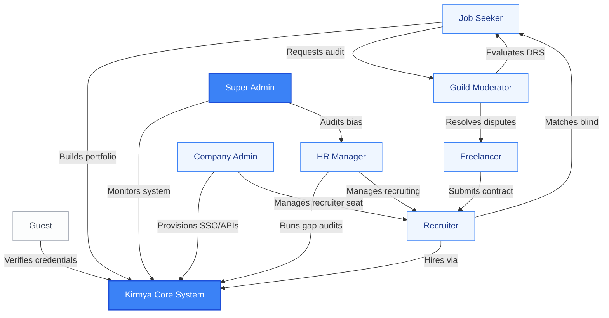

# User Personas: Kirmya Professional Ecosystem
**Document Identifier:** PL-PD-006 | **Status:** Draft / Pending Approval | **Version:** 1.0.0  
**Authors:** Antigravity AI & Design & Research Guild | **Date:** July 19, 2026

---

## Document Control & Meta-Information

### Version History
| Version | Date | Author | Description |
| :--- | :--- | :--- | :--- |
| `0.1.0` | 2026-07-19 | Antigravity AI | Initial draft outlining the eight personas. |
| `1.0.0` | 2026-07-19 | Antigravity AI | Completed detailed profiles for all eight personas including accessibility needs and mapping diagrams. |

---

## 1. Executive Summary

This User Personas document establishes the target user framework for the **Kirmya Professional Ecosystem**. Designing for a multi-sided ecosystem requires clear empathy for distinct user groups—from unauthenticated guests checking credentials to enterprise HR administrators managing budgets and community moderators auditing portfolios. These profiles must guide all future UI/UX workflows, front-end development, accessibility structures, and system notification models.

---

## 2. Core Personas

### 2.1 Persona 1: Guest (Unauthenticated Visitor)
> *"I need to verify a candidate's skill credentials quickly without registering for another account or getting trapped behind a signup wall."*

* **Demographics**:
  - **Age**: 28 - 55
  - **Location**: Global
  - **Education**: Diverse
  - **Role Experience**: Client, External Auditor, or Partner Employer
  - **Language**: English / Arabic (Bilingual)
* **Goals**:
  - Audit a specific candidate portfolio or credential link sent by a job applicant.
  - Review public Guild documents or check the platform's high-signal public content.
  - Determine if Kirmya is worth creating an account for.
* **Frustrations**:
  - Being blocked by aggressive modal popups demanding registration.
  - Slow load times on heavy client-side pages.
  - Lack of clear, shareable public-link structures.
* **Workflows**:
  - Clicks a shared URL in a resume or portfolio PDF.
  - Scans verified skills on the candidate’s public Kirmya profile.
  - Verifies the credential's cryptographic origin badge.
* **Accessibility Considerations**:
  - **Visual**: Needs clear text contrast ratio (4.5:1 minimum) and scalable font sizing.
  - **Device**: Highly mobile-responsive pages (often viewed on smartphones on the go).
* **Expected Platform Interactions**:
  - Reads static public profile graphs.
  - Interacts with public, read-only content feeds and articles.
  - Views public-facing glossary or ecosystem overview screens.

---

### 2.2 Persona 2: Job Seeker (Emerging Technical Talent)
> *"I want to prove I can build excellent systems. I don't have a Ivy League degree, but I have verified projects that speak for themselves."*

* **Demographics**:
  - **Age**: 20 - 32
  - **Location**: Bangalore, India / Dubai, UAE
  - **Education**: Coding Bootcamp Graduate / Self-Taught
  - **Role Experience**: Junior-to-Mid level developer (0-3 years)
  - **Language**: English
* **Goals**:
  - Build a verified portfolio that bypasses traditional corporate recruiters' brand-based filters.
  - Identify exactly what skills they lack to secure a target job role.
  - Use AI mock interviews to build technical communication confidence.
* **Frustrations**:
  - Resume-parsing engines auto-rejecting them due to a lack of brand-name companies on their CV.
  - Mainstream professional sites flooded with bragging posts and influencer spam.
  - High cost of certifications that do not lead to direct job placements.
* **Workflows**:
  - Connects GitHub profile and initiates code analysis.
  - Requests peer portfolio audits from the specialized Guild.
  - Activates Kirmya Copilot to audit resume formatting and practice coding questions.
* **Accessibility Considerations**:
  - **Cognitive**: Needs simple, distraction-free reading modes to minimize anxiety during automated assessments.
  - **Neurological**: Keyboard-navigable screens (no mouse required) for fast coding/sandbox exercises.
* **Expected Platform Interactions**:
  - Manages personal Skill Graph nodes.
  - Engages in Guild study boards and submits code for reviews.
  - Utilizes LLM voice-coaching sessions.

---

### 2.3 Persona 3: Freelancer (Independent Contract Specialist)
> *"I want to work with clients who value technical quality, pay milestone-escrow commitments on time, and don't charge me 20% commission."*

* **Demographics**:
  - **Age**: 25 - 45
  - **Location**: Cairo, Egypt / Remote
  - **Education**: Bachelor's in Software Engineering / Graphic Design
  - **Role Experience**: Mid-to-Senior Specialist (4+ years)
  - **Language**: Arabic (Native) / English (Fluent)
* **Goals**:
  - Find high-quality, high-budget corporate clients in the GCC.
  - Retain 97.5% of contract earnings (only paying 2.5% escrow transaction fees).
  - Secure a verified regional reputation score to win contracts without pitching spam.
* **Frustrations**:
  - High commission rates on global platforms eating into thin margins.
  - Clients changing project scopes without escrow protections.
  - Competitors bidding with fake, copied reviews.
* **Workflows**:
  - Integrates UAE freelance permit or KSA residency card to verify legal working status.
  - Submits structured proposals specifying milestones and budgets.
  - Tracks client deposit validation before beginning codebase commits.
* **Accessibility Considerations**:
  - **Language**: Modern Standard Arabic (MSA) localized dashboards.
  - **Auditory**: Subtitled tutorial and video guides for platform contracts.
* **Expected Platform Interactions**:
  - Uploads verified contracts to Escrow pipelines.
  - Submits deliverables to clients for milestone release triggers.
  - Reviews client reputation scores after project completion.

---

### 2.4 Persona 4: Recruiter (Sourcing Specialist)
> *"I am tired of sorting through hundreds of unverified PDF resumes. I want to search for verified capabilities and see who can build what I need."*

* **Demographics**:
  - **Age**: 24 - 40
  - **Location**: Dubai, UAE / Riyadh, Saudi Arabia
  - **Education**: Business Administration / HR
  - **Role Experience**: Sourcing Specialist (2-8 years)
  - **Language**: English / Arabic
* **Goals**:
  - Reduce sourcing-to-interview cycles by 50% by reviewing pre-screened talent profiles.
  - Maintain legal compliance for Emiratization and Saudization diversity quotas.
  - Ensure candidate portfolios contain real, functional codebase assets.
* **Frustrations**:
  - Candidate resume inflation (exaggerating skills on text-only profiles).
  - Mainstream search tools returning thousands of generic, keyword-stuffed results.
  - Slow client communications on external communication channels.
* **Workflows**:
  - Configures capability searches using strict skill constraints (e.g. Node.js DRS > 75).
  - Toggles Blind Mode to shortlist candidates without unconscious bias.
  - Integrates shortlist data directly into the company’s internal ATS dashboard.
* **Accessibility Considerations**:
  - **Visual**: Support for high-contrast dark/light mode options to reduce eye strain during long screen-sourcing sessions.
  - **Motor**: Optimized tab navigation indexes for rapid keyboard shortlisting.
* **Expected Platform Interactions**:
  - Manages active job posts and capability matching parameters.
  - Communicates with candidates through secure, anonymous chat flows.
  - Tracks sourcing metrics and team candidate pipelines.

---

### 2.5 Persona 5: HR Manager (Enterprise Talent Director)
> *"We need to manage corporate upskilling programs, optimize internal transitions, and ensure our AI hiring engines meet compliance requirements."*

* **Demographics**:
  - **Age**: 35 - 55
  - **Location**: Abu Dhabi, UAE
  - **Education**: Master's in Human Resources / Organizational Psychology
  - **Role Experience**: HR Manager / Talent Director (10+ years)
  - **Language**: English
* **Goals**:
  - Run internal skill gap audits to align workforce capabilities with new technology initiatives.
  - Manage company hiring compliance records (specifically AEDT fair hiring requirements).
  - Retain top talent by providing clear, platform-recommended career upskilling paths.
* **Frustrations**:
  - Disconnected corporate training tools (employees do courses but don't apply them).
  - Algorithmic biases in hiring software that expose the firm to legal fines.
  - Lack of clear metrics showing internal skill density.
* **Workflows**:
  - Configures the corporate internal upskilling portal.
  - Generates compliance audit logs detailing candidate match distributions.
  - Reviews internal promotion paths based on verified skill growths.
* **Accessibility Considerations**:
  - **Cognitive**: Simplified dashboard reports with clear graphic charts and CSV export capabilities.
  - **Motor**: Fully accessible tables that support screen readers.
* **Expected Platform Interactions**:
  - Audits company team profiles and skill gaps.
  - Reviews AEDT compliance telemetry screens.
  - Authorizes budgets for corporate premium training courses.

---

### 2.6 Persona 6: Company Administrator
> *"I need to manage user permissions, integrate APIs with our ATS, and control corporate payment methods securely."*

* **Demographics**:
  - **Age**: 30 - 50
  - **Location**: Global
  - **Education**: Computer Science / Information Systems
  - **Role Experience**: IT Administrator / Operations Manager (5+ years)
  - **Language**: English
* **Goals**:
  - Maintain data security and control access using Single Sign-On (SSO).
  - Integrate Kirmya API pipelines with Greenhouse, Lever, or Workday ATS systems.
  - Audit billing history and track recruiter seat licenses.
* **Frustrations**:
  - Clunky multi-tenant setup processes.
  - Poorly documented API integrations.
  - Security logs that do not track detailed recruiter search behaviors.
* **Workflows**:
  - Provisions SSO profiles for new recruiting hires.
  - Sets up webhook triggers for ATS data synchronization.
  - Reviews billing methods and downloads payment receipts.
* **Accessibility Considerations**:
  - **Visual**: Screen reader compatibility for complex API setup and key generation screens.
  - **Neurological**: Clear alert configurations to prevent accidental deletion of critical API linkages.
* **Expected Platform Interactions**:
  - Manages corporate IAM settings.
  - Accesses API credentials and generates client secrets.
  - Audits payment logs and seat licenses.

---

### 2.7 Persona 7: Community Moderator (Guild Leader)
> *"I want to maintain a clean, high-signal workspace. We audit portfolios, moderate feeds, and keep spam out of our Guild."*

* **Demographics**:
  - **Age**: 28 - 60
  - **Location**: Riyadh, Saudi Arabia / Cairo, Egypt
  - **Education**: Expert practitioner in specific field
  - **Role Experience**: Senior Lead Engineer / Designer (8+ years)
  - **Language**: Arabic / English
* **Goals**:
  - Build a highly respected community of experts in their region.
  - Audit candidate code submissions fairly and issue verified DRS scores.
  - Mitigate feed spam, promotional posts, and AI-generated copy-paste articles.
* **Frustrations**:
  - Lack of granular moderation tools (e.g. bulk-deleting spammers).
  - Conflict-resolution workflows that take too long to resolve.
  - System algorithms that favor sensationalist content over deep technical guides.
* **Workflows**:
  - Reviews flagged posts in the Guild feed.
  - Audits peer-review portfolio requests using a structured scoring metric.
  - Resolves dispute escalations between freelancers and clients in their domain.
* **Accessibility Considerations**:
  - **Visual**: Support for high font magnification without breaking the UI grid layout.
  - **Auditory**: Audio transcripts of video files flagged for moderation.
* **Expected Platform Interactions**:
  - Moderates Guild discussion feeds and repositories.
  - Interacts with candidates during peer audits.
  - Votes on ecosystem moderation policies.

---

### 2.8 Persona 8: Super Administrator (Kirmya Core Team)
> *"I need to monitor system-wide uptime, audit AI match accuracy, verify compliance logs, and handle critical disputes."*

* **Demographics**:
  - **Age**: 28 - 45
  - **Location**: Kirmya HQ (Dubai, UAE)
  - **Education**: Computer Science / Systems Engineering
  - **Role Experience**: Core Developer / Systems Operations Lead (5+ years)
  - **Language**: English
* **Goals**:
  - Monitor global system health, API latencies, and server load distributions.
  - Audit matching algorithm performance metrics to verify bias compliance.
  - Manage system-wide configuration flags and emergency rollback deployments.
* **Frustrations**:
  - Lack of consolidated operations dashboards.
  - Slow database migration structures across graph and relational tables.
* **Workflows**:
  - Reviews system telemetry logs (graph RPS, vector index rates).
  - Approves manual overrides for disputed accounts or critical security alerts.
  - Monitors monthly compute cost margins and API rate boundaries.
* **Accessibility Considerations**:
  - **Visual**: High-contrast dashboard charts with raw tabular data views for screen readers.
  - **Cognitive**: Critical security configurations require dual-admin confirmation warnings to prevent errors.
* **Expected Platform Interactions**:
  - Accesses the core Kirmya Ops portal.
  - Deploys feature flags and updates system-wide matching models.
  - Reviews regional compliance audit registries.

---

## 3. Inter-Persona Interaction Mapping

The following diagram illustrates how the eight personas interact and exchange value within the Kirmya ecosystem:

---

## 4. Approval Checkpoints

This User Personas document must be signed off by UX Research and Product Strategy before committing to layout designs:

| Role | Department | Name | Date | Status / Signature |
| :--- | :--- | :--- | :--- | :--- |
| **Lead UX Researcher** | User Experience | [Pending] | | `Awaiting Review` |
| **Product Director** | Product Strategy | [Pending] | | `Awaiting Review` |
| **Lead Developer** | Front-End Guild | [Pending] | | `Awaiting Review` |
