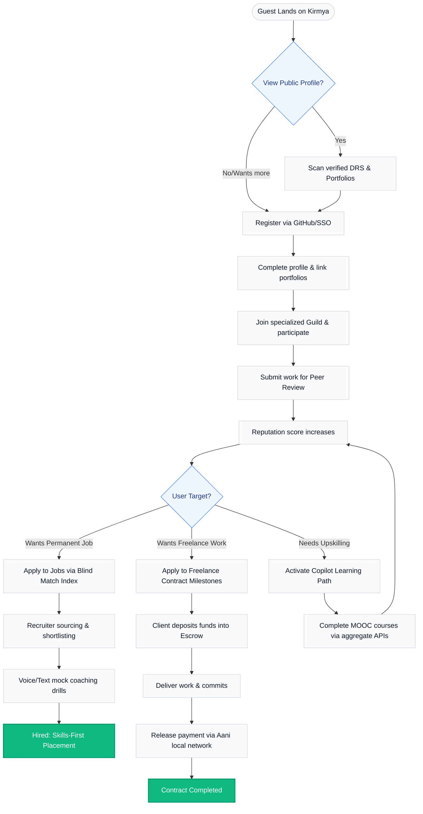

# User Journeys: Kirmya Professional Ecosystem
**Document Identifier:** PL-PD-007 | **Status:** Draft / Pending Approval | **Version:** 1.0.0  
**Authors:** Antigravity AI & Design & Research Guild | **Date:** July 19, 2026

---

## Document Control & Meta-Information

### Version History
| Version | Date | Author | Description |
| :--- | :--- | :--- | :--- |
| `0.1.0` | 2026-07-19 | Antigravity AI | Initial draft mapping user journey phases. |
| `1.0.0` | 2026-07-19 | Antigravity AI | Completed full end-to-end user journeys for all eight personas across the 11 key touchpoints. |

---

## 1. Executive Summary

This document charts the end-to-end user journeys for all eight core personas within the **Kirmya Professional Ecosystem** as defined in the *User Personas* document ([06-user-personas.md](file:///c:/Users/PRASHANTH/Documents/real/my_project/docs/product/06-user-personas.md)). By detailing each persona's path across key touchpoints—from initial unauthenticated guest checks to daily administrative audits—we ensure that system designs support high-signal interactions, low latency, and intuitive routing across all pillars of the ecosystem.

---

## 2. End-to-End Persona Journeys

---

### 2.1 Persona 1: Guest (Unauthenticated Visitor)

* **Registration**: 
  - *Journey*: N/A. The Guest does not create an account. They land directly on public-facing URL routes (e.g. `kirmya.com/profile/verify/candidate-123` or `kirmya.com/guilds/systems-engineering/public-docs`).
* **Profile Completion**:
  - *Journey*: N/A.
* **Networking**:
  - *Journey*: Scans public feeds. They cannot post, vote, or comment.
* **Searching**:
  - *Journey*: Can execute basic search queries for public Guild resources or search for public candidate IDs, but cannot access advanced recruiter search filters.
* **Applying**:
  - *Journey*: N/A. If they attempt to apply for a role, they are redirected to the registration screen.
* **Recruiting**:
  - *Journey*: N/A.
* **Community Participation**:
  - *Journey*: Can view public knowledge repositories within Guilds but cannot participate in peer reviews or discussions.
* **Freelancing**:
  - *Journey*: N/A.
* **Notifications**:
  - *Journey*: N/A. (Does not receive platform push/email alerts).
* **Settings**:
  - *Journey*: N/A. (Can only adjust basic browser session preferences like light/dark mode overrides).
* **Account Recovery**:
  - *Journey*: N/A.

---

### 2.2 Persona 2: Job Seeker (Emerging Technical Talent)

* **Registration**: 
  - *Journey*: Accesses the signup screen. Selects "GitHub OAuth". Authenticates via GitHub, authorizing Kirmya to pull public metadata and email details. Accepts the privacy terms.
* **Profile Completion**:
  - *Journey*: Enters name, location, and imports GitHub projects. The system auto-populates languages used. Candidate inputs additional skills, which are saved under "Unverified". Connects with their LinkedIn profile to fetch historical text CV blocks.
* **Networking**:
  - *Journey*: Scans their High-Signal Feed. Upvotes technical guides as "Educational". Connects with peers who share mutual project code repositories. Sends a personalized, one-click connection request to a senior developer in their domain.
* **Searching**:
  - *Journey*: Searches for junior developer roles in Dubai using the job board filters. Uses Kirmya Copilot to find roles where their active GitHub languages match >80% of job requirements.
* **Applying**:
  - *Journey*: Selects a job. Runs Copilot to verify resume alignment. Submits the application. The system automatically creates a blind candidate summary, obscuring their name, age, and university.
* **Recruiting**:
  - *Journey*: N/A. (Interacts only as an applicant, receiving scheduling requests and blind messaging prompts from recruiters).
* **Community Participation**:
  - *Journey*: Joins the *Rust Guild*. Submits a new project link to the Guild review board. Receives peer scoring and audits from senior members, which automatically upgrades their Decentralized Reputation Score (DRS).
* **Freelancing**:
  - *Journey*: N/A. (Deferred to future marketplace Phase 4; currently focused on permanent placements).
* **Notifications**:
  - *Journey*: Receives push alerts when:
    - A Guild review is completed on their submission.
    - A recruiter requests an interview.
    - Copilot identifies a newly emerging skill gap in their target industry.
* **Settings**:
  - *Journey*: Toggles profile visibility to "Open to Sourcing". Adjusts data sharing, opting out of third-party model training.
* **Account Recovery**:
  - *Journey*: If locked out, logs in via GitHub OAuth. If password-based, uses "Forgot Password" to trigger a secure magic link sent to their verified email.

---

### 2.3 Persona 3: Freelancer (Independent Contract Specialist)

* **Registration**: 
  - *Journey*: Signs up using email and password. Completes email OTP verification. Selects "Freelancer Profile Type".
* **Profile Completion**:
  - *Journey*: Uploads case study PDFs and links live projects. Links their UAE Freelance Permit and inputs local bank IBAN. The system validates the permit number against the registry.
* **Networking**:
  - *Journey*: Contributes deep technical posts to the *UI/UX Design Guild*. Upvotes high-quality case studies. Engages in mentorship boards, guiding junior members to increase their own DRS.
* **Searching**:
  - *Journey*: Filters the Marketplace search for "Contract Projects" matching their design skill nodes. Sorts projects by "Escrow Verified" status to ensure payment security.
* **Applying**:
  - *Journey*: Submits a proposal for a freelance project. Specifies milestone payments, delivery timelines, and acceptance criteria.
* **Recruiting**:
  - *Journey*: N/A. (Acts as a bidder on projects).
* **Community Participation**:
  - *Journey*: Serves as a peer auditor in the *UX Research Guild*. Reviews junior portfolios to earn platform fee discounts.
* **Freelancing**:
  - *Journey*: Secures the project. Receives notification that client has deposited milestone funds into Escrow. Submits deliverables via GitHub/Figma sync. Triggers milestone release request.
* **Notifications**:
  - *Journey*: Receives real-time SMS and email alerts when:
    - Escrow deposits are verified.
    - Milestone payments are released.
    - A client initiates a dispute resolution ticket.
* **Settings**:
  - *Journey*: Configures billing preferences, sets regional hourly rates, and adjusts profile availability indicators.
* **Account Recovery**:
  - *Journey*: Uses email password-reset wizard. Sets up authenticator-app MFA to prevent credential hijacking.

---

### 2.4 Persona 4: Recruiter (Sourcing Specialist)

* **Registration**: 
  - *Journey*: Onboarded by their Company Administrator via an SSO email invite. Clicks invite link and logs in using corporate credentials (Azure AD).
* **Profile Completion**:
  - *Journey*: Enters corporate details, job title, and links their profile to the verified Company Brand Page.
* **Networking**:
  - *Journey*: Follows industry-specific Guilds to track rising talent. Posts technical job hiring announcements in specialized community forums.
* **Searching**:
  - *Journey*: Opens the **Capability Search Engine**. Enters criteria: "React.js > 80, Dubai, verified GitHub portfolio, UAE Golden Visa holder". Filters results.
* **Applying**:
  - *Journey*: N/A.
* **Recruiting**:
  - *Journey*: Reviews blind candidate summaries. Shortslist 5 candidates. Initiates blind chat. Once candidates approve the request, reveals profiles and schedules interviews through the native calendar sync.
* **Community Participation**:
  - *Journey*: Posts sourcing challenges or sponsors technical hackathons in the *Frontend Guild* to attract applicants.
* **Freelancing**:
  - *Journey*: Opens contract search panels to find short-term freelancers, verifying their local permit compliance before contract issuance.
* **Notifications**:
  - *Journey*: Receives instant notifications when a matched candidate accepts an interview request or completes a custom assessments module.
* **Settings**:
  - *Journey*: Toggles notification sounds, manages dashboard layouts, and saves custom candidate search parameters.
* **Account Recovery**:
  - *Journey*: Handled entirely through corporate SSO identity provider (IDP). IT admin resets their access via SSO directory.

---

### 2.5 Persona 5: HR Manager (Enterprise Talent Director)

* **Registration**: 
  - *Journey*: Registers using enterprise corporate email. Completes verification step. Invites the IT Administrator to configure workspace systems.
* **Profile Completion**:
  - *Journey*: Configures the primary Company Brand Profile, uploads logos, and sets up corporate billing cards.
* **Networking**:
  - *Journey*: Connects with other industry HR leaders. Publishes company culture guides in regional business groups.
* **Searching**:
  - *Journey*: Accesses internal employee skill databases. Searches for internal candidates who have completed upskilling pathways.
* **Applying**:
  - *Journey*: N/A.
* **Recruiting**:
  - *Journey*: Manages active job openings. Audits recruiter seat activities and reviews shortlisting conversion metrics.
* **Community Participation**:
  - *Journey*: Authorizes employee participation in Guild cohorts, sponsoring enterprise learning pathways.
* **Freelancing**:
  - *Journey*: Reviews contractor spend dashboards, monitoring active freelance milestone payouts and escrow budgets.
* **Notifications**:
  - *Journey*: Receives monthly billing alerts, hiring quota updates, and compliance audit notifications.
* **Settings**:
  - *Journey*: Manages corporate membership tiers, edits branding configurations, and controls team editing access.
* **Account Recovery**:
  - *Journey*: Recovers access via security question verification and MFA-SMS secondary code prompts.

---

### 2.6 Persona 6: Company Administrator

* **Registration**: 
  - *Journey*: Onboarded via HR corporate setup email. Sets up primary admin credentials and password.
* **Profile Completion**:
  - *Journey*: N/A. (Directly enters administrative panel setup).
* **Networking**:
  - *Journey*: N/A.
* **Searching**:
  - *Journey*: Searches system transaction logs, user records, and API status codes in the Admin Dashboard.
* **Applying**:
  - *Journey*: N/A.
* **Recruiting**:
  - *Journey*: N/A.
* **Community Participation**:
  - *Journey*: N/A.
* **Freelancing**:
  - *Journey*: N/A.
* **Notifications**:
  - *Journey*: Receives critical system alerts, failed API webhook triggers, and billing decline warnings.
* **Settings**:
  - *Journey*: Configures SSO (SAML/OIDC), generates API keys, whitelists IP ranges, and manages recruiter user seat assignments.
* **Account Recovery**:
  - *Journey*: Secures recovery through enterprise security keys (e.g. YubiKey) and offline backup recovery codes.

---

### 2.7 Persona 7: Community Moderator (Guild Leader)

* **Registration**: 
  - *Journey*: Automatically upgraded from an active User profile after being elected by the Guild board. Accepts moderator code-of-conduct terms.
* **Profile Completion**:
  - *Journey*: Profile displays a "Guild Moderator" badge alongside their technical DRS scores.
* **Networking**:
  - *Journey*: Directs technical discussions in the Guild. Connects with other Guild leaders to coordinate cross-discipline events.
* **Searching**:
  - *Journey*: Searches for flagged content, copyright claims, and spam accounts within their designated Guild space.
* **Applying**:
  - *Journey*: N/A. (If seeking a job, they use their standard user profile view).
* **Recruiting**:
  - *Journey*: N/A.
* **Community Participation**:
  - *Journey*: Audits portfolio code submissions. Reviews disputed peer-reviews. Pinpoints high-value posts to feature at the top of the Guild feed.
* **Freelancing**:
  - *Journey*: Acts as an arbitrator in freelance contract disputes. Reviews project specifications and code submissions, delivering a verdict to release/refund escrow funds.
* **Notifications**:
  - *Journey*: Receives high-priority notifications when content is flagged or when a contract dispute requires urgent mediation.
* **Settings**:
  - *Journey*: Adjusts moderation queue filters, sets auto-moderation keyword policies, and schedules Guild office hours.
* **Account Recovery**:
  - *Journey*: Uses standard user email-reset flows with mandatory secondary hardware token confirmation.

---

### 2.8 Persona 8: Super Administrator (Kirmya Core Team)

* **Registration**: 
  - *Journey*: Provisioned directly on local server databases using secure CLI commands during system boot.
* **Profile Completion**:
  - *Journey*: Profile is private, masked from search engines, and visible only to system logs.
* **Networking**:
  - *Journey*: N/A.
* **Searching**:
  - *Journey*: Executes queries across system database clusters, audits transaction flows, and searches user security logs.
* **Applying**:
  - *Journey*: N/A.
* **Recruiting**:
  - *Journey*: N/A.
* **Community Participation**:
  - *Journey*: Audits overall community health parameters, monitoring platform-wide signal quality metrics.
* **Freelancing**:
  - *Journey*: N/A. (Monitors total transactional escrow liquidity pools).
* **Notifications**:
  - *Journey*: Receives real-time paging alerts (via PagerDuty/OpsGenie integrations) for system crashes, database lag, and security violations.
* **Settings**:
  - *Journey*: Sets system feature flags, edits LLM pricing thresholds, modifies algorithm weights, and configures data backup schedules.
* **Account Recovery**:
  - *Journey*: Multi-custodian offline recovery keys stored in secure physical safety deposit boxes.

---

## 3. Core Ecosystem Journey Mapping

The following flowchart visualizes the progressive lifecycle of users as they interact and evolve through the Kirmya ecosystem:

---

## 4. Approval Checkpoints

This User Journeys document must be approved by all cross-functional leads before proceeding to frontend layout prototyping:

| Role | Department | Name | Date | Status / Signature |
| :--- | :--- | :--- | :--- | :--- |
| **Product Director** | Product Strategy | [Pending] | | `Awaiting Review` |
| **Lead UX Architect** | User Experience | [Pending] | | `Awaiting Review` |
| **Front-End Engineering Lead**| Engineering | [Pending] | | `Awaiting Review` |
| **Information Security Lead** | InfoSec & Legal | [Pending] | | `Awaiting Review` |
