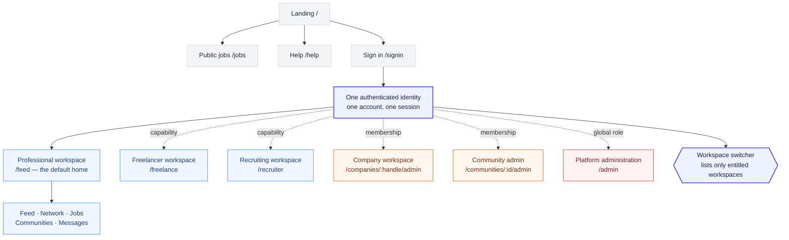

# Information Architecture & Sitemap: Kirmya Professional Ecosystem
**Document Identifier:** PL-PD-011 | **Status:** Draft / Pending Approval | **Version:** 1.0.0  
**Authors:** Antigravity AI & Design & UX Guild | **Date:** July 19, 2026

---

## Document Control & Meta-Information

### Version History
| Version | Date | Author | Description |
| :--- | :--- | :--- | :--- |
| `0.1.0` | 2026-07-19 | Antigravity AI | Initial draft outlining route hierarchies and dashboard structures. |
| `1.0.0` | 2026-07-19 | Antigravity AI | Completed full sitemap, breadcrumb specifications, and deep-link routing mappings. |
| `1.1.0` | 2026-09-10 | Platform architecture | Rewrote the site map, routes, workspace shell and breadcrumbs around the single-identity multi-workspace model; corrected `/dashboard`, `/guilds` and `/copilot` claims against the shipped application. |

---

## 1. Executive Summary

This document establishes the official **Information Architecture (IA) and Sitemap** for the **Kirmya Professional Ecosystem**. It provides frontend developers, product managers, and UI/UX designers with a comprehensive blueprint of all page routes, authenticated dashboards, navigation hierarchies, deep-linking configurations, and SEO-optimized public landing directories.

---

## 2. Core Site Map & Navigation Hierarchy

The previous diagram branched from the auth gate into three separate
dashboards — talent, recruiter and admin — as if a user were one of the three.
That is the single-role model. One account may hold several of these at once,
so the hierarchy branches on **workspace**, and every branch hangs off the same
identity.



Dotted edges are conditional: the workspace exists for this account only when
the capability is activated, the membership is held, or the global role allows
it. Solid edges are unconditional — every account has an identity and a
Professional workspace.

**The switcher is not a security boundary.** It renders what the server said is
enterable; each route re-checks on the server regardless of how it was reached.

---

## 3. URL Routes & Page Index

> ### Rewritten 2026-09-10 — workspace-based information architecture
>
> The previous version of this section described `/dashboard` as the unified
> signed-in homepage and listed `/guilds` and `/copilot`. **None of those is
> accurate**: `/dashboard` was retired as a landing page and permanently
> redirects to `/feed`, and `/guilds` and `/copilot` do not exist in the
> application. Verified against `frontend/src/app` on 2026-09-10.
>
> Routes are now organised by **workspace**. See
> [26-workspace-architecture.md](../architecture/26-workspace-architecture.md)
> for the model and
> [ADR 0002](../decisions/0002-single-identity-multi-workspace-access.md) for
> the decision.

### 3.0 How to read this section

Each namespace belongs to one workspace. A route existing does not imply the
signed-in user may open it: entity-scoped routes are authorized against the
entity in the URL, on the server, on every request. Navigation visibility is
never the control.

**Status column:** *Shipped* means the route exists today. *Target* means it is
specified here and not yet built.

### 3.1 Unauthenticated public routes

| Route | Purpose | Status |
| :--- | :--- | :--- |
| `/` | Marketing landing page | Shipped |
| `/signin` | Sign-in. `/login` also resolves | Shipped |
| `/signup`, `/register` | Account creation | Shipped |
| `/jobs`, `/jobs/[id]` | Public job board and postings, server-rendered for indexing | Shipped |
| `/help` | Public documentation and appeals | Shipped |

There is one account type at signup. The wizard does **not** segment users into
Talent, Employer or Freelancer — capabilities are activated later through
onboarding (§3.8), and a person may hold several.

### 3.2 Professional workspace — the signed-in home

`/feed` is where an authenticated user lands. There is no generic dashboard.

| Route | Purpose | Status |
| :--- | :--- | :--- |
| `/feed` | Professional home | Shipped |
| `/network` | Connections and invitations | Shipped |
| `/jobs` | Job search and saved jobs | Shipped |
| `/communities`, `/communities/[id]` | Communities | Shipped |
| `/messages` | Messaging | Shipped |
| `/notifications`, `/profile`, `/settings` | Account surfaces | Shipped |

Primary navigation is exactly five destinations — Feed, Network, Jobs,
Communities, Messages. Search, notifications and the account menu are global
*actions* beside them, not entries in the list. Workspace links never accumulate
here; the workspace switcher handles that (§4.1).

`/dashboard` permanently redirects to `/feed`. Several personal tools remain
under the `/dashboard/*` namespace (`career-insights`, `cover-letters`,
`interview-prep`, `resumes`, `saved-searches`). They are tools inside the
Professional workspace, not a dashboard home — a dashboard may exist inside a
workspace, but is not the workspace.

### 3.3 Freelancer workspace

Available when the freelancer capability is activated.

| Route | Purpose | Status |
| :--- | :--- | :--- |
| `/freelance` | Freelancer home | Shipped |
| `/freelance/projects` | Find projects | Target |
| `/freelance/proposals` | Proposals | Target |
| `/freelance/contracts` | Contracts | Target |
| `/freelance/earnings` | Earnings | Target |

### 3.4 Recruiting workspace

Available when the recruiter capability is activated.

**The canonical namespace is `/recruiter/*`, not `/recruiting/*`.** The shipped
application uses `/recruiter`, and renaming a working namespace to match a
document would break every existing link and bookmark for no user-visible gain.
The workspace is *named* Recruiting; its routes are `/recruiter`.

| Route | Purpose | Status |
| :--- | :--- | :--- |
| `/recruiter` | Recruiting home | Shipped |
| `/recruiter/jobs` | Job management | Shipped |
| `/recruiter/candidates`, `/recruiter/candidates/[id]` | Candidates | Shipped |
| `/recruiter/applications`, `/recruiter/applications/[id]` | Applications | Shipped |
| `/recruiter/candidates/search` | Talent search | Shipped |
| `/recruiter/interviews`, `/recruiter/pipeline`, `/recruiter/offers` | Hiring workflow | Shipped |

If `/recruiting/*` is ever introduced, it must be a redirect to `/recruiter/*`,
never a parallel implementation. Two URLs for one canonical resource is the
defect this section exists to prevent.

### 3.5 Company workspace — entity-scoped

One instance per company the user may manage. The company id is in the path, so
the address carries the authority it needs; it must never be carried in a query
parameter, which was the defect corrected in the navigation rebuild.

| Route | Purpose | Status |
| :--- | :--- | :--- |
| `/companies/[handle]` | Public company page | Shipped |
| `/companies/[handle]/admin` | Company home | Shipped |
| `/companies/[handle]/admin/jobs` | Jobs | Target |
| `/companies/[handle]/admin/candidates` | Candidates | Target |
| `/companies/[handle]/admin/team` | Employees and team | Target |
| `/companies/[handle]/admin/analytics` | Analytics | Target |
| `/companies/[handle]/admin/settings` | Settings | Target |

The shipped namespace is `/companies/[handle]/admin/*`. Documents proposing
`/company/:companyId/*` describe the same concept with a different spelling;
the shipped form is canonical. A legacy `/company/dashboard?company=slug` has
already been retired.

### 3.6 Community admin workspace — entity-scoped

| Route | Purpose | Status |
| :--- | :--- | :--- |
| `/communities/[id]/admin` | Overview | Shipped |
| `/communities/[id]/admin/members` | Members | Target |
| `/communities/[id]/admin/posts`, `/moderation` | Content and moderation | Target |
| `/communities/[id]/admin/events`, `/analytics`, `/settings` | Remaining sections | Target |

### 3.7 Page admin workspace — specified, not buildable

`/pages/[id]/admin` is **Target only, and blocked.** Pages do not exist: no
table, no backend module, no API route, no web route. This workspace must not
appear in the switcher until the Pages domain exists. See §3.2 of the
architecture specification.

### 3.8 Capability onboarding

Capabilities are activated, never selected. "Start freelancing" and "Recruit
talent" begin onboarding; the workspace appears only once that completes and
validates. Selecting a workspace never grants the capability behind it.

### 3.9 Platform administration

`/admin/*`. Isolated, gated on the route rather than only on the link, and
restricted to the global role set `{admin, super_admin, platform_admin}`. No
entity-scoped role ever confers access here.


---

## 4. Workspace Shell & The Switcher

Renamed from "Dashboard Layout". The panel specifications that stood here
described four dashboards keyed to four mutually exclusive personas — Talent,
Recruiter, Company Admin, Guild Moderator — which is the model this
architecture replaces. Several referenced surfaces that do not exist (DRS
rating, AI Copilot panel, Guild peer review, recruiter seat caps).

Layout is now defined per **workspace**, and one user may move between several.

### 4.1 The workspace switcher

Placement: beside the account controls, at every breakpoint. **Not** in the
primary navigation.

```
Kirmya   Feed  Network  Jobs  Communities  Messages      🔍  🔔  [Professional ▾]
                                                                      │
                                                     ┌────────────────┴─────────┐
                                                     │ Professional           ✓ │
                                                     │ Freelancing              │
                                                     │ Recruiting               │
                                                     ├──────────────────────────┤
                                                     │ Acme LLC                 │
                                                     │ Go Developers UAE        │
                                                     ├──────────────────────────┤
                                                     │ Kirmya Administration    │
                                                     └──────────────────────────┘
```

Rules:

- Lists only workspaces the authenticated user may actually enter.
- Groups by kind: capabilities, then entity instances, then platform admin.
- The current workspace is always identifiable.
- Switching takes at most two interactions.
- Unavailable **capabilities** may appear as onboarding calls to action.
  Unavailable **privileged** workspaces do not appear at all — listing a company
  the user cannot enter discloses that the company exists.

### 4.2 Shell composition

Every workspace uses the same shell, with the contextual layer swapped:

| Layer | Varies by workspace? |
| :--- | :--- |
| Global header — brand, search, notifications, account, switcher | No |
| Primary navigation | **Yes** — five destinations of the active workspace |
| Contextual navigation — section tabs | **Yes** |
| Page header and breadcrumbs | Yes |
| Content | Yes |
| Mobile bottom navigation | **Yes** — mirrors the active workspace's primary items |

### 4.3 Per-workspace primary navigation

| Workspace | Primary destinations |
| :--- | :--- |
| Professional | Feed · Network · Jobs · Communities · Messages |
| Freelancer | Freelancer Home · Find Projects · Proposals · Contracts · Earnings · Messages |
| Recruiting | Recruiting Home · Jobs · Candidates · Applications · Talent Search · Messages |
| Company | Company Home · Jobs · Candidates · Team · Company Page · Analytics · Settings |
| Community admin | Overview · Members · Posts · Moderation · Events · Analytics · Settings |
| Page admin | Overview · Content · Followers · Analytics · Settings *(blocked — Pages do not exist)* |
| Platform admin | Isolated console; not composed with the above |

### 4.4 Mobile and tablet

The switcher opens from the account control on every breakpoint. The mobile
presentation must not enumerate every capability at once. The bottom navigation
carries the primary destinations of the **active** workspace, so switching
changes the bottom bar rather than adding to it.

Both the desktop primary row and the bottom bar switch at the `md` breakpoint
(768px in this theme, not MUI's 900px default), so no viewport is left with
neither.

---

## 5. Breadcrumb Structure & Navigation Rules

Breadcrumbs are rooted in the **active workspace**, not in a global "Home".
This is what tells a user which of several contexts they are in, and it is the
main orientation cue when one person holds many workspaces.

| Workspace | Pattern | Example |
| :--- | :--- | :--- |
| Professional | `Feed > [Section] > [Item]` | `Feed > Jobs > Senior Backend Engineer` |
| Freelancer | `Freelancing > [Section] > [Item]` | `Freelancing > Proposals > Proposal #482` |
| Recruiting | `Recruiting > [Section] > [Item]` | `Recruiting > Candidates > Priya Raghunathan` |
| Company | `[Company Name] > [Section] > [Item]` | `Acme LLC > Jobs > Platform Engineer` |
| Community admin | `[Community Name] > [Section] > [Item]` | `Go Developers UAE > Moderation > Report #17` |
| Platform admin | `Kirmya Administration > [Section] > [Item]` | `Kirmya Administration > Users > Account #8821` |

Rules:

- The first crumb names the workspace and, for entity-scoped workspaces, the
  entity — so `Acme LLC > …` rather than `Company > …`.
- A crumb is a link only where the destination exists and the user may open it.
- Breadcrumbs never expose the name of an entity the viewer may not see.
- Browser Back and Forward follow the URL, and the URL carries the workspace, so
  history moves between workspaces predictably.

The previous version of this section described Guild peer-review paths, DevOps
upskilling paths and Neo4j telemetry logs. None of those surfaces exists.

---

## 6. Deep Link Configurations

> **Unverified.** The deep links below were not re-checked against the shipped
> application in the 2026-09-10 workspace revision, and some reference Guild
> surfaces that do not exist. Verify before relying on them.


To support external workflows and sharing, the platform registers specific deep-link schemas:

* **Verifiable Skill Credentials**:  
  Format: `https://kirmya.com/verify/badge/[badgeId]`  
  *Target*: Public page rendering badge issuer details, candidate DRS scores, and cryptographic signatures.
* **B2B Sourcing Invitations**:  
  Format: `https://kirmya.com/invite/enterprise/[tenantId]?token=[token]`  
  *Target*: Instantly routes new team members to the SSO authentication bridge.
* **Specialized Guild Resource Sharing**:  
  Format: `https://kirmya.com/guilds/[guild-slug]/docs/[docId]`  
  *Target*: Renders specific Guild articles directly. Redirects unauthenticated Guests to public-read-only schemas.

---

## 7. SEO-Optimized Public Pages

To capture search engine index queries organically, Kirmya maintains public, read-only directories:

* **Regional Skill Directories**:  
  Format: `https://kirmya.com/skills/[skill-name]-developers-[region]`  
  *Target*: Public, search-indexed directories displaying aggregate talent density, trending skill graphs, and median salary structures for specific regions (e.g. `/skills/python-developers-riyadh`).
* **Open Guild Repositories**:  
  Format: `https://kirmya.com/guilds/[guild-slug]/public-resources`  
  *Target*: Public repositories indexing highly voted technical articles and guides, boosting Kirmya’s authority keywords.

---

## 8. Future Horizon Marketplace Mappings (Phase 4)

> **Forward-looking.** Phase 4 concepts, not shipped routes. Retained as
> intent; several reference Guild surfaces that do not exist today.


To support the V3.0 roadmap, the sitemap reserves the following routes:

* **`/marketplace`**: Freelance project listing index.
* **`/contracts/[contract-id]`**: Milestone escrow management panel (displaying deliverables, timelines, and escrow deposit statuses).
* **`/contracts/[contract-id]/dispute`**: Conflict arbitration workspace routing contracts to Guild moderator panels.
* **`/wallet`**: Escrow balance ledger displays, integrated with local transfer (Aani) banking configurations.

---

## 9. Approval Checkpoints

The Information Architecture and Sitemap must be signed off by UX and Engineering before front-end repository staging:

| Role | Department | Name | Date | Status / Signature |
| :--- | :--- | :--- | :--- | :--- |
| **Lead UX Architect** | Design & UX | [Pending] | | `Awaiting Review` |
| **Front-End Lead Engineer**| Engineering | [Pending] | | `Awaiting Review` |
| **Product Director** | Product Strategy | [Pending] | | `Awaiting Review` |
| **SEO Operations Lead** | Marketing | [Pending] | | `Awaiting Review` |
