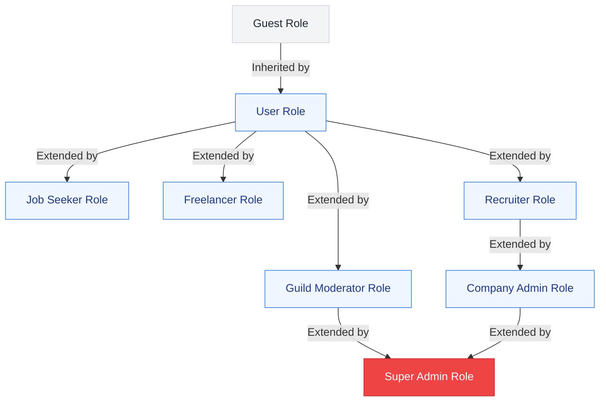

# Roles & Permissions: Kirmya Role-Based Access Control (RBAC)
**Document Identifier:** PL-PD-012 | **Status:** Draft / Pending Approval | **Version:** 1.0.0  
**Authors:** Antigravity AI & Technical Architecture Group | **Date:** July 19, 2026

---

## Document Control & Meta-Information

### Version History
| Version | Date | Author | Description |
| :--- | :--- | :--- | :--- |
| `0.1.0` | 2026-07-19 | Antigravity AI | Initial draft outlining RBAC matrix and role classifications. |
| `1.0.0` | 2026-07-19 | Antigravity AI | Completed full RBAC specifications detailing permissions, restrictions, and feature tables for all eight roles. |

---

## 1. Executive Summary

This document establishes the official **Role-Based Access Control (RBAC)** policies for the **Kirmya Professional Ecosystem**. It defines user permissions, API routing restrictions, module boundaries, and administrative actions for every role in the system. The specifications detailed here must be implemented at both the database query layers and the frontend routing guards to ensure system security and regulatory data compliance.

---

## 2. High-Level RBAC Matrix

The following grid outlines major platform capabilities mapped against Kirmya's eight core user roles:

| Platform Capability | Guest | User | Job Seeker | Freelancer | Recruiter | Company Admin | Moderator | Super Admin |
| :--- | :--- | :--- | :--- | :--- | :--- | :--- | :--- | :--- |
| **Read Public Profiles** | Yes | Yes | Yes | Yes | Yes | Yes | Yes | Yes |
| **Post to Home Feed** | No | Yes | Yes | Yes | Yes | Yes | Yes | Yes |
| **Vote on Content Signal** | No | Yes | Yes | Yes | Yes | Yes | Yes | Yes |
| **Submit Peer Reviews** | No | No | Yes | Yes | No | No | Yes | Yes |
| **Run Sourcing Searches** | No | No | No | No | Yes | Yes | No | Yes |
| **Publish Job Listings** | No | No | No | No | Yes | Yes | No | Yes |
| **Manage Billing Cards** | No | No | No | No | No | Yes | No | Yes |
| **Audit Sourcing Match Bias**| No | No | No | No | No | Yes | No | Yes |
| **Moderate Guild Feeds** | No | No | No | No | No | No | Yes | Yes |
| **Toggle System Flags** | No | No | No | No | No | No | No | Yes |

---

## 3. Role Hierarchy & Inheritance Mappings

The following inheritance diagram illustrates how permissions flow and extend from standard users up to administrators:

---

## 4. Role Specifications

---

### 4.1 Role 1: Guest (Unauthenticated Visitor)

* **Permissions**:
  - Read-only access to public candidate profiles via unique public share URLs.
  - Read-only access to public Guild files and articles.
  - Read-only access to public skill directories and salary benchmarks.
* **Restrictions**:
  - Blocked from posting, voting, commenting, or messaging.
  - Blocked from accessing recruiter dashboard paths.
  - Cannot access the Kirmya Copilot AI workspace.
* **Feature Access**:
  - *Profiles*: Public profile widgets.
  - *Communities*: Public document repositories.
  - *Search*: Basic public glossary search.
* **Administrative Actions**: None.

---

### 4.2 Role 2: User (Basic Registered Member)

* **Permissions**:
  - Create and edit personal profile pages (excluding DRS ratings).
  - Post content, share technical guides, and vote on content signals ("Educational", "Insightful").
  - Connect with and follow other registered users.
* **Restrictions**:
  - Blocked from submitting technical portfolios for Guild peer reviews (requires upgrading to Job Seeker or Freelancer type).
  - Blocked from posting job listings or searching the capability database.
* **Feature Access**:
  - *Authentication*: MFA, OAuth setups.
  - *Profiles*: Standard profile edit panels.
  - *Communities*: Read/Write access to general Guild feeds.
  - *Messaging*: Direct messaging with active connections.
  - *Notifications*: Event bus notifications.
  - *Settings*: Basic privacy and data export triggers.
* **Administrative Actions**: None.

---

### 4.3 Role 3: Job Seeker (Emerging Technical Talent)

* **Permissions (Inherits User)**:
  - Submit code repositories or design files to the Guild for peer review to update DRS.
  - Apply for capabilities-first job openings.
  - Access Kirmya Copilot resume checks and basic interview coaching.
* **Restrictions**:
  - Blocked from viewing recruiter dashboard configurations.
  - Cannot initiate blind sourcing chats.
* **Feature Access**:
  - *AI*: PDF Resume Optimizer, basic mock voice coach.
  - *Learning*: Unified aggregated course index, skill-gap learning pathways.
  - *Jobs*: Blind Candidate Match application submissions.
* **Administrative Actions**: None.

---

### 4.4 Role 4: Freelancer (Independent Contract Specialist)

* **Permissions (Inherits User)**:
  - Submit portfolio assets for Guild peer audits.
  - Bid on freelance projects in the Marketplace.
  - Create and authorize milestone escrow contracts.
* **Restrictions**:
  - Blocked from posting projects on the marketplace (restricted to recruiting entities).
  - Must provide verified regional freelance permits before submitting project bids.
* **Feature Access**:
  - *Freelancing*: Escrow milestone trackers, payment invoice logs.
  - *AI*: Basic resume audits.
* **Administrative Actions**: None.

---

### 4.5 Role 5: Recruiter (Sourcing Specialist)

* **Permissions (Inherits User)**:
  - Access the **Capability Search Engine** to filter candidates by DRS, skills, and regional Golden Visa statuses.
  - Publish jobs mapping target DRS requirements (cap: 5 active jobs per seat).
  - Initiate blind chat threads with matched candidates.
* **Restrictions**:
  - Blocked from viewing candidate names/photos during initial search results.
  - Cannot modify company billing details or SAML SSO keys.
  - Restricted from running system-level compliance telemetry logs.
* **Feature Access**:
  - *Search*: Capability Sourcing filters.
  - *Jobs*: Sourcing job post creator.
  - *Messaging*: Anonymous blind messaging threads.
  - *Analytics*: Candidate pipeline analytics.
* **Administrative Actions**: None.

---

### 4.6 Role 6: Company Admin (Enterprise Account Manager)

* **Permissions (Inherits Recruiter)**:
  - Provision, audit, and revoke recruiter seat licenses for their company tenant.
  - Configure SAML 2.0 / OIDC Corporate SSO integrations and generate API webhooks.
  - Manage corporate billing cards, invoices, and premium company pages.
  - Access the AEDT Bias Monitor logs to audit hiring match metrics.
* **Restrictions**:
  - Blocked from toggling system-wide feature flags.
  - Restricted from editing database schemas.
* **Feature Access**:
  - *Admin*: Corporate Seat Manager.
  - *Settings*: Corporate IAM panel.
  - *Analytics*: Sourcing efficiency and AEDT compliance loggers.
* **Administrative Actions**:
  - Authorize recruiter permissions within their multi-tenant enterprise portal.
  - Purge recruiter search logs after 2 years.

---

### 4.7 Role 7: Moderator (Guild Leader)

* **Permissions (Inherits User)**:
  - Audit and score peer portfolio submissions using structured rubrics.
  - Hide flagged content in their designated Guild feeds.
  - Act as an arbitrator in escrow payment disputes.
* **Restrictions**:
  - Blocked from accessing other Guild moderators' queues unless granted cross-moderator roles.
  - Cannot access company payment records or corporate SSO credentials.
* **Feature Access**:
  - *Communities*: Guild moderation consoles.
  - *Admin*: Dispute resolution mediation panels.
  - *Notifications*: flagged content alerts.
* **Administrative Actions**:
  - Ban spammers from their specific Guild discussions.
  - Authorize portfolio DRS score updates.

---

### 4.8 Role 8: Super Admin (Kirmya Core Team)

* **Permissions (Inherits Moderator and Company Admin)**:
  - Read, write, and delete permissions across all platform entities and databases.
  - Manage global configurations, toggle feature flags, and change algorithm matching weights.
  - Audit compute costs, vector indexing rates, and database latencies.
  - Resolve final Appeals from suspended users.
* **Restrictions**:
  - All critical configuration toggles require dual-admin confirmation alerts.
  - Access is logged in immutable audit trails.
* **Feature Access**:
  - *Admin*: Global configurations console, Feature Flag panel.
  - *Analytics*: OpenTelemetry logs, vector indexing monitors.
  - *Settings*: GDPR data deletion runners.
* **Administrative Actions**:
  - Suspend or ban any account violating platform rules.
  - Verify and approve trade licenses for new Company pages.
  - Provision new Guild nodes.

---

## 5. Security & Access Token Policies

* **Access Token Expiration**: Authentication session access tokens (JWTs) expire after **15 minutes**.
* **Refresh Token Lifetimes**: Refresh tokens remain valid for **7 days** (or 24 hours for recruiter/admin roles), requiring user re-authentication upon expiration.
* **SSO Attribute Mappings**: SAML assertions from corporate IDPs must map the `Role` attribute to either `Recruiter` or `CompanyAdmin` tags before platform workspace routing.

---

## 6. Approval Checkpoints

These RBAC roles and permissions specifications must be signed off by Legal and Technical architecture teams:

| Role | Department | Name | Date | Status / Signature |
| :--- | :--- | :--- | :--- | :--- |
| **Chief Technology Officer**| Engineering | [Pending] | | `Awaiting Review` |
| **Lead Security Architect** | InfoSec & Legal | [Pending] | | `Awaiting Review` |
| **Product Director** | Product Strategy | [Pending] | | `Awaiting Review` |
| **Lead QA Architect** | Quality Assurance| [Pending] | | `Awaiting Review` |
